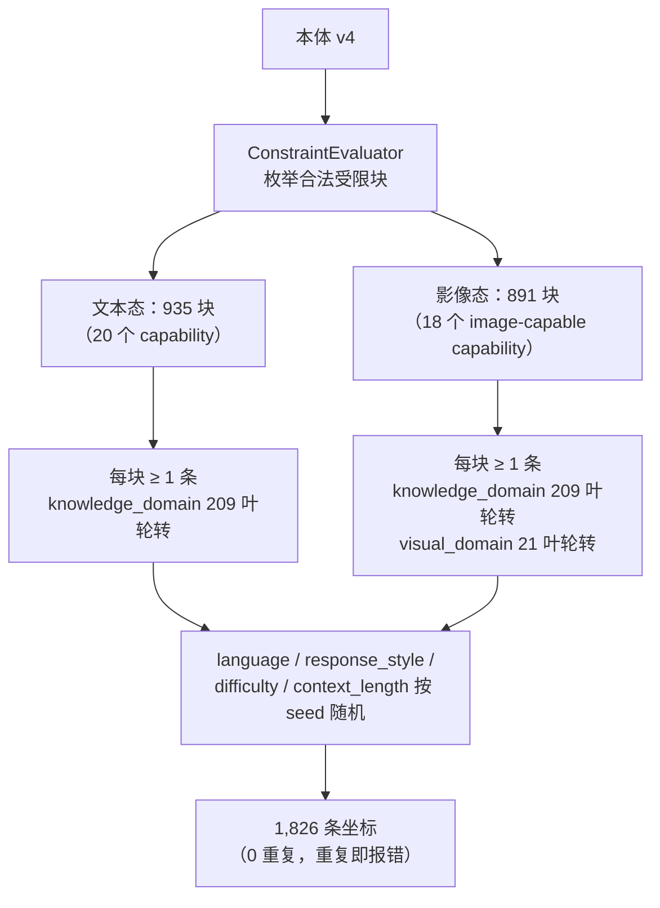

# ARD 算法：目标集口径与构造规则

> 职责：说明 ARD 一轮锚点计划的**目标集口径**、**构造规则**（坐标如何被选出）、**轮数口径**、**坐标与措辞的边界**，
> 以及本体指纹沿革。纯计算实现见 `src/ard/core/sampling.py` / `constraints.py` / `ontology.py`；判据与读数定义见 `docs/measurement.md`。
> 基线：本页所有 `文件:行` 已按提交 `a94e7b3` 的树逐条核对；其中指向 `src/ard/pipeline.py` 的引用
> 已按提交 `70af65e`（S11c resume 修复系列）逐条按符号内容重定位，指向 `src/ard/core/sampling.py`
> 的一处引用同期核正（原起点落在空行）。其余引用由 `tests/test_doc_line_references.py` 守卫检查
> "文件存在 / 行号在范围内 / 引用行非空"——它**不能**发现错位到另一条非空行上的情况。

## 1. 目标集口径

计划来自本体 v4（`ontology/anchor_ontology.v4.json`），它声明 **12 轴** = 11 个通用轴 + 1 个模态条件轴
（`ontology/anchor_ontology.v4.json:6-25`）。轴分两类：

- **6 个受限轴**（`capability` / `system_prompt_mode` / `conversation_type` / `output_format` / `input_condition` / `answer_mode`）——受约束 `allowed_pairs`（R1–R4b）与模态门 R5 限制，合法组合是**有限集合**；
- **5 个自由轴**（`language` / `knowledge_domain` / `response_style` / `difficulty` / `context_length`）——彼此正交（R7），组合数即自由轴积；
- **1 个条件轴** `visual_domain`——仅当采样字段 `modality == image` 时取值，文本态缺席（`:1222-1229`、`:1303-1309`）。

| 计数 | 值 | 出处 |
|---|---:|---|
| 自由轴积 `free_axis_product` | **52,668** | `ontology/anchor_ontology.v4.json:1340`（4 × 209 × 7 × 3 × 3） |
| 受限轴原始组合 `raw_restricted_block` | 100,800 | `:1341` |
| 文本态合法受限块 | **935** | `:1342`；`src/ard/core/sampling.py:87` |
| 影像态合法受限块（18 个 image-capable capability） | **891** | `:1343`；`src/ard/core/sampling.py:90` |
| `knowledge_domain` 叶 | **209**（18 domain / 36 subdomain） | `:63-67` |
| `visual_domain` 叶 | **21** | `:307-311` |
| **一轮计划总数** | **1,826**（935 + 891） | `src/ard/core/sampling.py:99` |

**总数不是配置项**：它由构造规则与本体唯一推导。`configs/config.toml` 中没有 `target_count` 一类字段，
`sampling.sample_anchors` 的返回长度就是计划长度；本体计数一旦与规则不符，采样器**报错退出**而不是产出更短/更长的计划
（`src/ard/core/sampling.py:254-276`）。

## 2. 构造规则

规则两态相同，差别只在 `capability` 的取值域与条件轴是否参与：

逐轴取值方式：

| 轴 | 取值方式 | 证据 |
|---|---|---|
| 6 个受限轴（`capability`/`system_prompt_mode`/`conversation_type`/`output_format`/`input_condition`/`answer_mode`） | **穷举合法受限块，每块恰好 1 条** | `src/ard/core/sampling.py:372-452`；`src/ard/core/constraints.py:212-264` |
| `knowledge_domain` | **轮转**：第 i 条取 `leaves[i % 209]` | `src/ard/core/sampling.py:78`、`:419-421` |
| `visual_domain` | **轮转**：第 i 条取 `leaves[i % 21]`（仅影像态；文本态缺席） | `src/ard/core/sampling.py:78`、`:419-421` |
| `language` / `response_style` / `difficulty` / `context_length` | **按 run seed 随机抽取** | `src/ard/core/sampling.py:80-85`、`:417-418`；`_draw` `src/ard/core/sampling.py:325-328` |
| `modality` | 采样字段（非轴）：前 935 条 `text_only`，后 891 条 `image` | `src/ard/core/sampling.py:428-448`；本体 `ontology/anchor_ontology.v4.json:1303-1309` |

已知的两个失败模式都做成**显式报错**而非静默降级：坐标重复（`src/ard/core/sampling.py:360-369`）、本体叶数与期望不符
（`src/ard/core/sampling.py:254-276`，报文给出 `expected (received: …)`）。

**"每块恰好 1 条"的作用域是模态组内**：891 个影像态合法块是 935 个文本态合法块的子集，因此这 891 个
受限坐标各出现**两次**——文本态组一次、影像态组一次——二者靠采样字段 `modality` 区分，而 `modality` 正是
查重身份（`identity()` → `as_dict()`）的一部分，故不构成重复。断言口径应为"每个模态组内每块一条"，
而不是"935 个互异块各一条"。

### 已不再使用的算法

本口径**不使用**：FPS / 最远点采样 / 贪心选点 / 覆盖选点 / 叶子权重 / 候选池 / 最大接近采样 / 三维空间 / 组合云。
对应旧模块（`core/_fps.py`、`core/cloud.py`、`core/embeddings.py`、`core/sampler.py`）与旧配置字段
（`criterion` / `embeddings_path` / `target_count` / `task_types`）已从 `src/` 与 `configs/` 删除。
可复核：`git grep -niE "farthest|_fps|criterion|proximity" -- src/` 在 `src/` 内 0 命中
（残留的 `image_pool`/`ThreadPoolExecutor` 是图片池与并发设施，与选点无关）。

## 3. 轮数口径

**两个"轮数"不是一回事，必须分开读：**

- 本体 `conversation_type.value_attributes.turns` 数的是**交换**（exchange = 一个用户问题 + 它得到的回答）；
- `AnchorSpec.messages`（生成产物中的消息数组）数的是**消息**，其长度 = `2n − 1`：`user` 开头、`user` 结尾、角色交替，
  因为**最后一轮必须是 user**——它的回答才是训练目标，不作为 spec 轮存在（`src/ard/core/types.py:62-75`）。

例：`single_turn`(1) → 1 条消息；`clarification`(2) → 3 条；`constraint_update`(4) → 7 条。
映射实现见 `src/ard/core/sampling.py:455-486`（`_spec_turns`）与 `:489-519`（`turn_counts_by_conversation_type`）。

**`MULTI_TURN_DEFAULT = 4` 的取值依据与本体缺口**（`src/ard/core/sampling.py:162-175`）：

- 依据：本体对 `tool_assisted` 与 `source_review` 只写 `turns: "multi"`，**没有数值上界**；常量取本体自身声明的最大轮数
  `constraint_update = 4`，即"`multi` = 本体已声明的最长交换数"。
- 缺口：这是**本体缺口，不是设计选择**——本体没有表达"multi 的上界"。代码把该数字收在单一常量处，
  并设硬门：本体一旦声明比它更大的轮数，`_spec_turns` 直接报错（`:481-486`），不静默采用。
- 轮数**不是配置项**：`configs/config.toml` 无对应字段，改轮数只能改本体（或该常量）。

## 4. 坐标与措辞

本体自述 **"Coordinates only. No prompt wording, no sampling/weighting/experiment policy."**
（`ontology/anchor_ontology.v4.json:5`）。`wording_policy`（`:1312-1324`）自述本体只持坐标、不得含 prompt 模板
（`:1314-1318`），并把措辞位置写成 `configs/prompts/system_prompt/<system_prompt_mode>.md`（`:1319-1323`）。

**该位置的效力**：`prompt_wording_location_recommendation.status` 逐字为
"recommendation only; no such file was created in this round (ontology-only round)"，即**推荐，非硬性要求**；
有约束力的是"坐标与措辞分离"本身。本工程按该推荐位置把措辞落地为数据文件（提交 `c8ffd44`），以下为**已实施的事实**。

**数据位置**：`configs/prompts/system_prompt/` 下 5 个文件，文件名 = 本体轴 `system_prompt_mode` 的取值：
`none.md`、`minimal_persona.md`、`detailed_persona.md`、`task_constraint.md`、`domain_style.md`。

**文件格式**（唯一格式定义，另见 `configs/prompts/README.md`）：

- 文件名恰为 `<system_prompt_mode>.md`，不读任何其他文件名；
- 正文 = UTF-8 Markdown，无 front matter、无注释语法；**整份内容去掉首尾空白即模板**，不做任何解释；
- 占位符**可选用且仅允许** `{language}` / `{capability}` / `{domain}`，按 `str.format` 从 `anchor_meta` 取
  `language` / `knowledge_domain` / `capability`（默认 `English` / `general` / `qa`）；其他占位符或不配对花括号 = 加载错误；
- `none.md` 是唯一例外：`none` 是"无 system message"的缺省态，没有生成措辞，该文件只**陈述**这一事实、
  **永不被渲染**（`build_system_prompt_prompt` 对 `none` 显式报错）；每个文件（含它）都必须非空。

**加载与报错语义**：措辞的契约与渲染是纯计算，落在 `src/ard/core/system_prompt.py`（目录常量 `:64`；错误类型、模板路径校验、模板校验、渲染 `:95-226`），**不含任何内置措辞串**；
**读文件**是设施动作，落在 `src/ard/backends/prompt_loader.py:38`（`load_system_prompt_template`）与组装入口 `:75`
（`build_system_prompt_prompt`）——`core/` 内零文件访问（§1.3，由 `tests/core/test_core_is_pure.py` 守卫）。目录缺失、mode 无对应文件、
文件为空、占位符非法**一律硬报错**，报文含**路径与期望**（§2.3），**不静默回退到硬编码**（那等于重建第二个真相源，§1.4）；
报文只含路径与 mode 名，无机密（§15）。`system_prompt_mode = none` 时 `_generate_system_message` 直接返回 `None`，
不发起任何请求（`src/ard/domain/text_anchor.py:484`）。

**模板目录来源单点**：`SYSTEM_PROMPT_TEMPLATE_DIR`（`src/ard/core/system_prompt.py:64`）是运行时**唯一**一处
声明该目录的地方（`git grep -n "configs/prompts" -- src` 仅此 1 命中）；契约测试
`test_template_dir_is_the_ontology_declared_location` 把它与本体声明的 `target`（`<system_prompt_mode>` 替换后）
逐字对齐，任一侧漂移即在 CI 报错。**未新增 config 字段**：生成路径拿不到 config 对象，加字段就没有消费者（§7.2）。

**行为不变**：5 个 mode 的最终渲染 prompt 与迁数据文件前**逐字节相同**，由契约测试
`test_generation_prompt_is_byte_identical_to_the_old_in_code_wording` 以 sha256 固定
（`tests/core/test_system_prompt.py`）。

**`get_system_prompt_values` 与 `SYSTEM_PROMPT_GENERATION_INSTRUCTIONS` 已具名删除**（§18.1 不留死代码）：
前者只是 `ontology.axis_values("system_prompt_mode")` 的 1:1 包装、生产路径 0 消费者；后者是被数据文件取代的
内置措辞表。测试改用本体访问器（`tests/core/test_system_prompt.py`）。

- **有措辞的轴**（轴的取值会进入发给模型的 prompt 文本）：

| 轴 | 措辞来源 | 证据 |
|---|---|---|
| `language` | 内联模板串（user 侧）+ 数据文件占位符 `{language}`（system-prompt 侧） | `src/ard/domain/text_anchor.py:184`、`:261`、`:269`；`configs/prompts/system_prompt/*.md` |
| `knowledge_domain` | 内联模板串 + 数据文件占位符 `{domain}` | `src/ard/domain/text_anchor.py:185`、`:270`；`configs/prompts/system_prompt/*.md` |
| `capability` | 内联模板串 + 数据文件占位符 `{capability}` | `src/ard/domain/text_anchor.py:186`、`:263`、`:271`；`configs/prompts/system_prompt/*.md` |
| `conversation_type` | 内联模板串（作为 "conversation style" 回显；其 `turns` 另决定消息条数） | `src/ard/domain/text_anchor.py:187`、`:264`、`:272` |
| `system_prompt_mode` | **数据文件** `configs/prompts/system_prompt/<mode>.md`（5 个取值各一份；present 模式 = 完整生成 prompt 模板） | `configs/prompts/system_prompt/`、`configs/prompts/README.md:1`、`src/ard/core/system_prompt.py:64`、`:95-226`；消费点 `src/ard/domain/text_anchor.py:499`（`none` 不生成 system message） |

> 注：`text_anchor.py` 的 import 段历经两次删除（最近一次是把 system-prompt 措辞读取下沉到
> `src/ard/backends/prompt_loader.py`，§1.3），其 import 段之后的行号整体上移；本页行号已按上面声明的基线提交逐条重核，无需再自行换算。

- **仅坐标的轴**（取值进入 `anchor_meta` / id / 统计，但**不改变 prompt 的文本措辞**）：

| 轴 | 取值仍被谁使用（非措辞） | 证据 |
|---|---|---|
| `response_style` | 采样坐标、id 维度之一 | `src/ard/core/sampling.py:80-85`、`:202-218`、`:350`；`src/ard/core/constraints.py:26` |
| `difficulty` | 采样坐标 | `src/ard/core/sampling.py:352`；`src/ard/core/constraints.py:27` |
| `context_length` | 采样坐标 | `src/ard/core/sampling.py:353`；`src/ard/core/constraints.py:28` |
| `output_format` | 受限块合法性判定（决定有哪些合法块） | `src/ard/core/constraints.py:34`、`:53`、`:228`、`:235`；`src/ard/core/sampling.py:351` |
| `input_condition` | 受限块合法性判定 | `src/ard/core/constraints.py:35`、`:54`、`:229`、`:236`、`:244-252`；`src/ard/core/sampling.py:354` |
| `answer_mode` | 受限块合法性判定 | `src/ard/core/constraints.py:36`、`:55`、`:230`、`:237`；`src/ard/core/sampling.py:355` |
| `visual_domain` | **决定影像态图片目录** `<image_dir>/<visual_domain>/`；进 manifest 分组标签 | `src/ard/domain/image_store.py:125-211`；调用点 `src/ard/pipeline.py:958-1018`；分组标签 `src/ard/domain/bank.py:453` |

**边界声明（如实记录，不补措辞）**：上述 7 个"仅坐标"轴（6 个受限轴 + `visual_domain`）的取值**不改变 prompt 的文本措辞**；
`visual_domain` 经图片目录影响**输入图像的内容**（属于内容而非措辞），其余 6 个受限轴只作为**约束求解的输入**
（决定有哪些合法块、共 935/891 个）。其中 `output_format` / `input_condition` / `answer_mode` 的语义
**没有落到生成时的任何指令里**——这是显式的口径缺口，本文档不复述任何自行补写的措辞，缺口已单列"需上级决策"。

**待决清单沿革**：本工作包曾单列"需上级决策"的**措辞数据位置**项（当时事实："本体推荐位置无对应文件 + 措辞硬编码在 Python"）
——**已决**：按本体推荐落地为数据文件（提交 `c8ffd44`）。仍未决的一条：上面
`output_format` / `input_condition` / `answer_mode` 的语义缺口。

## 5. 本体指纹沿革

本体 v4 在 v3 清账后有一行 provenance 文本改动，指纹因此变化：

| 项 | 值 |
|---|---|
| 旧 md5 | `8100af028ce1ada5dcf6da02f3b47026` |
| 新 md5 | `3c24b00927a1fe21d287d18df3af82b7`（复核：`md5sum ontology/anchor_ontology.v4.json`） |
| 改动 | **仅 `supersedes` 一行**：`ontology/anchor_ontology.v4.json:4` |

**为何 md5 变了但既有读数不作废**：`supersedes` 是 `OntologyV4` 的一个普通 `str` 字段，不参与任何解析、约束求值或采样规则；
v3 本体文件被删除后，原文 "left untouched" 已成假话，故改。语义不变性可逐项复核：

- 该字段是 `OntologyV4` 的普通 `str` 字段，**不被任何解析/约束/采样代码读取**（`git grep "supersedes" -- src tests` 0 命中）；
- **四个计数**在改动前后逐项相同，且与本体自述一致（`ontology/anchor_ontology.v4.json:1340-1343`：`52668 / 100800 / 935 / 891`）；
- **55 组无解对**（`reachability.zero_solution_pairs`，`ontology/anchor_ontology.v4.json:1356`）未受影响——它由约束求值决定；
- 采样计划只依赖本体坐标与 seed，**不含 provenance 字段**；同 seed 的 1,826 行计划逐字节复现由契约测试锁定
  （`tests/core/test_sampling.py`，`git grep -n "def test_" -- tests/core/test_sampling.py`）。

⇒ 该改动是 provenance 文本修订，**不构成口径变更**：既有 `q95` 读数、计数与计划都不需要重算。

## 6. 复现

- 采样由 `generation.seed` 决定；不设该字段则每次运行从系统随机源抽新 seed，实际使用的 seed 记入输出目录的 `config.toml`（`configs/config.toml:53-56`）。
- 同一 `(本体, seed)` 必然得到同一计划；构造规则本身无随机性，自由轴之外的取值完全确定。
