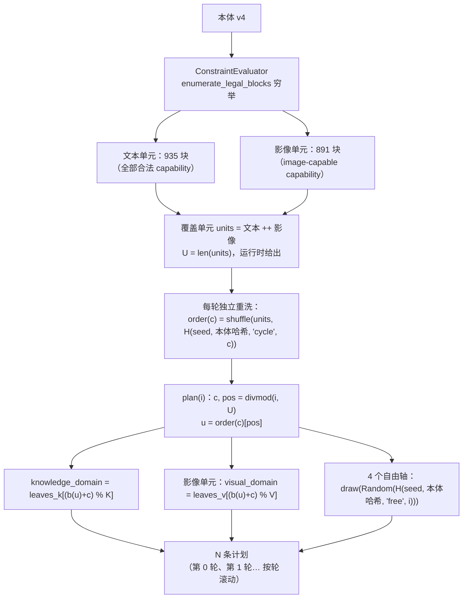

# ARD 算法：目标集口径与构造规则

> 职责：说明 ARD 计划的**目标集口径**、**构造规则**（坐标如何被选出）、**锚点 id 方案**、
> **轮数口径**、**坐标与措辞的边界**，以及**计划身份**。纯计算实现见 `ard.core.sampling` /
> `ard.core.constraints` / `ard.core.ontology`；判据与读数定义见 `docs/measurement.md`。
>
> 引用约定：本页一律使用**符号引用**（如 `ard.core.sampling.sample_coordinates`），
> **不写 `文件:行`**——行号会随任何代码改动漂移，符号名不会。
> 早期版本曾逐条核对行号并由一个"行引用守卫"测试看守，该守卫抓不到"错位到另一条非空行"的漂移，
> 已于 v5 删除（§18.1 不留负债）。

## 1. 目标集口径

计划来自本体 v4（`ontology/anchor_ontology.v4.json`，加载器 `ard.backends.ontology_loader.load_ontology_v4`，
schema 门 `ard.core.ontology.parse_ontology_v4`），它声明 **12 轴** = 11 个通用轴 + 1 个模态条件轴。轴分三类：

- **6 个受限轴**（`capability` / `system_prompt_mode` / `conversation_type` / `output_format` /
  `input_condition` / `answer_mode`，即 `ard.core.constraints.RESTRICTED_AXES`）——受约束
  `allowed_pairs`（R1–R4b）与模态门 R5 限制，合法组合是**有限集合**；
- **5 个自由轴**（`language` / `knowledge_domain` / `response_style` / `difficulty` /
  `context_length`）——彼此正交（R7）；
- **1 个条件轴** `visual_domain`——仅当采样字段 `modality == image` 时取值，文本态缺席。

### 计数一律运行时穷举，不手抄

本体里**没有任何手写计数块**（各轴 `counts`、顶层 `derived_counts`、顶层 `reachability` 已删除）：
**叶子清单是唯一权威**，所有计数由运行时穷举给出。要复算，跑这一条：

```bash
PYTHONPATH=src .venv/bin/python -c "
from ard.backends.ontology_loader import load_ontology_v4
from ard.core.sampling import coverage_units, unit_total, knowledge_leaf_count, visual_leaf_count
o = load_ontology_v4('ontology/anchor_ontology.v4.json')
units = coverage_units(o)
text  = sum(1 for u in units if u.modality == 'text_only')
image = sum(1 for u in units if u.modality == 'image')
print(f'text units = {text}')
print(f'image units = {image}')
print(f'U = {unit_total(o)}   K = {knowledge_leaf_count(o)}   V = {visual_leaf_count(o)}')
"
```

输出（本仓库当前本体）：

```text
text units = 935
image units = 891
U = 1826   K = 209   V = 21
```

其中 `U` = 覆盖单元总数 = 一轮条数，`K` = `knowledge_domain` 叶数，`V` = `visual_domain` 叶数。

**N 不是配置推导出来的常量，也不由上表拦截**：上表只回答"一轮有多大"。运行条数 N 由用户经
`configs/config.toml` 的 `[generation] count` 设置（§2），缺省 = 一轮 = U。

## 2. 构造规则：随机顺序轮转（cycle-shuffle）

规则两态相同，差别只在 `capability` 的取值域与条件轴是否参与。**覆盖单元** =
（模态，合法受限块）=（`text_only` | `image`，6 个受限轴的合法组合），由运行时穷举给出
（`ard.core.sampling.coverage_units`，内部调 `ard.core.constraints.ConstraintEvaluator.enumerate_legal_blocks`）。



实现符号：`ard.core.sampling.sample_coordinates`（`_iter_plan` 是唯一的构造循环）。
伪代码：

```
units    = 文本合法块 ++ 影像合法块                 # 穷举；U = len(units)
order(c) = shuffle(units, H(seed, 本体哈希, "cycle", c))
coordinate(i):
    c, pos = divmod(i, U); u = order(c)[pos]
    k = leaves_k[(b(u) + c) % K]                   # b(u) = 单元在声明序中的下标
    v = leaves_v[(b(u) + c) % V] if u.modality == image else None
    free = draw(Random(H(seed, 本体哈希, "free", i)))   # 4 个自由轴
    return Coordinate(modality=u.modality, block=u.block, knowledge=k, visual=v, **free)
plan(seed, N) = [coordinate(i) for i in range(N)]
```

逐轴取值方式：

| 轴 | 取值方式 | 实现符号 |
|---|---|---|
| 6 个受限轴 | **穷举合法受限块，每块恰好 1 条（模态组内）** | `ard.core.constraints.ConstraintEvaluator.enumerate_legal_blocks` |
| `knowledge_domain` | **轮转**：`leaves_k[(b(u) + c) % K]` | `ard.core.sampling._iter_plan` 的 `coordinate` |
| `visual_domain` | **轮转**：`leaves_v[(b(u) + c) % V]`（仅影像态；文本态缺席） | 同上 |
| `language` / `response_style` / `difficulty` / `context_length` | **按 `H(seed, 本体哈希, "free", i)` 抽取** | `ard.core.sampling._free_rng`、`_build_coordinate` |
| `modality` | 采样字段（非轴）：来自单元所属模态组 | `ard.core.sampling.coverage_units` |

**N 无上限，按轮滚动。** 唯一入口是 `configs/config.toml` 的 `[generation] count`
（`ard.config.GenerationConfig.count`，类型 `int | None`）。缺省 `None` = 一轮 = U。
**没有 CLI 参数、没有 `run.sh` 透传、没有环境变量**（宪法 §10.1 推论 1/2：CLI 与 config 零交集）。
边界校验（`ard.config.GenerationConfig._check_count`）只拒绝两种请求：**`count < 1`** 与
**非法类型**（非整数、`bool`、字符串、浮点）。**任何大 N 都不拒绝**——`N > U` 只是进入下一轮，
日志以 `ard.core.sampling.plan_rounds` 给出的 "满几轮 / 末轮几条 / 共多少条" 作提示。

**前缀性质**：`plan(seed, N)` 是 `plan(seed, N')` 的前缀（`N <= N'`）。自由轴的随机种子
（`ard.core.sampling._free_rng`）只依赖计划下标 `i`，**从不依赖 N**，所以增大 N 不改写任何已有坐标。

**"每块恰好 1 条"的作用域是模态组内**：891 个影像态合法块是 935 个文本态合法块的子集，因此这 891 个
受限坐标各出现两次——文本态组一次、影像态组一次——二者靠采样字段 `modality` 区分，不构成重复。

**没有坐标去重。** 同一坐标（同一组轴取值）可以在不同轮再次出现，**这是设计允许的**：坐标是内容、
不是身份，温度 0.8 下同一坐标能问出不同的题，丢掉它就是丢掉一条合法样本。运行时**不做**坐标查重、
**不丢**记录；`plan` 的长度恒等于请求的 N（`ard.core.sampling.sample_coordinates` 的返回值）。

### 已不再使用的算法

本口径**不使用**：FPS / 最远点采样 / 贪心选点 / 覆盖选点 / 叶子权重 / 候选池 / 最大接近采样 /
三维空间 / 组合云。对应旧模块（`core/_fps.py`、`core/cloud.py`、`core/embeddings.py`、`core/sampler.py`）
与旧配置字段（`criterion` / `embeddings_path` / `target_count` / `task_types`）已从 `src/` 与 `configs/` 删除。
也不再使用 v4 的等价模式与 id 构造：`PlanScale`、`FULL_SCALE` / `SMOKE_SCALE`、
`_evenly_spaced_indices`、`_select_blocks`、`EXPECTED_*`、`_verify_rule_counts`、`_rotating`、
`generate_anchor_id`、`ANCHOR_ID_DIMENSIONS`、`_reject_duplicates`、`Coordinate.identity()`
均已删除，仓内零残留（`git grep` 可复核）。

## 3. 锚点 id：计划位置，不是坐标指纹

锚点 id 是**计划位置序号**（库的主键），与坐标内容彻底脱钩：

```
run_key = H(本体哈希, seed, SAMPLING_ALGORITHM)[:8]
id      = f"{run_key}-c{轮次:05d}p{轮内序号:05d}"
```

实现符号：`ard.core.sampling.run_key` / `ard.core.sampling.format_anchor_id`；
本体哈希 = `ard.core.sampling.ontology_sha256`，算法版本 = `ard.core.sampling.SAMPLING_ALGORITHM`
（当前 `"cycle-shuffle/v1"`）。示例：`"1a2b3c4d-c00000p00137"` 是第 0 轮的第 138 条样本。

四条性质：

| 性质 | 内容 | 为什么需要 |
|---|---|---|
| **N 无关** | 增大 N 时已有 id **逐字节不变** | 续跑可直接追加，不重写已有记录 |
| **确定性** | 只用整数与固定格式摘要，无 `hash()` / `set` 迭代序 / 浮点，跨进程、跨 `PYTHONHASHSEED` 相同 | 续跑守卫与产物审计可独立复算 |
| **跨 run 可区分** | `run_key` 混合本体哈希、seed、算法 | 不同 seed / 本体 / 算法不会撞 id |
| **可读可定位** | `cNNNNN` / `pNNNNN` 五位补零 | 一条 id 就能说出"哪一轮的第几条" |

**id 是位置序号，不是内容指纹** —— 同一 id 在新旧两个计划里**不保证**指向同一坐标。
这正是续跑守卫不能用"id 集合是子集"来判定的原因（§6）。

## 4. 轮数口径

**两个"轮数"不是一回事，必须分开读：**

- 本体 `conversation_type.value_attributes.turns` 数的是**交换**（exchange = 一个用户问题 + 它得到的回答）；
- `AnchorSpec.messages`（生成产物中的消息数组）数的是**消息**，其长度 = `2n − 1`：`user` 开头、
  `user` 结尾、角色交替，因为**最后一轮必须是 user**——它的回答才是训练目标，不作为 spec 轮存在
  （`ard.core.types.AnchorSpec`）。

例：`single_turn`(1) → 1 条消息；`clarification`(2) → 3 条；`constraint_update`(4) → 7 条。
映射实现见 `ard.core.sampling._spec_turns` 与 `ard.core.sampling.turn_counts_by_conversation_type`。

**`MULTI_TURN_DEFAULT = 4` 的取值依据与本体缺口**（`ard.core.sampling.MULTI_TURN_DEFAULT`）：

- 依据：本体对 `tool_assisted` 与 `source_review` 只写 `turns: "multi"`，**没有数值上界**；常量取本体自身
  声明的最大轮数 `constraint_update = 4`，即"`multi` = 本体已声明的最长交换数"。
- 缺口：这是**本体缺口，不是设计选择**——本体没有表达"multi 的上界"。代码把该数字收在单一常量处，
  并设硬门：本体一旦声明比它更大的轮数，`_spec_turns` 直接报错，不静默采用。
- 轮数**不是配置项**：`configs/config.toml` 无对应字段，改轮数只能改本体（或该常量）。

## 5. 坐标与措辞

本体自述 **"Coordinates only. No prompt wording, no sampling/weighting/experiment policy."**
`wording_policy` 自述本体只持坐标、不得含 prompt 模板，并把措辞位置写成
`configs/prompts/system_prompt/<system_prompt_mode>.md`。

**该位置的效力**：`prompt_wording_location_recommendation.status` 逐字为
"recommendation only; no such file was created in this round (ontology-only round)"，即**推荐，非硬性要求**；
有约束力的是"坐标与措辞分离"本身。本工程按该推荐位置把措辞落地为数据文件，以下为**已实施的事实**。

**数据位置**：`configs/prompts/system_prompt/` 下 5 个文件，文件名 = 本体轴 `system_prompt_mode` 的取值：
`none.md`、`minimal_persona.md`、`detailed_persona.md`、`task_constraint.md`、`domain_style.md`。

**文件格式**（唯一格式定义，另见 `configs/prompts/README.md`）：

- 文件名恰为 `<system_prompt_mode>.md`，不读任何其他文件名；
- 正文 = UTF-8 Markdown，无 front matter、无注释语法；**整份内容去掉首尾空白即模板**，不做任何解释；
- 占位符**可选用且仅允许** `{language}` / `{capability}` / `{domain}`（`SYSTEM_PROMPT_TEMPLATE_FIELDS`），
  按 `str.format` 从 `anchor_meta` 取 `language` / `knowledge_domain` / `capability`；其他占位符或不配对
  花括号 = 加载错误；
- `none.md` 是唯一例外：`none` 是"无 system message"的缺省态，没有生成措辞，该文件只**陈述**这一事实、
  **永不被渲染**（`ard.core.system_prompt.require_present_mode` 对 `none` 显式报错）；每个文件（含它）都必须非空。

**加载与报错语义**：措辞的契约与渲染是纯计算，落在 `ard.core.system_prompt`
（目录常量 `SYSTEM_PROMPT_TEMPLATE_DIR`；模板路径校验 `system_prompt_template_path`、
模板校验 `validate_system_prompt_template`、渲染 `render_system_prompt_prompt`），**不含任何内置措辞串**；
**读文件**是设施动作，落在 `ard.backends.prompt_loader.load_system_prompt_template` 与组装入口
`ard.backends.prompt_loader.build_system_prompt_prompt`——`core/` 内零文件访问（§1.3，
由 `tests/core/test_core_is_pure.py` 守卫）。目录缺失、mode 无对应文件、文件为空、占位符非法**一律硬报错**，
报文含**路径与期望**（§2.3），**不静默回退到硬编码**（那等于重建第二个真相源，§1.4）；
报文只含路径与 mode 名，无机密（§15）。`system_prompt_mode = none` 时
`ard.domain.text_anchor._generate_system_message` 直接返回 `None`，不发起任何请求。

**模板目录来源单点**：system-prompt 模板目录只由 `SYSTEM_PROMPT_TEMPLATE_DIR` 一处声明
（同一函数族里没有第二处可漂移的副本；读文件的设施层只接收该常量，不自行拼路径）；契约测试
`test_template_dir_is_the_ontology_declared_location` 把它与本体声明的 `target`（`<system_prompt_mode>` 替换后）
逐字对齐，任一侧漂移即在 CI 报错。**未新增 config 字段**：生成路径拿不到 config 对象，加字段就没有消费者（§7.2）。

**行为不变**：5 个 mode 的最终渲染 prompt 与迁数据文件前**逐字节相同**，由契约测试
`test_generation_prompt_is_byte_identical_to_the_old_in_code_wording` 以 sha256 固定
（`tests/core/test_system_prompt.py`）。

**`get_system_prompt_values` 与 `SYSTEM_PROMPT_GENERATION_INSTRUCTIONS` 已具名删除**（§18.1 不留死代码）：
前者只是 `ontology.axis_values("system_prompt_mode")` 的 1:1 包装、生产路径 0 消费者；后者是被数据文件取代的
内置措辞表。测试改用本体访问器（`tests/core/test_system_prompt.py`）。

- **有措辞的轴**（轴的取值会进入发给模型的 prompt 文本）：

| 轴 | 措辞来源 | 实现符号 |
|---|---|---|
| `language` | 内联模板串（user 侧）+ 数据文件占位符 `{language}`（system-prompt 侧） | `ard.domain.text_anchor._build_user_prompt`、`_generate_system_message` |
| `knowledge_domain` | 内联模板串 + 数据文件占位符 `{domain}` | 同上 |
| `capability` | 内联模板串 + 数据文件占位符 `{capability}` | 同上 |
| `conversation_type` | 内联模板串（作为 "conversation style" 回显；其 `turns` 另决定消息条数） | 同上 |
| `system_prompt_mode` | **数据文件** `configs/prompts/system_prompt/<mode>.md`（5 个取值各一份） | `SYSTEM_PROMPT_TEMPLATE_DIR`、`load_system_prompt_template`、`render_system_prompt_prompt`；消费点 `_generate_system_message` |
| `response_style` | **数据文件** `configs/prompts/axis_instruction/response_style.json`（7 取值各一句） | `ard.core.axis_instruction.AXIS_INSTRUCTION_DIR`、`render_axis_instructions`；组装 `ard.backends.axis_instruction_loader.build_axis_requirements` |
| `output_format` | **数据文件** `configs/prompts/axis_instruction/output_format.json`（6 取值各一句） | 同上 |
| `difficulty` | **数据文件** `configs/prompts/axis_instruction/difficulty.json`（3 取值各一句） | 同上 |
| `context_length` | **数据文件** `configs/prompts/axis_instruction/context_length.json`（3 取值各一句） | 同上 |
| `input_condition` | **数据文件** `configs/prompts/axis_instruction/input_condition.json`（6 取值各一句） | 同上 |
| `answer_mode` | **数据文件** `configs/prompts/axis_instruction/answer_mode.json`（4 取值各一句） | 同上 |

**6 条 instruction 轴的措辞数据**（"wording is data" 的第二个数据族，与 `system_prompt/` 平级，
格式另见 `configs/prompts/README.md`）：`configs/prompts/axis_instruction/<axis>.json` 下 6 个文件，
键 = 轴的取值，值 = 发给输入生成器的一句要求。纯契约在 `ard.core.axis_instruction`
（`INSTRUCTION_AXES`、`AXIS_INSTRUCTION_DIR`、`validate_axis_instructions`、`render_axis_instructions`），
读文件在 `ard.backends.axis_instruction_loader`（`load_axis_instructions` / `build_axis_requirements`）。
取值缺指令 = **硬报错并点名轴、取值与文件**，无内置回退（§1.4、§2.3）；坐标不携带该轴（`None`）时该轴不加文本。

**落点语义**：这 6 条轴约束的是**生成出的用户消息**，不是别的通道——`input_condition` 决定消息本身带何种缺陷，
其余 5 条要求用户在提问里**索要**该风格 / 格式 / 难度 / 长度 / 回答方式。`context_length` 按
**用户消息的长度**落地（本体 R7 逐字称该轴为 "input length"），而不是答案长度：锚点这一侧生成的就是用户消息；
若改按答案长度落地，需要目标模型的 system 通道，会与 `system_prompt_mode` 的语义冲突。

- **仅坐标的轴**（取值进入 `anchor_meta` / id / 统计，但**不改变 prompt 的文本措辞**）：

| 轴 | 取值仍被谁使用（非措辞） | 实现符号 |
|---|---|---|
| `visual_domain` | **决定影像态图片目录** `<image_dir>/<visual_domain>/`；进 manifest 分组标签 | `ard.domain.image_store.domain_directory` / `resolve_domain_images`；调用点 `ard.pipeline._assign_images_by_domain`；分组标签 `ard.domain.bank.append_anchor` |

> 上表在早期审计时还有 6 行（`response_style` / `difficulty` / `context_length` / `output_format` /
> `input_condition` / `answer_mode`）：当时它们的取值只进采样坐标与约束求解，**一个字符都没进 prompt**。
> 后续为这 6 条 `layer = "instruction"` 的轴补齐措辞，故它们上移到"有措辞的轴"表。它们原先的非措辞用途不变：
> 采样坐标（`ard.core.sampling.Coordinate`）与受限块合法性判定（`ard.core.constraints`）。

**边界声明**：12 轴中 **11 轴的取值改变发给模型的 prompt 文本**（4 条 base 轴 + `system_prompt_mode` + 6 条
instruction 轴）；唯一例外是 `visual_domain`——它不进文本，而是经图片目录影响**输入图像的内容**，属内容而非措辞。
**不允许"吉祥物轴"**：守卫测试 `tests/domain/test_axis_influence_guard.py` 对 12 轴逐轴取两个
只差该轴的坐标，断言生成侧请求四元组 `(I, S, T, V)` 不同；负向对照在临时去掉 6 条 instruction 轴的措辞时**恰好点名这 6 条**。

**待决清单沿革**：曾单列"需上级决策"的**措辞数据位置**项——**已决**：按本体推荐落地为数据文件。
其后单列的 `output_format` / `input_condition` / `answer_mode` 语义缺口（以及同类的 3 条自由轴）——**已决**：
用户裁定原话："这就是 bug……确保所有的轴都有提示词应用，能切实的影响生成"。

### 5.1 `layer` 词表（本体无定义，本工程定义）

本体（`ontology/anchor_ontology.v4.json`）给每条轴一个 `layer` 字段，取值 `content` / `form` /
`instruction` / `modality`，但**全文无 legend、0 代码消费者**（`git grep -n "\.layer" -- src` 0 命中），
即该词表此前**只有名字没有定义**。此处按四值对 12 轴的实际划分**给出定义**——**这是我方拟定的定义，
不是本体的声明**（本体与本体指纹均未改动）：

| `layer` | 定义（我方拟定） | 该层的轴 |
|---|---|---|
| `content` | 取值决定**内容主题与语言** | `language`、`knowledge_domain`、`capability` |
| `form` | 取值决定**对话形态**（system message 的存在与风格、轮数） | `system_prompt_mode`、`conversation_type` |
| `instruction` | 取值是**对生成内容的要求/指令**，必须作为措辞进入 prompt | `response_style`、`output_format`、`difficulty`、`context_length`、`input_condition`、`answer_mode` |
| `modality` | 取值是**模态条件轴**，经输入通道（图片）生效 | `visual_domain`（R5 逐字称其为 "modality-conditional axis"） |

定义与代码的一致性由测试锁定：`instruction` 层 = `ard.core.axis_instruction.INSTRUCTION_AXES`
（契约测试 `test_instruction_axes_are_the_ontology_instruction_layer`），且 12 轴逐轴守卫见
`tests/domain/test_axis_influence_guard.py`。

## 6. 复现与"计划身份"

**计划由 `(本体, seed, N)` 唯一决定。** 采样只用显式的 `random.Random(seed)` 派生生成器
（`ard.core.sampling._free_rng` 等），自由轴取值来自本体的有序数组，受限块按固定嵌套顺序枚举
（`ard.core.constraints.ConstraintEvaluator.enumerate_legal_blocks`）——没有未播种随机源，
没有 `set` / `dict` 迭代顺序依赖。同一 seed 的同一计划在任意 `PYTHONHASHSEED` 下摘要逐字节相同。

- 采样由 `configs/config.toml` 的 `[generation] seed` 决定；不设该字段则每次运行从系统随机源抽新 seed，
  实际使用的 seed 记入输出目录的 `config.toml`。
- 同一 `(本体, seed, N)` 必然得到同一计划；构造规则本身无随机性，自由轴之外的取值完全确定。

**但 `seed` 不是计划的名字。** `config.toml` / `manifest.json` 的 `config` 段**每次运行都被覆盖**
（含什么都没生成的空转续跑），因此它记录的 seed 描述的是**最后一次调用**，不一定是产出该库的那次计划。
历史上曾有一个冒烟产物目录被调用 3 次、后两次空转，用记录 seed 复算该库自由轴仅 11/32 相同
（同 seed 重算在本仓库是确定的，所以差异只可能来自"记录的不是采样那次"）。

**`plan_identity`（v2）是计划的一等公民**：`ard.core.sampling.PlanIdentity.of`
（`PLAN_IDENTITY_VERSION = 2`）对**有序坐标列表**做 sha256，连同本体哈希、seed、请求的 count、
单元数 U、采样算法与版本、条数一起写进每次运行的 `manifest.json`：

```json
"plan_identity": {
  "algorithm": "sha256", "version": 2, "sampling": "cycle-shuffle/v1",
  "ontology_sha256": "<本体内容的 sha256>", "seed": 1488279264,
  "count": 8, "unit_total": 1826, "plan_size": 8, "digest": "…"
}
```

`count` 保留**调用者原样给的值**：`None` 就是 `None`（= 一轮），不被静默替换成 U。

**续跑判据**（`ard.pipeline._refuse_foreign_records_on_resume`）：

1. 库里每条已有记录的 id 必须属于本次计划，**并且**该 id 在新计划中所指的坐标与记录里保存的坐标**逐条一致**；
2. 判据**不是**"id 集合是子集"——id 是位置序号（§3），smoke 计划与全量计划的 id 形状相同但同一位置
   指向不同坐标，子集判定会把两者混进一个目录；
3. 一致 ⇒ 允许追加（把 `[generation] count` 调大后重跑同一目录即走这条路），
   不一致 ⇒ 在写任何东西之前 `ConfigError` 拒绝，并提示换目录或显式 `output.overwrite = true`。
4. 同一计划的判据是摘要，不是 seed——**不同 seed 可以是同一计划，同一 seed 也可以是不同计划**。
   若产物没有记录 `plan_identity`（旧库），守卫退化为结构校验：库里出现不属于本次计划的 id
   或其坐标不符即拒绝，全部一致则允许并记 WARNING。

**本体指纹沿革表已删除。** 早期文档维护过一张 md5 变化登记表；v5 起身份自动派生：
本体内容的 sha256（`ard.core.sampling.ontology_sha256`）由运行时算出并写进 `plan_identity` /
`manifest.json`（`ard.pipeline._declare_plan_readout`），**用户零登记、文档零手抄**。
