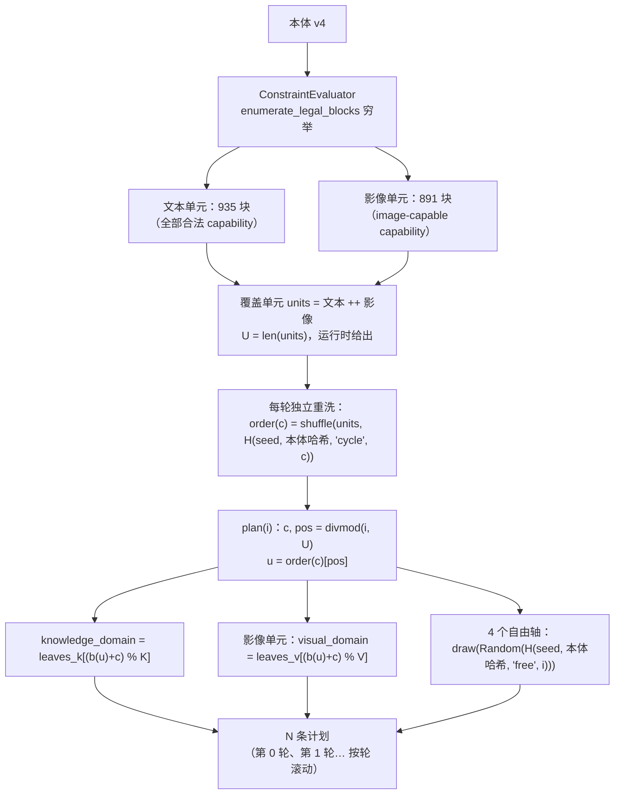

# ARD 算法：构造规则与验收尺子

> 职责：本页是 ARD 的**规范**——本体坐标空间的口径（12 轴分类）、计划的**构造规则**（cycle-shuffle）、
> **锚点 id** 方案、**轮数口径**、**验收尺子**（距离 / 分位 / ε 敏感带 / 配对 bootstrap / 噪声带 /
> 覆盖与密度）、结构读数的**有效多样性**与尺子的**分辨力上限**、**计划身份**与复现，以及仓库自带
> 目标集样例的构造规则与复核路径。
>
> 纯计算实现见 `ard.core.sampling` / `ard.core.constraints` / `ard.core.ontology` / `ard.core.coverage` /
> `ard.core.acceptance`；读数组装与产物字段见 `docs/architecture.md` §8；人话版流程见 `docs/walkthrough.md`。
>
> 引用约定：本页一律使用**符号引用**（如 `ard.core.sampling.sample_coordinates`），**不写 `文件:行`**
> ——行号会随任何代码改动漂移，符号名不会（规则原文见 `CONTRIBUTING.md`）。

## 1. 目标集口径

计划来自本体 v4（`ontology/anchor_ontology.v4.json`，加载器 `ard.backends.ontology_loader.load_ontology_v4`，
schema 门 `ard.core.ontology.parse_ontology_v4`），它声明 **12 轴** = 11 个通用轴 + 1 个模态条件轴。轴分三类：

- **6 个受限轴**（`capability` / `system_prompt_mode` / `conversation_type` / `output_format` /
  `input_condition` / `answer_mode`，即 `ard.core.constraints.RESTRICTED_AXES`）——受约束
  `allowed_pairs`（R1–R4b）与模态门 R5 限制，合法组合是**有限集合**；
- **5 个自由轴**（`language` / `knowledge_domain` / `response_style` / `difficulty` /
  `context_length`）——彼此正交（R7）；
- **1 个条件轴** `visual_domain`——仅当采样字段 `modality == image` 时取值，文本态缺席。

这 12 轴的取值如何影响发给模型的文本，是**措辞契约**，见 `docs/architecture.md` §7。

### 1.1 计数一律运行时穷举，不手抄

本体里**没有任何手写计数块**：**叶子清单是唯一权威**，所有计数由运行时穷举给出。要复算，跑这一条：

```bash
PYTHONPATH=src .venv/bin/python -c "
from ard.backends.ontology_loader import load_ontology_v4
from ard.core.sampling import coverage_units, unit_total, knowledge_leaf_count, visual_leaf_count
o = load_ontology_v4('ontology/anchor_ontology.v4.json')
units = coverage_units(o)
text  = sum(1 for u in units if u.modality == 'text_only')
image = sum(1 for u in units if u.modality == 'image')
print(f'text units = {text}')
print(f'image units = {image}')
print(f'U = {unit_total(o)}   K = {knowledge_leaf_count(o)}   V = {visual_leaf_count(o)}')
"
```

输出（本仓库当前本体）：

```text
text units = 935
image units = 891
U = 1826   K = 209   V = 21
```

其中 `U` = 覆盖单元总数 = 一轮条数，`K` = `knowledge_domain` 叶数，`V` = `visual_domain` 叶数。

**N 不是配置推导出来的常量，也不由上表拦截**：上表只回答"一轮有多大"。运行条数 N 由用户经
`configs/config.toml` 的 `[generation] count` 设置（§2），缺省 = 一轮 = U。

## 2. 构造规则：随机顺序轮转（cycle-shuffle）

规则两态相同，差别只在 `capability` 的取值域与条件轴是否参与。**覆盖单元** =
（模态，合法受限块）=（`text_only` | `image`，6 个受限轴的合法组合），由运行时穷举给出
（`ard.core.sampling.coverage_units`，内部调 `ard.core.constraints.ConstraintEvaluator.enumerate_legal_blocks`）。



实现符号：`ard.core.sampling.sample_coordinates`（`_iter_plan` 是唯一的构造循环）。
伪代码：

```
units    = 文本合法块 ++ 影像合法块                 # 穷举；U = len(units)
order(c) = shuffle(units, H(seed, 本体哈希, "cycle", c))
coordinate(i):
    c, pos = divmod(i, U); u = order(c)[pos]
    k = leaves_k[(b(u) + c) % K]                   # b(u) = 单元在声明序中的下标
    v = leaves_v[(b(u) + c) % V] if u.modality == image else None
    free = draw(Random(H(seed, 本体哈希, "free", i)))   # 4 个自由轴
    return Coordinate(modality=u.modality, block=u.block, knowledge=k, visual=v, **free)
plan(seed, N) = [coordinate(i) for i in range(N)]
```

逐轴取值方式：

| 轴 | 取值方式 | 实现符号 |
|---|---|---|
| 6 个受限轴 | **穷举合法受限块，每块恰好 1 条（模态组内）** | `ard.core.constraints.ConstraintEvaluator.enumerate_legal_blocks` |
| `knowledge_domain` | **轮转**：`leaves_k[(b(u) + c) % K]` | `ard.core.sampling._iter_plan` 的 `coordinate` |
| `visual_domain` | **轮转**：`leaves_v[(b(u) + c) % V]`（仅影像态；文本态缺席） | 同上 |
| `language` / `response_style` / `difficulty` / `context_length` | **按 `H(seed, 本体哈希, "free", i)` 抽取** | `ard.core.sampling._free_rng`、`_build_coordinate` |
| `modality` | 采样字段（非轴）：来自单元所属模态组 | `ard.core.sampling.coverage_units` |

**"轮转"的确切口径是每轮独立重洗，不是固定步长轮转。** 上表的轮转指取模
`(b(u) + c) % K`：轮内确定、跨轮均匀——一轮内 `b(u)` 取遍连续下标，K 个知识叶各出现
`⌈U/K⌉` 或 `⌊U/K⌋` 次（今天 `1826 = 209 × 8 + 154`，即 154 个叶 9 次、55 个叶 8 次），
每个单元在 K 轮里走遍全部知识叶。承载受限块与自由轴的**单元顺序**则不同：它每轮把整个单元集合
重新洗一遍（`order(c) = shuffle(units, H(seed, 本体哈希, "cycle", c))`，种子含 `c`），
第 `c` 轮与第 `c+1` 轮之间没有任何固定步长关系，轮内每个单元恰好出现一次。

**4 个自由轴等概率、无权重、彼此独立。** `ard.core.sampling._build_coordinate` 对每个轴调用
`ard.core.sampling._draw`，实现是 `values[rng.randrange(len(values))]`——在**该轴自己的取值数组**上
等概率抽取，没有权重、分层或截断一类会让分布偏斜的因素；4 个值来自同一次抽样里同一个
`Random(H(seed, 本体哈希, "free", i))` 的顺序调用，互不条件化（唯一例外：本体若未声明
`language` 取值，则回落到 `ard.core.sampling.DEFAULT_LANGUAGE` 且不消耗抽取）。
因此自由轴的轮内计数**带抽样波动**（今天一轮内 `difficulty` 三值为 591 / 606 / 629），
与轮转轴"每轮精确配平"是两种不同的均匀性。

**N 无上限，按轮滚动。** 唯一入口是 `configs/config.toml` 的 `[generation] count`
（`ard.config.GenerationConfig.count`，类型 `int | None`）。缺省 `None` = 一轮 = U。
**没有 CLI 参数、没有 `run.sh` 透传、没有环境变量**（宪法 §10.1 推论 1/2：CLI 与 config 零交集）。
边界校验（`ard.config.GenerationConfig._check_count`）只拒绝两种请求：**`count < 1`** 与
**非法类型**（非整数、`bool`、字符串、浮点）。**任何大 N 都不拒绝**——`N > U` 只是进入下一轮，
日志以 `ard.core.sampling.plan_rounds` 给出的 "满几轮 / 末轮几条 / 共多少条" 作提示。

**前缀性质**：`plan(seed, N)` 是 `plan(seed, N')` 的前缀（`N <= N'`）。自由轴的随机种子
（`ard.core.sampling._free_rng`）只依赖计划下标 `i`，**从不依赖 N**，所以增大 N 不改写任何已有坐标。

**"每块恰好 1 条"的作用域是模态组内**：891 个影像态合法块是 935 个文本态合法块的子集，因此这 891 个
受限坐标各出现两次——文本态组一次、影像态组一次——二者靠采样字段 `modality` 区分，不构成重复。

**没有坐标去重。** 同一坐标（同一组轴取值）可以在不同轮再次出现，**这是设计允许的**：坐标是内容、
不是身份，温度 0.8 下同一坐标能问出不同的题，丢掉它就是丢掉一条合法样本。运行时**不做**坐标查重、
**不丢**记录；`plan` 的长度恒等于请求的 N（`ard.core.sampling.sample_coordinates` 的返回值）。

**不变量**（构造规则的直接推论；一次计划复算即可验证，不需要端点调用）：

| 标记 | 内容 | 依据 |
|---|---|---|
| I1 | 一轮内每个覆盖单元恰好出现一次 | `order(c)` 是单元集合的排列 |
| I2 | `N >= U` 时 K 个知识叶、V 个视觉叶全部被覆盖 | 一轮内 `b(u)` 取遍 U 个连续下标，且文本单元数 `>= K`、影像单元数 `>= V` |
| I3 | 同一 run 内锚点 id 两两不同 | id 是 `(轮次, 轮内序号)` 的位置序号，构造即单射 |
| I4 | 同一坐标可以在不同轮再次出现，且两条都留存 | 坐标是内容不是身份；id 与坐标脱钩（§3） |

由此，**N 没有上限**：越过 U 后照常进入下一轮，覆盖率在 `N >= U` 后饱和于 `1.0`，密度继续线性增长
（两个口径的读数定义见 §7）。

## 3. 锚点 id：计划位置，不是坐标指纹

锚点 id 是**计划位置序号**（库的主键），与坐标内容彻底脱钩：

```
run_key = H(本体哈希, seed, SAMPLING_ALGORITHM)[:8]
id      = f"{run_key}-c{轮次:05d}p{轮内序号:05d}"
```

实现符号：`ard.core.sampling.run_key` / `ard.core.sampling.format_anchor_id`；
本体哈希 = `ard.core.sampling.ontology_sha256`，算法版本 = `ard.core.sampling.SAMPLING_ALGORITHM`
（当前 `"cycle-shuffle/v1"`）。示例：`"1a2b3c4d-c00000p00137"` 是第 0 轮的第 138 条样本。

四条性质：

| 性质 | 内容 | 为什么需要 |
|---|---|---|
| **N 无关** | 增大 N 时已有 id **逐字节不变** | 续跑可直接追加，不重写已有记录 |
| **确定性** | 只用整数与固定格式摘要，无 `hash()` / `set` 迭代序 / 浮点，跨进程、跨 `PYTHONHASHSEED` 相同 | 续跑守卫与产物审计可独立复算 |
| **跨 run 可区分** | `run_key` 混合本体哈希、seed、算法 | 不同 seed / 本体 / 算法不会撞 id |
| **可读可定位** | `cNNNNN` / `pNNNNN` 五位补零 | 一条 id 就能说出"哪一轮的第几条" |

**id 是位置序号，不是内容指纹** —— 同一 id 在新旧两个计划里**不保证**指向同一坐标。
这正是续跑守卫不能用"id 集合是子集"来判定的原因（§10）。

## 4. 轮数口径

**两个"轮数"不是一回事，必须分开读：**

- 本体 `conversation_type.value_attributes.turns` 数的是**交换**（exchange = 一个用户问题 + 它得到的回答）；
- `AnchorSpec.messages`（生成产物中的消息数组）数的是**消息**，其长度 = `2n − 1`：`user` 开头、
  `user` 结尾、角色交替，因为**最后一轮必须是 user**——它的回答才是训练目标，不作为 spec 轮存在
  （`ard.core.types.AnchorSpec`）。

例：`single_turn`(1) → 1 条消息；`clarification`(2) → 3 条；`constraint_update`(4) → 7 条。
映射实现见 `ard.core.sampling._spec_turns` 与 `ard.core.sampling.turn_counts_by_conversation_type`。

**`MULTI_TURN_DEFAULT = 4` 的取值依据与本体缺口**（`ard.core.sampling.MULTI_TURN_DEFAULT`）：

- 依据：本体对 `tool_assisted` 与 `source_review` 只写 `turns: "multi"`，**没有数值上界**；常量取本体自身
  声明的最大轮数 `constraint_update = 4`，即"`multi` = 本体已声明的最长交换数"。
- 缺口：这是**本体缺口，不是设计选择**——本体没有表达"multi 的上界"。代码把该数字收在单一常量处，
  并设硬门：本体一旦声明比它更大的轮数，`_spec_turns` 直接报错，不静默采用。
- 轮数**不是配置项**：`configs/config.toml` 无对应字段，改轮数只能改本体（或该常量）。

## 5. 验收尺子：距离、分位与 ε 敏感带

**距离**：`d(x) = min_{a ∈ A} (1 − cos(x, a))`，逐目标点取其到**最近锚点**的距离。两侧向量必须
**L2 归一化**，这样点积即余弦、`1 − dot` 即距离；结果夹到 `[0, 2]` 以免浮点噪声产生负距离。
实现：`ard.core.coverage.nearest_anchor_distances`；归一化门 `ard.core.coverage.validate_vector_set`
（容差常量 `UNIT_NORM_TOLERANCE`）。

**分位**：**Hyndman–Fan type-7**（`numpy.percentile(method="linear")`，`ard.core.coverage._type7`），
全项目统一口径。

**主尺子 `q95`**：最近锚点距离的 **type-7 95 分位**（`ard.core.coverage.distance_quantiles`）。
并报 `q50` / `q90` / `r_max`（最大距离），以及样本量 `|T|`（目标点个数）。

`Extent(ε) = mean(d ≤ ε)`：落在半径 ε 内的目标点比例，**仅作参考**，从不作为判定尺子
（`ard.core.coverage.extent`）。

**ε 敏感带**：`Extent` 对 ε 的选择敏感，故并列三点（`ard.core.coverage.epsilon_sensitivity`，
乘子常量在其模块内具名）：

| 字段 | 含义 |
|---|---|
| `extent_at_095` | `Extent(0.95 × ε)` |
| `extent_at_100` | `Extent(1.00 × ε)` = 报告的主覆盖读数 |
| `extent_at_105` | `Extent(1.05 × ε)` |

ε 的来源被显式落在空间声明里（`ard.backends.coverage_wiring`）：

1. 目标集文件头部声明了 `epsilon` ⇒ 原样使用；
2. 未声明 ⇒ 用目标集**自身尺度**：目标点之间最近邻距离的 type-7 中位数
   （`ard.core.acceptance.intrinsic_epsilon`）；目标点少于 2 个时**报错**，不猜测。

**配对 bootstrap**：用于比较两臂的 `q95` 差（`ard.core.coverage.paired_bootstrap_q95_ci`）：

- **单位 = 目标点**：每次重采样抽的是目标点下标；
- **两臂共用同一次索引抽取**（同一 `positions` 同时索引两臂）——这是"配对"的定义，也是它与独立重采样的区别；
- **B = 2000**（`DEFAULT_BOOTSTRAP_RESAMPLES`），置信水平 0.95（`DEFAULT_CONFIDENCE_LEVEL`）；
- 点估计 = `q95(A) − q95(B)`（原始样本上的 type-7 分位差）；CI = bootstrap 差值的 type-7 2.5% / 97.5% 分位；
- 两臂长度不一致、或 `unit_id` 不同的目标集 ⇒ `PairingMismatchError`，不静默产出。

## 6. 噪声带

同格重复生成（**同一请求**被生成多次）的距离分布，下沿 `q50`、上沿 `max`
（`ard.core.coverage.noise_band`）。原料是同一格的**互异对**距离（`ard.core.coverage.pairwise_distances`）。
判据 `ard.core.coverage.within_noise_band` 为闭区间判定：落在 `[q50, max]` 内 = 与重复生成噪声**不可分辨**。

组装：`ard.core.acceptance.noise_section` 从库记录中找**同 prompt 签名**的分组
（`ard.core.acceptance.repeat_groups`），无重复生成数据时按 `NOISE_UNAVAILABLE_REASON`
显式写 **`unavailable`**，绝不省略。

### 6.1 分组键 = prompt 签名（不是整份 `anchor_meta`）

分组的定义是"两次生成发给输入生成器的请求逐字节相同"，因此分组键必须是
**prompt 组装实际读到的字段序列**，而不是 `anchor_meta` 的全部键：

- 签名 = `PROMPT_SIGNATURE_AXES`（`ard.core.acceptance.PROMPT_SIGNATURE_AXES`）的取值**有序元组**；
  缺轴 = `None`，不是"取该轴第一个值"（`ard.core.acceptance.prompt_signature`）。
- 这 12 个轴就是**全部 12 个本体轴**：`language` / `knowledge_domain` / `capability` /
  `conversation_type`（`ard.domain.text_anchor._build_user_prompt` 读并拼进指令、
  `_generate_system_message` 组装 system 串）、`system_prompt_mode`
  （`ard.backends.prompt_loader.load_system_prompt_template` 选措辞文件，
  `ard.core.system_prompt.render_system_prompt_prompt` 填占位符）、六个 instruction 轴
  （`ard.domain.text_anchor._build_user_prompt` → `ard.backends.axis_instruction_loader.build_axis_requirements`）、
  `visual_domain`（`ard.domain.image_store.domain_directory` 决定选图时优先看哪个目录；该目录没有候选时
  实际图来自全局复用池，域目录本身仍是坐标的寻址依据）。
- **不在**签名里的是计划记账字段 `modality` / `has_image` / `image_count`：它们不改变发给生成器的请求文本。
  `image_count = min(用户轮数, IMAGES_PER_ANCHOR)` 且 `IMAGES_PER_ANCHOR = 1`
  （`ard.pipeline.IMAGES_PER_ANCHOR`），信息量为零；契约测试
  `tests/core/test_acceptance_prompt_signature.py` 双向渲染两遍（列出轴必须改变渲染、未列字段必须不改变渲染）
  来守住这个集合，轴一旦变成"吉祥物"即失败。
- **判据没有放宽**：仍然只在"同一签名出现 **≥2** 条"时才标定噪声带。一轮之内每条签名只出现一次，
  所以正常运行的读数**就是** `unavailable`；重复组是因为"同一格被生成多次"才出现，不是为了"能出数"而放宽。
  **跨轮**可能再次抽到同一签名（坐标允许重复），那时重复组会出现——这是真实噪声，不是放宽。

**为什么旧口径会低估噪声**：按整份 `anchor_meta` 分组时，两条**只差不进 prompt 的字段**的记录会被分到两格，
于是"同一请求的两次生成"被算成"两个格子"，重复对消失、噪声带被报成 `unavailable` 或偏窄，
而 `q95` 的臂间差反而显得"可分辨"。

## 7. 覆盖率 / 密度 / 轮分解

**两个口径必须分开读，不得混用**（`ard.core.acceptance.PlanCoverage`）：

| 口径 | 定义 | 重复如何处理 | 饱和行为 |
|---|---|---|---|
| **coverage（按坐标）** | `min(distinct_coordinates, U) / U` | 同一坐标跨轮**不重复计入** | 饱和于 `1.0` |
| **density（按条数）** | `N / U` | 重复**计入**（每条样本都算） | 随 N 线性增长（`N = 2U` ⇒ `2.0`） |

- `U` = 覆盖单元总数（一轮条数），运行时穷举给出（`ard.core.sampling.coverage_units`）；
  `K` / `V` = 知识叶 / 视觉叶数。**本仓库当前的数值与复算命令、输出见 §1.1**——本文不手抄数字，
  数字会随本体变化。
- **轮分解**：`full_rounds, last_round_size = divmod(N, U)`；`rounds = full_rounds + (1 if last_round_size else 0)`。
  `last_round_size == 0` 表示计划恰好停在轮边界。
- `plan_count` 保留调用者原样给的 N；缺省（`None`）按"一轮 = U"解析后再算。

**`within_rule` 的判据（`ard.core.acceptance.structure_checks`）——全部按本 run 的 N 判定：**

1. `plan_total == N`（缺省 N = U）；文本/影像条目数由本轮洗牌序决定，不写死；
2. `distinct_coordinates >= min(N, U)`（用 `>=`，**不用 `==`**：一轮内每个单元出现一次，
   所以前 U 条坐标互异；跨轮重复只会让 distinct 更高，不会更低）；
3. 受限块数、知识叶数、视觉叶数**只在 `N >= U` 时**才检查等于 `U_text` / `U_image` / `K` / `V`；
   `N < U` 时这些期望值为 `None`、检查项**整体略过**——洗牌序决定能覆盖到哪些块与叶，
   规则在这个规模上不保证任何块/叶计数，不猜一个可能不成立的界；
4. **没有"坐标重复"检查项。** 同一坐标跨轮再次出现是允许的（见上表），把它读成错误会误杀合法样本。

任一检查不成立 ⇒ `within_rule: false`，`coverage.md` 对应行标 `MISMATCH`，`structure_mismatch`
的 warning 逐行点名。**冒烟不再误报**：`--smoke` 的调用方传 `count = len(plan) = 8`
（`ard.pipeline._build_plan`），所以 8 条计划按 8 条判定，`within_rule: true`；
它只会在 coverage 上如实显示 `8 / 1826 ≈ 0.0044`。

## 8. 结构读数里的"有效多样性"——以及读数如何被误读

**为什么非要报这两个数。** 标称块数（`text_block_count` / `image_block_count`）只说明"计划枚举了多少个
合法受限组合"，**不等于**"发出了多少个不同请求"，更不等于"有多少个不同规格能改变生成结果"。合法受限块
必须投影到**prompt 真正读到的受限轴**上才成为规格：两个块若在那些轴上取值相同、自由轴也相同，它们发出的
prompt 就**逐字节相同**。所以读数把标称块数与两个 distinct 数并列报出，让"枚举得多、区分得少"这种退化在
零成本的结构读数里就暴露出来，而不是留给 `q95` 去承担它分辨不了的事（§9）。

**于是结构读数并列报四个数**（`structure` 里，全部按模态分开；定义随读数一起落盘在 `structure.diversity`）：

| 字段 | 含义 |
|---|---|
| `text_block_count` / `image_block_count` | 覆盖到的**合法受限块**数（标称块数） |
| `prompt_signature_distinct` | 不同 **prompt 签名**数 = 不同生成侧请求数 |
| `effective_projection_distinct` | 受限轴里**真正进 prompt**的那些轴的**不同投影**数 = 能改变生成结果的不同规格数 |
| `knowledge_domain_leaves` / `visual_domain_leaves` | 轮转叶覆盖数 |

具体数值随本体与 N 变化，`coverage.json` / `coverage.md` 里就是本 run 的实测值；
一轮（`N >= U`）时的期望值 = 运行时穷举的 `U_text` / `U_image` / `K` / `V`（§7）。
`prompt_signature_distinct` 与 `effective_projection_distinct` 都是 `{text_only, image}` 两个整数；
`structure.diversity` 写明签名包含哪些轴、按什么顺序拼、在什么集合上数（`counted_over`），
本页只讲"为什么要报"。任何一个 distinct 数**小于**同模态的块数且 `N >= U` 时，
`within_rule` 即为 `false`、`coverage.md` 对应行标 `MISMATCH`、`structure_mismatch` 的 warning 逐行点名
——这是防呆，不是给读数化妆。

**读数如何被误读（三种典型错误，都必须避免）**

1. **把标称块数当有效多样性**：`935/935 块覆盖` 只说明"计划枚举了 935 个合法受限组合"，
   **不说明**它们产生 935 个不同请求或 935 个不同规格。要读有效多样性，只能看上面后两个数。
2. **把 `prompt_signature_distinct` 当"设计格数"**：签名 distinct=935 只说"935 个不同 prompt"。但签名互异
   **可以靠单轴轮转撑起来**——当有效的受限投影数远小于块数时，`knowledge_domain` 逐条轮转就足以让每行签名
   互异。所以**签名互异 ≠ 受限规格互异**，两个数必须一起读；
   只看签名数会把"轮转出来的差异"当成"实验格子本身的差异"。
3. **把 `noise.available=false` 当"没有噪声"**：`unavailable` 的含义是"**这批产物里没有同签名的重复生成**"，
   不是"噪声为零"。一轮内每格只生成一次，所以正常运行的读数就是 `unavailable`（§6.1）；此时
   `q95` 的臂间差**没有标定过**可分辨性，不得据此写"某臂更优/更差"（§9）。

**复算**：这些数都是零成本的纯结构计数，`ard.core.acceptance.structure_readout(plan, ontology=…, count=…)`
即可复得；本机既有产物上重跑读数的做法见 §12 结尾，不需要任何生成调用。

## 9. 验收尺子的分辨力上限

**这是本尺子的硬约束，读任何 `q95` 数字前必须先读它：**

- 噪声带的语义是"**同格重复生成**这条管道自身产生的距离散布"。当两臂的 `q95` 差值**小于**该噪声时，
  指标层**无法区分**这两臂——差异可能来自生成随机性，而非被测的设计因素。
- **尾部读数已被噪声主导。** 报告里的噪声带就是这个上界的实测值：同格重复生成之间的距离分布
  `[q50, max]` 决定了 `q95`（以及 `r_max`）能分辨的最小差异。当噪声带量级与臂间 `q95` 差相当时，
  **指标层已到顶**——再多臂、再多尺子层都不会让排名变得可分。
- **由此得出的口径**：在该分辨力上限内，**结构保证才是硬约束**——即
  "每个模态组内每个合法受限块恰好 1 条、`prompt_signature_distinct` 等于块数、
  `effective_projection_distinct` 等于块数、知识叶 / 视觉叶在全轮上轮转、`coverage` 在 `N >= U` 时饱和于 1.0"
  这类可零成本复核的结构事实，比臂间 `q95` 排名更可靠。`q95` 用于**自证与回归**（同一构造的读数是否稳定），
  不用于主张细微的算法优劣。
  后两个 distinct 数不是装饰（§8）：它们正是"935 个格子"与"935 个不同规格"之间那道必须被读出来的差别。
- 报告的措辞要求：当读数落在噪声带内时，不得写"某臂更优/更差"，只能报
  **效应量 + CI 宽度 + 最小可辨差（≈ CI 半宽）**，并明确声明"不可分辨"。

## 10. 计划身份与复现

**计划由 `(本体, seed, N)` 唯一决定。** 采样只用显式的 `random.Random(seed)` 派生生成器
（`ard.core.sampling._free_rng` 等），自由轴取值来自本体的有序数组，受限块按固定嵌套顺序枚举
（`ard.core.constraints.ConstraintEvaluator.enumerate_legal_blocks`）——没有未播种随机源，
没有 `set` / `dict` 迭代顺序依赖。同一 seed 的同一计划在任意 `PYTHONHASHSEED` 下摘要逐字节相同。

- 采样由 `configs/config.toml` 的 `[generation] seed` 决定；不设该字段则每次运行从系统随机源抽新 seed，
  实际使用的 seed 记入输出目录的 `config.toml`。
- 同一 `(本体, seed, N)` 必然得到同一计划；构造规则本身无随机性，自由轴之外的取值完全确定。

**但 `seed` 不是计划的名字。** `config.toml` / `manifest.json` 的 `config` 段**每次运行都被覆盖**
（含什么都没生成的空转续跑），因此它记录的 seed 描述的是**最后一次调用**，不一定是产出该库的那次计划
——用记录里的 seed 复算一个被空转调用覆盖过的库，自由轴分配对不上；历史冒烟库被调用 3 次，后两次空转
覆盖了真正采样那次的 seed，用记录值复算自由轴只有 11/32 相同。**结论：计划本身由 `(本体, seed, N)` 唯一
决定，所以"钉 seed ⇒ 计划可复现"成立；但"产物里记录的 seed ⇒ 计划可复现"不成立**，因为记录值可能属于
另一次调用。计划的名字是 `plan_identity` 的摘要。

**`plan_identity`（v2）是计划的一等公民**：`ard.core.sampling.PlanIdentity.of`
（`PLAN_IDENTITY_VERSION = 2`）对**有序坐标列表**做 sha256，连同本体哈希、seed、请求的 count、
单元数 U、采样算法与版本、条数一起写进每次运行的 `manifest.json`
（`ard.pipeline._declare_plan_identity`）：

```json
"plan_identity": {
  "algorithm": "sha256", "version": 2, "sampling": "cycle-shuffle/v1",
  "ontology_sha256": "<本体内容的 sha256>", "seed": 1488279264,
  "count": 8, "unit_total": 1826, "plan_size": 8, "digest": "…"
}
```

`count` 保留**调用者原样给的值**：`None` 就是 `None`（= 一轮），不被静默替换成 U。
同一计划在任何进程、任何 `PYTHONHASHSEED` 下得到同一摘要。

**绑定规则**：

1. **产品级读数（`q95` / `Extent` / 覆盖与密度）只能绑定到 `plan_identity.digest`**：写报告时引用该摘要，
   而不是引用 seed；两个摘要相同才允许把两次读数并列比较。
2. **续跑守卫比的是"逐条坐标一致"，不是摘要相等**（`ard.pipeline._refuse_foreign_records_on_resume`）：
   id 是位置序号（§3），smoke 计划与全量计划的 id 形状相同却指向不同坐标，所以守卫逐条比对已有记录
   在其 id 位置的坐标；不一致 ⇒ 拒绝续跑（明确报错并提示换目录），绝不把两份计划的锚点写进同一份
   `anchor_bank.jsonl`；一致 ⇒ 允许追加。守卫的读数来源（manifest 或中间记录）见
   `docs/architecture.md` §4。
3. **同一计划的判据是摘要，不是 seed**——**不同 seed 可以是同一计划，同一 seed 也可以是不同计划**。
4. **`plan_identity` 没有被记录的老产物**（本字段引入之前的库）不能凭 seed 断言其计划身份，
   只能按结构校验续跑；若要做产品级读数，先重新采样并记录摘要。

**本体身份自动派生，文档零手抄。** 本体内容的 sha256（`ard.core.sampling.ontology_sha256`）由运行时
算出并写进 `plan_identity` / `manifest.json`（`ard.pipeline._declare_plan_readout`）——用户无需登记任何
指纹，文档也不维护任何指纹表。

## 11. 目标集样例的构造规则

`examples/target_set.sample.jsonl` 是**接线样例（wiring sample），不是产品目标集**。它的构造规则写在文件头
（`axes` / `selection` / `template` 三个字段）里，机器可读、可复算：

- **用到的轴**：`knowledge_domain` 与 `language`（取自 `ontology/anchor_ontology.v4.json`）；
- **`knowledge_domain` 取法**：按 `knowledge_domain_tree` 的文档序展开成叶值列表，
  取下标 `floor(k × (len − 1) / 7)`，`k = 0..7` —— 等距 8 个，**含首尾**；
- **`language` 取法**：`axes.language.values` 的**全部**取值，按本体序；
- **文本模板**（唯一一条，逐字）：
  `Explain {leaf} in depth: what it is, how it is studied, and why it matters. Answer in {language}.`
- **顺序与数量**：`knowledge_domain` 外层、`language` 内层，共 **8 × 4 = 32 条**；文件头声明
  `expected_count: 32`，条目数不符即被 `load_target_set` 拒绝。

该文件不含端点、密钥、模型名或个人信息。文件是**一行 JSON 文档**（外层是带 `targets` 数组的对象），
这同时满足 JSONL 的"一行一个 JSON 值"与 `load_target_set` 的"对象文档可带头部"两种读法——JSONL 逐行读取
时不支持头部，头部因此只能由对象文档承载。

**它不保证读出的数字有意义**：32 条同模板句子的自身尺度很小（本机离线 MiniLM 384-d 下 ε ≈ 0.021，
故 `Extent(ε)` 通常为 0）。样例只证明"目标集 → 嵌入 → 距离 → 读数"这条**接线**通，不构成任何覆盖结论；
产品级读数需要真正的目标集与真正的锚点库。

## 12. 复核指标路径：三步

指标读数**完全由配置驱动**（没有 CLI 开关，`ard.config.CoverageConfig`）。要让复核员能零成本复跑：

1. **配嵌入器**：在 `.local/config.override.toml`（被 gitignore 的本机覆写文件，**绝不入库**）里写
   `[coverage.embedding]`。下文只给**字段名与占位符**，不给真实端点/模型/密钥：

   ```toml
   [coverage.embedding]
   api_base = "<OpenAI 兼容的 /embeddings 基址，含 /v1>"
   model = "<嵌入模型名>"
   dimension = <该模型的向量维度>
   # api_key = "<服务端需要时填>"
   # batch_size = 32
   # normalize = true      # 必须为 true：尺子要求 L2 归一化行
   ```

2. **指向目标集**：设 `coverage.target_set_path`。仓库自带一个小而确定的样例
   （`examples/target_set.sample.jsonl`，32 条，构造规则见 §11），开箱可用：

   ```toml
   [coverage]
   target_set_path = "examples/target_set.sample.jsonl"
   ```

3. **跑一次**：`--smoke`（8 条锚点，几分钟）或完整运行。产物在 `<output_dir>/results/coverage.json`
   与 `coverage.md`：`metrics.space` 是空间声明，`metrics.quantiles.q95` 是主读数。

三种配置组合的行为见 `docs/architecture.md` §8 的契约表：都没设 ⇒ 结构读数 + WARNING；只设目标集不配
嵌入器 ⇒ fail-fast 报错；两者都设 ⇒ 指标读数。只想验证接线、不想调用生成端点时，可以对**已有的**
`anchor_bank.jsonl` 直接调用 `ard.pipeline._prepare_coverage` + `ard.pipeline._run_acceptance`。
