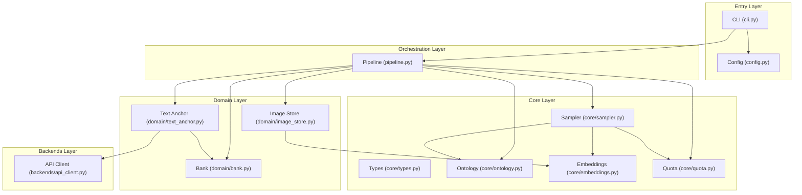
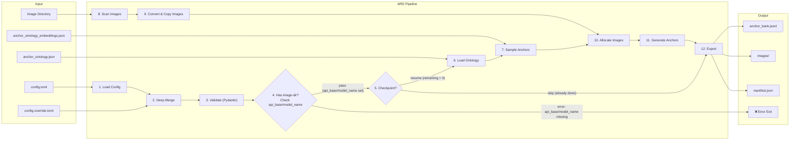
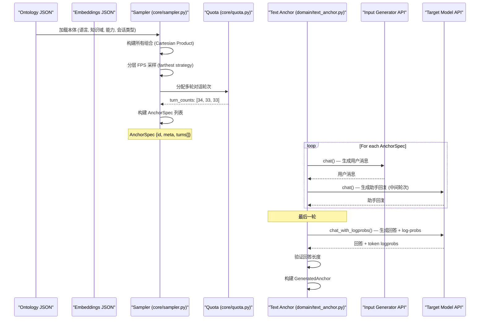
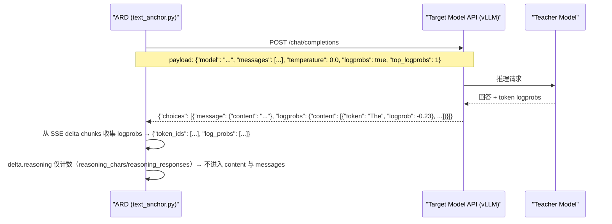
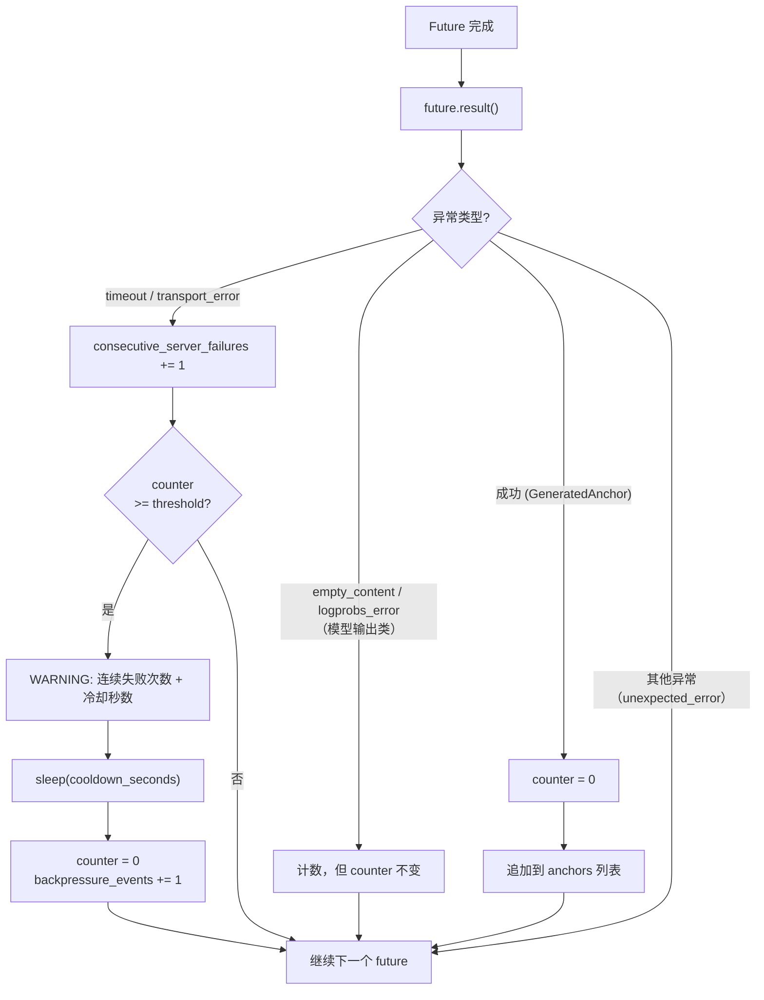
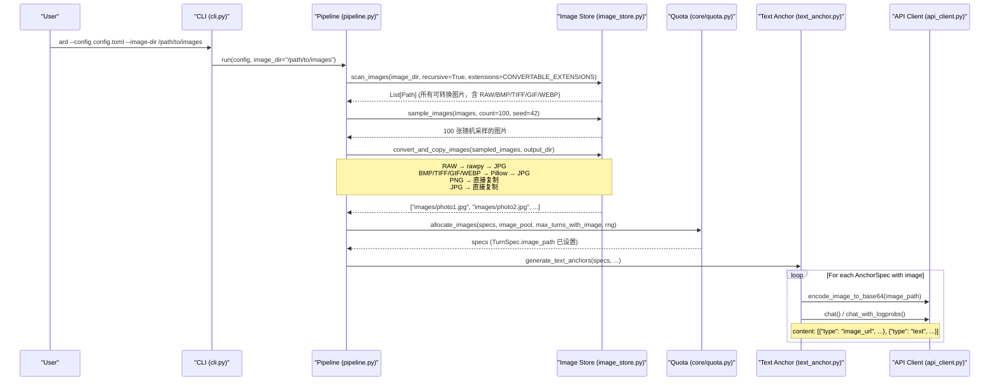

# ARD 架构文档

> **Anchor Replay Distillation** — 通过分层锚点采样和双模型 API 生成高质量训练数据，
> 为 graspo 等 Off-Policy Distillation 框架提供可复现的锚点数据集。

---

## 1. 设计目标

ARD 的核心价值是**生成高质量、可复现、覆盖多维度的锚点数据集**，
支撑 Off-Policy Distillation 训练。它围绕三大核心能力设计：

### 1.1 三大核心能力

| 能力 | 解决的问题 | 实现方式 |
|------|-----------|----------|
| **FPS 收敛采样** | 如何从巨大组合空间中选出最具代表性的锚点？ | 分层最远点采样（Hierarchical FPS），先选知识域，再选能力×语言×会话类型组合 |
| **Log-probs 支持 OPD** | 如何让 student 模型学到 teacher 的 token 级置信度？ | 通过 vLLM API `logprobs=True` 获取 teacher 回答的 token 级 log-probs |
| **多模态支持** | 如何生成文本+图片的锚点？ | 统一的文本/多模态生成管线，图片通过 `image_store.py` 管理 |

### 1.2 FPS 收敛目标

设 `C` 为所有可能的（知识域，能力，语言，会话类型）组合集合，`|C|` 为组合总数。
设 `S(k)` 为 FPS 算法从 `C` 中选出的 `k` 个样本，定义覆盖维度上的覆盖率：

- **知识域覆盖率** `D(k)`：`S(k)` 中覆盖的知识域数 / 总知识域数
- **能力覆盖率** `A(k)`：`S(k)` 中覆盖的能力类型数 / 总能力类型数
- **语言覆盖率** `L(k)`：`S(k)` 中覆盖的语言数 / 总语言数
- **会话类型覆盖率** `T(k)`：`S(k)` 中覆盖的会话类型数 / 总会话类型数

**收敛定义**：当 `k` 趋向 `|C|` 时，`D(k)`, `A(k)`, `L(k)`, `T(k)` 均为 1.0，
且每条覆盖率曲线单调非减。即：

$$\lim_{k \to |C|} D(k) = \lim_{k \to |C|} A(k) = \lim_{k \to |C|} L(k) = \lim_{k \to |C|} T(k) = 1.0$$

且对于任意 `k1 < k2`，有 `D(k1) ≤ D(k2)`（其他维度同理）。

**实际意义**：当用户设置 `target_count = 100` 时，FPS 算法保证这 100 个样本
覆盖的知识域、能力、语言、会话类型尽可能多；当 `target_count` 增大到 1000 时，
覆盖率单调递增并最终收敛到 100%。

---

## 2. 模块边界

### 2.1 四层架构图



### 2.2 模块职责声明

| 模块 | 文件 | 职责（一句话） |
|------|------|---------------|
| **CLI** | `cli.py` | 解析命令行参数，加载配置，调用 Pipeline |
| **Config** | `config.py` | 定义 Pydantic 配置模型，加载/合并/校验 TOML 配置 |
| **Pipeline** | `pipeline.py` | 编排整体流程：加载本体 → 采样 → 图片分配 → 生成 → 输出 |
| **Types** | `core/types.py` | 定义纯数据类（`AnchorSpec`, `TurnSpec`, `GeneratedAnchor` 等） |
| **Ontology** | `core/ontology.py` | 加载 `anchor_ontology.json`，提供本体数据访问 |
| **Embeddings** | `core/embeddings.py` | 加载预计算嵌入向量，执行 FPS 算法 |
| **Sampler** | `core/sampler.py` | 从本体组合空间中采样锚点规格 |
| **Quota** | `core/quota.py` | 分配多轮对话轮次配额和图片到锚点的配额 |
| **Text Anchor** | `domain/text_anchor.py` | 并发生成锚点：调用 Input Generator 生成用户消息，调用 Target Model 生成回答。**多模态场景下：input_generator 和 target_model 必须均为多模态模型** |
| **Bank** | `domain/bank.py` | 锚点存储：序列化、追加、读取、构建 manifest |
| **Image Store** | `domain/image_store.py` | 图片扫描、格式转换（RAW/ BMP/ TIFF/ GIF/ WebP → JPG）、随机采样、复制到输出目录 |
| **Logging** | `logging.py` | 提供 `get_logger` 辅助函数，统一所有模块的日志格式和输出目标 |
| **API Client** | `backends/api_client.py` | 基于 httpx 的 OpenAI 兼容客户端，支持 SSE 流式生成、分层超时控制、log-probs 提取和背压传播；识别并统计 `delta.reasoning`（推理 token 只计数、绝不进入 `target_answer`），推理吃光预算导致的空正文以 `ARDEmptyContentError` 显式失败 |

### 2.3 模块间接口

模块间通过**明确的 Python 类型**而非隐式约定通信：

- **Config → Pipeline**：`ARDConfig` (Pydantic model)
- **Pipeline → Core**：`AnchorGenerationConfig` (dataclass) + `ontology` dict
- **Core → Pipeline**：`list[AnchorSpec]`
- **Pipeline → Domain**：`list[AnchorSpec]` + `ChatAPIClient` 实例
- **Domain → Backends**：`list[dict]` (OpenAI 格式消息) → `str` / `ChatResultWithLogprobs`
- **Domain → Bank**：`GeneratedAnchor` → JSONL 行
- **Pipeline → Image Store**：`Path` 列表 → `list[str]`（相对路径）

依赖方向自上而下：Entry → Orchestration → Domain → Backends，Core 层被所有层单向依赖，不依赖任何其他层。

---

## 3. 数据流

### 3.1 从 CLI 到输出的完整数据流



**Checkpoint / Resume**：Pipeline 启动时先检查 `anchor_bank.jsonl` 中已有锚点数。
若已达到 `target_count`，跳过生成直接构建 manifest 并退出；
否则仅生成剩余数量（`remaining = target_count - existing_count`）。
每条锚点生成后立即通过 `O_APPEND` 原子写入 JSONL，确保中断后可从上一次提交点恢复。

**Multimodal Validation**：当 `--image-dir` 传入时，Pipeline 在生成前验证
`input_generator` 和 `target_model` 的 `api_base` 和 `model_name` 是否已设置。
任一为 `None` 时，Pipeline 立即报错退出。多模态支持由模型本身决定——
如果模型不支持多模态，API 会直接返回错误，无需手动维护配置开关。
这是 BADGE 宪法 §2.3（边界校验即防呆）的具体实践：`api_base`/`model_name` 的
None 检查在边界上拦截配置错误，多模态能力由 API 端自行校验。

### 3.2 从 Ontology 到 Anchor 的采样流



---

## 4. FPS 收敛采样

### 4.1 分层 FPS 算法原理

ARD 采用**分层最远点采样**（Hierarchical FPS），分两步进行：

**第一层：知识域 FPS**。对 `items.knowledge_domains` 中所有知识域的嵌入向量执行 FPS，
选出 `N` 个最分散的知识域。这保证了选出的知识域覆盖尽可能广泛的语义空间。

**第二层：域内组合 FPS（拼接组合嵌入 + FPS）**。对每个被选中的知识域，
将其关联的（能力，语言，会话类型）组合的嵌入向量**拼接**为 4096 维组合向量
（4 × 1024 = 4096），然后对组合向量执行 FPS，选出该域内最分散的组合。

**伪代码**：

```
function hierarchical_fps(ontology, embeddings, target_count):
    // Layer 1: select N knowledge domains via FPS
    domain_embeddings = embeddings.items.knowledge_domains
    selected_domains = fps(domain_embeddings, N)

    // Layer 2: within each selected domain, concatenate combo embeddings
    results = []
    per_domain = target_count / N
    for domain in selected_domains:
        combos = build_combinations(domain, capabilities, languages, conv_types)
        // Concat: domain_emb + cap_emb + lang_emb + conv_emb → 4096-dim
        combo_embeddings = [concat(e_domain, e_cap, e_lang, e_conv) for combo in combos]
        selected_combos = fps(combo_embeddings, per_domain)
        results.extend(selected_combos)

    return results
```

### 4.2 嵌入粒度与覆盖保证

嵌入数据来自 `ontology/anchor_ontology_embeddings.json`（49 个嵌入，1024 维）：

| 类别 | 向量数 | 说明 |
|------|--------|------|
| `knowledge_domains` | 18 | 知识域顶级节点（18 个顶级域） |
| `capabilities` | 20 | 能力类型（5 个大类，20 个叶子） |
| `languages` | 4 | 语言（English, 简体中文, Español, 日本語） |
| `conversation_types` | 7 | 会话类型（5 个大类，7 个叶子） |

嵌入数据以 `items` 字典组织，每个类别是一个 `{name: [1024 floats]}` 映射，
由 API 生成，维度 1024，距离度量为余弦距离。

**覆盖保证**：分层 FPS 确保：
- 第一层 FPS 保证知识域覆盖的多样性（知识域是最重要的维度，变化最大）
- 第二层 FPS 通过拼接组合嵌入（4096 维）保证每个域内组合的多样性
- 当 `target_count` 增大到组合总数时，FPS 退化为全选，覆盖率 = 100%

### 4.3 收敛性定义与度量

对于任意目标数量 `target_count = k`，FPS 选出的样本集 `S(k)` 需满足：

1. **单调性**：`D(k1) ≤ D(k2)` 对所有 `k1 < k2` 成立
2. **收敛性**：`lim_{k→|C|} D(k) = 1.0`
3. **FPS 最优性**：在给定 `k` 下，`S(k)` 的任意两个样本在嵌入空间中尽可能远离

ARD 使用最远点采样（Farthest Point Sampling, FPS）作为唯一采样策略，
基于预计算的领域嵌入向量选择多样性最大的知识域组合。

### 4.4 实际组合空间与覆盖率

当前本体定义的实际组合空间为 **10,080**（18 知识域 × 20 能力 × 4 语言 × 7 会话类型），
而非 117,040（此数字源于旧版本体的 209 个知识域，现已精简为 18 个顶级域）。

在 `target_count = 100` 时，各维度的覆盖率表现如下：

| 维度 | 总数 | 覆盖率 | 说明 |
|------|------|--------|------|
| 知识域 | 18 | **100%** | 分层 FPS 第一层保证所有知识域被覆盖 |
| 语言 | 4 | **100%** | 语言数量少，100 个样本足以全覆盖 |
| 能力 | 20 | **~75-90%** | 能力是覆盖的短板，因为 20 种能力需要在 100 个样本中分配 |
| 会话类型 | 7 | **~85-100%** | 7 种会话类型通常可全覆盖，但能力维度竞争配额时可能受影响 |

**建议**：当 `target_count ≥ 200` 时，能力覆盖率趋于 100%，
各维度均可实现全覆盖。对于需要能力维度全覆盖的训练场景，
建议设置 `target_count = 200` 或更高。

---

## 5. Log-probs 与 OPD

### 5.1 vLLM API 交互流程

ARD 通过 vLLM 兼容的 OpenAI API 获取 token 级 log-probs。
在每轮对话的最后一个 turn（用户最终提问），Target Model 的调用使用 `logprobs=True` 参数：



真机 chunk 形状（vLLM 0.22.0，同一 chunk 里 `reasoning` 与 `content` 可同时出现，
未产出正文的一侧为 `null`）：

```text
data: {"choices":[{"delta":{"reasoning":"Let me think","content":null},"logprobs":{"content":null}}]}
```

### 5.2 输出数据格式

每条 anchor 记录中的 `targets[].output.logprobs` 格式：

```json
{
  "id": "anchor_<sha256_hex16>",
  "source": "ard",
  "messages": [
    {"role": "user", "content": "..."},
    {"role": "assistant", "content": "..."}
  ],
  "targets": [{
    "id": "primary",
    "output": {
      "content": "<target_answer>",
      "logprobs": {
        "token_ids": ["The", " answer", " is", " 42", "."],
        "log_probs": [-0.1, -0.5, -0.02, -0.3, -0.01]
      }
    }
  }],
  "anchor_meta": {...},
  "teacher_id": "<target_model_name>"
}
```

### 5.3 与 graspo 的对齐

ARD 输出格式与 graspo 的 `Rollout` 格式完全对齐：

| 字段 | graspo | ARD | 说明 |
|------|--------|-----|------|
| `id` | rollout ID | `anchor_<sha256_16>` | 唯一标识 |
| `source` | `"graspo"` | `"ard"` | 数据来源标记 |
| `targets[].id` | `"primary"` | `"primary"` | 目标答案 ID |
| `targets[].output.content` | 回答文本 | 回答文本 | 一致 |
| `targets[].output.logprobs` | `{token_ids, log_probs}` | `{token_ids, log_probs}` | 一致 |

**关键差异**：graspo 的 log-probs 来自 rollout 过程中的模型推理；
ARD 的 log-probs 来自 vLLM API 的 `logprobs=True` 响应。
两者在**数据格式上完全一致**，但在**获取方式上不同**——
ARD 不依赖本地 HF 模型，而是通过远程 API 获取。

### 5.4 token_ids 的格式与跨 tokenizer 兼容性

**真机实测（vLLM 0.22.0，121 条 anchor）**：`logprobs.content[]` 的每个条目实际形状是

```json
{"token": "The", "logprob": -0.23, "bytes": [84, 104, 101], "top_logprobs": [...]}
```

**`token_id` 字段根本不存在**——121 条中 118 条如此（另外 3 条是早期抓取样本），
即"整数 ID（优先）"这一分支在当前服务端上不可达。

**ARD 的实际行为**：`api_client.py` 取

```python
tid = lp.get("token") or lp.get("token_id", "")
```

即**字符串 `token` 是第一来源**，整数 `token_id` 只在服务端**确实返回**它时才会被用到
（保留该分支是为了兼容别的 OpenAI 兼容服务端）。因此输出里的 `token_ids`
（字段名因 graspo 兼容而保留复数形式）在真机上**几乎总是字符串数组**：

```json
"logprobs": {"token_ids": ["The", " answer"], "log_probs": [-0.23, -0.5]}
```

**跨 tokenizer 语义**：字符串 token 是人类可读的文本表示，与具体 tokenizer 的词表无关。
它**不等于"任何一个 tokenizer 下的一个 token"**——把字符串 token 单独拿去编码，
得到的可能是多个子词（例如 `" answer"` 在别的词表里可能被拆成 `" answer"` + 其余部分），
也可能与生成的切分不同。因此：

* teacher 与 student 使用**同一 tokenizer** 时，监督信号最精确的方式是**用该 tokenizer 重新编码
  `content`**，并按位置与 `log_probs` 对齐；字符串 token 用于校验切分是否一致。
* tokenizer 不同时，字符串形式是唯一可移植的表示，但下游必须按自己的词表重新编码，
  并接受切分不对齐的代价。

**整数 ID 的适用条件**：只有在服务端确实返回 `token_id` 且 teacher/student 共享词表时，
整数才能直接用于 OPD 训练、无需额外映射。

### 5.5 流式 SSE 与分层超时

ARD 使用 `httpx` 替换 `urllib`，通过 SSE（Server-Sent Events）流式获取 API 响应。
流式模式采用**三层超时策略**，每层超时独立控制，防止僵尸请求级联：

| 超时层 | 配置字段 | 默认值 | 控制范围 |
|--------|----------|--------|----------|
| **连接超时** | `connect_timeout` | 10s | TCP 连接 + TLS 握手（httpx 层控制） |
| **首 Token 超时** | `first_token_timeout` | 60s | 等待第一个 `data:` 行到达（应用层控制） |
| **Token 间超时** | `inter_token_timeout` | 15s | 生成过程中 token 之间的最大间隔（应用层控制） |

**设计要点**：

- **httpx 层**只设置 `connect` 超时（`httpx.Timeout(connect=...)`），
  不设置 `read`/`write`/`pool` 超时——这些由应用层的 `_iter_lines_with_timeout()` 接管。
- `_iter_lines_with_timeout()` 使用后台线程读取 SSE 行，主线程通过 `queue.Queue.get(timeout=...)`
  实现分阶段超时：首个 token 前用 `first_token_timeout`，之后切换到 `inter_token_timeout`。
- `retry_on_timeout` 默认 `false`：超时不重试，避免超时放大——每个 API 的 `max_retries` 仅用于
  非超时错误（如 HTTP 503、连接拒绝等），超时异常直接向上传播。
- 超时/结束时除关闭 response 外，还会对读线程所阻塞的 socket 执行
  `shutdown(SHUT_RDWR)` + `SO_LINGER(1, 0)`，确保读线程立即退出、服务端立刻收到 RST
  并停止生成（httpx 的 `read` 超时被显式移除，论证见 `api_client.py` 的
  `_iter_lines_with_timeout` docstring 与实测数据；实测释放耗时 5.04s → 0.79~0.93s）。
- `delta.reasoning`（推理 token）只**计数**（`reasoning_chars` / `reasoning_responses`），
  绝不进入 `content`、`messages` 或 `target_answer`；推理吃光 `max_tokens` 预算导致正文为空时，
  不是"空答案"而是显式失败 `ARDEmptyContentError`。

**流式 vs 非流式模式选择**：

| 方法 | 模式 | 原因 |
|------|------|------|
| `chat()` | **SSE 流式** | 常规文本生成，流式响应降低首字节延迟，支持分层超时 |
| `chat_with_logprobs()` | **SSE 流式** | 通过 ``collect_logprobs=True`` 从每个 SSE delta chunk 收集
``logprobs.content``，格式与非流式完全一致，同时享受分层超时保护 |

**流式 SSE 超时策略图**：


### 5.6 背压机制（Backpressure）

当 vLLM 服务端过载时，大量并发流式请求可能同时超时，在客户端形成**僵尸请求级联**——
所有线程阻塞等待超时，恢复后再次同时发起请求，导致服务端负载振荡
（实测形态：单次冻结 1750s、服务端 `Running:2/Waiting:27`、prompt 吞吐恒 0）。

**计数单位是"被放弃的 anchor"，不是"某一轮超时"。** 这是关键语义：

* 一个 anchor 的任意一轮失败，都会**整体放弃该 anchor**（绝不跳过该轮——
  跳过会造成连续同角色消息，破坏角色交替不变量）；因此"轮超时"与"anchor 失败"
  在数量上并不同构，背压必须建立在后者之上，否则计数会被轮数稀释。
* 每个 anchor 恰好对应一个 future，`future.result()` **只在**该 anchor 被放弃时抛异常，
  所以调度层的 `as_completed` 循环是唯一能观察到"连续放弃"的地方。

ARD 在 `generate_text_anchors()` 中实现**背压机制**：

1. `_generate_one_anchor()` 中每一处失败都 `logger.exception(...)` 记录 traceback 后
   **裸 `raise`** 重新抛出（不吞没、不改写异常类型），传播到调度层。
2. `generate_text_anchors()` 的 `as_completed` 循环捕获异常，按**异常类型**分类
   （`failure_reason()`，绝不按消息文本匹配），递增
   `consecutive_server_failures` 计数器。
3. 当 `consecutive_server_failures >= backpressure_threshold`（默认 3）时，
   先打 WARNING（含已连续失败次数与冷却秒数），再 `time.sleep(backpressure_cooldown)`
   （默认 60s）暂停**所有**并发请求——注意 future 仍在后台运行，冷却只是让调度层不再补发新请求。
4. 冷却结束打 WARNING 并把计数器**重置为 0**；成功产出的 anchor 同样把计数器清零。

**只有"服务端不稳"才计入背压**：`timeout`（`ARDTimeoutError`）与
`transport_error`（`httpx.HTTPError`，如连接失败、HTTP 5xx）。
`empty_content` / `logprobs_error` / `answer_too_short` 等**模型输出类失败**会被计数、
会写进 manifest，但**不触发冷却**——同一 prompt 在同样预算下必然以同样方式失败，
sleep 只是白等。



**配置参数**（`configs/config.toml` 的 `[generation]` 段，**完全可配**）：

| 参数 | 默认值 | 说明 |
|------|--------|------|
| `backpressure_threshold` | 3 | 触发冷却的连续服务端失败次数 |
| `backpressure_cooldown` | 60.0 | 冷却暂停秒数 |

调用链：`configs/config.toml` → `config.py: GenerationConfig` → `pipeline.py` →
`generate_text_anchors(backpressure_threshold=..., backpressure_cooldown=...)`，
参数确实生效到 `text_anchor.py`。

**设计原理**：背压是 §3.1（同效退路）的实践——超时放弃不改变"这一条 anchor 失败"
这一结果，冷却只改变代价（增加总耗时）来避免雪上加霜。与 `retry_on_timeout=false` 配合：
超时不重试（避免放大），而是通过背压让整个 Pipeline 降速等待服务端恢复。
每次冷却都以 WARNING 显式告知（§3.2 透明退路），冷却次数写入 `manifest.json`
的 `generation.counters.backpressure_events`。

---

## 6. 多模态支持

### 6.0 多模态前提条件

**多模态锚点生成要求 `input_generator` 和 `target_model` 的 `api_base` 和 `model_name` 均已设置。**
Pipeline 在启动时验证此条件——任一为 `None` 时，立即报错退出。
多模态能力由模型 API 端自行校验：如果模型不支持多模态输入，API 会返回错误，
直接透传给用户。无需在配置中手动维护 `is_multimodal` 开关。

### 6.1 图片管理流程



### 6.1.5 图片格式转换

Pipeline 默认开启图片格式自动转换（可通过 `--no-convert` 关闭）：

| 源格式 | 处理方式 | 输出格式 |
|--------|----------|----------|
| `.png` | 直接复制（无损） | PNG |
| `.jpg` / `.jpeg` | 直接复制（避免二次有损压缩） | JPG |
| RAW（`.cr2`, `.nef`, `.arw`, `.dng` 等 19 种） | `rawpy` 解码 → Pillow 编码 | JPG (quality=95) |
| `.bmp`, `.tiff`, `.gif`, `.webp` | Pillow 打开 → 编码 | JPG (quality=95) |

**依赖**：
- `Pillow>=10.0` — 必需依赖，处理 BMP/TIFF/GIF/WebP 转换
- `rawpy>=0.24` — 可选依赖（manylinux wheel 自带 `libraw.so`，零系统依赖），仅 RAW 格式需要

**`--no-convert` 关闭转换**：当关闭转换时，`scan_images` 仅接受 `SUPPORTED_EXTENSIONS`
（PNG/JPEG/GIF/WEBP），遇 BMP/TIFF/RAW 格式的图片会被静默跳过。
**静默跳过会一路传导到产物**：若跳过后目录内没有可用图片，Pipeline 只打一条
`No images found in <dir>. All anchors will be pure text.` 的 WARNING（`pipeline.py`），
然后照常产出**纯文本锚点**——命令成功、退出码 0，但没有任何多模态锚点。
用户侧判据是启动日志中的这一行，以及产出锚点的 `anchor_meta.has_image`。

**Resume 安全**：`convert_and_copy_images()` 检查目标文件是否已存在，已转换的图片自动跳过。

### 6.2 视觉域结构

视觉域定义在 `anchor_ontology.json` 的 `visual_domains` 中，共 4 大类 21 个子域：

| 视觉域 | 子域数 | 说明 |
|--------|--------|------|
| `object_recognition` | 多个 | 物体识别、分类、计数 |
| `spatial_reasoning` | 多个 | 空间关系推理、方位判断 |
| `scene_understanding` | 多个 | 场景理解、活动识别 |
| `text_reading` | 多个 | 图片中文字读取、OCR 相关 |

### 6.2.5 多模态锚点的多样性来源

多模态锚点的多样性来自三个独立的来源，三者叠加确保即使图片池单一，
生成的锚点仍具有足够的多样性：

1. **Ontology 多样性**（FPS 保证）：FPS 采样器从 10,080 个组合中选出
   最优的锚点规格，每个规格携带语言、知识域、能力、会话类型等元数据。
   这些元数据通过 VLM prompt 传递（如"用中文回答一个关于计算机科学的问题"），
   确保 prompt 的多样性。即使图片池单一，Ontology 元数据仍然保证 prompt 层面的多样性。

2. **图片池多样性**：`image_store.py` 从用户指定的图片目录中随机采样图片。
   图片内容本身（场景、物体、文字、构图）构成视觉输入的多样性。

3. **VLM 随机性**（temperature=0.8）：Input Generator 的采样温度默认 0.8，
   即使相同的 Ontology 元数据和相同的图片，VLM 也会生成不同措辞和角度的问题。
   这进一步增加了锚点的多样性。

**关键设计要点**：多样性的第一道防线是 Ontology（通过 FPS 保证），
第二道是图片池，第三道是 VLM 随机性。三道防线层层叠加，
使得即使图片池只有少量图片，FPS 仍能保证 prompt 维度上不重复。

### 6.3 图片 Anchor 生成流程

图片 anchor 与文本 anchor 共用同一条生成管线（`generate_text_anchors`）。
区别仅在于 `AnchorSpec` 的 `TurnSpec.image_path` 字段：

- **纯文本 anchor**：`TurnSpec.image_path = None`，消息格式为纯文本
- **图片 anchor**：`TurnSpec.image_path = "images/xxx.jpg"`，消息格式为 `[{type: image_url, ...}, {type: text, ...}]`

图片比例通过 `anchor_meta.has_image` 标识，可通过 `--image-dir` 和文件数量间接控制。

---

## 7. 配置系统

### 7.1 分层 TOML 模型

ARD 采用双层 TOML + 深度合并的配置模式（遵循 BADGE 宪法 §7.1）：

```
configs/config.toml           ← 基础配置（git-tracked），含全部字段
│                               · 公开字段有生产级默认值
│                               · 机密字段置空（""）
│                               · 环境字段有开发默认值
│
└── .local/config.override.toml  ← 覆写配置（gitignored），仅覆写部署字段
                                     · 不能新增基础配置中不存在的字段
                                     · 从 config.override.sample.toml 复制模板
```

合并流程：
1. `tomllib.load()` 加载基础 TOML → dict
2. `tomllib.load()` 加载覆写 TOML → dict（可选）
3. `_deep_merge()` 深度合并（叶子值覆盖）
4. `_replace_empty_str_with_none()` 将所有 `""` 转为 `None`
5. `ARDConfig.model_validate()` Pydantic 校验（`extra="forbid"`）

### 7.2 配置段说明

| 配置段 | 类型 | 说明 |
|--------|------|------|
| `[input_generator]` | `InputGeneratorConfig` | 问题生成模型的 API 配置（温度默认 0.8） |
| `[target_model]` | `TargetModelConfig` | 目标模型的 API 配置（温度默认 0.0，`enable_thinking` 默认 false） |
| `[generation]` | `GenerationConfig` | 生成参数：数量、种子、并发、最大轮次、语言/任务过滤 |
| `[ontology]` | `OntologyConfig` | 本体文件路径 |
| `[output]` | `OutputConfig` | 输出目录和覆盖策略 |

**关键字段**：

```toml
[generation]
target_count = 100      # 目标锚点数量
seed = 42               # 随机种子（保证可复现）
concurrency = 4         # 并发 API 请求数
max_turns = 1           # 最大对话轮次（1=单轮，2-10=多轮）
max_turns_with_image = 1 # 每个锚点最多带图片的轮次数

[output]
overwrite = false       # 是否覆盖已有输出目录（预授权退路，遵循 §3.3）
```

**`enable_thinking` 说明**：

`[target_model].enable_thinking` 是**二态 bool**（`true` / `false`，没有"未配置"第三态），
默认 `false`。该键由 `_build_payload()` **恒定显式发送**，且值必须是真正的 `bool`
（配置层与出网前双重契约校验）。

| 发送内容 | 服务端行为 | 后果 |
|----------|-----------|------|
| `false` | 关闭推理 | 仅输出答案，适用于蒸馏非推理 student 模型 |
| `true` | 开启推理 | 推理以 `delta.reasoning` 单独下发，不进入 `target_answer`，但**先消耗 `max_tokens`** |
| 省略该键 | 模板判定为 undefined → **等同于开启推理** | 与 `true` 同样危险，却没有任何显式声明 |
| `null` | 既不切分推理、又仍开启思考 | **推理原文泄漏进 `content`**，污染蒸馏数据 |

因此"未配置"不是安全的第三态：省略键和 `null` 都会开启推理，其中 `null` 还会把推理原文
写进正文。ARD 的选择是永远显式发送真 bool。

设为 `true` 时必须同时上调 `max_tokens`：推理先吃掉预算，预算不足时目标答案为空，
该 anchor 以 `ARDEmptyContentError` 失败并被计入
`manifest.json` 的 `generation.failures`（`empty_content` / `reasoning_only_responses` /
`truncated_empty`）。适用于蒸馏推理模型（如 Qwen3-235B → Qwen3-8B）。
详见 `README.zh-CN.md` 配置参考。

---

## 8. 输出格式

### 8.1 `anchor_bank.jsonl` Schema

每行一个 JSON 对象，格式如下：

```json
{
  "id": "anchor_<sha256_hex16>",
  "source": "ard",
  "messages": [
    {"role": "user", "content": "..."},
    {"role": "assistant", "content": "..."}
  ],
  "targets": [{
    "id": "primary",
    "output": {
      "content": "<target_answer>",
      "logprobs": {
        "token_ids": ["The", " answer", " is"],
        "log_probs": [-0.1, -0.5, -0.02]
      }
    }
  }],
  "anchor_meta": {
    "language": "English",
    "knowledge_domain": "computer_science",
    "capability": "qa",
    "conversation_type": "single_turn",
    "has_image": false,
    "image_count": 0
  },
  "teacher_id": "deepseek-v4-flash"
}
```

> **`teacher_id` 字段说明**：该字段名称保留 graspo 兼容性（历史原因），但实际存储的是 Target Model 的名称。
> 在 ARD 的双模型架构中，Target Model 是生成答案和 log-probs 的模型，即 student 学习的 teacher。

### 8.2 `manifest.json` 统计

```json
{
  "total_anchors": 100,
  "domains": {
    "computer_science": 12,
    "mathematics": 8,
    ...
  },
  "languages": {
    "English": 30,
    "简体中文": 25,
    "Español": 25,
    "日本語": 20
  },
  "capabilities": {
    "qa": 40,
    "summarization": 20,
    ...
  },
  "output_dir": "outputs/ard_dataset_20260904_050800",
  "generation": {
    "counters": {
      "requested": 120,
      "succeeded": 101,
      "abandoned_total": 19,
      "abandoned_by_reason": {"timeout": 12, "empty_content": 4, "logprobs_error": 3},
      "written": 100,
      "rejected_invalid_shape": 0,
      "duplicate_ids": 1,
      "backpressure_events": 2
    },
    "failures": {
      "key_missing": 3,
      "empty_content": 4,
      "reasoning_only_responses": 4,
      "truncated_empty": 4,
      "responses": 1212
    }
  }
}
```

**`generation` 段**是"这轮生成健康吗"的答案，与上面"产出了什么"互补：

* `counters` — 每条被请求的 anchor 的归宿：`requested`（请求数）、`succeeded`（内存中产出）、
  `abandoned_total` 与 `abandoned_by_reason`（被放弃及其机器可读原因）、`written`（真正落盘）、
  `rejected_invalid_shape`（被出口形状门拦下）、`duplicate_ids`（被 id 去重拦下）、
  `backpressure_events`（触发冷却次数）。
* `failures` — 进程级失败计数：log-probs 提取失败按 reason 计数，
  以及 reasoning/空正文计数（`responses`、`empty_content`、`reasoning_only_responses`、
  `truncated_empty`）。

两个子对象**只在非空时写出**，且**零值条目被丢弃**——健康的一轮不会因为新增字段而多出噪音，
而"短了 19 条"或"logprobs 全空"的一轮**不可能**再看起来是健康的。

**向后兼容**：`generation` 是**可选**字段。在它出现之前写下的 manifest 仍然可读——
读取方必须以"字段缺失 = 该轮没有生成统计"处理，不得把缺失当成全部为零
（检查用 `manifest.get("generation") is None`，不用真值判断）。
`total_anchors` / `domains` / `languages` / `capabilities` / `output_dir` / `config`
六个既有字段的语义与形状**未变**。

---

## 9. 设计决策

### 9.1 为什么用分层 FPS 而非组合级嵌入

**方案 A（组合级嵌入）**：为每个（知识域，能力，语言，会话类型）组合计算一个嵌入向量，
然后对全部组合做 FPS。

**问题**：组合总数为 `209 × 20 × 4 × 7 = 117,040` 个。为每个组合计算嵌入需要大量 API 调用，
且嵌入质量取决于组合描述的质量。

**方案 C（分层 FPS）**：先对知识域嵌入做 FPS，再对域内组合做 FPS。

**优势**：
- 嵌入数量少（49 个嵌入），一次预计算即可
- 知识域是变化最大的维度，第一层 FPS 保证域级多样性
- 第二层 FPS 保证域内组合多样性
- 两层 FPS 结合起来，等价于在组合空间中的近似 FPS，但计算量大幅降低

**选择原因**：分层 FPS 在**计算效率**和**覆盖质量**之间取得了最优平衡。

### 9.2 为什么用分层 FPS 而非纯分层抽样

**分层抽样**：按知识域均匀分配配额，每个域内随机采样。

**问题**：域内随机采样可能导致能力、语言、会话类型维度上的覆盖不均——某些能力可能被多次采样，
某些能力完全未被采样。

**分层 FPS**：域内仍然通过 FPS 选择最分散的组合，保证每个域内各维度的覆盖最大化。

**选择原因**：分层 FPS 在分层抽样"保证域级覆盖"的基础上，进一步保证了域内多维度的覆盖。
两者结合，收敛速度更快。

### 9.3 为什么 log-probs 通过 vLLM API 而非本地 HF

**本地 HF 方案**：加载 HuggingFace 模型，本地推理获取 log-probs。

**vLLM API 方案**：通过 vLLM 兼容的 OpenAI API，设置 `logprobs=True` 获取。

**权衡**：

| 维度 | 本地 HF | vLLM API |
|------|---------|----------|
| 部署复杂度 | 高（需要 GPU、模型权重） | 低（仅需 API endpoint） |
| 推理速度 | 取决于本地 GPU | 取决于远程服务 |
| 模型一致性 | 必须与训练模型版本一致 | 由 API 服务端保证 |
| 网络依赖 | 无 | 有 |
| 与 OPD 的集成 | 需要额外适配 | 天然对齐（OpenAI 格式） |

**选择原因**：ARD 的设计定位是**数据生成工具**，不是模型训练框架。
它依赖用户提供的 API endpoint（vLLM 或其他 OpenAI 兼容服务），
而不是自己管理模型。这使得 ARD 可以轻量化部署，与任何兼容 API 的 teacher 模型配合使用。
同时，`logprobs=True` 返回的 `token_ids` 和 `log_probs` 格式与 graspo 的 OPD 格式完全对齐。

---

## 附录 A：文件清单

### 核心模块

> 行数为**本表更新时的实测值**（`wc -l`），会随代码演进过期；以仓库文件为准。

| 文件 | 行数 | 职责 |
|------|------|------|
| `src/ard/cli.py` | 94 | CLI 入口 |
| `src/ard/config.py` | 227 | 配置模型与加载 |
| `src/ard/logging.py` | 135 | 统一日志配置（`get_logger` 辅助函数） |
| `src/ard/pipeline.py` | 388 | 流程编排 |
| `src/ard/core/types.py` | 93 | 核心数据类型 |
| `src/ard/core/ontology.py` | 29 | 本体加载 |
| `src/ard/core/embeddings.py` | 134 | 嵌入加载与 FPS 算法 |
| `src/ard/core/_fps.py` | 350 | 分层 FPS 算法实现 |
| `src/ard/core/sampler.py` | 151 | 锚点采样 |
| `src/ard/core/quota.py` | 103 | 配额分配 |
| `src/ard/domain/text_anchor.py` | 791 | 锚点生成（含背压计数器与失败分类） |
| `src/ard/domain/bank.py` | 408 | 锚点存储（含写盘前形状/id 双门与 manifest 健康计数） |
| `src/ard/domain/anchor_shape.py` | 82 | 消息形状契约（入口与出口的唯一实现） |
| `src/ard/domain/image_store.py` | 263 | 图片管理（扫描、格式转换、采样、复制） |
| `src/ard/backends/api_client.py` | 1338 | API 客户端 |

### 数据文件

| 文件 | 大小 | 说明 |
|------|------|------|
| `ontology/anchor_ontology.json` | — | 锚点本体定义（语言、知识域、能力、会话类型、视觉域） |
| `ontology/anchor_ontology_embeddings.json` | — | 49 个预计算嵌入向量（API 生成，1024-dim） |

### 配置文件

| 文件 | 跟踪 | 说明 |
|------|------|------|
| `configs/config.toml` | git | 基础配置，含全部字段 |
| `configs/config.override.sample.toml` | git | 覆写模板 |
| `.local/config.override.toml` | gitignored | 部署覆写（机密信息） |

---

## 附录 B：依赖关系矩阵

```
                    core.types   core.ontology  core.embeddings  core.sampler  core.quota
cli.py              ·            ·              ·                ·             ·
config.py           ·            ·              ·                ·             ·
pipeline.py         ·            ✓              ·                ✓             ✓
text_anchor.py      ✓            ·              ·                ·             ·
bank.py             ✓            ·              ·                ·             ·
image_store.py      ·            ·              ·                ·             ·
api_client.py       ·            ·              ·                ·             ·

                    domain.text_anchor  domain.bank  domain.image_store  backends.api_client
cli.py              ·                   ·            ·                   ·
config.py           ·                   ·            ·                   ·
pipeline.py         ✓                   ✓            ✓                   ✓
text_anchor.py      ·                   ✓            ·                   ✓
bank.py             ·                   ·            ·                   ·
image_store.py      ·                   ·            ·                   ·
api_client.py       ·                   ·            ·                   ·
```

✓ = 直接依赖（import），· = 无依赖。

模块依赖严格遵循单向依赖原则：Core 层无任何外部依赖，Backends 层仅依赖 stdlib，Domain 层依赖 Core + Backends，Pipeline 层依赖所有下层。