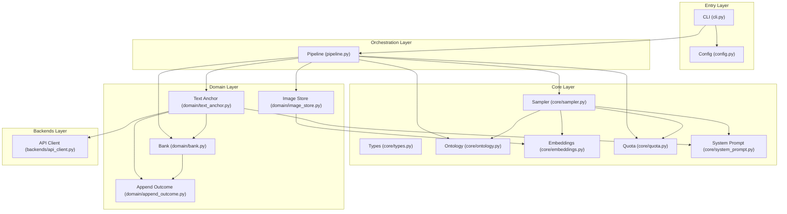
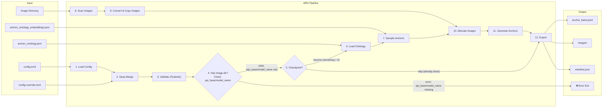
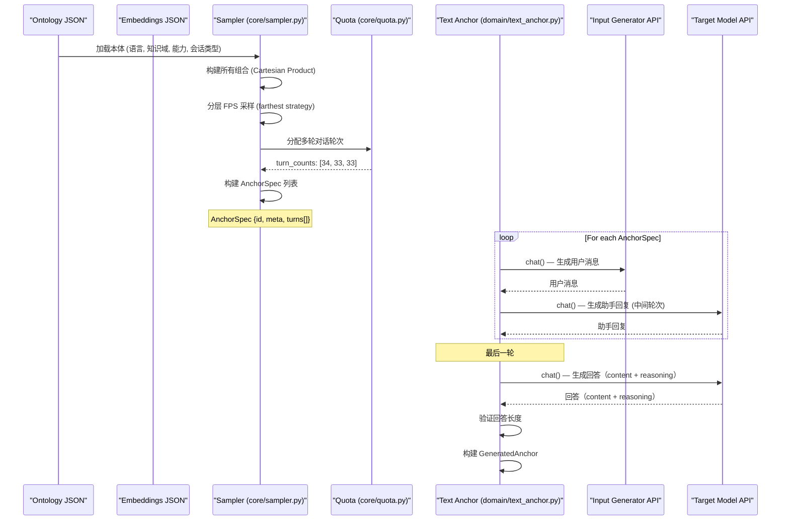
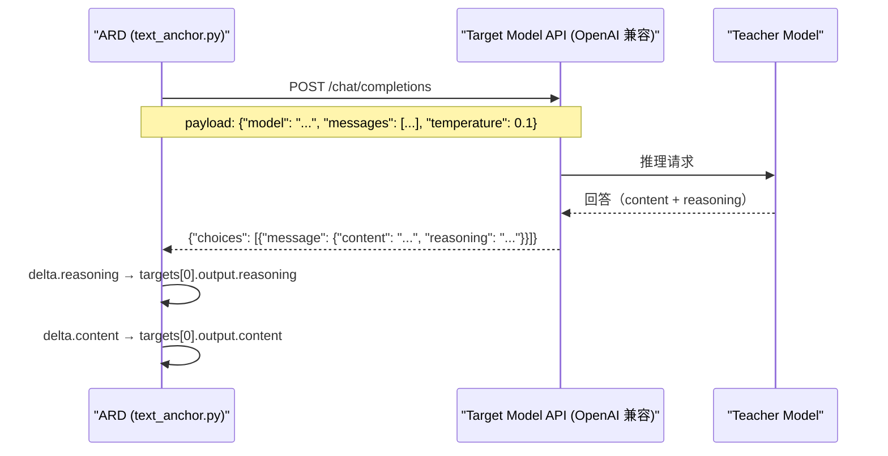
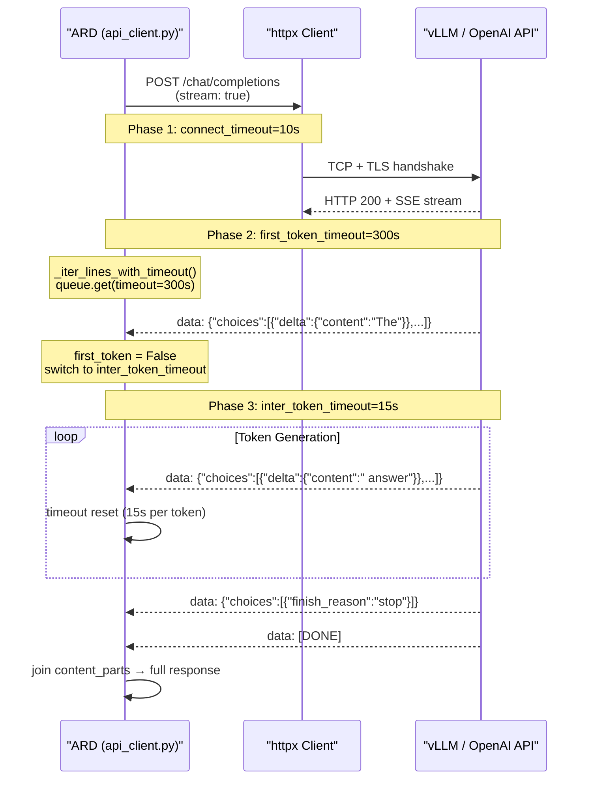
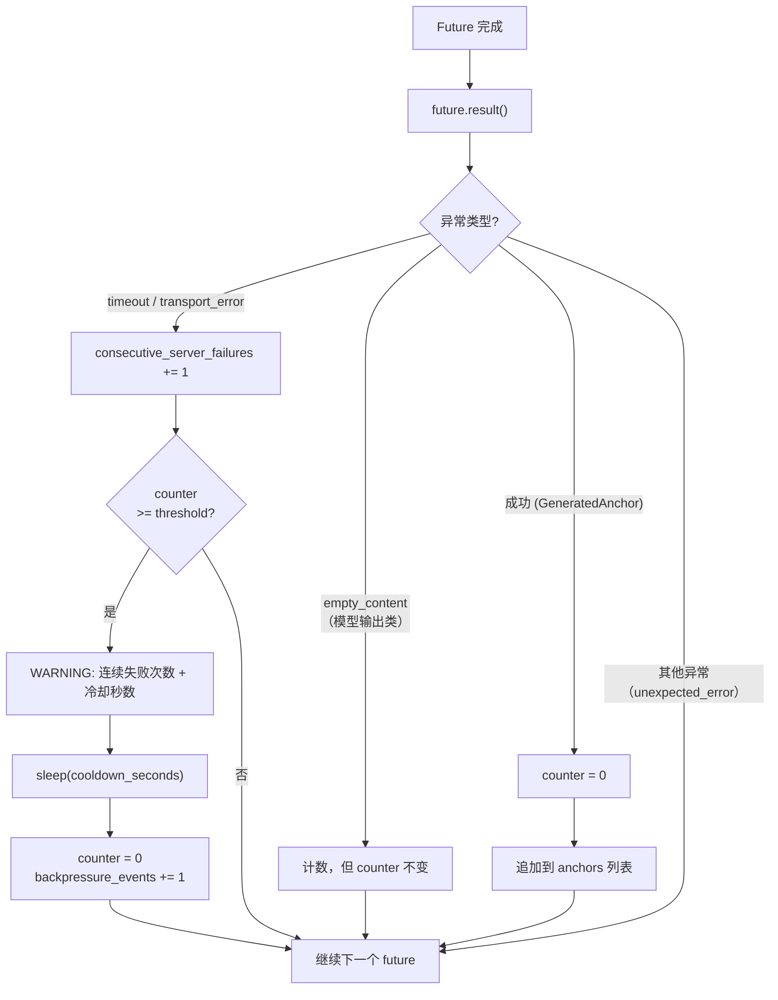
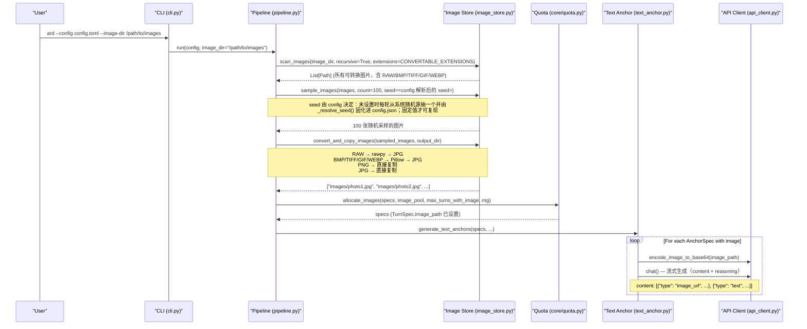

# ARD 架构文档

> **Anchor Replay Distillation** — 通过分层锚点采样和双模型 API 生成高质量训练数据。
> ARD 是**纯锚点数据集生成器**：生成 LLM 能力锚点数据（含 `content` 与 `reasoning`），
> 自身不落 logprob、不负责打分；on-policy distillation（OPD）中学生的轨迹由学生自定义，
> 教师 logprob 由原版 LLM 教师在训练时现场给出。

---

## 0. 模型术语对照表（防歧义）

为了避免"ARD 里的两个角色"与"下游框架谈论的角色"混淆，全项目统一使用下表术语
（**不改变代码键名**）：

| ARD 内名称 | 下游 SFT/OPD 语境 | 职责 |
|-----------|-------------------|------|
| `input_generator`（提问/输入生成器） | 无对应（SFT/OPD 不"出题"） | 生成 `user` 轮（出题端） |
| `target_model`（目标作答模型） | **教师模型 (teacher)** | 生成目标答案 `targets[0].output`（教学信号） |
| — | 学生模型 (student) | 学习者（ARD 不参与，由 graspo/SFT 负责） |

> **一句话规则："谁的输出是目标答案，谁就是教师"。** ARD 里目标答案只有
> `target_model` 一个来源；输入生成器只出题、从不产出监督信号；ARD 从不运行
> 学生模型。

---

## 1. 设计目标

ARD 的核心价值是**生成高质量、可复现、覆盖多维度的锚点数据集**，
支撑 on-policy distillation（OPD）训练。它围绕三大核心能力设计：

### 1.1 三大核心能力

| 能力 | 解决的问题 | 实现方式 |
|------|-----------|----------|
| **FPS 收敛采样** | 如何从巨大组合空间中选出最具代表性的锚点？ | 分层最远点采样（Hierarchical FPS），先选知识域，再选能力×语言×会话类型×system prompt 组合 |
| **SFT 锚点数据生成** | 如何为学生模型生成 SFT 训练所需的高质量 prompt/answer 对？ | 逐条生成 `messages`（含可选 system）+ `targets[0].output = {content, reasoning}`，另带 `teacher_id`、`data_source` 等溯源字段 |
| **多模态支持** | 如何生成文本+图片的锚点？ | 统一的文本/多模态生成管线，图片通过 `image_store.py` 管理 |

### 1.2 FPS 收敛目标

设 `C` 为所有可能的（知识域，能力，语言，会话类型，system prompt 模式）组合集合，`|C|` 为组合总数。
设 `S(k)` 为 FPS 算法从 `C` 中选出的 `k` 个样本，定义覆盖维度上的覆盖率：

- **知识域覆盖率** `D(k)`：`S(k)` 中覆盖的知识域数 / 总知识域数
- **能力覆盖率** `A(k)`：`S(k)` 中覆盖的能力类型数 / 总能力类型数
- **语言覆盖率** `L(k)`：`S(k)` 中覆盖的语言数 / 总语言数
- **会话类型覆盖率** `T(k)`：`S(k)` 中覆盖的会话类型数 / 总会话类型数
- **system prompt 覆盖率** `S_(k)`：`S(k)` 中覆盖的 system prompt 模式数 / 总模式数

**收敛定义**：当 `k` 趋向 `|C|` 时，`D(k)`, `A(k)`, `L(k)`, `T(k)`, `S_(k)` 均为 1.0。即：

$$\lim_{k \to |C|} D(k) = \lim_{k \to |C|} A(k) = \lim_{k \to |C|} L(k) = \lim_{k \to |C|} T(k) = \lim_{k \to |C|} S_(k) = 1.0$$

**这个定义只在 `k = |C|`（穷举）时是可达的结论，不蕴含有限 `k` 上的单调性。**
FPS 是逐域配额（`per_domain = max(1, target_count // n_domains)`，整数除法）
+ 贪心最远点链：`k` 变化会同时改变每域配额和域内 `n`，贪心链随之完全不同，
因此对中间任意 `k1 < k2` **不保证** `D(k1) ≤ D(k2)`（其他维度同理）——实测见 §4.4。
只有两条维度上的满覆盖是**结构性**的：知识域（第 1 层的逐域配额让每个域至少出一个样本）
与 system prompt 模式（每个域内样本必带 5 种模式之一）。

**实际意义**：当用户设置 `target_count = 100` 时，FPS 在给定预算下让 100 个样本尽可能
铺开；但"覆盖率随 `target_count` 增大而单调上升、最终在某个较小的 `k` 上收敛到 100%"
**不是本算法的性质**。需要某个维度的全覆盖时，请以实测覆盖为准，或按维度做分层配额
（当前代码不提供）。

---

## 2. 模块边界

### 2.1 五层架构图



### 2.2 模块职责声明

| 模块 | 文件 | 职责（一句话） |
|------|------|---------------|
| **CLI** | `cli.py` | 解析命令行参数，加载配置，调用 Pipeline |
| **Config** | `config.py` | 定义 Pydantic 配置模型，加载/合并/校验 TOML 配置 |
| **Pipeline** | `pipeline.py` | 编排整体流程：加载本体 → 采样 → 图片分配 → 生成 → 输出 |
| **Types** | `core/types.py` | 定义纯数据类（`AnchorSpec`, `TurnSpec`, `GeneratedAnchor` 等） |
| **Ontology** | `core/ontology.py` | 加载 `anchor_ontology.json`，提供本体数据访问 |
| **Embeddings** | `core/embeddings.py` | 加载预计算嵌入向量，执行 FPS 算法 |
| **Sampler** | `core/sampler.py` | 从本体组合空间中采样锚点规格 |
| **Quota** | `core/quota.py` | 分配多轮对话轮次配额和图片到锚点的配额 |
| **System Prompt** | `core/system_prompt.py` | 拥有 system prompt 采样维度的契约：`system_prompt_presence` / `system_prompt_style` 及其合并值 `system_prompt_mode`（下游路由与计数的唯一取值来源），并提供提示文本生成指令 |
| **Text Anchor** | `domain/text_anchor.py` | 并发生成锚点：调用 Input Generator 生成用户消息，调用 Target Model 生成回答。**多模态场景下：input_generator 和 target_model 必须均为多模态模型** |
| **Bank** | `domain/bank.py` | 锚点存储：序列化、追加、读取、构建 manifest；写盘前三道门——消息形状、`data_source` 词表、id 唯一性 |
| **Append Outcome** | `domain/append_outcome.py` | 定义 `append_anchor` 的返回枚举 `AppendOutcome`（`APPENDED` / `DUPLICATE_SKIPPED` / `INVALID_SHAPE_SKIPPED` / `INVALID_DATA_SOURCE_SKIPPED`）；类名与文件名精确互映（§12.2），`bank.py` 不再 re-export（§18.1） |
| **Image Store** | `domain/image_store.py` | 图片扫描、格式转换（RAW/ BMP/ TIFF/ GIF/ WebP → JPG）、随机采样、复制到输出目录 |
| **Logging** | `logging.py` | 提供 `get_logger` 辅助函数，统一所有模块的日志格式和输出目标 |
| **API Client** | `backends/api_client.py` | 基于 httpx 的 OpenAI 兼容客户端，支持 SSE 流式生成、分层超时控制、背压传播；识别并统计 `delta.reasoning`（推理 token 只计数、绝不进入 `target_answer`），推理吃光预算导致的空正文以 `ARDEmptyContentError` 显式失败 |

### 2.3 模块间接口

模块间通过**明确的 Python 类型**而非隐式约定通信：

- **Config → Pipeline**：`ARDConfig` (Pydantic model)
- **Pipeline → Core**：`AnchorGenerationConfig` (dataclass) + `ontology` dict
- **Core → Pipeline**：`list[AnchorSpec]`
- **Pipeline → Domain**：`list[AnchorSpec]` + `ChatAPIClient` 实例
- **Domain → Backends**：`list[dict]` (OpenAI 格式消息) → `str` / `ChatResult`
- **Domain → Bank**：`GeneratedAnchor` → JSONL 行
- **Pipeline → Image Store**：`Path` 列表 → `list[str]`（相对路径）

依赖方向自上而下：Entry → Orchestration → Domain → Backends，Core 层被所有层单向依赖，不依赖任何其他层。

---

## 3. 数据流

### 3.1 从 CLI 到输出的完整数据流



**Checkpoint / Resume**：Pipeline 启动时先检查 `anchor_bank.jsonl` 中已有锚点数。
若已达到 `target_count`，跳过生成直接构建 manifest 并退出；
否则仅生成剩余数量（`remaining = target_count - existing_count`）。
每条锚点生成后立即通过 `O_APPEND` 原子写入 JSONL，确保中断后可从上一次提交点恢复。

**Multimodal Validation**：当 `--image-dir` 传入时，Pipeline 在生成前验证
`input_generator` 和 `target_model` 的 `api_base` 和 `model_name` 是否已设置。
任一为 `None` 时，Pipeline 立即报错退出。多模态支持由模型本身决定——
如果模型不支持多模态，API 会直接返回错误，无需手动维护配置开关。
这是 BADGE 宪法 §2.3（边界校验即防呆）的具体实践：`api_base`/`model_name` 的
None 检查在边界上拦截配置错误，多模态能力由 API 端自行校验。

### 3.2 从 Ontology 到 Anchor 的采样流



---

## 4. FPS 收敛采样

### 4.1 分层 FPS 算法原理

ARD 采用**分层最远点采样**（Hierarchical FPS），分两步进行：

**第一层：知识域 FPS**。对 `items.knowledge_domains` 中所有知识域的嵌入向量执行 FPS，
选出 `N` 个最分散的知识域。这保证了选出的知识域覆盖尽可能广泛的语义空间。

**第二层：域内组合 FPS（拼接组合嵌入 + FPS）**。对每个被选中的知识域，
将（知识域，能力，语言，会话类型，presence，style）六槽组合的嵌入向量**拼接**为
6144 维组合向量（6 × 1024 = 6144，布局见 §4.2），然后对组合向量执行 FPS，选出该域内最分散的组合。

**伪代码**：

```
function hierarchical_fps(ontology, embeddings, target_count):
    // Layer 1: select N knowledge domains via FPS
    domain_embeddings = embeddings.items.knowledge_domains
    selected_domains = fps(domain_embeddings, N)

    // Layer 2: within each selected domain, concatenate combo embeddings
    results = []
    per_domain = target_count / N
    for domain in selected_domains:
        combos = build_combinations(domain, capabilities, languages, conv_types, system_prompt_modes)
        // Concat the unit-normalised slots: domain + cap + lang + conv + presence + style
        combo_embeddings = [concat(unit(e_domain), unit(e_cap), unit(e_lang), unit(e_conv),
                                   unit(e_presence), style_onehot) for combo in combos]
        selected_combos = fps(combo_embeddings, per_domain)
        results.extend(selected_combos)

    return results
```

### 4.2 嵌入粒度与覆盖保证

嵌入数据来自 `ontology/anchor_ontology_embeddings.json`（55 个嵌入，1024 维）：

| 类别 | 向量数 | 说明 |
|------|--------|------|
| `knowledge_domains` | 18 | 知识域顶级节点（18 个顶级域） |
| `capabilities` | 20 | 能力类型（5 个大类，20 个叶子） |
| `languages` | 4 | 语言（English, 简体中文, Español, 日本語） |
| `conversation_types` | 7 | 会话类型（5 个大类，7 个叶子） |
| `system_prompt` | 6 | system prompt 维度的取值向量（2 个 presence + 4 个风格），由能力向量确定性派生，不走 API |

嵌入数据以 `items` 字典组织，每个类别是一个 `{name: [1024 floats]}` 映射，
由 API 生成（`system_prompt` 一节除外），维度 1024，距离度量为余弦距离。

**组合向量布局（v3.0.0）**：域内 FPS 的每个组合由 6 个槽位拼接而成，
每个槽位先归一化为单位长度再等权拼接（避免某一维的向量模长意外主导距离）：

```
[ domain | capability | language | conversation_type | presence | style ]
```

最后两个槽位是 system prompt 维度，见 §4.5。

**覆盖保证**：分层 FPS 确保（第 1 条是**结构性**的——由构造保证，不是采样质量的功劳）：
- 第一层 FPS 保证知识域覆盖的多样性（知识域是最重要的维度，变化最大；逐域配额使
  18/18 由构造保证，见 §4.4）
- 第二层 FPS 通过拼接组合嵌入（6 × 1024 = 6144 维）**促成**每个域内组合的多样性
  ——同一轮内 FPS 逐位置记账、不会重复选中同一组合；但跨 run 同一组合会复用同一 id，
  见 §8.1 的唯一性边界
- 当 `target_count` 增大到组合总数时，FPS 退化为全选，覆盖率 = 100%

### 4.5 system prompt 采样维度（v3.0.0）

`system prompt` 不是全局开关，而是**采样维度**：真实对话数据里既有完全不带
system 的，也有各种风格的 system，要让数据集覆盖这个分布，它就必须像其他维度
一样进入 ontology 与 FPS。

它由两个**正交**维度组成（`ontology/anchor_ontology.json`）：

| 维度 | 取值 | 语义 |
|------|------|------|
| `system_prompt_presence` | `none` / `present` | 这条锚点到底带不带 system |
| `system_prompt_style` | `minimal_persona` / `detailed_persona` / `task_constraint` / `domain_style` | 带 system 时怎么写 |

「不带 system」没有风格可言，因此 `none` presence 只与 `none` 风格配对；两维合并后的
单一标签写在 `anchor_meta["system_prompt_mode"]`（`none` 或某个风格名），供下游
路由与统计使用。

**几何处理**：`none` 不是一段文本，在风格向量空间里没有自然位置，所以它在
presence 槽位取「风格质心的反方向」——与所有风格尽可能远；风格槽位是 4 个风格的
一维独热（正交），不带 system 时为零向量。这样「有没有 system」与「什么风格」在
距离上都真正可分辨。

**文本生成与落盘**：风格只是一个**规格**，具体文本由 input_generator 现场生成，
并要求与 `knowledge_domain` / `capability` 呼应；生成的文本写入 `messages[0]`
（`messages` 是 system prompt 的唯一真相源），不新增顶层文本字段。

**anchor id**：id 的哈希维度由 4 维变为 5 维（增加 `system_prompt_mode`），
**v2 产出与 v3 产出的 id 不可比**。

### 4.3 收敛性定义与度量

对于任意目标数量 `target_count = k`，FPS 选出的样本集 `S(k)` 需满足：

1. **收敛性**：`lim_{k→|C|} D(k) = 1.0`（穷举时才成立，见 §1.2）
2. **FPS 最优性**：在给定 `k` 下，`S(k)` 的任意两个样本在嵌入空间中尽可能远离
3. ~~单调性~~ **不作为要求**：`D(k1) ≤ D(k2)` 对 `k1 < k2` **不成立**（实测反例见 §4.4）。
   逐域配额是整数除法、贪心链依赖 `k`，因此覆盖率在中间 `k` 上会上下波动。

ARD 使用最远点采样（Farthest Point Sampling, FPS）作为唯一采样策略，
基于预计算的领域嵌入向量选择多样性最大的知识域组合。

### 4.4 实际组合空间与覆盖率

当前本体定义的实际组合空间为 **50,400**（18 知识域 × 20 能力 × 4 语言 × 7 会话类型 ×
5 个 system prompt 取值；把文本/多模态两种输出形态也算上是 **100,800**），
而非 117,040（此数字源于旧版本体的 209 个知识域，现已精简为 18 个顶级域）。

在 `target_count = 100` 时，各维度的覆盖率**实测**如下（单 seed，`seed = 42`）：
**条件**：`target_count = 100`、`max_turns = 1`、不使用 `--image-dir`（纯文本一轮），
固定 `seed = 42`；换 seed 或换 `target_count` 数值即变，下表不应被读作期望值。

| 维度 | 总数 | 覆盖率 | 说明 |
|------|------|--------|------|
| 知识域 | 18 | **18/18 = 100%** | **结构性**：分层 FPS 第 1 层逐域配额（`per_domain = max(1, k // 18)`），每个域至少被分配一个样本，因此 100% 是构造保证，不是采样质量的证据 |
| system prompt | 5 | **5/5 = 100%** | **同样是结构性的**：域内样本必带 5 种模式之一 |
| 会话类型 | 7 | **6/7 ≈ 86%** | 实测 |
| 语言 | 4 | **3/4 = 75%** | 实测 |
| 能力 | 20 | **6/20 = 30%** | **覆盖短板**，且分布极不均：`translation` 37 条 : `uncertainty_handling` 1 条 = **37:1** |

**关于单调性与"加 `k` 就好了"的证伪**：能力覆盖率随 `target_count` 只是缓慢上升，
且**不保证单调**（实测，同一 seed）：

| `target_count` | 200 | 600 | 2800 | 5040 |
|----------------|-----|-----|------|------|
| 覆盖能力数 | 7/20 | 10/20 | 15/20 | 18/20 |

会话类型维度同样非单调（`k = 100 → 6/7`，`k = 200 → 5/7`）。
**"`target_count ≥ 200` 时能力覆盖率趋于 100%"这一旧声明与实测不符，已删除**；
旧值 `~75-90%` 实际来自 `k = 2800` 档位，不是 `k = 100` 的实测值。

> 上述数字均为**单 seed 实测**，会随 seed 波动，不应被读作期望值。
> 根因（可从机制推出）：`_fps.py` 的 `per_domain = max(1, target_count // n_domains)`
> 是整数截断，且 FPS 贪心链依赖域内 `n`；在 capability 这种叶子多、嵌入方向集中的
> 维度上，少数"极端"能力会在多个域被反复选中，长尾因此长期得不到覆盖。

**建议**：需要能力维度全覆盖的训练场景，**不能依赖提高 `target_count`**——
应大幅提高 `target_count` 到接近组合规模（`k = 5040` 时实测 18/20），或新增按维度
分层的配额 / 后验补样（当前代码均不提供）。

---

## 5. OPD 定位与输出契约（v3：无 logprobs）

### 5.1 权威定位：ARD = 锚点数据集生成器，不是 OPD 训练器

**OPD = on-policy distillation（on-policy 蒸馏）**：学生模型跑轨迹、**原版 LLM 教师现场给
logprob**，训练由下游训练器（如 graspo 的 OPD 训练器）完成。

ARD 在 OPD 链路中的角色是**纯锚点数据集生成器**：

- 生成 SFT 全量字段（prompt/anchors + teacher answer + reasoning 落盘）；
- **不产出 `logprobs`**——v3 输出契约是 `targets[0].output = {content, reasoning}`，无任何
  logprob/token_ids/log_probs 顶层或嵌套字段；
- **不负责打分/评分/奖励**——无评分链路，也**不落 logprob**（logprob 不含在锚点里，由教师在训练时现场给出）。



> 请求参数**不含 `logprobs`/`top_logprobs`**（grep `src/ard` 0 命中）；返回的
> `reasoning` 与 `content` 分别落盘（ARD 侧不内联、不合并、不 base64）。

### 5.2 输出数据格式（v3.0.0）

每条 anchor 记录中 `targets[0].output` 只含 `content` 与 `reasoning`，**不含 logprobs**：

```json
{
  "id": "anchor_<sha256_hex16>",
  "source": "ard",
  "data_source": "ard_text",
  "schema_version": "3.0.0",
  "messages": [
    {"role": "user", "content": "..."},
    {"role": "assistant", "content": "..."}
  ],
  "targets": [{
    "id": "primary",
    "output": {
      "content": "<target_answer>",
      "reasoning": "<teacher_reasoning>"
    }
  }],
  "anchor_meta": {...},
  "teacher_id": "<target_model_name>",
  "input_generator_model": "<input_generator_model>"
}
```

- `output.content` 是 `str`（教师答案），`output.reasoning` 是 `str | null`（教师思考链，
  `enable_thinking` 关闭时为 `null`，不合并进 `content`）。
- 顶层 `data_source ∈ {ard_text, ard_multi}`（受控枚举）、`schema_version="3.0.0"`、
  `input_generator_model`、`teacher_id` 构成 OPD 消费侧的路由与溯源字段。
- **单次运行 = 单个 `data_source`**：一轮要么全是 `ard_text`（不带 `--image-dir`），
  要么全是 `ard_multi`（带 `--image-dir`）。即使传了 `--image-dir`，下面两种情况仍
  整轮为 `ard_text`：图片目录为空或没有可转换的图片（见 `quota.allocate_images` 与
  `text_anchor.anchor_data_source`），或 `max_turns_with_image = 0` 关闭了图片轮。
  该保证是**按运行而非按文件**的：文本与多模态要**分两次运行、各用独立输出目录**，
  才各得一个纯 `anchor_bank.jsonl`。
- **续跑边界（重要）**：`output.overwrite = false` 时续跑会把新记录追加到已有 bank。
  run 1 写 `ard_text`、run 2 带 `--image-dir` 续跑同一输出目录，同一个
  `anchor_bank.jsonl` 就会同时含两种 `data_source`。因此 `data_source` 是
  **记录级**路由键，消费端**不得**按 bank 级假设单一取值。
  `id` 是 5 维元数据的 sha256 前缀（§8.1），只在单次运行内唯一——**跨 run 不承诺唯一**：
  同一元数据在不同 run 会得到相同的 `id`，合并多个 bank 时不得以 `id` 去重。
- **没有** `logprobs` / `token_ids` / `log_probs` / `logprobs.content` 等键——这些键
  在 v3 已从产品代码移除（grep `src/ard` 0 命中）。

### 5.3 与 graspo 的对齐（诚实表述）

ARD 的 `messages`/`targets`**键名与形状**与 graspo 现存的样本加载契约一致
（`messages` 非空 list、`targets[].output.content` 为 dict）；但 **graspo 当前没有 OPD
训练器，也**不读取** `data_source`/`schema_version`/`teacher_id`/`input_generator_model`**
（grep graspo 全库 0 命中）——这些字段在 graspo 现有流程中只透传进 metadata。

因此**"ARD 输出与 graspo 的 OPD 格式完全对齐"这一表述不成立**：ARD 的 `messages`/`targets`
当前即可被 graspo 消费，但 **OPD 专属字段属 ARD 预留的前瞻接口**，等待 graspo 落地 OPD
训练器时反向对齐（见 §ARD docs 单一真相源 §1.4 —— 不虚构消费契约）。

### 5.4 流式 SSE 与分层超时

ARD 使用 `httpx` 替换 `urllib`，通过 SSE（Server-Sent Events）流式获取 API 响应。
流式模式采用**三层超时策略**，每层超时独立控制，防止僵尸请求级联：

| 超时层 | 配置字段 | 默认值 | 控制范围 |
|--------|----------|--------|----------|
| **连接超时** | `connect_timeout` | 10s | TCP 连接 + TLS 握手（httpx 层控制） |
| **首 Token 超时** | `first_token_timeout` | 300s | 等待第一个 `data:` 行到达（应用层控制；含 prefill 与排队等待） |
| **Token 间超时** | `inter_token_timeout` | 15s | 生成过程中 token 之间的最大间隔（应用层控制） |

**设计要点**：

- **httpx 层**只设置 `connect` 超时（`httpx.Timeout(connect=...)`），
  不设置 `read`/`write`/`pool` 超时——这些由应用层的 `_iter_lines_with_timeout()` 接管。
- `_iter_lines_with_timeout()` 使用后台线程读取 SSE 行，主线程通过 `queue.Queue.get(timeout=...)`
  实现分阶段超时：首个 token 前用 `first_token_timeout`，之后切换到 `inter_token_timeout`。
- `retry_on_timeout` 默认 `false`：超时不重试，避免超时放大——每个 API 的 `max_retries` 仅用于
  非超时错误（如 HTTP 503、连接拒绝等），超时异常直接向上传播。
- 超时/结束时除关闭 response 外，还会对读线程所阻塞的 socket 执行
  `shutdown(SHUT_RDWR)` + `SO_LINGER(1, 0)`，确保读线程立即退出、服务端立刻收到 RST
  并停止生成（httpx 的 `read` 超时被显式移除，论证见 `api_client.py` 的
  `_iter_lines_with_timeout` docstring 与实测数据；实测释放耗时 5.04s → 0.79~0.93s）。
- `delta.reasoning`（推理 token）只**计数**（`reasoning_chars` / `reasoning_responses`），
  绝不进入 `content`、`messages` 或 `target_answer`；推理吃光 `max_tokens` 预算导致正文为空时，
  不是"空答案"而是显式失败 `ARDEmptyContentError`。

**流式 vs 非流式模式选择**：

| 方法 | 模式 | 原因 |
|------|------|------|
| `chat()` | **SSE 流式** | 常规文本生成，流式响应降低首字节延迟，支持分层超时 |

**流式 SSE 超时策略图**：



### 5.5 背压机制（Backpressure）

当 vLLM 服务端过载时，大量并发流式请求可能同时超时，在客户端形成**僵尸请求级联**——
所有线程阻塞等待超时，恢复后再次同时发起请求，导致服务端负载振荡
（实测形态：单次冻结 1750s、服务端 `Running:2/Waiting:27`、prompt 吞吐恒 0）。

**计数单位是"被放弃的 anchor"，不是"某一轮超时"。** 这是关键语义：

* 一个 anchor 的任意一轮失败，都会**整体放弃该 anchor**（绝不跳过该轮——
  跳过会造成连续同角色消息，破坏角色交替不变量）；因此"轮超时"与"anchor 失败"
  在数量上并不同构，背压必须建立在后者之上，否则计数会被轮数稀释。
* 每个 anchor 恰好对应一个 future，`future.result()` **只在**该 anchor 被放弃时抛异常，
  所以调度层的 `as_completed` 循环是唯一能观察到"连续放弃"的地方。

ARD 在 `generate_text_anchors()` 中实现**背压机制**：

1. `_generate_one_anchor()` 中每一处失败都 `logger.exception(...)` 记录 traceback 后
   **裸 `raise`** 重新抛出（不吞没、不改写异常类型），传播到调度层。
2. `generate_text_anchors()` 的 `as_completed` 循环捕获异常，按**异常类型**分类
   （`failure_reason()`，绝不按消息文本匹配），递增
   `consecutive_server_failures` 计数器。
3. 当 `consecutive_server_failures >= backpressure_threshold`（默认 3）时，
   先打 WARNING（含已连续失败次数与冷却秒数），再 `time.sleep(backpressure_cooldown)`
   （默认 60s）暂停**所有**并发请求——注意 future 仍在后台运行，冷却只是让调度层不再补发新请求。
4. 冷却结束打 WARNING 并把计数器**重置为 0**；成功产出的 anchor 同样把计数器清零。

**只有"服务端不稳"才计入背压**：`timeout`（`ARDTimeoutError`）与
`transport_error`（`httpx.HTTPError`，如连接失败、HTTP 5xx）。
`empty_content` 等**模型输出类失败**（ARDEmptyContentError）会被计数、
会写进 manifest，但**不触发冷却**——同一 prompt 在同样预算下必然以同样方式失败，
sleep 只是白等。



**配置参数**（`configs/config.toml` 的 `[generation]` 段，**完全可配**）：

| 参数 | 默认值 | 说明 |
|------|--------|------|
| `backpressure_threshold` | 3 | 触发冷却的连续服务端失败次数 |
| `backpressure_cooldown` | 60.0 | 冷却暂停秒数 |

调用链：`configs/config.toml` → `config.py: GenerationConfig` → `pipeline.py` →
`generate_text_anchors(backpressure_threshold=..., backpressure_cooldown=...)`，
参数确实生效到 `text_anchor.py`。

**设计原理**：背压是 §3.1（同效退路）的实践——超时放弃不改变"这一条 anchor 失败"
这一结果，冷却只改变代价（增加总耗时）来避免雪上加霜。与 `retry_on_timeout=false` 配合：
超时不重试（避免放大），而是通过背压让整个 Pipeline 降速等待服务端恢复。
每次冷却都以 WARNING 显式告知（§3.2 透明退路），冷却次数写入 `manifest.json`
的 `generation.counters.backpressure_events`。

---

## 6. 多模态支持

### 6.0 多模态前提条件

**多模态锚点生成要求 `input_generator` 和 `target_model` 的 `api_base` 和 `model_name` 均已设置。**
Pipeline 在启动时验证此条件——任一为 `None` 时，立即报错退出。
多模态能力由模型 API 端自行校验：如果模型不支持多模态输入，API 会返回错误，
直接透传给用户。无需在配置中手动维护 `is_multimodal` 开关。

### 6.1 图片管理流程



### 6.1.5 图片格式转换

Pipeline 默认开启图片格式自动转换（可通过 `--no-convert` 关闭）：

| 源格式 | 处理方式 | 输出格式 |
|--------|----------|----------|
| `.png` | 直接复制（无损） | PNG |
| `.jpg` / `.jpeg` | 直接复制（避免二次有损压缩） | JPG |
| RAW（`.cr2`, `.nef`, `.arw`, `.dng` 等 19 种） | `rawpy` 解码 → Pillow 编码 | JPG (quality=95) |
| `.bmp`, `.tiff`, `.gif`, `.webp` | Pillow 打开 → 编码 | JPG (quality=95) |

**依赖**：
- `Pillow>=10.0` — 核心依赖，处理 BMP/TIFF/GIF/WebP 转换
- `rawpy>=0.24` — **核心依赖**（列在 `pyproject.toml` 的 `[project].dependencies`，随包安装；
  manylinux wheel 自带 `libraw.so`，零系统依赖）。代码侧的 import 是**懒加载**
  （`image_store.py` 在需要转换 RAW 时才 `import rawpy`），因此源码层面的
  "可选"只指**触发时机**，不指**依赖声明**：安装本项目即会装上 rawpy，只有实际转换
  RAW 格式时才会加载它。若某环境确实装不上 rawpy，请以 `--no-convert` 运行并只喂
  PNG/JPEG/GIF/WEBP（此时 RAW 会被跳过，见下）。

**`--no-convert` 关闭转换**：当关闭转换时，`scan_images` 仅接受 `SUPPORTED_EXTENSIONS`
（PNG/JPEG/GIF/WEBP），遇 BMP/TIFF/RAW 格式的图片会被静默跳过。
**静默跳过会一路传导到产物**：若跳过后目录内没有可用图片，Pipeline 只打一条
`No images found in <dir>. All anchors will be pure text.` 的 WARNING（`pipeline.py`），
然后照常产出**纯文本锚点**——命令成功、退出码 0，但没有任何多模态锚点。
用户侧判据是启动日志中的这一行，以及产出锚点的 `anchor_meta.has_image`。

**Resume 安全**：`convert_and_copy_images()` 检查目标文件是否已存在，已转换的图片自动跳过。

### 6.2 视觉域结构

视觉域定义在 `anchor_ontology.json` 的 `visual_domains` 中，共 4 大类 21 个子域：

| 视觉域 | 子域数 | 说明 |
|--------|--------|------|
| `object_recognition` | 多个 | 物体识别、分类、计数 |
| `spatial_reasoning` | 多个 | 空间关系推理、方位判断 |
| `scene_understanding` | 多个 | 场景理解、活动识别 |
| `text_reading` | 多个 | 图片中文字读取、OCR 相关 |

### 6.2.5 多模态锚点的多样性来源

多模态锚点的多样性来自三个独立的来源，三者叠加确保即使图片池单一，
生成的锚点仍具有足够的多样性：

1. **Ontology 多样性**（FPS 促成）：FPS 采样器从 50,400 个组合中选出
   最分散的锚点规格，每个规格携带语言、知识域、能力、会话类型等元数据。
   这些元数据通过 VLM prompt 传递（如"用中文回答一个关于计算机科学的问题"），
   **促成** prompt 的多样性：语言/能力/会话类型不同时，VLM 拿到的指令文本不同。
   这是促成而非绝对保证——同一轮内 FPS 逐位置记账、不会重复选中同一个组合，
   但语言/能力/会话类型相同的两条锚点会拿到逐字相同的指令文本（因此依赖第 3 条）。

2. **图片池多样性**：`image_store.py` 从用户指定的图片目录中随机采样图片。
   图片内容本身（场景、物体、文字、构图）构成视觉输入的多样性。

3. **VLM 随机性**（`[input_generator].temperature`，默认 `0.8`）：输入生成器
   按**配置**的采样温度采样（`configs/config.toml` 里的值即实际发往 API 的值，§7.2），
   即使相同的 Ontology 元数据和相同的图片，VLM 也会生成不同措辞和角度的问题。
   这进一步增加了锚点的多样性。

**关键设计要点**：多样性的第一道防线是 Ontology（由 FPS **促成**，非绝对保证），
第二道是图片池，第三道是 VLM 随机性。三道防线层层叠加，
使得**即使图片池只有少量图片，prompt 层面仍由 FPS 拉开差异**——注意这是
"提升多样性"，不是"保证不重复"：id 只由 5 个采样维度哈希而来，同一组合在
**不同 run** 会得到同一个 id（续跑因此可能撞 id，见 §8.1 与 README 的"已知行为边界"）。

### 6.3 图片 Anchor 生成流程

图片 anchor 与文本 anchor 共用同一条生成管线（`generate_text_anchors`）。
区别仅在于 `AnchorSpec` 的 `TurnSpec.image_path` 字段：

- **纯文本 anchor**：`TurnSpec.image_path = None`，消息格式为纯文本
- **图片 anchor**：`TurnSpec.image_path = "images/xxx.jpg"`，消息格式为 `[{type: image_url, ...}, {type: text, ...}]`

图片比例通过 `anchor_meta.has_image` 标识，可通过 `--image-dir` 和文件数量间接控制。

---

## 7. 配置系统

### 7.1 分层 TOML 模型

ARD 采用双层 TOML + 深度合并的配置模式（遵循 BADGE 宪法 §7.1）：

```
configs/config.toml           ← 基础配置（git-tracked），含全部字段
│                               · 公开字段有生产级默认值
│                               · 机密字段置空（""）
│                               · 环境字段有开发默认值
│
└── .local/config.override.toml  ← 覆写配置（gitignored），仅覆写部署字段
                                     · 不能新增基础配置中不存在的字段
                                     · 从 config.override.sample.toml 复制模板
```

合并流程：
1. `tomllib.load()` 加载基础 TOML → dict
2. `tomllib.load()` 加载覆写 TOML → dict（可选）
3. `_deep_merge()` 深度合并（叶子值覆盖）
4. `_replace_empty_str_with_none()` 将所有 `""` 转为 `None`
5. `ARDConfig.model_validate()` Pydantic 校验（`extra="forbid"`）

### 7.2 配置段说明

| 配置段 | 类型 | 说明 |
|--------|------|------|
| `[input_generator]` | `InputGeneratorConfig` | 提问/输入生成器（出题端）的 API 配置（温度默认 0.8） |
| `[target_model]` | `TargetModelConfig` | 目标作答模型（=教师端）的 API 配置（温度默认 0.1，`enable_thinking` 默认 false） |
| `[generation]` | `GenerationConfig` | 生成参数：数量、种子、并发、最大轮次、语言/任务过滤 |
| `[ontology]` | `OntologyConfig` | 本体文件路径 |
| `[output]` | `OutputConfig` | 输出目录和覆盖策略 |

**关键字段**：

```toml
[generation]
target_count = 100      # 目标锚点数量
# seed = 42             # 省略 = 每轮从系统随机源取种；显式设置 = 固定该轮采样顺序
concurrency = 4         # 并发 API 请求数
max_turns = 1           # 最大对话轮次（1=单轮，2-10=多轮）
max_turns_with_image = 1 # 每个锚点最多带图片的轮次数

[output]
overwrite = false       # 是否覆盖已有输出目录（预授权退路，遵循 §3.3）
```

**`enable_thinking` 说明**：

`[target_model].enable_thinking` 是**二态 bool**（`true` / `false`，没有"未配置"第三态），
默认 `false`。该键由 `_build_payload()` **恒定显式发送**，且值必须是真正的 `bool`
（配置层与出网前双重契约校验）。

| 发送内容 | 服务端行为 | 后果 |
|----------|-----------|------|
| `false` | 关闭推理 | 仅输出答案，适用于蒸馏非推理 student 模型 |
| `true` | 开启推理 | 推理以 `delta.reasoning` 单独下发，不进入 `target_answer`，但**先消耗 `max_tokens`** |
| 省略该键 | 模板判定为 undefined → **等同于开启推理** | 与 `true` 同样危险，却没有任何显式声明 |
| `null` | 既不切分推理、又仍开启思考 | **推理原文泄漏进 `content`**，污染蒸馏数据 |

因此"未配置"不是安全的第三态：省略键和 `null` 都会开启推理，其中 `null` 还会把推理原文
写进正文。ARD 的选择是永远显式发送真 bool。

设为 `true` 时必须同时上调 `max_tokens`：推理先吃掉预算，预算不足时目标答案为空，
该 anchor 以 `ARDEmptyContentError` 失败并被计入
`manifest.json` 的 `generation.failures`（`empty_content` / `reasoning_only_responses` /
`truncated_empty`）。适用于蒸馏推理模型（如 Qwen3-235B → Qwen3-8B）。
详见 `README.zh-CN.md` 配置参考。

**`temperature` 说明（单一真相源，§1.4）**：

`[input_generator].temperature`（默认 0.8）与 `[target_model].temperature`（默认 **0.1**）
是采样温度的唯一权威来源：`pipeline.py` 把它们写进各自的 `ChatAPIConfig`，
`text_anchor.py` 的每个 `chat()` 调用**不再传 per-request temperature**（R12 前曾硬编码
0.7 / 0.0 覆盖配置），实际发往 API 的 payload 因此一定等于配置值。

---

## 8. 输出格式

### 8.1 `anchor_bank.jsonl` Schema

每行一个 JSON 对象，格式如下：

```json
{
  "id": "anchor_<sha256_hex16>",
  "source": "ard",
  "data_source": "ard_text",
  "schema_version": "3.0.0",
  "messages": [
    {"role": "user", "content": "..."},
    {"role": "assistant", "content": "..."}
  ],
  "targets": [{
    "id": "primary",
    "output": {
      "content": "<target_answer>",
      "reasoning": "<teacher_reasoning>"
    }
  }],
  "anchor_meta": {
    "language": "English",
    "knowledge_domain": "computer_science",
    "capability": "qa",
    "conversation_type": "single_turn",
    "system_prompt_presence": "none",
    "system_prompt_style": "none",
    "system_prompt_mode": "none",
    "has_image": true,
    "image_count": 1
  },
  "teacher_id": "deepseek-v4-flash",
  "input_generator_model": "<input_generator_model>"
}
```

> **`anchor_meta` 字段口径**：`system_prompt_presence` / `system_prompt_style` /
> `system_prompt_mode` 三维**每条记录都有**（见 §4.5）；
> `has_image` / `image_count` 是**多模态记录独有**的键——纯文本记录的
> `anchor_meta` 完全不含这两个键（不是 `false` / `0`），消费端用
> `anchor_meta.get("has_image")` 判断。上面示例按多模态记录列出。
>
> **`id` 的唯一性边界**：`id` 只由 5 个采样维度哈希而来，不含 seed 也不含运行身份，
> 因此只在**单次运行内唯一**、**跨 run 不承诺唯一**；续跑时同 seed 会重复抽中已写过的
> 组合并被 bank 的 id 门拦下（计入 `duplicate_ids`），bank 可能停在 `target_count`
> 之下。详见 README 的"已知行为边界"一节。

> **`teacher_id` 字段说明**：该字段名为 OPD 消费侧的**前瞻对接预留**（未来 graspo OPD
> 训练器将据其识别教师），当前实际存储 Target Model 的名称。
> 在 ARD 的双模型架构中，Target Model 是生成答案（content）与思考链（reasoning）的模型，
> 即 student 学习/蒸馏的 teacher；ARD 自身不落 logprob、不负责打分。

### 8.2 `manifest.json` 统计

```json
{
  "total_anchors": 100,
  "domains": {
    "computer_science": 12,
    "mathematics": 8,
    ...
  },
  "languages": {
    "English": 30,
    "简体中文": 25,
    "Español": 25,
    "日本語": 20
  },
  "capabilities": {
    "qa": 40,
    "summarization": 20,
    ...
  },
  "output_dir": "outputs/ard_dataset_20260904_050800",
  "generation": {
    "counters": {
      "requested": 120,
      "succeeded": 101,
      "abandoned_total": 19,
      "abandoned_by_reason": {"timeout": 12, "transport_error": 3, "empty_content": 4},
      "written": 100,
      "rejected_invalid_shape": 0,
      "duplicate_ids": 1,
      "backpressure_events": 2
    },
    "failures": {
      "empty_content": 4,
      "reasoning_only_responses": 4,
      "truncated_empty": 4,
      "responses": 1212
    }
  }
}
```

**`generation` 段**是"这轮生成健康吗"的答案，与上面"产出了什么"互补：

* `counters` — 每条被请求的 anchor 的归宿：`requested`（请求数）、`succeeded`（内存中产出）、
  `abandoned_total` 与 `abandoned_by_reason`（被放弃及其机器可读原因）、`written`（真正落盘）、
  `rejected_invalid_shape`（被出口形状门拦下）、`duplicate_ids`（被 id 去重拦下）、
  `backpressure_events`（触发冷却次数）。
* `failures` — 进程级失败计数：空正文/推理类失败按 reason 计数
  （`responses`、`empty_content`、`reasoning_only_responses`、`truncated_empty`）。

两个子对象**只在非空时写出**，且**零值条目被丢弃**——健康的一轮不会因为新增字段而多出噪音，
而"短了 19 条"或"推理吃光预算"的一轮**不可能**再看起来是健康的。

**向后兼容**：`generation` 是**可选**字段。在它出现之前写下的 manifest 仍然可读——
读取方必须以"字段缺失 = 该轮没有生成统计"处理，不得把缺失当成全部为零
（检查用 `manifest.get("generation") is None`，不用真值判断）。
`total_anchors` / `domains` / `languages` / `capabilities` / `output_dir` / `config`
六个既有字段的语义与形状**未变**。

---

## 9. 设计决策

### 9.1 为什么用分层 FPS 而非组合级嵌入

**方案 A（组合级嵌入）**：为每个（知识域，能力，语言，会话类型，system prompt 模式）
组合计算一个嵌入向量，然后对全部组合做 FPS。

**问题**：组合总数为 `18 × 20 × 4 × 7 × 5 = 50,400` 个（旧版本体 209 个知识域时是
`209 × 20 × 4 × 7 = 117,040`）。为每个组合计算嵌入需要大量 API 调用，
且嵌入质量取决于组合描述的质量。

**方案 C（分层 FPS）**：先对知识域嵌入做 FPS，再对域内组合做 FPS。

**优势**：
- 嵌入数量少（55 个嵌入，见 §4.2），一次预计算即可
- 知识域是变化最大的维度，第一层 FPS 保证域级多样性（结构性：逐域配额）
- 第二层 FPS **促成**域内组合多样性（非绝对保证，见 §6.2.5 与 §8.1）
- 两层 FPS 结合起来，等价于在组合空间中的近似 FPS，但计算量大幅降低

**选择原因**：分层 FPS 在**计算效率**和**覆盖质量**之间取得了最优平衡。
注意这里的"覆盖质量"指**单 run 内代表点铺展**，不代表维度级满覆盖——
有限 `k` 上的实际维度覆盖率与单调性见 §4.4。

### 9.2 为什么用分层 FPS 而非纯分层抽样

**分层抽样**：按知识域均匀分配配额，每个域内随机采样。

**问题**：域内随机采样可能导致能力、语言、会话类型维度上的覆盖不均——某些能力可能被多次采样，
某些能力完全未被采样。

**分层 FPS**：域内仍然通过 FPS 选择最分散的组合，保证每个域内各维度的覆盖最大化。

**选择原因**：分层 FPS 在分层抽样"保证域级覆盖"的基础上，进一步保证了域内多维度的覆盖。
两者结合，收敛速度更快。

### 9.3 为什么 ARD 用远程 API 生成、且不落 logprobs

**本地 HF 方案**：加载 HuggingFace 模型，本地推理生成锚点（且可求 log-probs）。

**远程 API 方案**：通过 OpenAI 兼容的 API 生成锚点；ARD 只取 `content` + `reasoning`，
**不请求、不落盘 logprobs**。

**权衡**：

| 维度 | 本地 HF | 远程 API |
|------|---------|----------|
| 部署复杂度 | 高（需要 GPU、模型权重） | 低（仅需 API endpoint） |
| 推理速度 | 取决于本地 GPU | 取决于远程服务 |
| 模型一致性 | 必须与训练模型版本一致 | 由 API 服务端保证 |
| 网络依赖 | 无 | 有 |
| 与 OPD 的集成 | 不适用 | 由下游 OPD 训练器在训练时现场取 logprob |

**选择原因**：ARD 的设计定位是**数据生成工具**，不是模型训练框架。
它依赖用户提供的 API endpoint（vLLM 或其他 OpenAI 兼容服务），
而不是自己管理模型。这使得 ARD 可以轻量化部署，与任何兼容 API 的 teacher 模型配合使用。
**ARD 不落 logprobs**（v2 时期曾经落盘，v3 按用户诉求移除）：教师 logprob 属 OPD 训练的
监督信号，应在训练时由原版 LLM 教师现场给出、由下游训练器（如 graspo OPD 训练器）消费，
而不是固化在锚点数据集里。

---

## 附录 A：文件清单

### 核心模块

> 行数为**本表更新时的实测值**（`wc -l`），会随代码演进过期；以仓库文件为准。
> 重现口径：`wc -l src/ard/**/*.py src/ard/*.py`（2026-09-16 更新）。

| 文件 | 行数 | 职责 |
|------|------|------|
| `src/ard/cli.py` | 94 | CLI 入口 |
| `src/ard/config.py` | 277 | 配置模型与加载 |
| `src/ard/logging.py` | 135 | 统一日志配置（`get_logger` 辅助函数） |
| `src/ard/pipeline.py` | 501 | 流程编排（含续跑差额重采样、推理计数 delta 发布） |
| `src/ard/core/types.py` | 136 | 核心数据类型 |
| `src/ard/core/ontology.py` | 29 | 本体加载 |
| `src/ard/core/embeddings.py` | 134 | 嵌入加载与 FPS 算法 |
| `src/ard/core/_fps.py` | 532 | 分层 FPS 算法实现 |
| `src/ard/core/sampler.py` | 176 | 锚点采样与 anchor id 哈希（`generate_anchor_id`） |
| `src/ard/core/quota.py` | 103 | 配额分配 |
| `src/ard/core/system_prompt.py` | 238 | system prompt 采样维度契约（presence/style → mode）与提示文本生成 |
| `src/ard/domain/text_anchor.py` | 1046 | 锚点生成（含背压计数器与失败分类） |
| `src/ard/domain/bank.py` | 581 | 锚点存储（含写盘前形状/id/data_source 三门与 manifest 健康计数） |
| `src/ard/domain/append_outcome.py` | 31 | bank 追加结果枚举（`AppendOutcome` ↔ 文件名精确互映，§12.2） |
| `src/ard/domain/anchor_shape.py` | 116 | 消息形状契约（入口与出口的唯一实现） |
| `src/ard/domain/image_store.py` | 263 | 图片管理（扫描、格式转换、采样、复制） |
| `src/ard/backends/api_client.py` | 991 | API 客户端（含模块级推理观测计数器） |

### 数据文件

| 文件 | 大小 | 说明 |
|------|------|------|
| `ontology/anchor_ontology.json` | — | 锚点本体定义（语言、知识域、能力、会话类型、视觉域） |
| `ontology/anchor_ontology_embeddings.json` | — | 55 个预计算嵌入向量（API 生成，1024-dim） |

### 配置文件

| 文件 | 跟踪 | 说明 |
|------|------|------|
| `configs/config.toml` | git | 基础配置，含全部字段 |
| `configs/config.override.sample.toml` | git | 覆写模板 |
| `.local/config.override.toml` | gitignored | 部署覆写（机密信息） |

---

## 附录 B：依赖关系矩阵

```
                    core.types   core.ontology  core.embeddings  core.sampler  core.quota
cli.py              ·            ·              ·                ·             ·
config.py           ·            ·              ·                ·             ·
pipeline.py         ·            ✓              ·                ✓             ✓
text_anchor.py      ✓            ·              ·                ·             ·
bank.py             ✓            ·              ·                ·             ·
image_store.py      ·            ·              ·                ·             ·
api_client.py       ·            ·              ·                ·             ·

                    domain.text_anchor  domain.bank  domain.image_store  backends.api_client
cli.py              ·                   ·            ·                   ·
config.py           ·                   ·            ·                   ·
pipeline.py         ✓                   ✓            ✓                   ✓
text_anchor.py      ·                   ✓            ·                   ✓
bank.py             ·                   ·            ·                   ·
image_store.py      ·                   ·            ·                   ·
api_client.py       ·                   ·            ·                   ·
```

✓ = 直接依赖（import），· = 无依赖。

模块依赖严格遵循单向依赖原则：Core 层无任何外部依赖，Backends 层仅依赖 stdlib，Domain 层依赖 Core + Backends，Pipeline 层依赖所有下层。