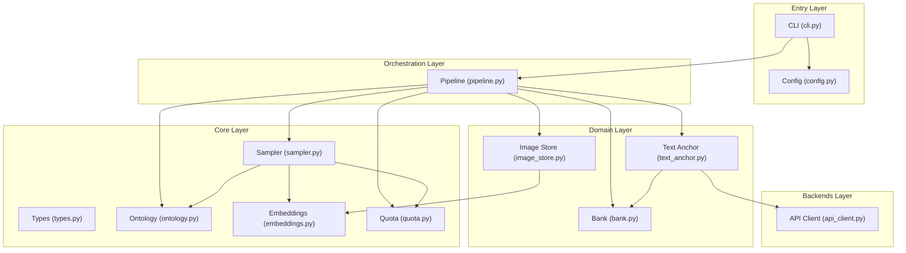
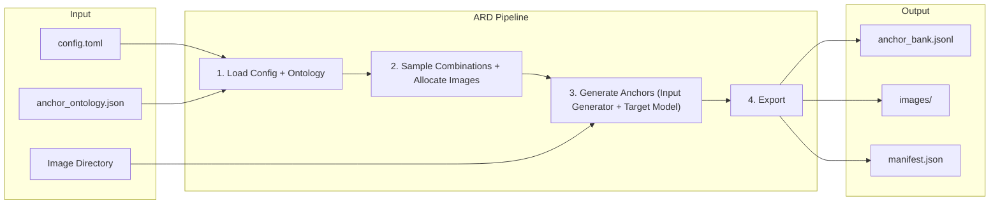
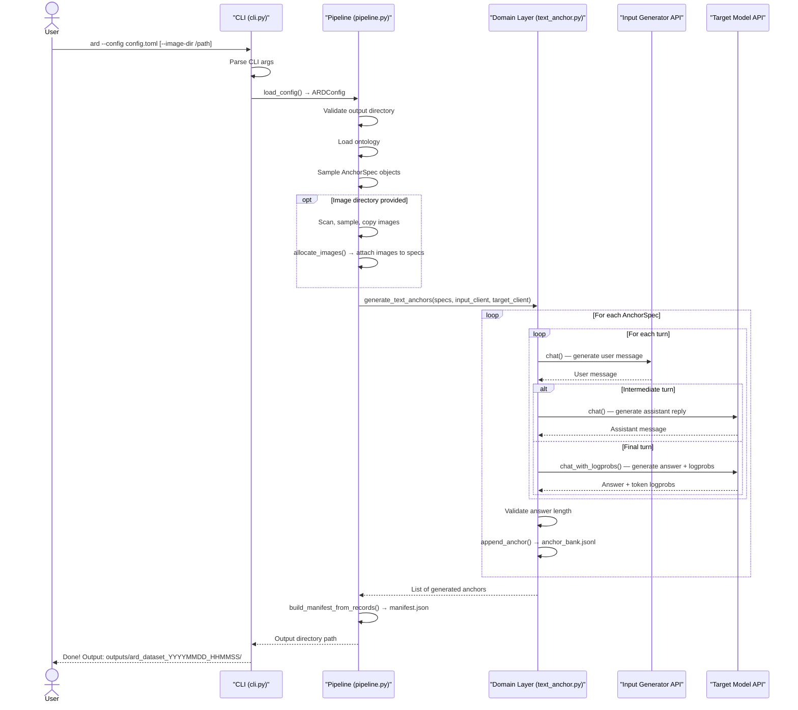
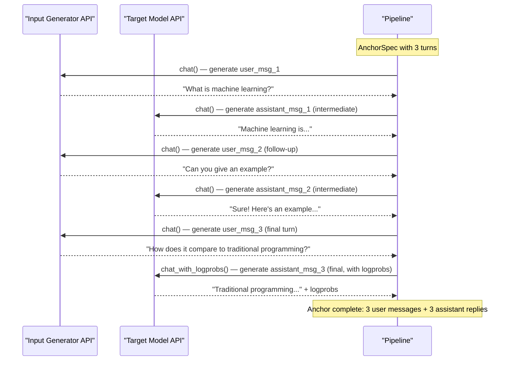
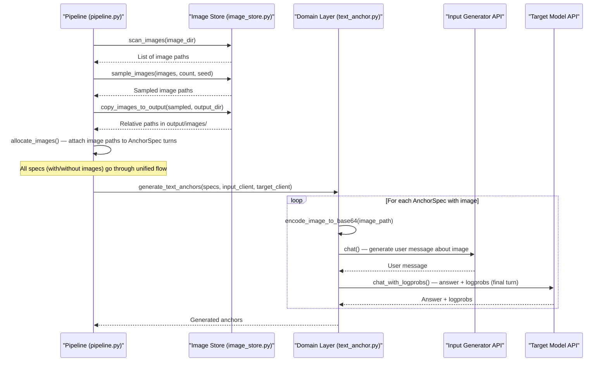

# ARD Architecture

## Module Boundaries



## Data Flow



## Layer Responsibilities

| Layer | Directory | Responsibility | Dependencies |
|-------|-----------|---------------|-------------|
| **Core** | `src/ard/core/` | Pure computation: data types, ontology, sampling, quota, embeddings | `numpy` |
| **Backends** | `src/ard/backends/` | Infrastructure: API calls (urllib) to Input Generator and Target Model APIs | `core` |
| **Domain** | `src/ard/domain/` | Business logic: text anchor generation, image storage, bank I/O | `core`, `backends` |
| **Pipeline** | `src/ard/pipeline.py` | Orchestration: wires config → domain modules → output | `domain` |
| **Entry** | `src/ard/cli.py`, `config.py` | CLI parsing, config loading + validation | `pipeline` |

> **Note:** `multimodal_anchor.py` was removed in Phase 4. All anchors (text + multimodal) now flow through the unified `generate_text_anchors()` function in `text_anchor.py`. Image utilities (`scan_images`, `sample_images`, `copy_images_to_output`) were extracted into `image_store.py` and are called directly by the pipeline.

## Key Design Decisions

1. **Three-layer separation**: Core (pure computation) → Backends (I/O) → Domain (business logic). Core modules can be tested without network, GPU, or file system access.

2. **Single CLI command**: `ard --config <path> [--image-dir <path>]` handles everything. All anchors are generated through a unified pipeline; multimodal data is handled by attaching image paths to anchor specs before generation.

3. **Dual-model architecture**: Two separate API backends are used — the **Input Generator** (simulates user questions) and the **Target Model** (provides assistant answers). Each has its own endpoint, model name, and temperature configuration. Token-level log-probabilities are obtained from the Target Model API on the final turn of each conversation. See `api_client.py` for implementation details.

4. **Unified output format**: All anchors are written to a single `anchor_bank.jsonl` file in a format compatible with graspo. Each record includes `id`, `source`, `messages`, `targets` (with `logprobs`), `anchor_meta`, and `teacher_id` (historical field name retained for graspo compatibility — contains the target model name).

5. **TOML config with override**: Base config (`config.toml`) contains all fields with defaults. Override config (`config.override.toml`) contains only secrets. Both are deep-merged into a single `ARDConfig` instance at startup.

6. **User-provided resources**: Images are provided by the user (directory). All model inference goes through the user's API endpoints. ARD does not bundle models or images.

7. **Phase 3 unified flow**: Text and multimodal anchors share a single code path. Images are sampled and allocated to `AnchorSpec` objects via `allocate_images()`, then all specs (with or without images) are processed by `generate_text_anchors()`. The `multimodal_anchor.py` module is no longer invoked by the pipeline.

## Anchor Generation Flow

### Single-turn / Multi-turn Generation



### Multi-turn Conversation Example (max_turns=3)



### Multimodal Anchor Flow



## Output Format

Each line in `anchor_bank.jsonl` follows the graspo-compatible format:

```json
{
  "id": "anchor_<sha256_hex16>",
  "source": "ard",
  "messages": [
    {"role": "user", "content": "..."},
    {"role": "assistant", "content": "..."}
  ],
  "targets": [{
    "id": "primary",
    "output": {
      "content": "<target_answer>",
      "logprobs": {"token_ids": [...], "log_probs": [...]}
    }
  }],
  "anchor_meta": {
    "language": "English",
    "knowledge_domain": "computer_science",
    "capability": "qa",
    "conversation_type": "single_turn"
  },
  "teacher_id": "<target_model_name>"
}
```

> **Note on `teacher_id`:** The field name `teacher_id` is retained for backward compatibility with graspo. In the current dual-model architecture, it contains the **target model** name (the model that generated the final answer with logprobs). The field name is historical and does not reflect the current architecture's distinction between Input Generator and Target Model.