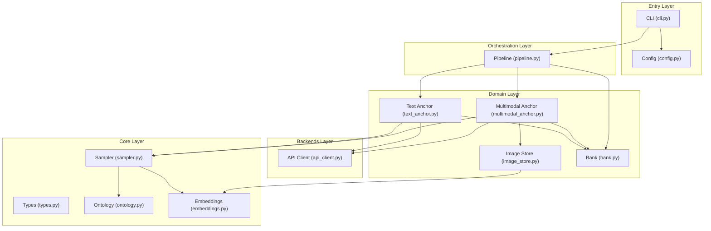
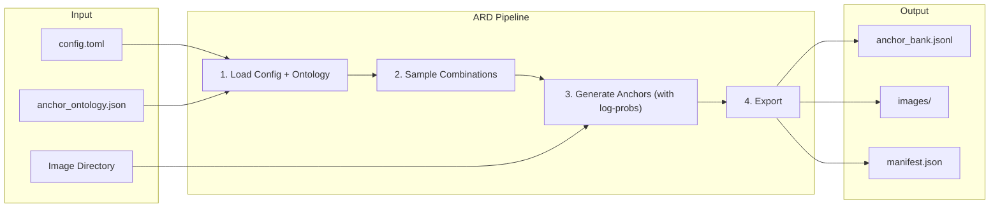
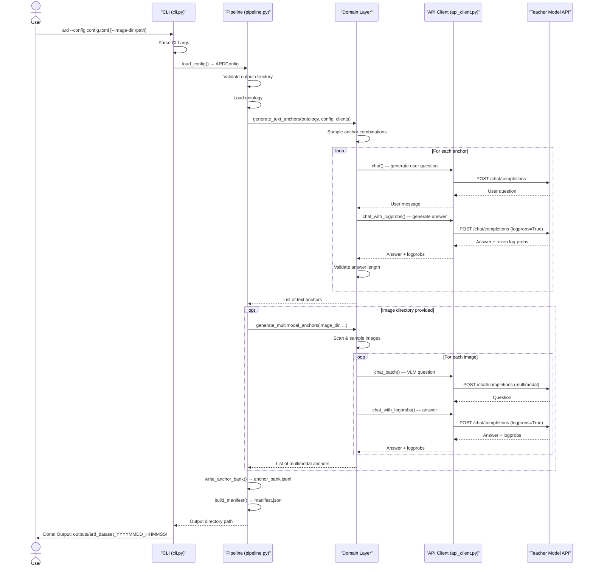

# ARD Architecture

## Module Boundaries

## Data Flow

## Layer Responsibilities

| Layer | Directory | Responsibility | Dependencies |
|-------|-----------|---------------|-------------|
| **Core** | `src/ard/core/` | Pure computation: data types, ontology, sampling, embeddings | `numpy` |
| **Backends** | `src/ard/backends/` | Infrastructure: API calls (urllib) with log-prob support | `core` |
| **Domain** | `src/ard/domain/` | Business logic: assembles core + backends for each feature | `core`, `backends` |
| **Pipeline** | `src/ard/pipeline.py` | Orchestration: wires config → domain modules → output | `domain` |
| **Entry** | `src/ard/cli.py`, `config.py` | CLI parsing, config loading + validation | `pipeline` |

## Key Design Decisions

1. **Three-layer separation**: Core (pure computation) → Backends (I/O) → Domain (business logic). Core modules can be tested without network, GPU, or file system access.

2. **Single CLI command**: `ard --config <path> [--image-dir <path>]` handles everything. Text anchors are always generated; multimodal anchors are generated when `--image-dir` is provided.

3. **Log-probs via API**: Token-level log-probabilities are obtained directly from the vLLM API by adding `logprobs=True` to the target model call. No local HF model is needed.

4. **Unified output format**: All anchors are written to a single `anchor_bank.jsonl` file in a format compatible with graspo. Each record includes `id`, `source`, `messages`, `targets` (with `logprobs`), `anchor_meta`, and `teacher_id`.

5. **TOML config with override**: Base config (`config.toml`) contains all fields with defaults. Override config (`config.override.toml`) contains only secrets. Both are deep-merged into a single `ARDConfig` instance at startup.

6. **User-provided resources**: Images are provided by the user (directory). All model inference goes through the user's API endpoints. ARD does not bundle models or images.

## Anchor Generation Flow

