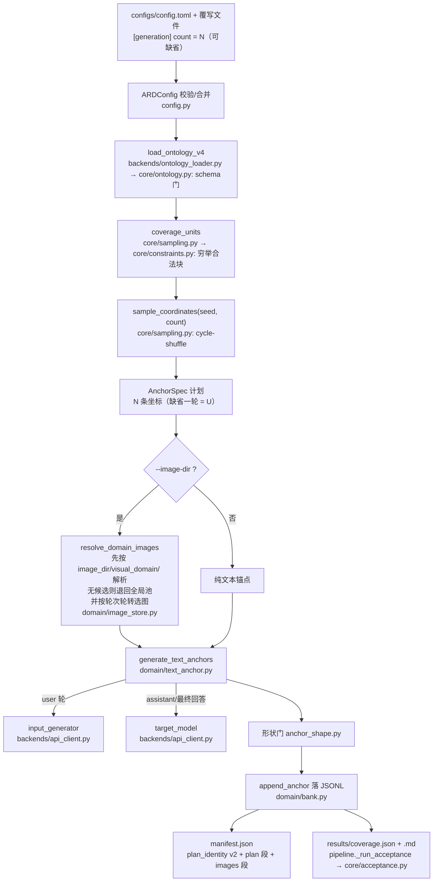
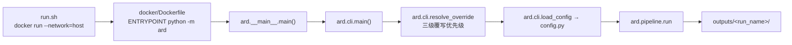
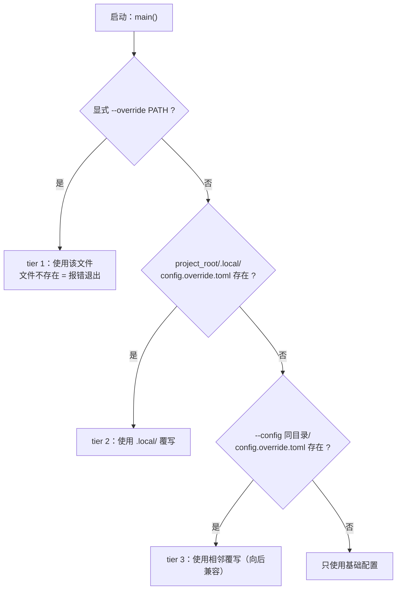
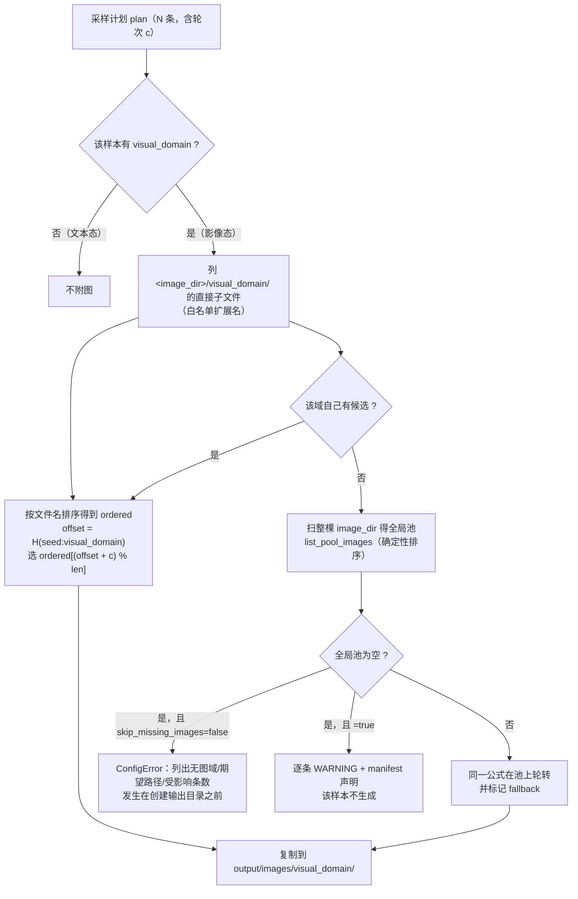

# ARD 架构

> 职责：说明 ARD 的模块边界、数据流、入口链路、输出目录布局与配置分层。本文件只写结构级的"为什么"与模块职责；
> 实现细节、算法口径、验收尺子分别见 `docs/algorithm.md` 与 `docs/measurement.md`，代码级细节见各模块 docstring
> （宪法 §17.2 / §12.4）。
>
> 引用约定：本页一律使用**符号引用**（如 `ard.pipeline.run`、`ard.domain.bank.append_anchor`），
> **不写 `文件:行`**——行号会随任何代码改动漂移，符号名不会。

ARD（Anchor Replay Distillation）从本体 v4 的坐标空间中构造锚点计划，调用输入生成模型产出用户轮、
调用目标（teacher）模型产出回答，落成 JSONL 锚点库与 manifest，并在同一轮内给出验收读数
（`q95` / 覆盖率 / 密度）。它不训练模型、不做数据蒸馏；产物是训练语料与验收报告。

计划条数 N 由用户在 `configs/config.toml` 的 `[generation] count` 设置，**无上限**，缺省 = 一个完整轮 = 单元数 U；
采样规则是**随机顺序轮转**（cycle-shuffle），详见 `docs/algorithm.md`。

## 1. 模块边界

四层，依赖只能向下、不得回指（宪法 §1.1 / §1.3）：

| 层 | 目录 | 职责 | 成员 |
|---|---|---|---|
| 核心层 | `src/ard/core/` | **纯计算**，零文件/网络/子进程访问（§1.3；由 `tests/core/test_core_is_pure.py` 的 AST 守卫强制） | `ontology.py`（v4 本体 schema 门：校验**已解码**的 payload）、`constraints.py`（约束求值 + 合法受限块穷举）、`sampling.py`（构造规则 → 坐标、`AnchorSpec`、锚点 id、`PlanIdentity`）、`coverage.py`（验收尺子，纯数值）、`acceptance.py`（读数与空间声明的组装）、`quota.py`（图片配额）、`system_prompt.py`（system prompt 措辞契约与渲染）、`axis_instruction.py`（6 条 instruction 轴的措辞契约）、`system_prompt_template_error.py` / `axis_instruction_error.py`（两个措辞契约各自的**唯一异常类**，落镜像文件、由契约模块 re-export）、`types.py`（核心 dataclass） |
| 设施层 | `src/ard/backends/` | **设施**：文件读取、网络 I/O 与端点协议 | `api_client.py`（OpenAI 兼容 chat + SSE 流式）、`embedding_client.py`（OpenAI 兼容 `/embeddings`）、`coverage_wiring.py`（把库记录/目标集接到 `core/` 尺子上）、`ontology_loader.py`（读本体文件 → `core/` 的 schema 门）、`prompt_loader.py`（读 system-prompt 措辞文件 → `core/` 的渲染）、`axis_instruction_loader.py`（读 instruction 轴措辞文件） |
| 领域层 | `src/ard/domain/` | **领域编排**：把坐标变成对外产物 | `text_anchor.py`（生成主循环：逐轮生成、形状门、最终回答）、`bank.py`（JSONL 库、锚点 id 唯一性、manifest）、`image_store.py`（图片扫描/转换/按域与**轮次**分配）、`anchor_shape.py`（消息形状契约）、`append_outcome.py`（入库结果枚举） |
| 入口层 | `src/ard/` | 参数、配置、日志、编排 | `cli.py`（argparse + 覆写解析）、`config.py`（pydantic 模型 + 合并/校验，含 `[generation] count`）、`pipeline.py`（主编排 `run`、续跑守卫、manifest 组装）、`logging.py`（控制台 + 文件日志）、`__main__.py`（`python -m ard`） |

```mermaid
graph TD
    subgraph Entry["入口层 src/ard"]
        "cli.py" --> "config.py"
        "cli.py" --> "pipeline.py"
        "pipeline.py" --> "logging.py"
    end
    subgraph Domain["领域层 src/ard/domain"]
        "text_anchor.py"
        "bank.py"
        "image_store.py"
        "anchor_shape.py"
    end
    subgraph Backends["设施层 src/ard/backends"]
        "api_client.py"
        "embedding_client.py"
        "coverage_wiring.py"
        "ontology_loader.py"
        "prompt_loader.py"
        "axis_instruction_loader.py"
    end
    subgraph Core["核心层 src/ard/core"]
        "ontology.py"
        "constraints.py"
        "sampling.py"
        "coverage.py"
        "acceptance.py"
        "quota.py"
        "system_prompt.py"
        "axis_instruction.py"
        "system_prompt_template_error.py"
        "axis_instruction_error.py"
        "types.py"
        "system_prompt.py" --> "system_prompt_template_error.py"
        "axis_instruction.py" --> "axis_instruction_error.py"
    end
    Entry --> Domain
    Entry --> Backends
    Domain --> Backends
    Domain --> Core
    Backends --> Core
```

**异常类落镜像文件（§12.2）**：两个措辞契约各自的唯一失败类型 `SystemPromptTemplateError` /
`AxisInstructionError` 放在与类名同名的镜像文件里（`ard/core/system_prompt_template_error.py`、
`ard/core/axis_instruction_error.py`），由各自的契约模块 `import` 后 **re-export**。公开导入路径
（`ard.core.system_prompt.SystemPromptTemplateError`、`ard.core.axis_instruction.AxisInstructionError`）
因此保持不变——调用方与设施层无需知道这层拆分；拆分的收益是每个文件只有一个概念（§8.2）。

**层次边界（§1.3 计算与设施分离）**：`core/` 内**零**文件读取、网络与子进程调用——schema 校验
（`ard.core.ontology.parse_ontology_v4`，接受**已解码**的 payload）、措辞渲染
（`ard.core.system_prompt.validate_system_prompt_template` / `render_system_prompt_prompt`）
都是纯函数。读文件的动作各有设施侧入口：本体 = `ard.backends.ontology_loader.load_ontology_v4`，
system-prompt 措辞 = `ard.backends.prompt_loader.load_system_prompt_template`（组装入口
`build_system_prompt_prompt`），instruction 轴措辞 = `ard.backends.axis_instruction_loader`。
`tests/core/test_core_is_pure.py` 用 AST 扫描 `src/ard/core/*.py`，一旦出现文件/网络/子进程/os 访问即测试失败
——这条边界由测试守着，不靠人记。

## 2. 数据流


```mermaid
flowchart TD
    A["configs/config.toml + 覆写文件<br/>[generation] count = N（可缺省）"] --> B["ARDConfig 校验/合并<br/>config.py"]
    B --> C["load_ontology_v4<br/>backends/ontology_loader.py → core/ontology.py: schema 门"]
    C --> D["coverage_units<br/>core/sampling.py → core/constraints.py: 穷举合法块"]
    D --> E["sample_coordinates(seed, count)<br/>core/sampling.py: cycle-shuffle"]
    E --> F["AnchorSpec 计划<br/>N 条坐标（缺省一轮 = U）"]
    F --> G{"--image-dir ?"}
    G -- 是 --> H["resolve_domain_images<br/>先按 image_dir/visual_domain/ 解析<br/>无候选则退回全局池<br/>并按轮次轮转选图<br/>domain/image_store.py"]
    G -- 否 --> I["纯文本锚点"]
    H --> J["generate_text_anchors<br/>domain/text_anchor.py"]
    I --> J
    J -->|"user 轮"| K["input_generator<br/>backends/api_client.py"]
    J -->|"assistant/最终回答"| L["target_model<br/>backends/api_client.py"]
    J --> M["形状门 anchor_shape.py"]
    M --> N["append_anchor 落 JSONL<br/>domain/bank.py"]
    N --> O["manifest.json<br/>plan_identity v2 + plan 段 + images 段"]
    N --> P["results/coverage.json + .md<br/>pipeline._run_acceptance → core/acceptance.py"]
```

要点（结构级）：

- **计划与生成分离**：`AnchorSpec` 计划在触碰任何端点之前就固定（坐标 → 轮数 → 消息角色），
  因此"要生成什么"可复现、可计数；生成阶段只是按计划逐轮调用模型。
- **N 只从 config 来**：`ard.config.GenerationConfig.count`（`int | None`，缺省 `None` = 一轮 = U）。
  CLI 只传输入定位参数与运行边界参数（`--config` / `--override` / `--image-dir` / `--smoke`），
  与 N 的取值域零交集（§10.1 推论 1/2）。
- **单条锚点原子性**：任一轮失败（超时/空内容/角色不符）即放弃整条锚点并记账，不允许产出角色错位的对话
  （`ard.domain.text_anchor._generate_one_anchor`）。
- **入库是唯一持久化入口**：形状门、`data_source` 门、锚点 id 唯一性都在 `ard.domain.bank.append_anchor`
  内完成；manifest 与验收读数都从落盘的记录重建。
- **影像按坐标寻址、按轮次轮转、缺图则复用**：影像态锚点优先按自己的 `visual_domain` 到
  `<image_dir>/<visual_domain>/` 取图，同一域的多张图按**轮次**确定性轮转
  （`ard.domain.image_store.select_domain_image` 的 `cycle` 参数，`cycle = 0` 取第 0 轮）；
  该目录没有可用图时退回整棵图片树的全局池（`list_pool_images`）并同样按轮次轮转，因此只给一张图也能
  跑完整轮。只有整棵树都没有可用图时域才算真的缺图，在**创建输出目录之前**被拒绝，除非显式配置
  `[images] skip_missing_images = true`。复用与否由 `DomainImageResolution.fallback` 记录并进入 manifest。
- **验收读数不参与生成**：`q95` 等读数在生成完成后计算，读的是已落盘记录与用户提供的目标集，
  不影响采样与生成（`ard.pipeline._run_acceptance`）。

## 3. 入口链路


```mermaid
flowchart LR
    R["run.sh<br/>docker run --network=host"] --> D["docker/Dockerfile<br/>ENTRYPOINT python -m ard"]
    D --> M["ard.__main__.main()"]
    M --> C["ard.cli.main()"]
    C --> O["ard.cli.resolve_override<br/>三级覆写优先级"]
    O --> L["ard.cli.load_config → config.py"]
    L --> P["ard.pipeline.run"]
    P --> Out["outputs/&lt;run_name&gt;/"]
```

- `run.sh` 以 `--network=host` 启动容器，只读挂载 `configs/`、`ontology/`、`examples/`、`.local/`，
  可写挂载 `outputs/`。
- 容器入口是 `python -m ard`（`docker/Dockerfile` 的 `ENTRYPOINT`），即 `ard.__main__.main` →
  `ard.cli.main`。
- CLI 参数只有 `--config`（必需）、`--override`、`--image-dir`、`--smoke`。图片是否转码由
  `[images] convert` 决定，不进 CLI；计划条数由 `[generation] count` 决定，**没有 `--count`**（宪法 §10.1）。
- `ard.pipeline.run` 在**创建输出目录之前**先做端点边界校验与验收输入校验：缺 `api_base` / `model_name`、
  或目标集文件缺失/维度不符，都在零副作用的前提下拒绝（§2.3 边界校验即防呆）。

## 4. 输出目录布局

目录树（纯文本结构，非 ASCII 图；宪法 §17.2 明确豁免）：

```text
outputs/<run_name>/            # 默认 ard_dataset_<YYYYmmdd_HHMMSS>；--smoke 追加 _smoke
├── anchor_bank.jsonl          # 锚点库，每行一条 record（schema_version 5.0.0）
├── config.toml                # 合并后的配置快照（密钥已脱敏，端点保留）
├── plan_identity.in_progress.json  # 只在运行结束前存在：中途可审计的计划身份
├── images/                    # 影像态锚点图片的落点：images/<visual_domain>/<图片文件>（转码或复制而来，同一源文件只落一份）；只有本次带影像态锚点时才创建
├── logs/                      # 文件日志（ard.log 等，见 logging.py）
├── results/
│   ├── coverage.json          # 机器可读验收读数（report_schema = "ard-acceptance-3"）
│   └── coverage.md            # 人读版验收报告
└── manifest.json              # 库构成 + 运行健康 + config + plan_identity v2 + plan 段 + images 段 + acceptance 指针（权威申报）
```

**运行目录里哪个是权威，半途中断的产物怎么审计**：

- **权威只有 `manifest.json`**：它带 `status: "complete"`、`plan_identity`、`plan` 段、库构成与运行健康
  （`generation` 计数器/失败记账）与 `acceptance` 指针。申报一律读它。
- **`plan_identity.in_progress.json` 是中间态记录，不是申报**：它在计划已生成、配置快照已写之后、
  **第一次调用端点之前**落盘（写入点 `ard.pipeline._write_progress_record`，构造
  `ard.pipeline._build_progress_record`），文件里 `status: "in_progress"`、
  `ard_progress_record: "plan_identity/v1"`，并且**故意不含** `generation` 计数器——那些数字在运行结束前
  根本不存在。它的作用只有一个：让一个没走完的运行目录**也能被绑定到某个计划**
  （大批量那条路几乎必然被中断/续跑，中间态是常态）。
- **绑定与复算**：记录里的 `plan_identity` 与 manifest 是同一份定义（`ard.core.sampling.PlanIdentity.of`，
  有序坐标列表的 sha256 + 条数 + 版本 + 本体哈希 + seed + count + U）。审计中断产物时可独立复算：
  取出计划的有序坐标（或按 id 重建），跑 `PlanIdentity.of(...)`，与记录里的 `digest` 逐位比对
  ——不是读一个无法验证的字符串。
- **计数器是计划口径，不得当进度或最终申报**：记录的 `counters`（`existing` / `new` / `written`）在
  **第一次端点调用之前**定稿，此后不再刷新——`existing` = 本次调用开始时库里已有的锚点数（实读：库被读回来算续跑差值），
  `new` = 本次向生成器索要的锚点数（`len(specs)`，影像域过滤后的待生成坐标），`written` = **与 `new` 同值**：
  本次**计划**写出的条数，是计划值而非磁盘现状（中断时它只多不少）。所以半途产物的正确读法是
  "这个库属于哪个计划 + 计划多大"，**不是**"跑到哪一步"；真正已落库的条数只能读 `manifest.json` 的
  `total_anchors`（由 `ard.domain.bank.build_manifest_from_records` 从库里的**全量**记录数出，运行结束才写；
  `generation.counters.written` 只是**本次调用**写入的条数，续跑时两者不等）。记录把这条结论写成
  机器可读的声明：`counters_are_live: false`，并由 `counters_note` 点名**计数真相源**——磁盘上真实记录读
  `anchor_bank.jsonl`，最终条数读运行结束时的 `manifest.json`（`total_anchors`）——记录里的 `counters`
  **不是**计数真相源。
- **生命周期**：每次真正采样计划的调用都刷新这份记录（写前一次留下的记录会被替换，属**有意**：
  目录现在说的是这一次的计划）；运行正常结束时写完 manifest（同一 `plan_identity`）后把它删掉
  ——**完成的目录里只有一份申报**。续跑的空转调用（无锚点可生成）若发现已有 manifest 记录同一计划，
  则保持 manifest 原文不动、并同样删掉中间记录（不会把已完成运行改写回 `in_progress`）。
- 输出目录解析：`ard.pipeline._resolve_run_directory`；`--smoke` 会在目录名后加 `_smoke` 并在 manifest 里
  声明 `smoke: true`（`ard.pipeline._declare_smoke`）。
- 两个落盘点：`anchor_bank.jsonl` 与脱敏 `config.toml`（`ard.pipeline._config_snapshot_toml`，
  **每次运行覆盖**：续跑时它描述的是**最后一次**运行，包括什么都没生成的空转调用——所以它记录的是进程级
  `seed`，**不是计划身份**）。计划身份是 manifest 里的 `plan_identity`；续跑时先比这个摘要，
  不同即在写任何东西之前报错，不静默混合两个计划。
- **续跑守卫**（`ard.pipeline._refuse_foreign_records_on_resume`）：判据不是"已有 id 集合 ⊆ 新计划 id 集合"
  ——id 是**计划位置序号**（与坐标脱钩），smoke 计划与全量计划的 id 形状相同却指向不同坐标。
  正确判据是**逐条比对已有记录在其 id 所指位置上的坐标是否与新计划一致**（`ard.pipeline._coordinate_matches`）：
  一致 ⇒ 追加（把 `[generation] count` 调大后重跑同一目录即走这条路）；不一致 ⇒ `ConfigError` 拒绝，
  并提示换目录或显式 `output.overwrite = true`。**守卫的读数来源有两个**：已有 manifest 的 `plan_identity`，
  或（上一次没走完时）中间记录的 `plan_identity`——两个都比。
- `manifest.json` 由 `ard.domain.bank.build_manifest_from_records` 组装库构成
  （`total_anchors` / `domains` / `languages` / `capabilities` / `system_prompt_modes` / `data_sources` / `output_dir`），
  再挂上运行健康、`plan_identity` v2（`ard.pipeline._declare_plan_identity`）、
  `plan` 段（`ard.pipeline._declare_plan_readout`）、`images` 段（`ard.pipeline._declare_images`）
  与 `acceptance` 指针；**只在本次真的重新生成**时落盘——空转调用若发现 manifest 已记录同一 `plan_identity`，
  保持原文不动。
- `plan` 段是"计划多大、覆盖多少、密度多少"的唯一机器可读出处：`count`（N 原样，`None` = 一轮）、
  `unit_total`（U）、`full_cycles` / `last_cycle_size`（轮分解）、`planned_anchors` / `written_anchors`、
  `distinct_coordinates`、`coverage_ratio`（`min(distinct, U) / U`）、`density`（`N / U`）、`smoke`，
  以及本体哈希与 seed。口径定义见 `docs/measurement.md`。
- `results/coverage.{json,md}` 是**验收读数**，不是训练数据：结构读数（计划计数 vs 构造规则，
  零模型调用）恒产出；指标读数（`q95` 等）只在配置了 `coverage.target_set_path` 与 `[coverage.embedding]`
  时产出，否则显式 WARNING。字段与口径见 `docs/measurement.md`。

## 5. 配置分层

**唯一权威基础**：`configs/config.toml`（含全部字段、英文注释）。覆写按**三级优先级，先命中者胜**
（`ard.cli.resolve_override`）：


```mermaid
flowchart TD
    S["启动：main()"] --> T1{"显式 --override PATH ?"}
    T1 -- 是 --> A["tier 1：使用该文件<br/>文件不存在 = 报错退出"]
    T1 -- 否 --> T2{"project_root/.local/<br/>config.override.toml 存在 ?"}
    T2 -- 是 --> B["tier 2：使用 .local/ 覆写"]
    T2 -- 否 --> T3{"--config 同目录/<br/>config.override.toml 存在 ?"}
    T3 -- 是 --> C["tier 3：使用相邻覆写（向后兼容）"]
    T3 -- 否 --> D["只使用基础配置"]
```

- 三级对应路径：① 显式 `--override PATH`；② `<project_root>/.local/config.override.toml`
  （宪法 §7.1 指定的推荐覆写位置，gitignored）；③ `<--config 同目录>/config.override.toml`（向后兼容）。
- `project_root` = 包含 `--config` 的检出树根（最近的有 `.git` 或 `pyproject.toml` 的祖先），
  由 `ard.cli._find_project_root` 判定。
- **永远不静默**：每次决策都在 INFO 日志里写出最终用了哪个覆写文件（含完整路径），"没有覆写"也会明确记录。
  属于另一棵检出树的 `.local/` 覆写会被报告且**不加载**（`ard.cli._foreign_local_override`）。
- 合并与校验：`ard.config` 的深层合并 → 空串归一为 `None` → `ARDConfig.model_validate`
  （各段模型一律 `extra="forbid"`，拼错的字段名会报错而不是被忽略）。
- 输出目录内的 `config.toml` 是**合并后**快照并已脱敏（`ard.pipeline._redact_secrets`）：密钥替换为占位符，
  **端点与模型名保留**（§7.1 把端点归为环境字段，不是机密）。它与 manifest 的 `config` 段共用同一份脱敏字典
  （单一真相源），并且本身是合法的 `--config`，配合 `--override` 提供凭证即可重跑（§8.5）。

## 6. 图像按 `visual_domain` 寻址，缺图则从全局池轮转复用

影像态每条样本带且仅带一个 `visual_domain` 叶坐标，图片优先按该坐标寻址：归档在域目录下的图，
才是用户为"内容与标签相符"背书的那张。但寻址失败不再等于丢锚点——域的目录里没有图时，退回整棵
图片树的全局池继续轮转，**只给一张图也能跑完整轮**。寻址与选图约定由 `ard.domain.image_store`
独占，`ard.pipeline.run` 只做编排与边界校验。


```mermaid
flowchart TD
    P["采样计划 plan（N 条，含轮次 c）"] --> Q{"该样本有 visual_domain ?"}
    Q -- "否（文本态）" --> T["不附图"]
    Q -- "是（影像态）" --> D["列 &lt;image_dir&gt;/visual_domain/ 的直接子文件<br/>（白名单扩展名）"]
    D --> R["按文件名排序得到 ordered<br/>offset = H(seed:visual_domain)<br/>选 ordered[(offset + c) % len]"]
    R --> C["复制到 output/images/visual_domain/"]
    D --> M{"该域自己有候选 ?"}
    M -- "是" --> R
    M -- "否" --> Z["扫整棵 image_dir 得全局池<br/>list_pool_images（确定性排序）"]
    Z --> ZP{"全局池为空 ?"}
    ZP -- "否" --> ZR["同一公式在池上轮转<br/>并标记 fallback"] --> C
    ZP -- "是，且 skip_missing_images=false" --> X["ConfigError：列出无图域/期望路径/受影响条数<br/>发生在创建输出目录之前"]
    ZP -- "是，且 =true" --> W["逐条 WARNING + manifest 声明<br/>该样本不生成"]
```

- **唯一约定**：`<image_dir>/<visual_domain>/<图片文件>`，`<image_dir>` 来自 `--image-dir`；
  域内选择只取该子目录的**直接子文件**，扩展名白名单见 `ard.domain.image_store.SUPPORTED_EXTENSIONS` 与
  `CONVERTABLE_EXTENSIONS`；约定常量 `VISUAL_DOMAIN_LAYOUT`，目录解析 `domain_directory`，
  域解析 `resolve_domain_images`；`configs/config.toml` 面向用户说明同一约定。
- **选择确定可复现，并按轮次轮转**：候选先按文件名排序，再以 `H(seed:visual_domain)` 摘要作偏移，
  第 `c` 轮取 `ordered[(offset + c) % len(ordered)]`（`ard.domain.image_store.select_domain_image` 的
  `cycle` 参数）——同一 `(候选集, 域, seed, cycle)` 在任何平台得到同一张图。因此一个域有多张图时，
  不同轮次会用不同的图，而不是把整个数据集钉在 21 张图上。
  选中的图由 `ard.pipeline._assign_images_by_domain` 分配到锚点。
- **域内没图则退回全局池复用**：`list_pool_images` 递归枚举整棵 `--image-dir`，按
  相对路径的 `(父目录, 文件名)` 排序成确定性全局池；域内无候选时在同一公式下对池轮转，并把该域记入
  `DomainImageResolution.fallback`。**只有全局池也为空**时域才算真的缺图。池只有 1 张时所有域、所有
  轮次都取到那一张——这正是"只给一张图也行"的语义。选中的源文件在
  `ard.pipeline.run` 的放置步骤里**同一源只落一份拷贝**，被多个 `(cycle, 域)` 共享。
- **缺图默认报错**：全局池为空时，`ard.pipeline.run` 在**创建输出目录之前**拒绝整个运行
  （`raise ConfigError`，报文由 `ard.pipeline._missing_image_message` 生成），而第一个副作用
  `output_dir.mkdir` 在其后；只有显式开启 `[images] skip_missing_images = true` 才跳过，
  且逐条 WARNING 并在 `manifest.json` 里申报跳过数与域（`ard.pipeline._declare_images`）——绝不静默。
- **文本态永不附图**：没有 `visual_domain` 的坐标不携带图片，避免"坐标说文本态、消息里却有图"的错配。
- **丢弃锚点不留图**：图片在生成**之前**复制，因此一条锚点最终被丢弃（生成失败/重试耗尽）时，
  它的图片会被 `ard.pipeline._prune_abandoned_images` 从 `output/images/` 删除，使产物目录与
  `anchor_bank.jsonl` 的引用数一致。删除判据是"`anchor_bank.jsonl` 里**没有任何记录引用**该文件"，
  且只考察**本轮放置/复用**的文件；记录集是**既有记录 ∪ 本轮写出记录**，所以同一张图被同域其它
  **已写出**锚点共享时**不删**（按记录引用判定，而非按锚点数），**断点续跑**时既有记录引用的图同样不删。
  删除失败只记 WARNING、不影响本轮运行。
- **manifest 的 `images` 段**记录 `resolved_images`（每个 `(cycle, visual_domain, image, fallback)`
  一行）、`domain_candidate_counts`（域名 → 该域目录下的可用文件数）、`pool_candidate_count`
  （全局池大小）与 `fallback_visual_domains` / `fallback_anchor_count`（哪些域、多少条锚点用的是复用的
  图），使"这一轮用哪张图、是自己的还是复用来的、每个域有多少备选"可审计——复用必须可见，
  否则"复用的图够不够用"这个判断就无从谈起。

## 7. 引用约定

本页只写符号引用。核对某符号是否仍在，用符号搜索而非行号：

```bash
git grep -n "def run" -- src/ard/pipeline.py
git grep -n "def resolve_override" -- src/ard/cli.py
git grep -n "def build_manifest_from_records" -- src/ard/domain/bank.py
```
