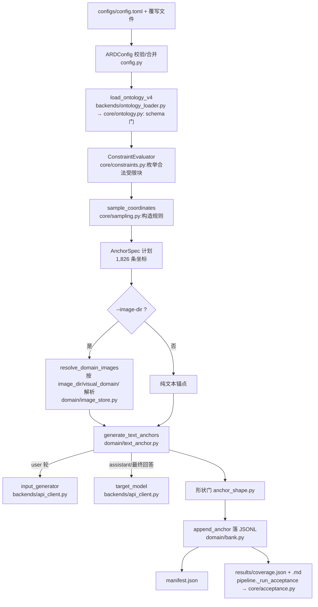
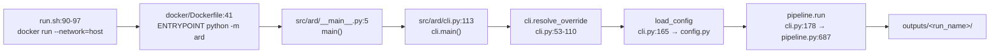
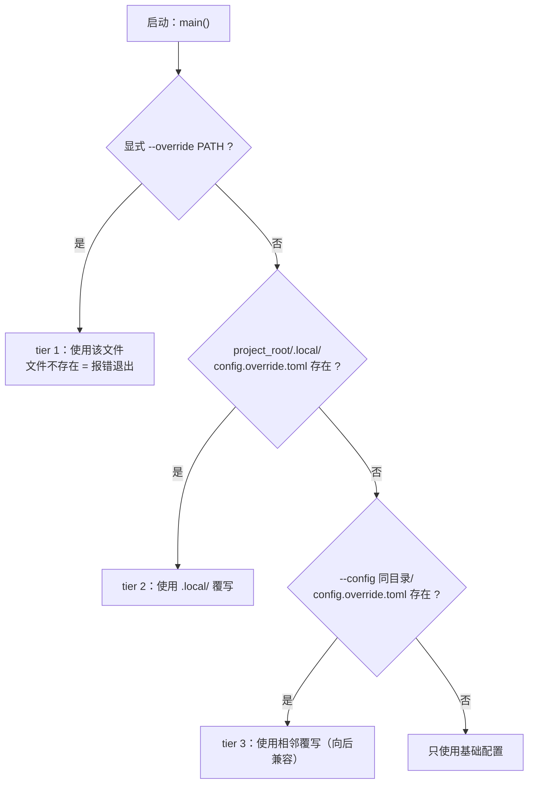
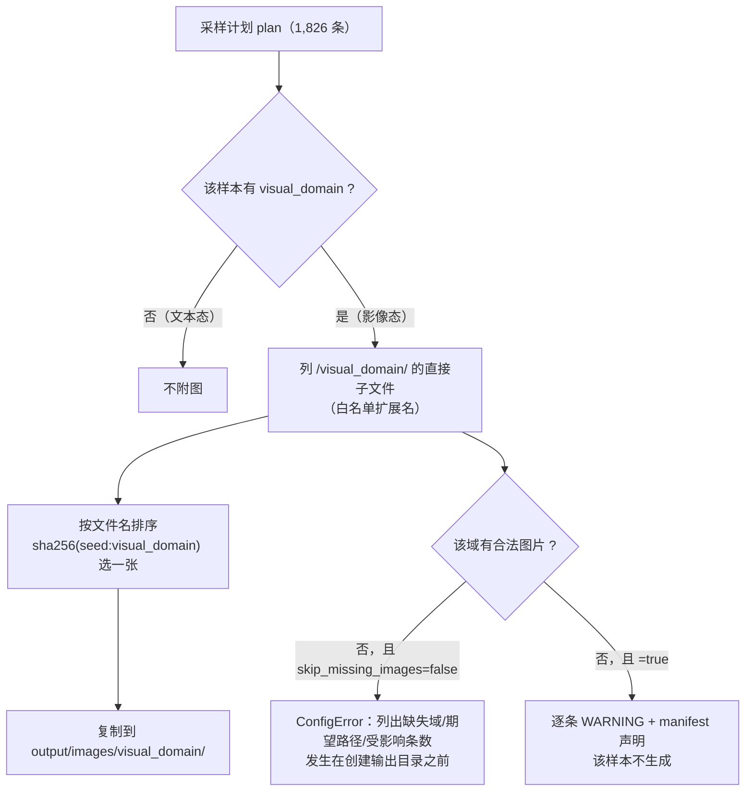

# ARD 架构

> 职责：说明 ARD 的模块边界、数据流、入口链路、输出目录布局与配置分层。本文件只写结构级的"为什么"与模块职责；
> 实现细节、算法口径、验收尺子分别见 `docs/algorithm.md` 与 `docs/measurement.md`，代码级细节见各模块 docstring（宪法 §17.2 / §12.4）。
> 基线：本页所有 `文件:行` 已按提交 `a94e7b3` 的树逐条核对（该提交之后只有文档变更，被引用的代码行未再漂移；
> 后续代码提交仍可能使其漂移，届时按符号名定位并重核）。

ARD（Anchor Replay Distillation）从本体 v4 的坐标空间中构造一轮锚点计划，调用输入生成模型产出用户轮、
调用目标（teacher）模型产出回答，落成 JSONL 锚点库与 manifest，并在同一轮内给出验收读数（`q95` / 覆盖率）。
它不训练模型、不做数据蒸馏；产物是训练语料与验收报告。

## 1. 模块边界

四层，依赖只能向下、不得回指（宪法 §1.1 / §1.3）：

| 层 | 目录 | 职责 | 成员 |
|---|---|---|---|
| 核心层 | `src/ard/core/` | **纯计算**，零文件/网络/子进程访问（§1.3；由 `tests/core/test_core_is_pure.py` 的 AST 守卫强制） | `ontology.py`（v4 本体 schema 门：校验**已解码**的 payload）、`constraints.py`（约束求值 + 合法受限块枚举）、`sampling.py`（构造规则 → 坐标与 `AnchorSpec`）、`coverage.py`（验收尺子，纯数值）、`acceptance.py`（读数与空间声明的组装）、`quota.py`（图片配额）、`system_prompt.py`（system prompt 措辞契约与渲染）、`types.py`（核心 dataclass） |
| 设施层 | `src/ard/backends/` | **设施**：文件读取、网络 I/O 与端点协议 | `api_client.py`（OpenAI 兼容 chat + SSE 流式）、`embedding_client.py`（OpenAI 兼容 `/embeddings`）、`coverage_wiring.py`（把库记录/目标集接到 `core/` 尺子上）、`ontology_loader.py`（读本体文件 → `core/` 的 schema 门）、`prompt_loader.py`（读措辞文件 → `core/` 的渲染） |
| 领域层 | `src/ard/domain/` | **领域编排**：把坐标变成对外产物 | `text_anchor.py`（生成主循环：逐轮生成、形状门、最终回答）、`bank.py`（JSONL 库、id 去重、manifest）、`image_store.py`（图片扫描/转换/分配）、`anchor_shape.py`（消息形状契约）、`append_outcome.py`（入库结果枚举） |
| 入口层 | `src/ard/` | 参数、配置、日志、编排 | `cli.py`（argparse + 覆写解析）、`config.py`（pydantic 模型 + 合并/校验）、`pipeline.py`（主编排 `run`）、`logging.py`（控制台 + 文件日志）、`__main__.py`（`python -m ard`） |

```mermaid
graph TD
    subgraph Entry["入口层 src/ard"]
        "cli.py" --> "config.py"
        "cli.py" --> "pipeline.py"
        "pipeline.py" --> "logging.py"
    end
    subgraph Domain["领域层 src/ard/domain"]
        "text_anchor.py"
        "bank.py"
        "image_store.py"
        "anchor_shape.py"
    end
    subgraph Backends["设施层 src/ard/backends"]
        "api_client.py"
        "embedding_client.py"
        "coverage_wiring.py"
        "ontology_loader.py"
        "prompt_loader.py"
    end
    subgraph Core["核心层 src/ard/core"]
        "ontology.py"
        "constraints.py"
        "sampling.py"
        "coverage.py"
        "acceptance.py"
        "quota.py"
        "system_prompt.py"
        "types.py"
    end
    Entry --> Domain
    Entry --> Backends
    Domain --> Backends
    Domain --> Core
    Backends --> Core
```

**层次边界（§1.3 计算与设施分离）**：`core/` 内**零**文件读取、网络与子进程调用——schema 校验（`src/ard/core/ontology.py:491` 的 `parse_ontology_v4`，接受**已解码**的 payload）与措辞渲染
（`src/ard/core/system_prompt.py:146` 的 `validate_system_prompt_template`、`:194` 的 `render_system_prompt_prompt`）都是纯函数。
读文件的两件事各有一个设施侧入口：本体 = `src/ard/backends/ontology_loader.py:31` 的 `load_ontology_v4`，措辞模板 =
`src/ard/backends/prompt_loader.py:38` 的 `load_system_prompt_template`（组装入口 `:75` 的 `build_system_prompt_prompt`）。
`tests/core/test_core_is_pure.py` 用 AST 扫描 `src/ard/core/*.py`，一旦出现文件/网络/子进程/os 访问即测试失败——这条边界由测试守着，不靠人记。

## 2. 数据流


```mermaid
flowchart TD
    A["configs/config.toml + 覆写文件"] --> B["ARDConfig 校验/合并<br/>config.py"]
    B --> C["load_ontology_v4<br/>backends/ontology_loader.py → core/ontology.py: schema 门"]
    C --> D["ConstraintEvaluator<br/>core/constraints.py:枚举合法受限块"]
    D --> E["sample_coordinates<br/>core/sampling.py:构造规则"]
    E --> F["AnchorSpec 计划<br/>1,826 条坐标"]
    F --> G{"--image-dir ?"}
    G -- 是 --> H["resolve_domain_images<br/>按 image_dir/visual_domain/ 解析<br/>domain/image_store.py"]
    G -- 否 --> I["纯文本锚点"]
    H --> J["generate_text_anchors<br/>domain/text_anchor.py"]
    I --> J
    J -->|"user 轮"| K["input_generator<br/>backends/api_client.py"]
    J -->|"assistant/最终回答"| L["target_model<br/>backends/api_client.py"]
    J --> M["形状门 anchor_shape.py"]
    M --> N["append_anchor 落 JSONL<br/>domain/bank.py"]
    N --> O["manifest.json"]
    N --> P["results/coverage.json + .md<br/>pipeline._run_acceptance → core/acceptance.py"]
```

要点（结构级）：

- **计划与生成分离**：`AnchorSpec` 计划在触碰任何端点之前就固定（坐标 → 轮数 → 消息角色），因此"要生成什么"可复现、可计数；生成阶段只是按计划逐轮调用模型。
- **单条锚点原子性**：任一轮失败（超时/空内容/角色不符）即放弃整条锚点并记账，不允许产出角色错位的对话（`src/ard/domain/text_anchor.py:549`，`_generate_one_anchor` 起）。
- **入库是唯一持久化入口**：形状门、`data_source` 门、id 去重都在 `bank.append_anchor` 内完成（`src/ard/domain/bank.py:219` 起），manifest 与验收读数都从落盘的记录重建。
- **影像按坐标寻址**：影像态锚点按自己的 `visual_domain` 到 `<image_dir>/<visual_domain>/` 取图；
  缺图的域在**创建输出目录之前**被拒绝，除非显式配置 `[images] skip_missing_images = true`
  （`src/ard/pipeline.py:832-882`，`src/ard/domain/image_store.py:125-251`）。
- **验收读数不参与生成**：`q95` 等读数在生成完成后计算，读的是已落盘记录与用户提供的目标集，不影响采样与生成（`src/ard/pipeline.py:597`，`_run_acceptance`）。

## 3. 入口链路


```mermaid
flowchart LR
    R["run.sh:90-97<br/>docker run --network=host"] --> D["docker/Dockerfile:41<br/>ENTRYPOINT python -m ard"]
    D --> M["src/ard/__main__.py:5<br/>main()"]
    M --> C["src/ard/cli.py:113<br/>cli.main()"]
    C --> O["cli.resolve_override<br/>cli.py:53-110"]
    O --> L["load_config<br/>cli.py:165 → config.py"]
    L --> P["pipeline.run<br/>cli.py:178 → pipeline.py:687"]
    P --> Out["outputs/&lt;run_name&gt;/"]
```

- `run.sh` 以 `--network=host` 启动容器，只读挂载 `configs/`、`ontology/`、`examples/`、`.local/`，可写挂载 `outputs/`（`run.sh:90-97`）。
- 容器入口是 `python -m ard`（`docker/Dockerfile:41`），即 `src/ard/__main__.py:5` → `src/ard/cli.py:113`。
- CLI 参数（`src/ard/cli.py:119-148`）覆盖 `--config`（必需）、`--override`、`--image-dir`、`--smoke`。图片是否转码由 `[images] convert` 决定，不进 CLI（宪法 §10.1）。
- `pipeline.run`（`src/ard/pipeline.py:687`）在**创建输出目录之前**先做端点边界校验与验收输入校验：缺 `api_base`/`model_name`、或目标集文件缺失/维度不符，都在零副作用的前提下拒绝（`§2.3 边界校验即防呆`）。

## 4. 输出目录布局

目录树（纯文本结构，非 ASCII 图；宪法 §17.2 明确豁免）：

```text
outputs/<run_name>/            # 默认 ard_dataset_<YYYYmmdd_HHMMSS>；--smoke 追加 _smoke
├── anchor_bank.jsonl          # 锚点库，每行一条 record（schema_version 4.0.0）
├── config.toml                # 合并后的配置快照（密钥已脱敏，端点保留）
├── logs/                      # 文件日志（ard.log 等，见 logging.py:36 起）
├── results/
│   ├── coverage.json          # 机器可读验收读数
│   └── coverage.md            # 人读版验收报告
└── manifest.json              # 库构成 + 运行健康 + config + acceptance 指针
```

- 输出目录：`src/ard/pipeline.py:821`（`_resolve_run_directory` 的调用处）；`--smoke` 会在目录名后加 `_smoke` 并在 manifest 里声明 `smoke: true`。
- 两个落盘点：`src/ard/pipeline.py:822` 写 `anchor_bank.jsonl`，`src/ard/pipeline.py:909` 写脱敏 `config.toml`。
- `manifest.json` 由 `bank.build_manifest_from_records` 组装（库构成：`total_anchors`/`domains`/`languages`/`capabilities`/`system_prompt_modes`/`data_sources`/`output_dir`，`src/ard/domain/bank.py:510-543`），再挂上运行健康与 `acceptance` 指针；`src/ard/pipeline.py:1097` 落盘。
- `results/coverage.{json,md}` 是**验收读数**，不是训练数据：结构读数（计划计数 vs 构造规则，零模型调用）恒产出；指标读数（`q95` 等）只在配置了 `coverage.target_set_path` 与 `[coverage.embedding]` 时产出，否则显式 WARNING。字段与口径见 `docs/measurement.md`。

## 5. 配置分层

**唯一权威基础**：`configs/config.toml`（含全部字段、英文注释）。覆写按**三级优先级，先命中者胜**（`src/ard/cli.py:53-110`）：


```mermaid
flowchart TD
    S["启动：main()"] --> T1{"显式 --override PATH ?"}
    T1 -- 是 --> A["tier 1：使用该文件<br/>文件不存在 = 报错退出"]
    T1 -- 否 --> T2{"project_root/.local/<br/>config.override.toml 存在 ?"}
    T2 -- 是 --> B["tier 2：使用 .local/ 覆写"]
    T2 -- 否 --> T3{"--config 同目录/<br/>config.override.toml 存在 ?"}
    T3 -- 是 --> C["tier 3：使用相邻覆写（向后兼容）"]
    T3 -- 否 --> D["只使用基础配置"]
```

- 三级对应路径：① 显式 `--override PATH`；② `<project_root>/.local/config.override.toml`（宪法 §7.1 指定的推荐覆写位置，gitignored）；
  ③ `<--config 同目录>/config.override.toml`（向后兼容）。
- `project_root` = 包含 `--config` 的检出树根（最近的有 `.git` 或 `pyproject.toml` 的祖先），由 `cli._find_project_root` 判定（`src/ard/cli.py:19-31`）。
- **永远不静默**：每次决策都在 INFO 日志里写出最终用了哪个覆写文件（含完整路径），"没有覆写"也会明确记录（`src/ard/cli.py:73-110`）。属于另一棵检出树的 `.local/` 覆写会被报告且**不加载**（`cli._foreign_local_override`，`src/ard/cli.py:33-51`）。
- 合并与校验：`_deep_merge` → `_replace_empty_str_with_none` → `ARDConfig.model_validate`（`src/ard/config.py`；各段模型一律 `extra="forbid"`，拼错的字段名会报错而不是被忽略）。
- 输出目录内的 `config.toml` 是**合并后**快照并已脱敏（`pipeline._redact_secrets`，`src/ard/pipeline.py:201`）：密钥替换为占位符，**端点与模型名保留**（§7.1 把端点归为环境字段，不是机密）。它与 manifest 的 `config` 段共用同一份脱敏字典（单一真相源），并且本身是合法的 `--config`（`configs/` 里那份格式相同），配合 `--override` 提供凭证即可重跑（§8.5）。

## 6. 图像按 `visual_domain` 寻址

影像态每条样本带且仅带一个 `visual_domain` 叶坐标，图片就按该坐标寻址——不从一个扁平图片池里抽：扁平池无法保证"图"与"标签"一致，错配会静默给锚点打上错误的视觉域。寻址约定由 `ard.domain.image_store` 独占，`pipeline.run` 只做编排与边界校验。


```mermaid
flowchart TD
    P["采样计划 plan（1,826 条）"] --> Q{"该样本有 visual_domain ?"}
    Q -- "否（文本态）" --> T["不附图"]
    Q -- "是（影像态）" --> D["列 <image_dir>/visual_domain/ 的直接子文件<br/>（白名单扩展名）"]
    D --> R["按文件名排序<br/>sha256(seed:visual_domain) 选一张"]
    R --> C["复制到 output/images/visual_domain/"]
    D --> M{"该域有合法图片 ?"}
    M -- "否，且 skip_missing_images=false" --> X["ConfigError：列出缺失域/期望路径/受影响条数<br/>发生在创建输出目录之前"]
    M -- "否，且 =true" --> W["逐条 WARNING + manifest 声明<br/>该样本不生成"]
```

- **唯一约定**：`<image_dir>/<visual_domain>/<图片文件>`，`<image_dir>` 来自 `--image-dir`；只取该子目录的**直接子文件**，扩展名白名单见 `src/ard/domain/image_store.py:30`（`SUPPORTED_EXTENSIONS`）与 `:54`（`CONVERTABLE_EXTENSIONS`）；约定常量 `src/ard/domain/image_store.py:125`（`VISUAL_DOMAIN_LAYOUT`），目录解析 `src/ard/domain/image_store.py:128`（`domain_directory`）、`:211`（`resolve_domain_images`），`configs/config.toml:79-93` 面向用户说明同一约定。
- **选择确定可复现**：候选先按文件名排序，再以 `sha256(f"{seed}:{visual_domain}")` 摘要作种子选一张（`src/ard/domain/image_store.py:167`，`select_domain_image`）——同一 `(候选集, 域, seed)` 在任何平台得到同一张图；选中的图由 `pipeline._assign_images_by_domain` 分配到锚点（`src/ard/pipeline.py:466`，调用点 `:1043`）。
- **缺图默认报错**：所需域缺目录或缺合法图片时，`pipeline.run` 在**创建输出目录之前**拒绝整个运行（校验块 `src/ard/pipeline.py:832-882`，`raise ConfigError` 在 `:853`（缺目录）与 `:866`（缺域），而第一个副作用 `output_dir.mkdir` 在 `:891`）；只有显式开启 `[images] skip_missing_images = true`（`configs/config.toml:93`）才跳过，且逐条 WARNING 并在 `manifest.json` 里申报跳过数与域——绝不静默。
- **文本态永不附图**：没有 `visual_domain` 的坐标不携带图片，避免"坐标说文本态、消息里却有图"的错配。

## 7. 证据基准

本文行号以首页声明的基线提交为准（`a94e7b3`，逐条核对过的树）；核对命令行示例：

```bash
git grep -n "def run" -- src/ard/pipeline.py
git grep -n "def resolve_override" -- src/ard/cli.py
```
