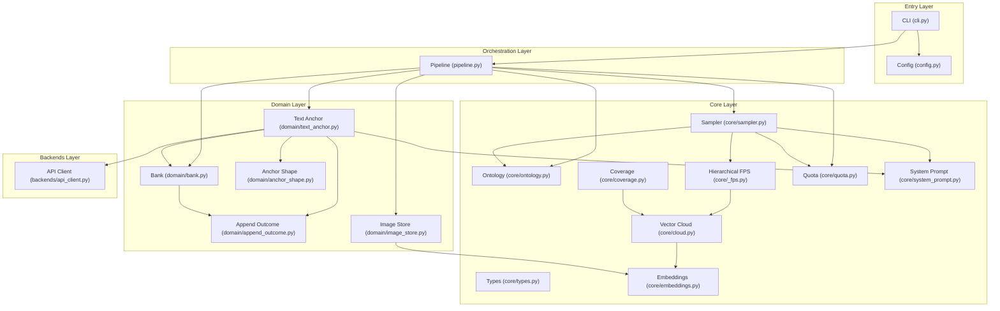
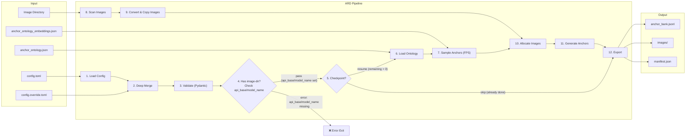
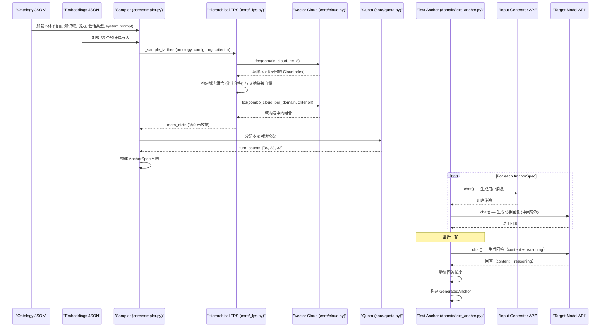
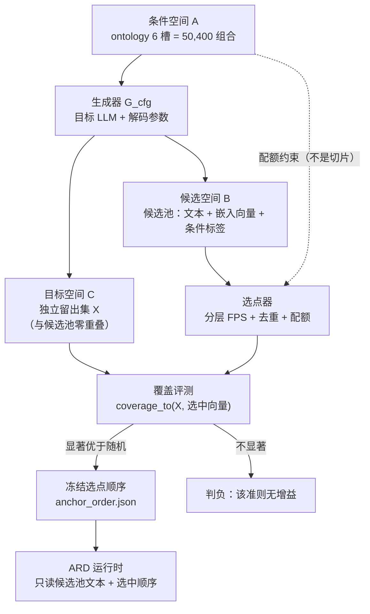
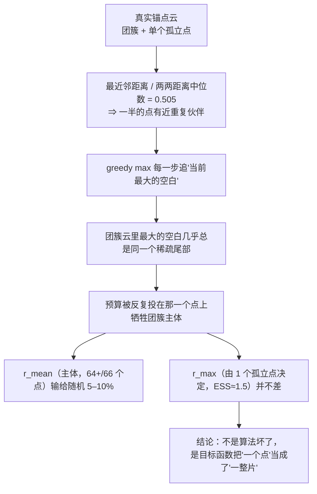
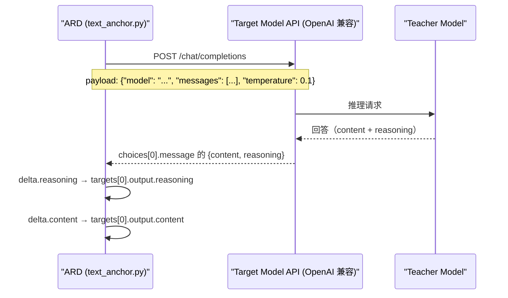
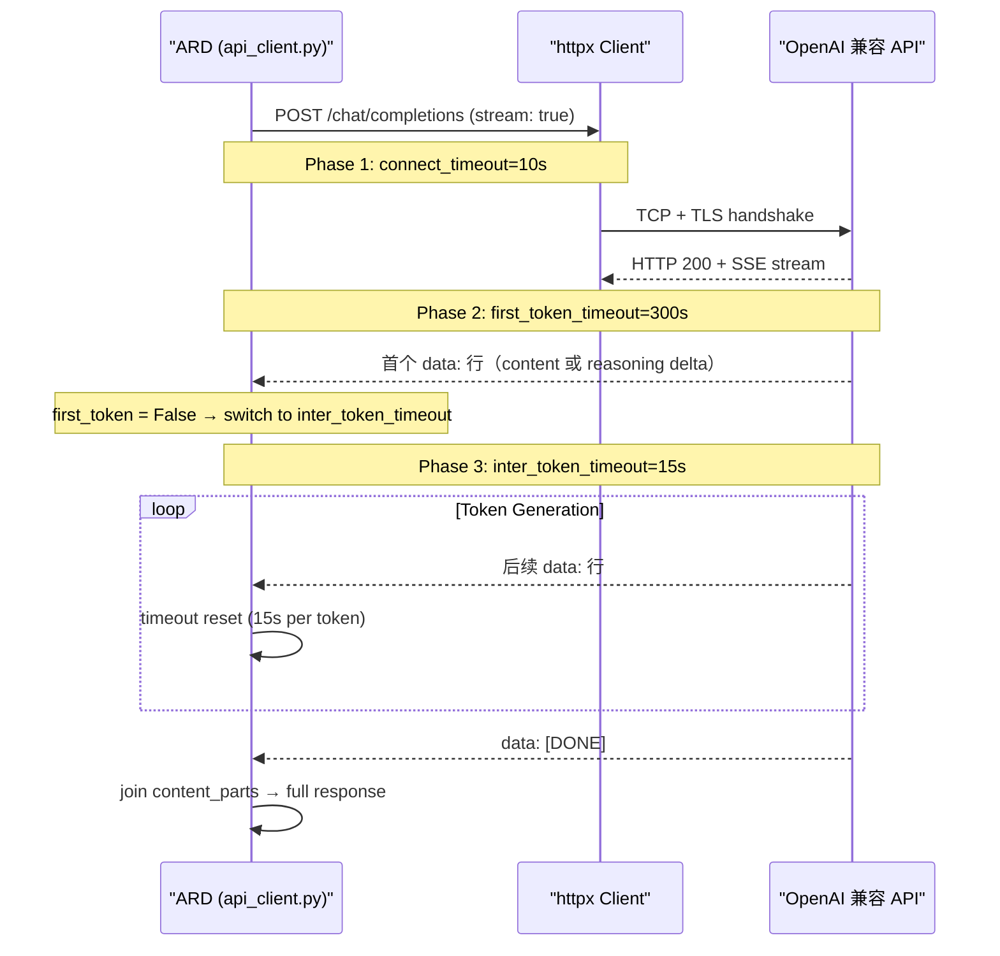
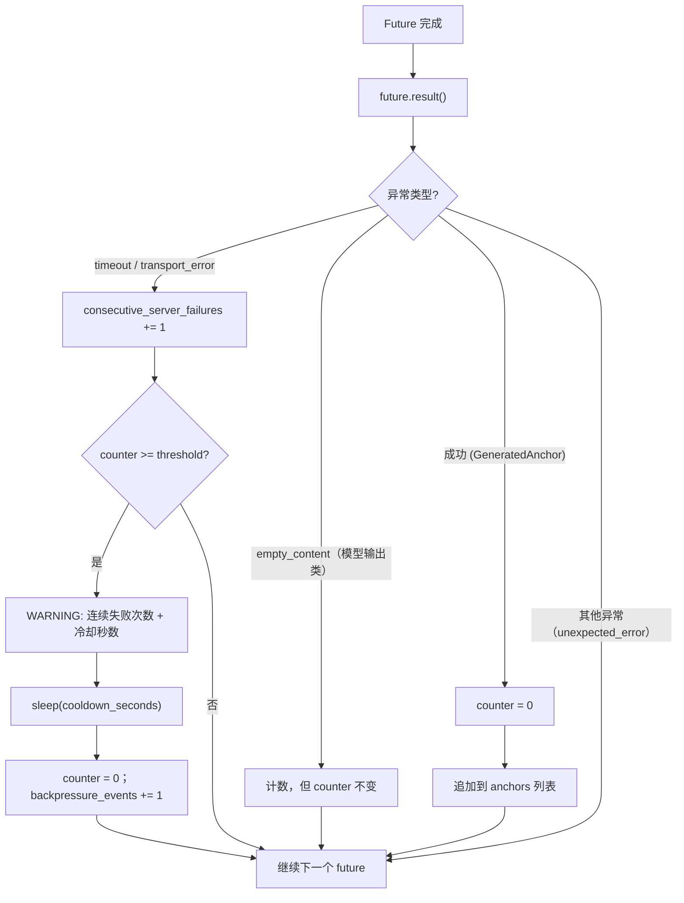
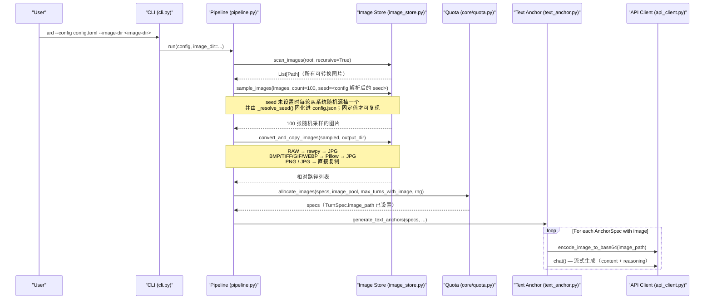
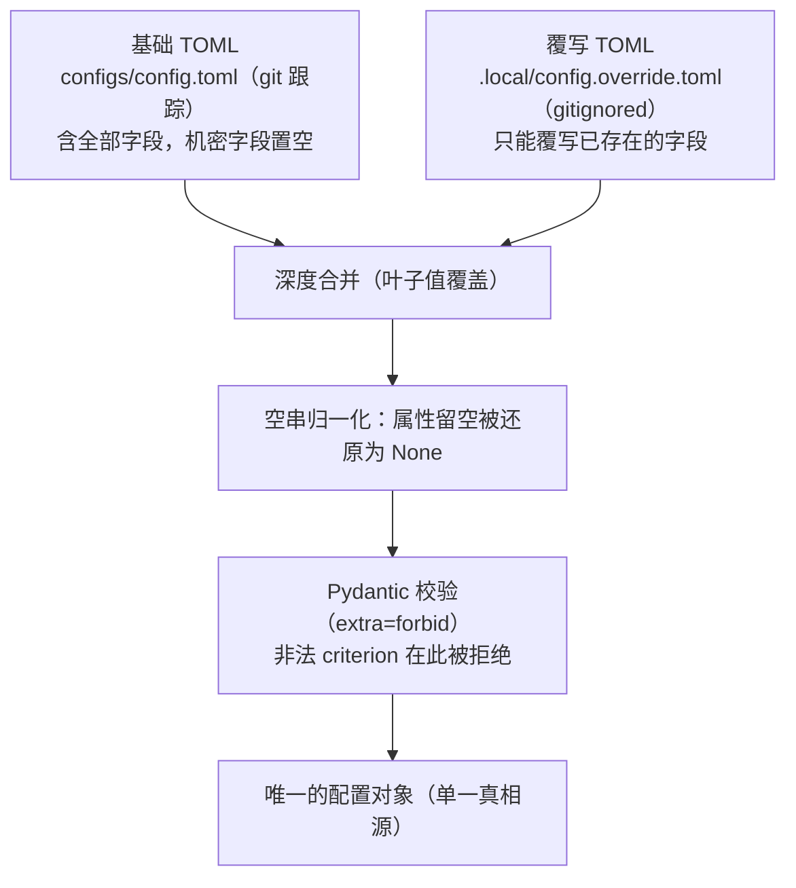

# ARD 架构文档

> **Anchor Replay Distillation** — 通过分层锚点采样和双模型 API 生成高质量训练数据。
> ARD 是**纯锚点数据集生成器**：生成 LLM 能力锚点数据（含 `content` 与 `reasoning`），
> 自身不落 logprob、不负责打分；on-policy distillation（OPD）中学生的轨迹由学生自定义，
> 教师 logprob 由原版 LLM 教师在训练时现场给出。

**本文档的读者是人与 AI 助手。** 写模块边界、职责、接口，以及结构级的"为什么"；
实现细节在代码注释里（宪法 §1.6）。所有图一律 [Mermaid](https://mermaid.js.org/)，节点名用英文双引号包裹（宪法 §17.2）。

**证据引用约定**：`.local/hb-workspace/<会话>/<工位>/<文件>` 是开发期工位证据（不入 git，见宪法 §16）。
本文档凡出现"实测"二字，都能在该路径找到机器生成的原始读数；`report.md` 中的"断言 → 出处"对照表给出逐条映射。
**凡没有出处的陈述，本文档一律写成"设计意图"或"待验证"。**

---

## 0. 术语对照表（防歧义）

### 0.1 模型角色

为了避免"ARD 里的两个角色"与"下游框架谈论的角色"混淆，全项目统一使用下表术语
（**不改变代码键名**）：

| ARD 内名称 | 下游 SFT/OPD 语境 | 职责 |
|-----------|-------------------|------|
| `input_generator`（提问/输入生成器） | 无对应（SFT/OPD 不"出题"） | 生成 `user` 轮（出题端） |
| `target_model`（目标作答模型） | **教师模型 (teacher)** | 生成目标答案 `targets[0].output`（教学信号） |
| — | 学生模型 (student) | 学习者（ARD 不参与，由 graspo/SFT 负责） |

> **一句话规则："谁的输出是目标答案，谁就是教师"。** ARD 里目标答案只有
> `target_model` 一个来源；输入生成器只出题、从不产出监督信号；ARD 从不运行学生模型。

### 0.2 几何与覆盖量（本文档后续反复出现）

**先定名（一名一物，§1.4）**：本仓库有**两条链**，各自有一个"可供选点的材料集合"，
**它们的名字必须分开**，否则读者会把两条链的产物当成同一个东西：

| 名字（本文用） | 指哪一个 | 在哪条链 | 记号 |
|---|---|---|---|
| **组合云** / 组合向量空间 | **本体组合向量的候选云**（6×D 拼接过、随 `CloudVectors` 流动） | **生产管线**（`src/ard/`） | 实现里的 `cloud_id = "ontology_combinations"` |
| **候选池** / 文本池 | **通过复核的文本 + 向量 + 条件标签**（材料，不是对话） | **池建流程**（`scripts/poolbuild/`）＋ 覆盖度 v2 评测 | `P` / `\|P\|` |
| **实验向量云** | 覆盖几何实验里被选点的那个向量集合（`\|P\|=200/40/4000` 这些读数里的"池"） | 离线实验与覆盖度 v2（**不在生产链路**） | `P` / `\|P\|` |

> **与算法文档的接口**：`docs/ard-algorithm.md` 的"**候选池**"专指上表第二行的**文本池**；
> 本文档的"池"在 §0.2–§4.7 的读数语境里指**实验向量云**，在 §1.3/§4.9–§4.12 指**候选池**。
> 两者**都不是**生产链路选点的那个对象——生产链路选的是**组合云**。
> 凡读到这里之后的"随机池 / 池点 / 池内"，请按**当节所说的那朵云**理解；含义不明处都补了链名。
> （本表由 WP3-X1 登记。按"只改本工作包交付面"的边界，**只改本文档**，不改算法文档。）

| 记号 | 含义 |
|------|------|
| `P`（候选云，pool） | **候选集**：可供选点的向量集合。**生产管线**当前 = 本体组合云（§1.3 左列）；**覆盖度 v2 评测** = 文本嵌入云（§1.3 右列）。两者**都不是** `docs/ard-algorithm.md` 的"候选池" |
| `X`（留出集，holdout） | **目标集**：我们要覆盖的分布的样本；与 `P` **零重叠**（`P ∩ X = ∅`） |
| `k` | 选点个数（预算） |
| `S`（选择，selection） | 从 `P` 中选出的 `k` 个点 |
| `d(i, j)` | 余弦距离 `1 − ⟨v_i, v_j⟩`；两边都 L2 归一 |
| `m_j` | 云点 `j` 到**已选集** `S` 的最小距离，`m_j = min_{s∈S} d(j, s)`（读数段落里的"池点"与之同义） |
| `r_max` | 留出集上**最坏**覆盖半径：`max_{x∈X} min_{s∈S} d(x, s)` |
| `r_p95` | 覆盖半径的 **95 分位**（"覆盖大部分"的读法） |
| `r_mean` | 覆盖半径**均值**（覆盖主体的读法） |

**度量方向（符号纪律）**：`r` 是**余弦半径，越小越好**。
带方向的百分数必须**自带口径**，例如 `gain_pct_pooled = 100·(1 − mean(半径_ref)/mean(半径_arm))`，
**正值表示参考臂（默认 `random`）半径更小、即随机更好**。
本项目已因口径混用栽过多次（登记见 `.local/hb-workspace/20260917-1330-ard-coverage-v2/task-selector-design/eval-protocol-selector.md` §1）。
**任何带符号的增益数字都不得单独用于判读方向**——方向只由原始逐划分均值与逐划分胜数导出。

---

## 1. 设计目标

ARD 的核心价值是**生成高质量、可复现、覆盖多维度的锚点数据集**，支撑 SFT 与 OPD 训练。
它围绕三大核心能力设计：

### 1.1 三大核心能力

| 能力 | 解决的问题 | 实现方式 |
|------|-----------|----------|
| **FPS 收敛采样** | 如何从巨大组合空间中选出最具代表性的锚点？ | 分层最远点采样（Hierarchical FPS），先选知识域，再选能力×语言×会话类型×system prompt 组合 |
| **锚点数据生成** | 如何为学生模型生成 SFT 训练所需的高质量 prompt/answer 对？ | 逐条生成 `messages`（含可选 system）+ `targets[0].output = {content, reasoning}`，另带 `teacher_id`、`data_source` 等溯源字段 |
| **多模态支持** | 如何生成文本+图片的锚点？ | 统一的文本/多模态生成管线，图片通过 `image_store.py` 管理 |

### 1.2 覆盖目标的正式表述（用户原始诉求）

> **ARD 产生的 FPS 锚点，随着数量的增加，迅速覆盖 LLM 通顺语义空间的大部分，
> 每多一个点就在最大空白处插入一个锚点，这样下来用不了太多的数据，就能均匀覆盖 LLM 通顺语义空间。**

这段话里有两个必须分开处理的东西：

1. **"最大空白"是概念表述，不是算法规格。** 它描述的是**意图**——每一步把预算花在当前最缺代表的地方。
   把它**字面**实现成 `argmax_i min_j d(i,j)`（"最大的那一个空白"）在真实几何上**输给同一实验向量云内的随机基线**（实测，见 §4.7）。
   真正达成该意图的是 **"总空白"准则** `argmin_i Σ_j min_j d(i,j)`（设施选址 / 最大覆盖）。
2. **"LLM 通顺语义空间"必须先被定义成可测的东西**，否则覆盖无法验证。ARD 覆盖度 v2 的操作化定义见 §4.1。

**当前实现状态（诚实边界，不得含糊）**：

| 项 | 状态 |
|---|---|
| 本体嵌入空间上的分层 FPS（Layer 1 域 + Layer 2 域内组合） | ✅ **在生产代码中，是默认路径** |
| `fps(..., criterion="sum")`（总空白） | ✅ **接口已落地、有单元测试**；默认值仍是历史行为 `"max"` |
| `criterion` 接进配置面（`GenerationConfig` / `config.toml`） | ✅ **已接线**：`[generation].criterion`（默认 `"max"`，可选 `"sum"`，非法值在配置加载时报错）。默认路径输出**逐字节不变**（§4.7）。⚠️ **`"sum"` 配得出但当前生产云跑不通**——余量填充云超 1 GiB 矩阵预算，见 §4.7 |
| 文本嵌入池（覆盖度 v2）选点链路 | ⚠️ **候选池产物已建成并按 Release 发布，但"候选池 → 生产选点"链路尚未进入 `src/`**；生产采样仍在**组合云**（本体嵌入空间）上。候选池是**通用语料（原材料）**，其构建流程**不做几何选点**（两层结构见 §1.3） |

> **规模定档（用户裁决，2026-09-18）**：下一次建池的目标是**池约 12,400 条 + 留出约 5,500 条
> ≈ 17,900 个条件**，生成约 2.8 小时；打包**按 100 MB 定档**（150 MB 硬上限自然满足，留约 15% 余量）。
> **不截断**（目标 ≥ 候选）、**不做精选小集**、只发一份完整池。**已发布的 `poolv3.0.0` 是旧规模
> （4000 / 4950）按旧规则（含截断）建的**，不等于上述新形态（§4.10、§4.12）。
> 该档位属**阶段 B**（需生成端点与嵌入网关）；本阶段只做文档定稿与代码对齐。

### 1.3 两层结构：生产管线 ≠ 池建流程（**不得混为一谈**）

此前文档把"选点"笼统写成一件事，导致读者以为池建流程里也有 FPS。**两者是两条不同的流程，
作用在不同的云、用不同的规则**（名字见 §0.2 的定名表：左列选的是**组合云**，右列产出的是**候选池/文本池**）：

| | **生产管线**（`src/ard/`） | **池建流程**（`scripts/poolbuild/`） |
|---|---|---|
| 在什么云上选 | **组合云**（本体组合向量；约 50,400 个可达组合；组合向量 6×D 维） | **候选池/文本池**（已生成文本 + 其 4096 维嵌入 + 条件标签）；池建阶段**不做几何选点**，只在**条件空间**上做覆盖 |
| 用什么规则 | **FPS（几何）**——`sample_anchors(...)` → `_sample_farthest` → `cloud.fps` | **加权抽样 + 配额修复 +（已移除的）稀有度截断**——**不做几何选点** |
| `criterion` 作用处 | ✅ **就在这里**（`max` 默认 / `sum` 可选） | ❌ **完全不涉及**（池建工具内 `criterion` 出现 0 次） |
| 产物 | 锚点数据集（`anchor_bank.jsonl`） | 一份通用语料池（文本 + 向量 + 元数据） |

**池建的抽样不是纯随机**（三条都要写清，否则读者会以为 55/55 是靠运气）：

1. **加权抽样**：语言 / 系统提示词有无 / 风格 / 知识域 / 能力 / 对话类型**各有权重表**
   （`poolbuild.conditions`，权重集中声明、可在一处调整）；
2. **配额修复**：抽完后检查**每个叶值是否都有代表**，缺的补上——**55/55 叶值覆盖由此保证**，
   不是抽样碰巧命中；
3. **未穷举**：全组合约 5 万余，含语言等维度可达百万级；实际是**抽样覆盖**而非穷举。

**选点链（取消截断后）**：去重（精确重复 + 近重复簇）→ 代表选择（每簇留一个）→ **叶值覆盖强制**
（不够就从储备换入）→ **无截断**。目标设定为 `候选 ≥ 池目标`，因此"按稀有度砍尾部"这一步被移除；
若代表数仍超过声明的池上限，工具**显式报错**而不是静默裁剪。

**为什么不给池做几何选点**（结论 + 理由，避免读者以为是遗漏）：

- 用户裁决：池的定位是**通用语料（原材料）**，下游"**要多少自己算**"——我们不发精选小集；
- 池保留率本就很高，再在池内做几何优化**对下游的边际意义无法度量**（本项目只测覆盖几何，
  不测下游训练收益，§4.7）；
- 几何选点属于**生产管线那一层**（用 `criterion` 选择），池建阶段做的是**条件空间覆盖**。

---

## 2. 模块边界

### 2.1 五层架构图


```mermaid
graph TD
    subgraph "Entry Layer"
        CLI["CLI (cli.py)"]
        CFG["Config (config.py)"]
    end

    subgraph "Orchestration Layer"
        PL["Pipeline (pipeline.py)"]
    end

    subgraph "Core Layer"
        TY["Types (core/types.py)"]
        ON["Ontology (core/ontology.py)"]
        EM["Embeddings (core/embeddings.py)"]
        CL["Vector Cloud (core/cloud.py)"]
        CV["Coverage (core/coverage.py)"]
        FP["Hierarchical FPS (core/_fps.py)"]
        SM["Sampler (core/sampler.py)"]
        QT["Quota (core/quota.py)"]
        SP["System Prompt (core/system_prompt.py)"]
    end

    subgraph "Domain Layer"
        TA["Text Anchor (domain/text_anchor.py)"]
        BK["Bank (domain/bank.py)"]
        AO["Append Outcome (domain/append_outcome.py)"]
        SH["Anchor Shape (domain/anchor_shape.py)"]
        IS["Image Store (domain/image_store.py)"]
    end

    subgraph "Backends Layer"
        API["API Client (backends/api_client.py)"]
    end

    CLI --> CFG
    CLI --> PL
    PL --> TA
    PL --> IS
    PL --> SM
    PL --> ON
    PL --> BK
    PL --> QT
    TA --> API
    TA --> BK
    TA --> SH
    TA --> SP
    TA --> AO
    SM --> ON
    SM --> QT
    SM --> SP
    SM --> FP
    FP --> CL
    CL --> EM
    CV --> CL
    BK --> AO
    IS --> EM
```

> `FP`（`core/_fps.py`）是**分层 FPS 算法**；`CL`（`core/cloud.py`）是**空间安全的向量载体与贪心选点原语**
> （`fps()`）。两者的边界是：`_fps.py` 决定"分层怎么切、配额怎么分"，`cloud.py` 决定"给定一个云和 n 怎么选"。

### 2.2 模块职责声明

| 模块 | 文件 | 职责（一句话） |
|------|------|---------------|
| **CLI** | `cli.py` | 解析命令行参数，加载配置，调用 Pipeline |
| **Config** | `config.py` | 定义 Pydantic 配置模型，加载/合并/校验 TOML 配置；未固定 seed 时每轮解析出一个权威 seed；`[generation].criterion` 在配置边界即校验（合法集合取自 `core.cloud.FPS_CRITERIA`，见 §4.7） |
| **Pipeline** | `pipeline.py` | 编排整体流程：加载本体 → 采样 → 图片分配 → 生成 → 输出 |
| **Types** | `core/types.py` | 定义纯数据类（`AnchorSpec`, `TurnSpec`, `GeneratedAnchor` 等） |
| **Ontology** | `core/ontology.py` | 加载 `anchor_ontology.json`，提供本体数据访问 |
| **Embeddings** | `core/embeddings.py` | 加载预计算嵌入向量，并给出该文件所定义嵌入空间的指纹（`embedding_space_id`） |
| **Vector Cloud** | `core/cloud.py` | 携带空间标识的向量载体（`CloudVectors` / `CloudIndex`）与空间安全的贪心选点（`fps`）：跨云、跨空间的下标与距离运算在运行期抛异常，绝不静默计算。**持有贪心准则常量 `CRITERION_MAX` / `CRITERION_SUM` 与其内存预算**（§4.7） |
| **Coverage** | `core/coverage.py` | 空间安全的覆盖测量：`coverage_to`（目标云 × 选择云的显式跨云测量）与 `self_coverage`（同云自覆盖），返回带来源身份的 `CoverageStats` |
| **Hierarchical FPS** | `core/_fps.py` | 分层 FPS 策略层：Layer 1 域排序、Layer 2 域内组合向量拼接与选点、逐域配额、余量全局 FPS 填充 |
| **Sampler** | `core/sampler.py` | 公开采样入口：编排 FPS 选点、分配轮次、构建 `AnchorSpec`；同时是 `generate_anchor_id` 的归属模块 |
| **Quota** | `core/quota.py` | 分配多轮对话轮次配额和图片到锚点的配额 |
| **System Prompt** | `core/system_prompt.py` | 拥有 system prompt 采样维度的契约：`system_prompt_presence` / `system_prompt_style` 及其合并值 `system_prompt_mode`（下游路由与计数的唯一取值来源），并提供提示文本生成指令 |
| **Text Anchor** | `domain/text_anchor.py` | 并发生成锚点：调用 Input Generator 生成用户消息，调用 Target Model 生成回答。**多模态场景下：input_generator 和 target_model 必须均为多模态模型** |
| **Bank** | `domain/bank.py` | 锚点存储：序列化、追加、读取、构建 manifest；写盘前三道门——消息形状、`data_source` 词表、id 唯一性 |
| **Append Outcome** | `domain/append_outcome.py` | 定义 `append_anchor` 的返回枚举 `AppendOutcome`（`APPENDED` / `DUPLICATE_SKIPPED` / `INVALID_SHAPE_SKIPPED` / `INVALID_DATA_SOURCE_SKIPPED`）；类名与文件名精确互映 |
| **Anchor Shape** | `domain/anchor_shape.py` | 消息形状契约（入口与出口的唯一实现） |
| **Image Store** | `domain/image_store.py` | 图片扫描、格式转换（RAW/BMP/TIFF/GIF/WebP → JPG）、随机采样、复制到输出目录 |
| **Logging** | `logging.py` | 提供 `get_logger` 辅助函数，统一所有模块的日志格式和输出目标 |
| **API Client** | `backends/api_client.py` | 基于 httpx 的 OpenAI 兼容客户端，支持 SSE 流式生成、分层超时控制、背压传播；识别并统计 `delta.reasoning`（推理 token 只计数、绝不进入 `target_answer`），推理吃光预算导致的空正文以 `ARDEmptyContentError` 显式失败 |

### 2.3 模块间接口

模块间通过**明确的 Python 类型**而非隐式约定通信：

- **Config → Pipeline**：`ARDConfig` (Pydantic model)
- **Pipeline → Core**：`AnchorGenerationConfig` (dataclass) + `ontology` dict
- **Pipeline → Sampler**：`sample_anchors(ontology, config, rng, *, criterion: str | None = None) -> list[AnchorSpec]`
  （`criterion=None` 表示"交给 `config.criterion`，再回落到历史默认 `"max"`"；显式关键字优先于配置）
- **Core → Pipeline**：`list[AnchorSpec]`
- **Core → Core（选择与测量）**：`CloudVectors`（向量矩阵 + `space_id` + `cloud_id`）与 `CoverageStats`（五个统计量 + 目标/选择两侧的身份）；行下标只以 `CloudIndex` 形式流动，见 §2.5
- **Pipeline → Domain**：`list[AnchorSpec]` + `ChatAPIClient` 实例
- **Domain → Backends**：`list[dict]` (OpenAI 格式消息) → `str` / `ChatResult`
- **Domain → Bank**：`GeneratedAnchor` → JSONL 行
- **Pipeline → Image Store**：`Path` 列表 → `list[str]`（相对路径）

依赖方向自上而下：Entry → Orchestration → Domain → Backends，Core 层被所有层单向依赖，不依赖任何其他层。

### 2.4 依赖关系矩阵

**Core 层内部与上层对 Core 的依赖**：

| 依赖方 \ 被依赖方 | `core.types` | `core.ontology` | `core.embeddings` | `core.system_prompt` | `core.sampler` | `core.quota` | `core.cloud` | `core._fps` |
|---|:--:|:--:|:--:|:--:|:--:|:--:|:--:|:--:|
| `cli.py` | · | · | · | · | · | · | · | · |
| `config.py` | · | · | · | · | · | · | · | · |
| `pipeline.py` | · | ✓ | · | · | ✓ | ✓ | · | · |
| `core.sampler` | ✓ | · | · | ✓ | — | · | ✓ | ✓ |
| `core._fps` | · | · | ✓ | ✓ | · | · | ✓ | — |
| `domain.text_anchor.py` | ✓ | · | · | · | · | · | · | · |
| `domain.bank.py` | ✓ | · | · | · | · | · | · | · |

**Domain / Backends 层的依赖**：

| 依赖方 \ 被依赖方 | `domain.text_anchor` | `domain.bank` | `domain.image_store` | `backends.api_client` |
|---|:--:|:--:|:--:|:--:|
| `cli.py` | · | · | · | · |
| `config.py` | · | · | · | · |
| `pipeline.py` | ✓ | ✓ | ✓ | ✓ |
| `domain.text_anchor.py` | — | ✓ | · | ✓ |
| `domain.bank.py` | · | — | · | · |

✓ = 直接依赖（import），· = 无依赖。

模块依赖严格遵循单向依赖原则：Core 层无任何外部依赖，Backends 层仅依赖 stdlib，Domain 层依赖 Core + Backends，Pipeline 层依赖所有下层。

### 2.5 空间安全的选点与测量接口

**要解决的问题。** 覆盖测量问的是"用一组选出的向量去覆盖另一组向量，最远的那一点有多远"。
一旦"另一组"与"选出的那组"不是同一个云，行下标就不再通用：把 A 云选出的下标投到 B 云上，
运算照常完成、数字照常有值，但它度量的已经不是要测的东西。项目曾因此在**无异常、无 NaN**
的情况下得到一个错误结论并传播了一整轮。结论是：**这类错误必须由接口在运行期拦下**，
不能靠"下次更仔细"。

**两个身份（各只有一个来源）。**

| 身份 | 含义 | 约束的运算 | 唯一来源 |
|------|------|-----------|---------|
| `space_id` | 嵌入器指纹：向量由哪个嵌入空间产生 | 向量级运算（距离 / 覆盖）只在同一 `space_id` 内可比 | `embeddings.embedding_space_id()`（读嵌入文件的 `model` + `embedding_dimension`） |
| `cloud_id` | 行集身份：这一片行属于哪个云 | 行下标只在同一 `cloud_id` 内有效 | 构造 `CloudVectors` 的调用方显式声明 |

两者必须分开：同一个嵌入器产生的"标签名云"与"生成文本云"共享 `space_id`，但它们的行下标
互不通用——这正是缺陷发生的形状，只看 `space_id` 抓不住。

**接口边界**（模块 `core/cloud.py` 与 `core/coverage.py`）。

| 接口 | 签名 | 边界语义 |
|------|------|---------|
| `fps` | `(cloud, n, *, seed=None, criterion=CRITERION_MAX) -> (CloudIndex, CloudVectors)` | 唯一的选点入口。返回的是**带身份的下标**与**选出的向量本身**，调用方拿不到裸 `list[int]`。`criterion` 见 §4.7 |
| `CloudVectors.index_of` | `(positions) -> CloudIndex` | 把"本云的行号"标记成本云的 `CloudIndex`（随机基线等非 FPS 选择走这里） |
| `CloudVectors.select` | `(index: CloudIndex) -> CloudVectors` | 取行。`index` 来自别的云或别的空间 → **抛异常**，不计算 |
| `CloudVectors.require_item_ids` | `() -> tuple[str, ...]` | 取出条目名（如域名字），避免用 FPS 位置去索引第二个平行数组 |
| `coverage_to` | `(target: CloudVectors, selected: CloudVectors) -> CoverageStats` | **显式的跨云测量**：只用 `selected` 的向量投到 `target`，因此两边可以是不同的云；两边必须同一 `space_id` |
| `self_coverage` | `(cloud: CloudVectors, selection: CloudVectors) -> CoverageStats` | **同云自覆盖**：`selection` 必须来自 `cloud` 本身，否则抛异常 |
| `CoverageStats` | 五个统计量 + 两侧 `space_id`/`cloud_id` + 行数 + `same_cloud` | 数值口径与历史 `coverage(U_all, sel)` 逐位一致；身份字段让"谁覆盖谁、在哪个空间"可事后审计 |

**异常契约**（均继承 `ValueError`，在边界上阻断而非降级）。

| 异常 | 触发条件 |
|------|---------|
| `SpaceMismatchError` | 行下标跨 `space_id` 使用；两个云 `space_id` 不同；或两个云声称同一 `space_id` 却维度不同 |
| `CloudMismatchError` | 行下标跨 `cloud_id` 使用（同一嵌入空间内）；`self_coverage` 收到别的云的选择 |

**不变式**（`tests/core/test_coverage.py` 固化）：
`coverage_to(X, X[sel]) == self_coverage(X, sel)`；
而当 `X`、`Y` 是同一空间中的不同云时，`coverage_to(X, Y[sel]) != self_coverage(X, sel)`
——把后者当前者用，正是那个静默失败。

> **为什么主指标必须跨云**：用独立留出集 `X` 度量（`coverage_to(X, S)`）才是"覆盖目标分布"；
> 用**被选云自身**度量（`self_coverage`）是"覆盖我们已有的材料"。后者会给出**伪增益**：
> 实测同云自覆盖下 FPS 相对随机有约 13.9% 的表面优势，换成独立同分布留出集后优势塌到约 3.7%
> （出处：`.local/hb-workspace/20260917-1330-ard-coverage-v2/task-arch-design/evidence/calibration.json`
> 的 `self_coverage_control` 与 `cross_cloud_holdout_experiment`）。

---

## 3. 数据流

### 3.1 从 CLI 到输出的完整数据流


```mermaid
flowchart LR
    subgraph "Input"
        TOML["config.toml"]
        OVER["config.override.toml"]
        ONT["anchor_ontology.json"]
        EMB["anchor_ontology_embeddings.json"]
        IMG["Image Directory"]
    end

    subgraph "ARD Pipeline"
        LOAD["1. Load Config"]
        MERGE["2. Deep Merge"]
        VALID["3. Validate (Pydantic)"]
        MMVAL{"4. Has image-dir?<br/>Check api_base/model_name"}
        CKPT{"5. Checkpoint?"}
        ONTL["6. Load Ontology"]
        SMPL["7. Sample Anchors (FPS)"]
        IMGSCAN["8. Scan Images"]
        IMGCONV["9. Convert & Copy Images"]
        ALLOC["10. Allocate Images"]
        GEN["11. Generate Anchors"]
        EXP["12. Export"]
    end

    subgraph "Output"
        AB["anchor_bank.jsonl"]
        IMGS["images/"]
        MF["manifest.json"]
    end

    TOML --> LOAD
    OVER --> MERGE
    LOAD --> MERGE
    MERGE --> VALID
    VALID --> MMVAL
    MMVAL -->|"pass (api_base/model_name set)"| CKPT
    MMVAL -->|"error: api_base/model_name missing"| ERR["❌ Error Exit"]
    CKPT -->|"resume (remaining > 0)"| ONTL
    CKPT -->|"skip (already done)"| EXP
    ONT --> ONTL
    ONTL --> SMPL
    EMB --> SMPL
    SMPL --> ALLOC
    IMG --> IMGSCAN
    IMGSCAN --> IMGCONV
    IMGCONV --> ALLOC
    ALLOC --> GEN
    GEN --> EXP
    EXP --> AB
    EXP --> IMGS
    EXP --> MF
```

**Checkpoint / Resume**：Pipeline 启动时先检查 `anchor_bank.jsonl` 中已有锚点数。
若已达到 `target_count`，跳过生成直接构建 manifest 并退出；
否则仅生成剩余数量（`remaining = target_count - existing_count`）。
每条锚点生成后立即通过 `O_APPEND` 原子写入 JSONL，确保中断后可从上一次提交点恢复。

**Multimodal Validation**：当 `--image-dir` 传入时，Pipeline 在生成前验证
`input_generator` 和 `target_model` 的 `api_base` 和 `model_name` 是否已设置。
任一为 `None` 时，Pipeline 立即报错退出。多模态支持由模型本身决定——
如果模型不支持多模态，API 会直接返回错误，无需手动维护配置开关。
这是 BADGE 宪法 §2.3（边界校验即防呆）的具体实践。

### 3.2 从 Ontology 到 Anchor 的采样流


```mermaid
sequenceDiagram
    participant Ontology as "Ontology JSON"
    participant Embeddings as "Embeddings JSON"
    participant Sampler as "Sampler (core/sampler.py)"
    participant HierFPS as "Hierarchical FPS (core/_fps.py)"
    participant Cloud as "Vector Cloud (core/cloud.py)"
    participant Quota as "Quota (core/quota.py)"
    participant TextAnchor as "Text Anchor (domain/text_anchor.py)"
    participant InputGen as "Input Generator API"
    participant Target as "Target Model API"

    Ontology->>Sampler: 加载本体 (语言, 知识域, 能力, 会话类型, system prompt)
    Embeddings->>Sampler: 加载 55 个预计算嵌入
    Sampler->>HierFPS: _sample_farthest(ontology, config, rng, criterion)
    HierFPS->>Cloud: fps(domain_cloud, n=18)
    Cloud-->>HierFPS: 域顺序 (带身份的 CloudIndex)
    HierFPS->>HierFPS: 构建域内组合 (笛卡尔积) 与 6 槽拼接向量
    HierFPS->>Cloud: fps(combo_cloud, per_domain, criterion)
    Cloud-->>HierFPS: 域内选中的组合
    HierFPS-->>Sampler: meta_dicts (锚点元数据)
    Sampler->>Quota: 分配多轮对话轮次
    Quota-->>Sampler: turn_counts: [34, 33, 33]
    Sampler->>Sampler: 构建 AnchorSpec 列表

    loop For each AnchorSpec
        TextAnchor->>InputGen: chat() — 生成用户消息
        InputGen-->>TextAnchor: 用户消息
        TextAnchor->>Target: chat() — 生成助手回复 (中间轮次)
        Target-->>TextAnchor: 助手回复
    end
    Note over TextAnchor: 最后一轮
    TextAnchor->>Target: chat() — 生成回答（content + reasoning）
    Target-->>TextAnchor: 回答（content + reasoning）
    TextAnchor->>TextAnchor: 验证回答长度
    TextAnchor->>TextAnchor: 构建 GeneratedAnchor
```

---

## 4. FPS 收敛采样

### 4.1 "要覆盖什么"必须先被定义成可测的东西

ARD 覆盖度 v2 的设计先把四个概念**显式分离**，否则会重犯上游已实锤的"索引空间混用"缺陷。


```mermaid
flowchart TD
    ONT["条件空间 A<br/>ontology 6 槽 = 50,400 组合"] --> GEN["生成器 G_cfg<br/>目标 LLM + 解码参数"]
    GEN --> POOL["候选空间 B<br/>候选池：文本 + 嵌入向量 + 条件标签"]
    GEN --> TGT["目标空间 C<br/>独立留出集 X<br/>（与候选池零重叠）"]
    POOL --> SEL["选点器<br/>分层 FPS + 去重 + 配额"]
    TGT --> EVAL["覆盖评测<br/>coverage_to(X, 选中向量)"]
    SEL --> EVAL
    EVAL -->|"显著优于随机"| FREEZE["冻结选点顺序<br/>anchor_order.json"]
    EVAL -->|"不显著"| STOP["判负：该准则无增益"]
    FREEZE --> RUNTIME["ARD 运行时<br/>只读候选池文本 + 选中顺序"]
    ONT -.->|"配额约束（不是切片）"| SEL
```

| 空间 | 是什么 | 谁能枚举 / 采样 | 生命周期 |
|---|---|---|---|
| **条件空间 𝒜** | 本体 6 个槽位（语言 / 知识域 / 能力 / 会话类型 / presence / style）的组合 | 可枚举：`4 × 18 × 20 × 7 × 5 = 50,400` | 随本体变更升版本 |
| **候选空间 ℬ** | **候选池** `P`：**文本 + 嵌入向量 + 条件标签** | 离线可扩充；冻结后为 `pool_version` | 冻结；重建 = 新版本 |
| **目标空间 𝒞** | 独立**留出集** `X`：同一生成器配置下重采样得到的文本的嵌入 | **不可枚举**（文本空间连续、生成非确定）；只能采样估计 | 每轮评测重建；**不得复用为候选池** |

**"LLM 通顺语义空间"的操作化定义**（四步，全部可执行）：

1. **固定一个生成器配置** `cfg = (模型版本, 解码参数, 系统提示族, 本体, 语言集合, 模态)`。
2. **目标分布** = 该配置下模型输出文本的嵌入分布 `σ`。它就是"LLM 通顺语义空间"的可测替身。
3. **留出集** `X = {E(t_i)}`，`t_i` 从该配置**独立重采样**，且 `X ∩ 候选池文本 = ∅`。
4. **覆盖** = 对选点集 `S`，`r_q(S; X) = Quantile_q( min_{s∈S} d(x, s) )`。
   "覆盖**大部分**" ≜ `r_0.95` 小；"**均匀**" ≜ `r_max` 小。

**可测性自查**：能算出 `r_q`（`X`、`S` 都已知，余弦距离直接算）；**不需要**知道 `σ` 的绝对体积
（判据是**相对同一配置下随机基线**的比值，规避跨嵌入器的绝对几何不可比）；**不需要**列出目标模型的全部输出（只需能采样）。

> **这一节最重要的诚实边界**：`r` 只是"**相对该生成器配置**"的覆盖。
> 如果该配置本身的输出分布比用户心里的"通顺语义空间"窄，本指标**发现不了**——
> 这是覆盖度 v2 登记的第一号概念风险。

### 4.2 分层 FPS 算法原理（当前生产路径）

ARD 当前采用**分层最远点采样**（Hierarchical FPS），分两步进行：

**第一层：知识域 FPS**。对 `items.knowledge_domains` 中所有知识域的嵌入向量执行 FPS，
选出全部 18 个域的一个**顺序**。域名字以 `item_ids` 随 `CloudVectors` 流动，
**不使用 FPS 位置去索引第二个平行数组**（那正是"索引空间混用"缺陷的形状）。

**第二层：域内组合 FPS（拼接组合嵌入 + FPS）**。对每个被选中的知识域，
将（知识域，能力，语言，会话类型，presence，style）六槽组合的嵌入向量**拼接**为
6144 维组合向量（6 × 1024 = 6144，布局见 §4.3），然后对组合向量执行 FPS，选出该域内最分散的组合。

**两层的结构级划分**（实现逻辑见 `core/_fps.py` 的文件头与各步骤注释）：

| 层 | 输入 | 产出 | 边界约束 |
|---|---|---|---|
| **Layer 1：域排序** | 知识域嵌入 | 全部知识域的一个**顺序** | 顺序只影响配额分配；域的**点集**不变，故 Layer 1 有意固定历史准则 |
| **Layer 2：域内选点** | 域内组合的**拼接向量**云 | 该域内最分散的 `per_domain` 个组合 | 准则在此生效（`criterion`） |
| **余量填充** | 全局剩余组合云 | 补足到 `target_count` | 同一准则；此云规模最大（§4.7 的规模墙正在这里） |

**关键结构信息**：
- `per_domain = max(1, target_count // n_domains)` 是**整数除法**，因此 `k` 变化会同时改变每域配额与域内 `n`，
  贪心链随之完全不同。
- **Layer 1 的域排序仍使用默认准则**（`_farthest_domain_order` 不传 `criterion`）。
  这是**有意设计**：准则只改变域的**顺序**、不改变域的**点集**，保持不动使"一次 `sum` 运行与一次 `max` 运行"
  的差异**只剩下 Layer 2 一个自变量**，便于归因。
- **余量填充是第三段、不是"每域各补一点"**：它面向**全局剩余组合**，与域配额无因果关系。
  这一段的云规模决定了 `"sum"` 能否跑完（§4.7）。

### 4.3 嵌入粒度与覆盖保证

嵌入数据来自 `ontology/anchor_ontology_embeddings.json`（**55 个向量**，1024 维）。
"55" 是**全部条目数**，其中真正走 API 生成的是 **49** 个
（18 域 + 20 能力 + 4 语言 + 7 会话类型），另有 6 个 `system_prompt` 向量由能力向量确定性派生：

| 类别 | 向量数 | 说明 |
|------|--------|------|
| `knowledge_domains` | 18 | 知识域顶级节点（18 个顶级域） |
| `capabilities` | 20 | 能力类型（5 个大类，20 个叶子） |
| `languages` | 4 | 语言（English, 简体中文, Español, 日本語） |
| `conversation_types` | 7 | 会话类型（5 个大类，7 个叶子） |
| `system_prompt` | 6 | system prompt 维度的取值向量（2 个 presence + 4 个风格），由能力向量确定性派生，不走 API |

嵌入数据以 `items` 字典组织，每个类别是一个 `{name: [1024 floats]}` 映射，
由 API 生成（`system_prompt` 一节除外），维度 1024，距离度量为余弦距离。

**组合向量布局（v3.0.0）**：域内 FPS 的每个组合由 6 个槽位拼接而成，
每个槽位先归一化为单位长度再等权拼接（避免某一维的向量模长意外主导距离）。
槽位顺序、拼接与归一化的实现细节见 `core/_fps.py` 的模块注释。

最后两个槽位是 system prompt 维度，见 §4.6。

**覆盖保证（如实分级）**：

| 保证 | 强度 | 说明 |
|---|---|---|
| 知识域 18/18 | **结构性**（由构造保证） | Layer 1 逐域配额使每个域至少被分配一个样本；这不是采样质量的功劳 |
| system prompt 5/5 | **结构性**（由构造保证） | 域内样本必带 5 种模式之一 |
| 域内组合的多样性 | **促成，非保证** | 同一轮内 FPS 逐位置记账、不会重复选中同一组合；跨 run 同一组合会复用同一 id |
| 其他维度（能力/语言/会话类型）的覆盖率 | **实测值，非保证且非单调** | 见 §4.5 |

### 4.4 system prompt 采样维度（v3.0.0）

`system prompt` 不是全局开关，而是**采样维度**：真实对话数据里既有完全不带
system 的，也有各种风格的 system，要让数据集覆盖这个分布，它就必须像其他维度
一样进入 ontology 与 FPS。

它由两个**正交**维度组成（`ontology/anchor_ontology.json`）：

| 维度 | 取值 | 语义 |
|------|------|------|
| `system_prompt_presence` | `none` / `present` | 这条锚点到底带不带 system |
| `system_prompt_style` | `minimal_persona` / `detailed_persona` / `task_constraint` / `domain_style` | 带 system 时怎么写 |

「不带 system」没有风格可言，因此 `none` presence 只与 `none` 风格配对；两维合并后的
单一标签写在 `anchor_meta["system_prompt_mode"]`（`none` 或某个风格名），供下游
路由与统计使用。

**几何处理**：`none` 不是一段文本，在风格向量空间里没有自然位置，所以它在
presence 槽位取「风格质心的反方向」——与所有风格尽可能远；风格槽位是 4 个风格的
一维独热（正交），不带 system 时为零向量。这样「有没有 system」与「什么风格」在
距离上都真正可分辨。

**文本生成与落盘**：风格只是一个**规格**，具体文本由 input_generator 现场生成，
并要求与 `knowledge_domain` / `capability` 呼应；生成的文本写入 `messages[0]`
（`messages` 是 system prompt 的唯一真相源），不新增顶层文本字段。

**anchor id**：id 的哈希维度由 4 维变为 5 维（增加 `system_prompt_mode`），
**v2 产出与 v3 产出的 id 不可比**。

### 4.5 收敛性：定义、实测与**不保证的东西**

**收敛定义**：当 `k → |C|`（组合总数）时，各维度覆盖率 → 1.0。
**这个定义只在穷举时可达，不蕴含有限 `k` 上的单调性。**

`k` 变化会同时改变每域配额（整数除法）与域内 `n`，贪心链随之完全不同，
因此对中间任意 `k1 < k2` **不保证** `D(k1) ≤ D(k2)`。

**实际组合空间**：**50,400**（18 域 × 20 能力 × 4 语言 × 7 会话类型 × 5 个 system prompt 取值）；
把文本/多模态两种输出形态也算上是 **100,800**。

**实测（`target_count = 100`、`max_turns = 1`、纯文本、固定 `seed = 42`，单 seed）**：

| 维度 | 总数 | 覆盖率 | 说明 |
|------|------|--------|------|
| 知识域 | 18 | **18/18 = 100%** | **结构性**（见 §4.3） |
| system prompt | 5 | **5/5 = 100%** | **结构性**（见 §4.3） |
| 会话类型 | 7 | **6/7 ≈ 86%** | 实测 |
| 语言 | 4 | **3/4 = 75%** | 实测 |
| 能力 | 20 | **6/20 = 30%** | **覆盖短板**；分布极不均：`translation` 37 条 : `uncertainty_handling` 1 条 = **37:1** |

**单调性证伪**（同一 seed，实测）：

| `target_count` | 200 | 600 | 2800 | 5040 |
|----------------|-----|-----|------|------|
| 覆盖能力数 | 7/20 | 10/20 | 15/20 | 18/20 |

会话类型维度同样非单调（`k = 100 → 6/7`，`k = 200 → 5/7`）。
`target_count ≥ 200` 时"能力覆盖率趋于 100%"这一旧声明与实测不符，**已删除**。

> 上述数字均为**单 seed 实测**，会随 seed 波动，不应被读作期望值。
> 根因：`per_domain` 整数截断 + FPS 贪心链依赖域内 `n`；在 capability 这种叶子多、嵌入方向集中的
> 维度上，少数"极端"能力会在多个域被反复选中，长尾因此长期得不到覆盖。

**建议**：需要能力维度全覆盖的训练场景，**不能依赖提高 `target_count`**——
应大幅提高 `target_count` 到接近组合规模，或按维度做分层配额 / 后验补样
（覆盖度 v2 的配额 Q1–Q3 是这件事的设计方案，见 §4.9）。

### 4.6 收敛性度量与"覆盖大部分"的读数

对于任意目标数量 `k`，FPS 选出的样本集 `S(k)` 需满足：

1. **收敛性**：`lim_{k→|C|} D(k) = 1.0`（穷举时才成立，见 §4.5）。
2. **最坏空白尽可能小**：`r_max(S; X)` 小（"均匀"的读法）。
3. ~~单调性~~ **不作为要求**：见 §4.5。

**三个指标各有用途，不能混用**（这是本项目栽过多次的地方）：

| 指标 | 度量什么 | 何时用它 |
|---|---|---|
| `r_max` | 最坏的一个点离最近锚点有多远 | "均匀铺开"的直译 |
| `r_p95` | 95% 的目标点被覆盖到什么半径内 | "覆盖**大部分**"的直译，对孤立点不敏感 |
| `r_mean` | 全部目标点的平均覆盖半径 | "覆盖**主体**"的读法；对孤立点同样不敏感 |

**为什么不能只看 `r_max`**：实测在真实锚点云上 `r_max` 由**单个孤立点**决定，
有效样本量（ESS）≈ **1.5**；同一轮里"最大"与"第二大"只差 **3.4%**。
也就是说 `r_max` 这个统计量对"整体铺得均不均匀"几乎没有分辨率。
实测证据见 `.local/hb-workspace/20260917-1330-ard-coverage-v2/task-mechanism-bench/report.md` §一 Q4。

### 4.7 贪心准则：`max` 与 `sum`（**本节是覆盖度 v2 的核心修正**）

`fps()` 的选点准则由关键字参数 `criterion` 选择，取值是两个常量：

| 常量 | 值 | 每一步选谁 | 直觉 |
|---|---|---|---|
| `CRITERION_MAX` | `"max"` | `argmax_i min_j d(i,j)` | 「最大的**那一个**空白」——经典最远点规则，**历史行为，默认值** |
| `CRITERION_SUM` | `"sum"` | `argmin_i Σ_j min( m_j, d(i,j) )` | 「**总**空白」——设施选址 / 最大覆盖准则 |

其中 `m_j` 是云点 `j` 到已选集的最小距离（自身距离 0）。

**接口契约**（`core/cloud.py`）：

- `fps(cloud, n, *, seed=None, criterion=CRITERION_MAX)`：**默认值等于历史行为**。
  不加参数调用时，选中结果与旧版本**逐字节相同**（实测：三份指纹文件 SHA 完全一致，
  `918163de…`；出处 `.local/hb-workspace/20260917-1330-ard-coverage-v2/task-fps-objective/evidence/prod-fingerprint.{before,after,final}.json`）。
- **`sample_anchors` 层的默认值是 `None`**（不是 `CRITERION_MAX`）：`None` ⇒ 取 `config.criterion`，
  再回落到 `CRITERION_MAX`。两层默认值都指向历史行为，调用方省略参数时结果一致。
- `FPS_CRITERIA = (CRITERION_MAX, CRITERION_SUM)`：唯一合法取值集合。
- **非法取值显式报错**：`_check_criterion()` 抛 `ValueError`，**绝不静默回退**到默认准则
  （契约即防呆：写错目标函数却照常跑，正是这套 API 要让它不可能发生的失败）。
- `sum` 的内存预算：`FPS_SUM_MATRIX_MAX_BYTES = 1 << 30`（1 GiB）。
  `sum` 必须物化 `(n, n)` 距离矩阵才能求值（`max` 不需要），因此预算由接口给出上界：
  行数上限 = `sqrt(1 GiB / 8)` = **11,585**。**超限显式报错，不静默降级到另一个准则。**
  该上界按**每次调用所选的云**判定；在生产本体上，Layer 2 域内云（2,800 行）可用，
  余量填充云（约 5 万行）不可用——实测与后果见 §4.7 配置面小节。
- 透传链：`core/_fps.py::_sample_farthest(..., criterion=...)`（域内选点与余量填充）
  → `core/sampler.py::sample_anchors(..., criterion=...)`（公开入口）
  → `core/types.py::AnchorGenerationConfig.criterion` → `pipeline.py` 从 `GenerationConfig.criterion` 取值。
- **`_farthest_domain_order`（Layer 1）保持默认 `"max"`**，理由见 §4.2。

**配置面（`[generation].criterion`）——本节接线的结果**：

```toml
[generation]
# "max"（默认，历史行为）| "sum"（总空白）
criterion = "max"
```

| 事实 | 状态 |
|---|---|
| 默认值 | `"max"` ⇒ **不加这一行与旧版本逐字节相同**（见下条证据） |
| 取 `"sum"` | **配置校验通过**，且真的会传到**生产管线的 Layer 2 域内选点**（Layer 1 域排序仍是 `"max"`，§4.2）。⚠️ 但同一次运行随后在**余量填充**撞上规模预算而 `ValueError` 退出——即"能选、跑不完"，见下表 |
| 非法取值（`"Mean"` / 大小写不符 / 空串） | **配置加载即 `ValueError` 退出**，消息含合法取值集合；**不静默回退**（`config.py` 的 `field_validator` 与 `cloud._check_criterion()` 同源：合法集合只在 `cloud.FPS_CRITERIA` 定义一次） |
| `"sum"` 的规模上界 | `FPS_SUM_MATRIX_MAX_BYTES = 1 GiB`（≈ 11,585 行）是**每次 `fps()` 调用所选的云**的上界，不是"组合云有 50,400 行就算超限"。见下条 |

**`"sum"` 在生产本体上的实际可达范围（本工作包实测，逐条与上表并列读）**：

| 被选的云 | 行数（本体默认） | `"sum"` 是否可用 |
|---|---:|---|
| Layer 1 域云 | 18 | ✅（但 Layer 1 有意固定 `"max"`，§4.2） |
| Layer 2 域内组合云（每域） | 2,800 | ✅ |
| 余量填充云（全局剩余组合） | `50,400 − 已选`（`target_count=100` 时 **50,310**） | ❌ **超限即 `ValueError`** |

| 事实 | 实测结果 |
|---|---|
| `target_count = 100`、默认参数、`criterion="sum"` 走完 `sample_anchors` | ❌ `ValueError: criterion='sum' needs the full (50310, 50310) distance matrix (18.9 GiB), which exceeds FPS_SUM_MATRIX_MAX_BYTES=1073741824 (limits the cloud to 11585 rows)`——**报错在余量填充那一步**，域内选点已完成 |
| 同一输入 `criterion` 省略 / `"max"` | ✅ 正常产出，且两者选中结果 sha256 相同（默认路径逐字节不变，§4.7） |
| 结论 | **`"sum"` 今天在本体生产云上"配得出、跑不通"**：配置校验通过、域内选点也支持，但余量填充（几乎所有 `target_count` 都会触发）把全局剩余云交给 `fps()`，必然撞上 1 GiB 预算。这不是本次接线引入的缺陷，而是「余量填充云 = 数万行」与「`sum` 需要 `(n,n)` 矩阵」两件事的既有冲突（§4.8、§9.4） |

> **本节只登记事实，不含裁决**：出路（余量填充单独降级为 `"max"` / 让余量填充在域内配额内完成 / 提高预算 / 近似算法）
> 属架构决策，见 §9.4 的"待裁决"清单。在被裁决之前，公开表述只能是
> **"`sum` 是可选准则，但在当前本体组合云的生产路径上被规模预算拒绝"**，
> 不得写成"改成 `"sum"` 即可获得更优覆盖"。
>
> 复现命令（只读，不改任何文件）：
> `.venv/bin/python -c "import json,random,sys; sys.path.insert(0,'src'); from ard.core.sampler import sample_anchors; from ard.core.types import AnchorGenerationConfig; o=json.load(open('ontology/anchor_ontology.json')); sample_anchors(o, AnchorGenerationConfig(target_count=100, seed=20260920, max_turns=1, criterion='sum'), random.Random(20260920), criterion='sum')"`

**默认路径逐字节不变的证据**（本阶段实测）：

| 证据 | 值 |
|---|---|
| 指纹脚本 | `.local/hb-workspace/20260917-1330-ard-coverage-v2/task-stageA/evidence/_fingerprint_probe.py`（真实 `ontology/` + 固定 seed `20260917` + `target_count=50`，走 `load_config` → `sample_anchors`） |
| 改动前 SHA256（specs） | `5ab90194c2bf0d0a7124344221872f1579114a9460436c70af40a0476523634b` |
| 改动后 SHA256（specs） | `5ab90194c2bf0d0a7124344221872f1579114a9460436c70af40a0476523634b`（**一致**） |
| 指纹文件 | `evidence/prod-fingerprint.before.json` / `.after.json`（逐字节相同） |
| 另一条独立证据 | `task-fps-objective/evidence/prod-fingerprint.{before,after,final}.json`（`fps()` 层，`918163de…`） |

**为什么默认仍然不是最优准则（必须如实写给读者）**：
`criterion` 现在**可以从配置选了**，但**默认值仍是 `"max"`**——历史行为的逐字节延续。
要达成"总空白"覆盖，需要**显式**把 `criterion` 改成 `"sum"`（或由调用方传 `criterion="sum"`）。
**"已接线"不等于"默认已换成最优"**，两者不要混说。
更远一层：**"配得出"也不等于"能在生产云上跑通"**——当前本体组合云上 `"sum"` 会被规模预算拒绝
（见上表与 §4.8）。三个层次（接口已落地 / 可从配置选 / 生产可用）必须分开陈述，
`sum` 今天的位置是**前两个成立、第三个不成立**。
`sum` 在多大规模上仍然成立，证据边界见下条与 §4.8。

**两个准则在真实几何上的实测胜负**（`|P| = 200`、`|X| = 66`、40 划分、100 重启/划分；
**注意：这一组实验是在 200 行的独立实验云上做的，不是本体生产云**——它证明的是准则本身的好坏，
不改变上表"生产云上 `sum` 跑不通"的事实。口径 `gain_pct_pooled = 100·(1 − mean(半径_random)/mean(半径_arm))`，**正值 = 随机更好**）：

| `k` | 指标 | `max`（历史 FPS）相对随机 | `sum`（总空白）相对随机 | `sum` 相对 `max` |
|---:|---|---:|---:|---:|
| 5 | `r_mean` | **+8.34%**（随机更好，40–0 全负） | **−14.29%**（`sum` 更好，0–40 全胜） | `sum` 更好，0–40 |
| 10 | `r_mean` | +9.93% | −14.62% | 0–40 |
| 20 | `r_mean` | +8.96% | −14.09% | 0–40 |
| 40 | `r_mean` | +7.64% | −11.65% | 0–40 |
| 100 | `r_mean` | +4.42% | −2.86% | 0–40 |
| 5 | `r_p95` | +3.40% | **−7.46%** | 0–40 |
| 20 | `r_p95` | +1.89% | −5.07% | 0–40 |
| 100 | `r_p95` | −1.69%（FPS 略好） | −2.44% | 12–28（p=0.035） |
| 5 | `r_max` | +2.33% | **−4.79%** | 0–40 |
| 20 | `r_max` | +0.94% | −2.67% | 4–36 |
| 100 | `r_max` | −0.78%（FPS 更好） | −0.54%（14–26，**不显著**） | 12–17（p=0.45，**不可分辨**） |

出处：`.local/hb-workspace/20260917-1330-ard-coverage-v2/task-fps-objective/report.md` §4.3
（原始逐划分 JSON 与机器生成方向表在 `task-fps-objective/evidence/`）。

**能断言与不能断言**（逐条，请照此引用）：

- ✅ **能断言**：在 `|P|=200` 的真实 4096 维几何上，`sum` 在 `r_mean` 上**全部 5 个 k** 显著优于随机与 `max`（40/40，p ≤ 1e-16）；
  在 `r_p95` 上全部 5 个 k 显著优于随机（p ≤ 4.2e-10）。
- ✅ **能断言**：同一命题在**只有 40 行的实验向量云**的最小基底上也复现（`|P|=40`、`|X|=24`，
  `sum` vs 随机 `r_mean` 在 k=5/10 为 0–40 全胜）——结论**不是"只在大池上成立"**。
- ✅ **能断言**：方向与机制实验独立复现（机制实验 `+8.81% / −14.93%`，生产实现 `+8.34% / −14.29%`；
  两者划分种子基础不同，**只比方向与幅度，不逐位可比**）。
- ❌ **不能断言**：这些数字能外推到**更大规模的真实候选池**。
  机制实验的池与留出抽自同一个 266 条固定云，生产验证用的是 200/66；
  **今天还没有在 |P|=4000 的候选池上跑过 `sum` 的对照实验。**
- ❌ **不能断言**：`sum` 今天已经是生产默认。**它不是**——默认值仍是 `"max"`，
  只是现在**可以从配置选**（`[generation].criterion`）。
- ❌ **不能断言**：`sum` 在大 `k` 上仍占优。k=100 时 `r_max` 上两者不可分辨，
  `r_p95` 上的优势从 −11.24%（k=5）衰减到 −0.74%（k=100）。
  **强断言只属于小 `k` 的 `r_mean` / `r_p95`。**
- ❌ **不能断言**：覆盖几何改善 ⇒ 下游训练效果改善。**本项目的评测只测覆盖几何**，
  端到端收益不在证据范围内。

**为什么字面实现"最大空白"会输**（机制解释，供理解而非免责）：


```mermaid
flowchart TD
    A["真实锚点云<br/>团簇 + 单个孤立点"] --> B["最近邻距离 / 两两距离中位数 = 0.505<br/>⇒ 一半的点有近重复伙伴"]
    B --> C["greedy max 每一步追'当前最大的空白'"]
    C --> D["团簇云里最大的空白几乎总是同一个稀疏尾部"]
    D --> E["预算被反复投在那一个点上<br/>牺牲团簇主体"]
    E --> F["r_mean（主体，64+/66 个点）输给随机 5–10%"]
    E --> G["r_max（由 1 个孤立点决定，ESS≈1.5）并不差"]
    G --> H["结论：不是算法坏了，<br/>是目标函数把'一个点'当成了'一整片'"]
```

| 事实 | 实测值 | 含义 |
|---|---|---|
| 云内最近邻距离 ÷ 两两距离中位数 | **0.505** | 典型锚点的最近邻距离只有典型距离的一半 ⇒ 云是团簇状 |
| 最近邻 < 0.40 的云点比例 | **49.5%** | 一半的锚点有"近重复伙伴" |
| `r_max` 的有效样本量（ESS） | **≈ 1.5** | 主统计量由单个孤立留出点决定 |
| (最大 − 第二大) / 最大 | **0.0337** | 第 1、2 名的间隔只有 3.4%，与选择器效应同阶 |
| 锚点孤立度（k=5） | `max` **1.619** / `random` 1.491 / 稳健臂 **1.285** | `max` 挑出的锚点位置系统性更极端 |

出处：`task-mechanism-bench/report.md` §一 Q4 与 `evidence/tables-mechanism.md`。
**该实验的效力声明**：R=40 能分辨 0.44%–0.92% 的效应，观测到的效应是它的 5–30 倍——
所以"k≥20 时 `r_max` 上不可分辨"是**真实的零点**，不是功效不足。

### 4.8 准则的代价

| 准则 | 每步代价 | 内存 | 适用规模 |
|---|---|---|---|
| `max` | `O(k · n)`（增量维护"到已选集的最小距离"，无需距离矩阵） | 低 | 无显式上界 |
| `sum` | `O(n²)` 物化距离矩阵 + 分块求和（瞬态固定 64 MiB） | `(n, n)` float64，预算 1 GiB | **被选云**行数 **≤ 11,585** |

> **"n" 是被选云的行数，不是组合总数。** 生产路径上三段选点的 `n` 差别极大
> （域云 18 / 域内云 2,800 / 余量云数万），因此 `sum` 的可用性取决于**哪一段**在选——
> 这正是 §4.7 实测中"域内选点成功、余量填充报错"的原因。

实测（`|P|=200`）：`sum` 臂在 3 臂 × 5 个 k × 40 划分 × 100 重启的对照中占
**381.9 s / 779 s** 总耗时。**性能未作优化，仅作记录。**
若将来要把 `sum` 用于数万行的云，**必须先裁决规模方案**（抽样云 / 分块外存 / 近似算法 / 降维）——
（此处"数万行的云"指**组合云**：生产路径上唯一会给 `fps()` 喂数万行的那个云，§4.7；候选池本身不参与几何选点。）
降维已被否定（见 §4.9），因为待测效应（3–5%）与投影种子引入的离散度同阶，
一个未被预注册的随机数就能翻转结论。

### 4.9 覆盖度 v2：约束、配额与去重（**设计，未进入 `src/`**）

> **状态声明**：以下机制是 `.local/hb-workspace/20260917-1330-ard-coverage-v2/task-arch-design/ARCHITECTURE.md`
> 的**设计规格**。**候选池**产物已建成（§4.10），**池建工具已按最新定案对齐参数与"取消截断"**（§4.12），
> 但"**候选池 → 生产选点**"链路**尚未进入 `src/` 生产代码**。
> 本节写的是"设计意图与已计划的不变式"，**不是已实现的事实**。
> **注意（链名）**：下表"选点"指**池建流程内部**的**条件空间覆盖**（近重复代表 + 叶值覆盖 + 配额）——
> 它**既不**是 §4.7 的生产几何 FPS（选**组合云**），**也不**是本文档读数里的实验向量云；两层结构见 §1.3、定名见 §0.2。

**四条设计原则**（每条都对应一处已实测的缺陷）：

| 原则 | 对应缺陷 | 内容 |
|---|---|---|
| **禁止按任何键把候选池切成多个独立 FPS 实例** | 旧架构 Layer 1 按域切片（"M1"） | 分层只以**约束**形式进入目标函数，不改变"一条全局链"的算法结构 |
| **选点打分必须在完整维度上做** | 降维路线已被数学界与实测双重否定 | 不降维；候选池规模与向量精度由体积预算反推（推导与读数在池建设计规格中，见附录 C） |
| **去重键是向量近邻簇，条件画像只作兼容约束** | 旧架构按 6 槽标签去重（"M2"） | 不同条件画像的条目**不得**互相去重（承载覆盖义务） |
| **必须用独立留出集 `X` 打分，绝不用被选云自身打分** | 上游"池 = 评测集"的循环（"S2b"） | 自覆盖会给出约 3.9 倍的伪增益（§2.5） |

**配额三件套**（按优先级，P0 不可被下级牺牲）：

| 级别 | 内容 | 可被下级牺牲？ |
|:--:|---|---|
| **P0** | **配额可行性（硬下界）**：每个受保护叶值 ≥1 代表（`k ≥ 55` 时覆盖率 100%）；每语言层 ≥ `max(1, ⌊0.5·k·π̂_j⌋)` | ❌ 预算不足 ⇒ **报缺口**，不静默降级 |
| **P1** | **去重的条件兼容约束**：不同条件画像的条目不得互相合并 | ❌ |
| **P2** | **近重复去冗**：同画像内近重复簇只留 1 代表 | ✅ 可被 P0/P1 放宽 |
| **P3** | **密度裁剪（OOD 过滤）** | ✅ 可放宽，且**默认关闭** |

**候选分层键的筛选判据**（防止把 M1 的错误换个名字重犯）：
对每个候选键跑「最近质心分类准确率」`A_j`。
`A_j ≥ 0.6` 才允许作硬配额键；`0.4 ≤ A_j < 0.6` 只能进软配额；`A_j < 0.4` **不得进入目标函数**。

**候选池 → 实验向量云 的 loader 契约**（池文件 → `CloudVectors` 的映射，失败即拒绝加载。
注意这一步之后被选点的对象是**实验向量云**（§0.2 定名表第三行），不是候选池本身）：

| # | 映射 | 断言 |
|--:|---|---|
| L1 | `space_id ← f"{embedder.model}:{embedder.dim}"` | 实验向量云与留出集必须得到同一个 `space_id`，否则拒绝 |
| L2 | `cloud_id ← pool_version` / `holdout_id` | 两者必须不同，否则 `coverage_to` 退化成自覆盖 |
| L3 | 形状与归一化 | `vectors.shape == (n, dim)`；`normalization == "l2"`；逐行 `‖v‖₂ = 1 ± 1e-6` |
| L4 | `item_ids` 唯一性 | `len(set(ids)) == len(ids)` |
| L5 | dtype | 存 fp16，**加载后转 float64** 再进 `CloudVectors`，并记录 `max\|v_fp16 − v_fp64\|` |

### 4.10 候选池产物（已建成的证据，非生产链路）

> **状态（必读）**：下面这份**候选池**是 **`poolv3.0.0`——按旧规模（4000 / 4950）与旧规则（含稀有度截断）
> 建的**。它已通过发布门并作为 Release 资产发布，**不是 §4.12 定案的新形态**；
> 新形态（约 12,400 / 5,500、无截断）属**阶段 B**，尚未产出。

覆盖度 v2 的候选池产物已构建并通过发布门：

| 量 | 实测值 | 出处 |
|---|---|---|
| 候选池规模 `\|P\|` | **4000** | `task-release-gate-fix/evidence/cleaned/pool.items.jsonl` |
| 留出集 `\|X\|` | **4950** | `task-release-gate-fix/evidence/cleaned/holdout.jsonl` |
| `\|P ∩ X\|` | **0**（独立实测：两侧文本 NFKC + 空白归一化后 sha256 取交集） | `task-pool-full/report.md` §2 |
| 本体叶值覆盖 | **55 / 55，缺口 = 空** | `task-release-gate-fix/evidence/cleaned/package-report.json` |
| 四语种忠实度门 | **通过**（门槛 0.9；简体中文 0.9463 为四语种最低） | `task-release-gate-fix/evidence/cleaned/gates.json` |
| 归档体积 | **70,064,220 B = 66.82 MiB**（≤ 100 MiB 预算） | `task-release-gate-fix/evidence/cleaned/package-report.json` |
| 嵌入器指纹 | `space_id = "Qwen/Qwen3-Embedding-8B:4096"` | `task-release-gate-fix/evidence/cleaned/coverage-proof.json` |

> **两个基数不要混用**：`task-pool-full/evidence/full/`（净化**前**的原始产物）的留出集是 **5010** 行；
> 净化后重打包的 `task-release-gate-fix/evidence/cleaned/` 是 **4950** 行。
> 引用"|X|=4950"时指后者。本工作包简报里写的"|X|=4950"对应净化后产物。

**运行时零依赖的边界**（设计目标）：生成阶段只读**候选池文本 + 预计算选点顺序**，
不需要网络 / GPU / 嵌入服务。选点所需的重计算全部离线完成，运行时退化为查表。

### 4.11 各机制的效力分级（**一张表看清哪些是已证、哪些是意图**）

| 机制 | 效力等级 | 证据 |
|---|---|---|
| 分层 FPS 保证知识域 18/18 与 system prompt 5/5 | **结构性（由构造保证）** | §4.3、§4.5 |
| `sum` 准则在真实几何上优于**同一实验向量云内的随机基线** | **实测（\|P\|=200；40/40）** | §4.7 |
| 字面"最大空白"（`max`）在真实几何上**输给同一实验向量云内的随机基线** | **实测（\|P\|=200；40/40）** | §4.7 |
| 该结论在更大的实验向量云上仍成立 | **未验证**（设计目标） | §4.7 |
| 能力维度覆盖率随 `k` 单调上升 | **已证伪**（非单调） | §4.5 |
| 配额 Q1–Q3 能把能力覆盖短板补上 | **设计意图，未实测** | §4.9 |
| 候选池 → 选点 → 锚点链路进入 `src/` | **未实现** | §1.2、§4.9 |
| `criterion` 可从配置选择、默认值 = 历史行为 | **已实现 + 实测（默认路径 SHA 逐字节相同）** | §4.7 |
| `criterion="sum"` 在当前本体组合云的生产路径上可用 | **❌ 已证伪（余量填充云 50,310 行 > 11,585 行上限，`ValueError`）** | §4.7 |
| 覆盖几何改善 ⇒ 训练效果改善 | **未验证**，不在证据范围 | §4.7 |

### 4.12 池建流程的定案参数（**已对齐；池产物属阶段 B**）

> **这一节回答"下一次建池用什么参数、改了什么、什么还没做"**。它是阶段 A（文档定稿 + 代码对齐）
> 的产物；**不包含任何新建的池**。

**规模定档（用户裁决）**：

| 参数 | 定案值 | 说明 |
|---|---:|---|
| 候选 / 池目标 | **约 12,400** | 按实测单条约 8 KB 倒推，打包按 100 MB 定档（150 MB 硬上限自然满足，留约 15% 余量） |
| 留出集 | **约 5,500** | 与既有证据口径可对照 |
| 生成合计 | **约 17,900** 个条件 | 按实测饱和吞吐约 2.8 小时（并发 32、**关闭思维链**） |
| 截断 | **取消** | 目标 ≥ 候选 ⇒ 无"按稀有度砍尾部"；代表数超上限则**显式报错** |
| 精选小集 | **不做** | 只发一份完整池 |

**关键设置（不可省）**：生成必须**关闭思维链**（`--enable-thinking false`）。
池里嵌的是**答案文本**；开着思维链每条慢约 **11.5 倍**，且嵌进去的是推理轨迹而非答案，**内容不同**。

**流程与筛选**：加权抽样 + 配额修复（§1.3）→ 逐条件生成 → 筛掉不合格的并**逐条登记理由**
（格式不可解析 / 语言不符 / **思维链泄漏** / 触碰隐私规则）→ 嵌入（4096 维，仅建池时一次）→
去重 + 叶值覆盖 + **不截断** → 发布门（隐私**阻断**；网络与密钥形态**登记不阻断**）→ 打包。

> **保留率的两个口径必须分清**（都以已发布池 `poolv3.0.0` 的实跑为准，
> `task-pool-full/evidence/full/pool.drops.jsonl`、`task-release-gate-fix/report.md`）：
>
> | 口径 | 值 | 算法 |
> |---|---:|---|
> | **筛选保留率** | **≈ 91.9%** | 池侧候选 4,800 → 生成/筛选阶段淘汰 387（unparsable 281 / language_mismatch 68 / thinking_tag_leak 38）⇒ 4,413 通过 |
> | **该次实跑的进池率** | **83.3%** | 4,000 / 4,800——**差额里 409 条是"按稀有度截断"砍掉的**（`surplus_reserve`），**不是被筛掉的** |
>
> **取消截断后，那 409 条本来就该进池** ⇒ 新参数下的预期进池率回到**约 92%**，池规模也就不再受
> `--target` 裁剪。另外该次实跑还有 40 条**隐私命中**在发布门被删，并从**已筛过的储备**回填，
> 复扫 0 命中（`finalize` 阶段登记）。**大池上的保留率尚未实测**，阶段 B 才产出。

**已发布池与新定案的关系**（**不要说成同一形态**）：

| | 已发布 `poolv3.0.0` | 定案（阶段 B 才产出） |
|---|---|---|
| 池 / 留出 | 4,000 / 4,950（净化后） | 约 12,400 / 约 5,500 |
| 截断 | **有**（`surplus_reserve` 砍掉 409 条） | **无** |
| 规则 | 含稀有度截断的旧链路 | 去重 → 叶值覆盖 → 无截断 |

**工具对齐（本阶段已完成、未提交）**：池建工具落点 `scripts/poolbuild/`（待搬运版本
`.local/hb-workspace/20260917-1330-ard-coverage-v2/task-handover-fix/to-move/scripts/poolbuild/`）
的 `poolbuild/build.py` 已改：`--target` 明确为**池规模上限**、**移除截断**、
代表数超上限改为**显式 `SystemExit`**；`--candidates` / `--target` / `--holdout` 仍是
**必填命令行参数**（不设默认值），阶段 B 按上表传值。逐文件清单与实参见本阶段工位
`.local/hb-workspace/20260917-1330-ard-coverage-v2/task-stageA/`——
**该工位当前只有 `work_log.md` 与 `evidence/`**（`evidence/` 内为 `_fingerprint_probe.py`、
`prod-fingerprint.{before,after}.json`、`pytest-full.log`、`pytest-fast.log`）；
文件清单散记在 `work_log.md` 的表格里，**没有单独的 stage-a-manifest**（该工位 `work_log.md` 自述
`stage-a-manifest.md` / `report.md` 未写）。

---

## 5. OPD 定位与输出契约（v3：无 logprobs）

### 5.1 权威定位：ARD = 锚点数据集生成器，不是 OPD 训练器

**OPD = on-policy distillation（on-policy 蒸馏）**：学生模型跑轨迹、**原版 LLM 教师现场给
logprob**，训练由下游训练器（如 graspo 的 OPD 训练器）完成。

ARD 在 OPD 链路中的角色是**纯锚点数据集生成器**：

- 生成 SFT 全量字段（prompt/anchors + teacher answer + reasoning 落盘）；
- **不产出 `logprobs`**——v3 输出契约是 `targets[0].output = {content, reasoning}`；
- **不负责打分/评分/奖励**——无评分链路，logprob 由教师在训练时现场给出。


```mermaid
sequenceDiagram
    participant ARD as "ARD (text_anchor.py)"
    participant API as "Target Model API (OpenAI 兼容)"
    participant Model as "Teacher Model"

    ARD->>API: POST /chat/completions
    Note over ARD,API: payload: {"model": "...", "messages": [...], "temperature": 0.1}
    API->>Model: 推理请求
    Model-->>API: 回答（content + reasoning）
    API-->>ARD: choices[0].message 的 {content, reasoning}
    ARD->>ARD: delta.reasoning → targets[0].output.reasoning
    ARD->>ARD: delta.content → targets[0].output.content
```

> 请求参数**不含 `logprobs`/`top_logprobs`**；返回的 `reasoning` 与 `content` 分别落盘
> （ARD 侧不内联、不合并、不 base64）。

### 5.2 输出数据格式（v3.0.0）

每条 anchor 记录中 `targets[0].output` 只含 `content` 与 `reasoning`，**不含 logprobs**：

```json
{
  "id": "anchor_<sha256_hex16>",
  "source": "ard",
  "data_source": "ard_text",
  "schema_version": "3.0.0",
  "messages": [
    {"role": "user", "content": "..."},
    {"role": "assistant", "content": "..."}
  ],
  "targets": [{
    "id": "primary",
    "output": {
      "content": "<target_answer>",
      "reasoning": "<teacher_reasoning>"
    }
  }],
  "anchor_meta": {...},
  "teacher_id": "<target_model_name>",
  "input_generator_model": "<input_generator_model>"
}
```

- `output.content` 是 `str`（教师答案），`output.reasoning` 是 `str | null`（教师思考链，
  `enable_thinking` 关闭时为 `null`，不合并进 `content`）。
- 顶层 `data_source ∈ {ard_text, ard_multi}`（受控枚举）、`schema_version="3.0.0"`、
  `input_generator_model`、`teacher_id` 构成 OPD 消费侧的路由与溯源字段。
- **单次运行 = 单个 `data_source`**：一轮要么全是 `ard_text`，要么全是 `ard_multi`。
  该保证是**按运行而非按文件**的：文本与多模态要**分两次运行、各用独立输出目录**，
  才各得一个纯 `anchor_bank.jsonl`。
- **续跑边界（重要）**：`output.overwrite = false` 时续跑会把新记录追加到已有 bank。
  run 1 写 `ard_text`、run 2 带 `--image-dir` 续跑同一输出目录，同一个
  `anchor_bank.jsonl` 就会同时含两种 `data_source`。因此 `data_source` 是
  **记录级**路由键，消费端**不得**按 bank 级假设单一取值。
  `id` 是 5 维元数据的 sha256 前缀——**跨 run 不承诺唯一**；
  合并多个 bank 时不得以 `id` 去重。
- **没有** `logprobs` / `token_ids` / `log_probs` 等键——这些键在 v3 已从产品代码移除。

### 5.3 与 graspo 的对齐（诚实表述）

ARD 的 `messages`/`targets`**键名与形状**与 graspo 现存的样本加载契约一致；
但 **graspo 当前没有 OPD 训练器，也不读取** `data_source`/`schema_version`/`teacher_id`/`input_generator_model`
——这些字段在 graspo 现有流程中只透传进 metadata。

因此**"ARD 输出与 graspo 的 OPD 格式完全对齐"这一表述不成立**：ARD 的 `messages`/`targets`
当前即可被 graspo 消费，但 **OPD 专属字段属 ARD 预留的前瞻接口**，
等待 graspo 落地 OPD 训练器时反向对齐。

### 5.4 流式 SSE 与分层超时

ARD 使用 `httpx` 替换 `urllib`，通过 SSE（Server-Sent Events）流式获取 API 响应。
流式模式采用**三层超时策略**，每层超时独立控制，防止僵尸请求级联：

| 超时层 | 配置字段 | 默认值 | 控制范围 |
|--------|----------|--------|----------|
| **连接超时** | `connect_timeout` | 10s | TCP 连接 + TLS 握手 |
| **首 Token 超时** | `first_token_timeout` | 300s | 等待第一个 `data:` 行到达（含 prefill 与排队等待） |
| **Token 间超时** | `inter_token_timeout` | 15s | 生成过程中 token 之间的最大间隔 |

**设计要点**：

- **httpx 层**只设置 `connect` 超时，不设置 `read`/`write`/`pool` 超时——超时控制由应用层的
  独立读行线程接管（读线程阻塞在 SSE 行上，主线程按阶段分派三个超时）；实现见 `backends/api_client.py`。
- `retry_on_timeout` 默认 `false`：超时不重试，避免超时放大。超时异常直接向上传播。
- 超时/结束时除关闭 response 外，还会对读线程所阻塞的 socket 执行
  `shutdown(SHUT_RDWR)` + `SO_LINGER(1, 0)`，确保读线程立即退出、服务端立刻收到 RST
  并停止生成（实测释放耗时 5.04s → 0.79~0.93s）。
- `delta.reasoning`（推理 token）只**计数**，绝不进入 `content`、`messages` 或 `target_answer`；
  推理吃光 `max_tokens` 预算导致正文为空时，不是"空答案"而是显式失败 `ARDEmptyContentError`。


```mermaid
sequenceDiagram
    participant ARD as "ARD (api_client.py)"
    participant HTTPX as "httpx Client"
    participant API as "OpenAI 兼容 API"

    ARD->>HTTPX: POST /chat/completions (stream: true)
    Note over ARD,HTTPX: Phase 1: connect_timeout=10s
    HTTPX->>API: TCP + TLS handshake
    API-->>HTTPX: HTTP 200 + SSE stream
    Note over ARD,API: Phase 2: first_token_timeout=300s
    API-->>ARD: 首个 data: 行（content 或 reasoning delta）
    Note over ARD: first_token = False → switch to inter_token_timeout
    Note over ARD,API: Phase 3: inter_token_timeout=15s
    loop Token Generation
        API-->>ARD: 后续 data: 行
        ARD->>ARD: timeout reset (15s per token)
    end
    API-->>ARD: data: [DONE]
    ARD->>ARD: join content_parts → full response
```

### 5.5 背压机制（Backpressure）

当服务端过载时，大量并发流式请求可能同时超时，在客户端形成**僵尸请求级联**——
所有线程阻塞等待超时，恢复后再次同时发起请求，导致服务端负载振荡。

**计数单位是"被放弃的 anchor"，不是"某一轮超时"。** 这是关键语义：

* 一个 anchor 的任意一轮失败，都会**整体放弃该 anchor**（绝不跳过该轮——
  跳过会造成连续同角色消息，破坏角色交替不变量）；因此"轮超时"与"anchor 失败"
  在数量上并不同构，背压必须建立在后者之上。
* 每个 anchor 恰好对应一个 future，`future.result()` **只在**该 anchor 被放弃时抛异常，
  所以调度层的 `as_completed` 循环是唯一能观察到"连续放弃"的地方。


```mermaid
flowchart TD
    START["Future 完成"] --> GET["future.result()"]
    GET --> CHECK{"异常类型?"}
    CHECK -->|"timeout / transport_error"| INC["consecutive_server_failures += 1"]
    INC --> THRESH{"counter >= threshold?"}
    THRESH -->|"是"| WARN["WARNING: 连续失败次数 + 冷却秒数"]
    WARN --> SLEEP["sleep(cooldown_seconds)"]
    SLEEP --> RESET["counter = 0；backpressure_events += 1"]
    RESET --> NEXT["继续下一个 future"]
    THRESH -->|"否"| NEXT
    CHECK -->|"empty_content（模型输出类）"| COUNT["计数，但 counter 不变"]
    COUNT --> NEXT
    CHECK -->|"成功 (GeneratedAnchor)"| RESET_OK["counter = 0"]
    RESET_OK --> APPEND["追加到 anchors 列表"]
    APPEND --> NEXT
    CHECK -->|"其他异常（unexpected_error）"| NEXT
```

**只有"服务端不稳"才计入背压**：`timeout`（`ARDTimeoutError`）与
`transport_error`（`httpx.HTTPError`，如连接失败、HTTP 5xx）。
`empty_content` 等**模型输出类失败**会被计数、会写进 manifest，但**不触发冷却**——
同一 prompt 在同样预算下必然以同样方式失败，sleep 只是白等。

**配置参数**（`configs/config.toml` 的 `[generation]` 段）：`backpressure_threshold`（默认 3）、
`backpressure_cooldown`（默认 60.0 秒）。调用链：
`config.toml` → `config.py: GenerationConfig` → `pipeline.py` → `generate_text_anchors(...)`。

**设计原理**：背压是宪法 §3.1（同效退路）的实践——超时放弃不改变"这一条 anchor 失败"
这一结果，冷却只改变代价来避免雪上加霜。每次冷却都以 WARNING 显式告知（§3.2 透明退路），
冷却次数写入 `manifest.json` 的 `generation.counters.backpressure_events`。

---

## 6. 多模态支持

### 6.1 前提条件

**多模态锚点生成要求 `input_generator` 和 `target_model` 的 `api_base` 和 `model_name` 均已设置。**
Pipeline 在启动时验证此条件——任一为 `None` 时，立即报错退出。
多模态能力由模型 API 端自行校验：如果模型不支持多模态输入，API 会返回错误，
直接透传给用户。无需在配置中手动维护 `is_multimodal` 开关。

### 6.2 图片管理流程


```mermaid
sequenceDiagram
    participant User as "User"
    participant CLI as "CLI (cli.py)"
    participant Pipeline as "Pipeline (pipeline.py)"
    participant IS as "Image Store (image_store.py)"
    participant Quota as "Quota (core/quota.py)"
    participant TextAnchor as "Text Anchor (text_anchor.py)"
    participant API as "API Client (api_client.py)"

    User->>CLI: ard --config config.toml --image-dir <image-dir>
    CLI->>Pipeline: run(config, image_dir=...)
    Pipeline->>IS: scan_images(root, recursive=True)
    IS-->>Pipeline: List[Path]（所有可转换图片）
    Pipeline->>IS: sample_images(images, count=100, seed=<config 解析后的 seed>)
    Note over Pipeline,IS: seed 未设置时每轮从系统随机源抽一个<br/>并由 _resolve_seed() 固化进 config.json；固定值才可复现
    IS-->>Pipeline: 100 张随机采样的图片
    Pipeline->>IS: convert_and_copy_images(sampled, output_dir)
    Note over Pipeline,IS: RAW → rawpy → JPG<br/>BMP/TIFF/GIF/WEBP → Pillow → JPG<br/>PNG / JPG → 直接复制
    IS-->>Pipeline: 相对路径列表
    Pipeline->>Quota: allocate_images(specs, image_pool, max_turns_with_image, rng)
    Quota-->>Pipeline: specs（TurnSpec.image_path 已设置）
    Pipeline->>TextAnchor: generate_text_anchors(specs, ...)
    loop For each AnchorSpec with image
        TextAnchor->>API: encode_image_to_base64(image_path)
        TextAnchor->>API: chat() — 流式生成（content + reasoning）
    end
```

### 6.3 图片格式转换

Pipeline 默认开启图片格式自动转换（可通过 `--no-convert` 关闭）：

| 源格式 | 处理方式 | 输出格式 |
|--------|----------|----------|
| `.png` | 直接复制（无损） | PNG |
| `.jpg` / `.jpeg` | 直接复制（避免二次有损压缩） | JPG |
| RAW（`.cr2`, `.nef`, `.arw`, `.dng` 等 19 种） | `rawpy` 解码 → Pillow 编码 | JPG (quality=95) |
| `.bmp`, `.tiff`, `.gif`, `.webp` | Pillow 打开 → 编码 | JPG (quality=95) |

**依赖**：`Pillow>=10.0`（核心依赖）与 `rawpy>=0.24`（**核心依赖**，列在
`pyproject.toml` 的 `[project].dependencies`；manylinux wheel 自带 `libraw.so`，零系统依赖）。
代码侧的 import 是**懒加载**（`image_store.py` 在需要转换 RAW 时才 `import rawpy`），
因此源码层面的"可选"只指**触发时机**，不指**依赖声明**。

**`--no-convert` 关闭转换**：`scan_images` 仅接受 PNG/JPEG/GIF/WEBP，遇 BMP/TIFF/RAW 会静默跳过。
**静默跳过会一路传导到产物**：若跳过后目录内没有可用图片，Pipeline 只打一条
`No images found in <dir>. All anchors will be pure text.` 的 WARNING，然后照常产出**纯文本锚点**
——命令成功、退出码 0，但没有任何多模态锚点。
用户侧判据是启动日志中的这一行，以及产出锚点的 `anchor_meta.has_image`。

**Resume 安全**：`convert_and_copy_images()` 检查目标文件是否已存在，已转换的图片自动跳过。

### 6.4 视觉域结构

视觉域定义在 `anchor_ontology.json` 的 `visual_domains` 中，共 4 大类若干子域：

| 视觉域 | 说明 |
|--------|------|
| `object_recognition` | 物体识别、分类、计数 |
| `spatial_reasoning` | 空间关系推理、方位判断 |
| `scene_understanding` | 场景理解、活动识别 |
| `text_reading` | 图片中文字读取、OCR 相关 |

### 6.5 多模态锚点的多样性来源

多模态锚点的多样性来自三个独立的来源，三者叠加确保即使图片池单一，
生成的锚点仍具有足够的多样性：

1. **Ontology 多样性**（FPS **促成**）：FPS 采样器从 50,400 个组合中选出
   最分散的锚点规格，每个规格携带语言、知识域、能力、会话类型等元数据，
   通过 VLM prompt 传递。**促成而非绝对保证**——同一轮内 FPS 逐位置记账、
   不会重复选中同一个组合，但语言/能力/会话类型相同的两条锚点会拿到逐字相同的指令文本。
2. **图片池多样性**：`image_store.py` 从用户指定的图片目录中随机采样图片。
3. **VLM 随机性**（`[input_generator].temperature`，默认 `0.8`）：输入生成器按**配置**的
   采样温度采样，即使 Ontology 元数据与图片相同，VLM 也会生成不同措辞和角度的问题。

**关键设计要点**：这是"提升多样性"，不是"保证不重复"——id 只由 5 个采样维度哈希而来，
同一组合在**不同 run** 会得到同一个 id（续跑因此可能撞 id，见 §8.1）。

### 6.6 图片 Anchor 生成流程

图片 anchor 与文本 anchor 共用同一条生成管线（`generate_text_anchors`）。
区别仅在于 `AnchorSpec` 的 `TurnSpec.image_path` 字段：

- **纯文本 anchor**：`TurnSpec.image_path = None`，消息格式为纯文本
- **图片 anchor**：`TurnSpec.image_path = ...`，消息格式为 `[{type: image_url, ...}, {type: text, ...}]`

图片比例通过 `anchor_meta.has_image` 标识，可通过 `--image-dir` 和文件数量间接控制。

---

## 7. 配置系统

### 7.1 分层 TOML 模型

ARD 采用双层 TOML + 深度合并的配置模式（遵循 BADGE 宪法 §7.1）：


```mermaid
flowchart TD
    BASE["基础 TOML<br/>configs/config.toml（git 跟踪）<br/>含全部字段，机密字段置空"] --> MERGE["深度合并（叶子值覆盖）"]
    OVER["覆写 TOML<br/>.local/config.override.toml（gitignored）<br/>只能覆写已存在的字段"] --> MERGE
    MERGE --> NORM["空串归一化：属性留空被还原为 None"]
    NORM --> VALID["Pydantic 校验（extra=forbid）<br/>非法 criterion 在此被拒绝"]
    VALID --> CFG["唯一的配置对象（单一真相源）"]
```

**结构级要点**（具体函数与顺序见 `src/ard/config.py` 的文件头注释）：

- 覆写只做**增量**：基础 TOML 是字段全集，覆写不能引入新字段（`extra="forbid"` 会拒绝）。
- 空串在加载边界被归一为 `None`（TOML 无 null 字面量，属宪法 §2.2 的序列化边界例外）。
- **未固定 seed 的解析也发生在这一层**：每轮加载解析出一个权威 seed 并写入输出的 config 快照，
  下游任何模块都只消费这一个值。

### 7.2 配置段说明

| 配置段 | 类型 | 说明 |
|--------|------|------|
| `[input_generator]` | `InputGeneratorConfig` | 提问/输入生成器（出题端）的 API 配置（温度默认 0.8） |
| `[target_model]` | `TargetModelConfig` | 目标作答模型（=教师端）的 API 配置（温度默认 0.1，`enable_thinking` 默认 false） |
| `[generation]` | `GenerationConfig` | 生成参数：数量、种子、并发、最大轮次、语言/任务过滤、**域内 FPS 贪心准则** |
| `[ontology]` | `OntologyConfig` | 本体文件路径 |
| `[output]` | `OutputConfig` | 输出目录和覆盖策略 |

**关键字段**：

```toml
[generation]
target_count = 100      # 目标锚点数量
# seed = 42             # 省略 = 每轮从系统随机源取种；显式设置 = 固定该轮采样顺序
concurrency = 4         # 并发 API 请求数
max_turns = 1           # 最大对话轮次（1=单轮，2-10=多轮）
max_turns_with_image = 1 # 每个锚点最多带图片的轮次数
criterion = "max"       # 域内 FPS 贪心准则："max"（默认，历史行为）| "sum"（总空白）；非法值加载即报错

[output]
overwrite = false       # 是否覆盖已有输出目录（预授权退路，遵循宪法 §3.3）
```

> **`[generation].criterion`**：可选值为 `"max"`（默认）与 `"sum"`，语义、代价、
> 实测胜负与**默认路径逐字节不变**的证据见 §4.7。合法取值集合只在
> `ard.core.cloud.FPS_CRITERIA` 定义一次，配置加载器与 FPS 实现共用它。
> 取值 `"sum"` 时若**当次被选的那个云**超过 `FPS_SUM_MATRIX_MAX_BYTES`（≈ 11,585 行），
> 会**显式报错**而不是回退到 `"max"`。两侧要分清：**校验不拒绝 `"sum"`**，
> 域内选点（2,800 行）也确实跑得动；**被拒绝的是随后的余量填充云**（约 5 万行）——
> 因此今天在本体生产路径上，`"sum"` 是**配得出、跑不通**。实测与复现命令见 §4.7。

**`enable_thinking` 说明**：`[target_model].enable_thinking` 是**二态 bool**，默认 `false`，
**每次请求都显式发送**（不发"未配置"这种第三态），且值必须是真正的 `bool`。

| 发送内容 | 服务端行为 | 后果 |
|----------|-----------|------|
| `false` | 关闭推理 | 仅输出答案，适用于蒸馏非推理 student 模型 |
| `true` | 开启推理 | 推理以 `delta.reasoning` 单独下发，不进入 `target_answer`，但**先消耗 `max_tokens`** |
| 省略该键 | 模板判定为 undefined → **等同于开启推理** | 与 `true` 同样危险，却没有任何显式声明 |
| `null` | 既不切分推理、又仍开启思考 | **推理原文泄漏进 `content`**，污染蒸馏数据 |

因此"未配置"不是安全的第三态。设为 `true` 时必须同时上调 `max_tokens`：
推理先吃掉预算，预算不足时目标答案为空，该 anchor 以 `ARDEmptyContentError` 失败并被计入
`manifest.json` 的 `generation.failures`。

**`temperature` 说明（单一真相源，宪法 §1.4）**：
`[input_generator].temperature`（默认 0.8）与 `[target_model].temperature`（默认 **0.1**）
是采样温度的唯一权威来源：`pipeline.py` 把它们写进各自的 `ChatAPIConfig`，
`text_anchor.py` 的每个 `chat()` 调用**不再传 per-request temperature**，
实际发往 API 的 payload 因此一定等于配置值。

---

## 8. 输出格式

### 8.1 `anchor_bank.jsonl` Schema

每行一个 JSON 对象：

```json
{
  "id": "anchor_<sha256_hex16>",
  "source": "ard",
  "data_source": "ard_text",
  "schema_version": "3.0.0",
  "messages": [
    {"role": "user", "content": "..."},
    {"role": "assistant", "content": "..."}
  ],
  "targets": [{
    "id": "primary",
    "output": {
      "content": "<target_answer>",
      "reasoning": "<teacher_reasoning>"
    }
  }],
  "anchor_meta": {
    "language": "English",
    "knowledge_domain": "computer_science",
    "capability": "qa",
    "conversation_type": "single_turn",
    "system_prompt_presence": "none",
    "system_prompt_style": "none",
    "system_prompt_mode": "none",
    "has_image": true,
    "image_count": 1
  },
  "teacher_id": "<target_model_name>",
  "input_generator_model": "<input_generator_model>"
}
```

> **`anchor_meta` 字段口径**：`system_prompt_presence` / `system_prompt_style` /
> `system_prompt_mode` 三维**每条记录都有**；
> `has_image` / `image_count` 是**多模态记录独有**的键——纯文本记录的
> `anchor_meta` 完全不含这两个键（不是 `false` / `0`），消费端用
> `anchor_meta.get("has_image")` 判断。上面示例按多模态记录列出。
>
> **`id` 的唯一性边界**：`id` 只由 5 个采样维度哈希而来，不含 seed 也不含运行身份，
> 因此只在**单次运行内唯一**、**跨 run 不承诺唯一**；续跑时同 seed 会重复抽中已写过的
> 组合并被 bank 的 id 门拦下（计入 `duplicate_ids`），bank 可能停在 `target_count`
> 之下。详见 README 的"已知行为边界"一节。

> **`teacher_id` 字段说明**：该字段名为 OPD 消费侧的**前瞻对接预留**，当前实际存储
> Target Model 的名称。在 ARD 的双模型架构中，Target Model 是生成答案与思考链的模型，
> 即 student 学习/蒸馏的 teacher；ARD 自身不落 logprob、不负责打分。

### 8.2 `manifest.json` 统计

```json
{
  "total_anchors": 100,
  "domains": {"computer_science": 12, "mathematics": 8},
  "languages": {"English": 30, "简体中文": 25, "Español": 25, "日本語": 20},
  "capabilities": {"qa": 40, "summarization": 20},
  "output_dir": "outputs/<run-directory>",
  "generation": {
    "counters": {
      "requested": 120,
      "succeeded": 101,
      "abandoned_total": 19,
      "abandoned_by_reason": {"timeout": 12, "transport_error": 3, "empty_content": 4},
      "written": 100,
      "rejected_invalid_shape": 0,
      "duplicate_ids": 1,
      "backpressure_events": 2
    },
    "failures": {
      "empty_content": 4,
      "reasoning_only_responses": 4,
      "truncated_empty": 4,
      "responses": 1212
    }
  }
}
```

**`generation` 段**是"这轮生成健康吗"的答案，与"产出了什么"互补：

* `counters` — 每条被请求的 anchor 的归宿：`requested`（请求数）、`succeeded`（内存中产出）、
  `abandoned_total` 与 `abandoned_by_reason`（被放弃及其机器可读原因）、`written`（真正落盘）、
  `rejected_invalid_shape`（被出口形状门拦下）、`duplicate_ids`（被 id 去重拦下）、
  `backpressure_events`（触发冷却次数）。
* `failures` — 进程级失败计数（`responses`、`empty_content`、`reasoning_only_responses`、`truncated_empty`）。

两个子对象**只在非空时写出**，且**零值条目被丢弃**——健康的一轮不会因为新增字段而多出噪音，
而"短了 19 条"或"推理吃光预算"的一轮**不可能**再看起来是健康的。

**向后兼容**：`generation` 是**可选**字段。读取方必须以"字段缺失 = 该轮没有生成统计"处理，
不得把缺失当成全部为零（检查用 `manifest.get("generation") is None`，不用真值判断）。

---

## 9. 设计决策

### 9.1 为什么用分层 FPS 而非组合级嵌入

**方案 A（组合级嵌入）**：为每个（知识域，能力，语言，会话类型，system prompt 模式）
组合计算一个嵌入向量，然后对全部组合做 FPS。

**问题**：组合总数为 50,400 个。为每个组合计算嵌入需要大量 API 调用，
且嵌入质量取决于组合描述的质量。

**方案 C（分层 FPS）**：先对知识域嵌入做 FPS，再对域内组合做 FPS。

**优势**：
- 嵌入数量少（**49 个需要 API 生成 + 6 个确定性派生**，见 §4.3），一次预计算即可
- 知识域是变化最大的维度，第一层 FPS 保证域级多样性（**结构性**：逐域配额）
- 第二层 FPS **促成**域内组合多样性（非绝对保证）
- 两层 FPS 结合起来，等价于在组合空间中的近似 FPS，但计算量大幅降低

**选择原因**：分层 FPS 在**计算效率**和**覆盖质量**之间取得了平衡。
注意这里的"覆盖质量"指**单 run 内代表点铺展**，不代表维度级满覆盖——见 §4.5。

### 9.2 为什么用分层 FPS 而非纯分层抽样

**分层抽样**：按知识域均匀分配配额，每个域内随机采样。

**问题**：域内随机采样可能导致能力、语言、会话类型维度上的覆盖不均——某些能力可能被多次采样，
某些能力完全未被采样。这一风险在覆盖度 v2 的实测里被确认（见 §4.9 的分层键筛选判据）

> **诚实补充**：覆盖度 v2 的机制实验已证伪"几何贪心天然带来维度覆盖"：
> 在标签维度上，随机抽样在能力覆盖上**全面碾压** FPS（6.6/20 vs 20/20）。
> 因此"分层 FPS 比分层抽样收敛更快"这一说法**只在几何覆盖口径上有证据**，
> 在**条件维度覆盖**口径上**不成立**——后者必须靠显式配额（Q1–Q3）解决，不能指望 FPS。

### 9.3 为什么 ARD 用远程 API 生成、且不落 logprobs

**本地 HF 方案**：加载 HuggingFace 模型，本地推理生成锚点（且可求 log-probs）。

**远程 API 方案**：通过 OpenAI 兼容的 API 生成锚点；ARD 只取 `content` + `reasoning`，
**不请求、不落盘 logprobs**。

| 维度 | 本地 HF | 远程 API |
|------|---------|----------|
| 部署复杂度 | 高（需要 GPU、模型权重） | 低（仅需 API endpoint） |
| 推理速度 | 取决于本地 GPU | 取决于远程服务 |
| 模型一致性 | 必须与训练模型版本一致 | 由 API 服务端保证 |
| 网络依赖 | 无 | 有 |
| 与 OPD 的集成 | 不适用 | 由下游 OPD 训练器在训练时现场取 logprob |

**选择原因**：ARD 的设计定位是**数据生成工具**，不是模型训练框架。
它依赖用户提供的 API endpoint（vLLM 或其他 OpenAI 兼容服务），而不是自己管理模型。
**ARD 不落 logprobs**：教师 logprob 属 OPD 训练的监督信号，应在训练时由原版 LLM 教师现场给出、
由下游训练器消费，而不是固化在锚点数据集里。

### 9.4 为什么"总空白"准则需要显式的规模方案

`sum` 准则必须物化 `(n, n)` 距离矩阵才能求值。**组合云**规模一旦进入数万行，
内存与单核时间都不可行（50,000 行需要约 20 GB）。ARD 的处置是**边界校验而非降级**：
预算 `FPS_SUM_MATRIX_MAX_BYTES = 1 GiB`，超限**显式报错**。

**这是一处必须记账的架构张力**：**组合云**越大，"覆盖得更细"的潜力越大，但 `sum` 越跑不动。
可接受出路（**均未实现，需裁决**）：抽样云 / 分块外存 / 近似算法。
**降维已被否定**（§4.9）——待测效应 3–5% 与投影种子离散度同阶。

---

## 10. 附录

### 附录 A：文件清单

> 本表只列**职责**；行数、sha256 等实测值不在此维护（此前版本在此写行数，实际必然过期）。
> 权威清单是 `git ls-files 'src/**/*.py'`；文件职责与 §2.2 模块职责声明同源。

| 文件 | 职责 |
|------|------|
| `src/ard/__main__.py` | `python -m ard` 入口（转发到 CLI） |
| `src/ard/cli.py` | CLI 入口 |
| `src/ard/config.py` | 配置模型与加载 |
| `src/ard/logging.py` | 统一日志配置（`get_logger` 辅助函数） |
| `src/ard/pipeline.py` | 流程编排（含续跑差额重采样、推理计数 delta 发布） |
| `src/ard/core/__init__.py` | Core 层包标记 |
| `src/ard/core/types.py` | 核心数据类型 |
| `src/ard/core/ontology.py` | 本体加载 |
| `src/ard/core/embeddings.py` | 嵌入加载与嵌入空间指纹 |
| `src/ard/core/cloud.py` | 空间标识向量载体（`CloudVectors` / `CloudIndex`）、空间安全 FPS（`fps`）与贪心准则常量 |
| `src/ard/core/coverage.py` | 空间安全覆盖测量（`coverage_to` / `self_coverage` / `CoverageStats`） |
| `src/ard/core/_fps.py` | 分层 FPS 算法实现（Layer 1 域排序 + Layer 2 域内选点 + 余量填充） |
| `src/ard/core/sampler.py` | 锚点采样与 anchor id 哈希（`generate_anchor_id`） |
| `src/ard/core/quota.py` | 配额分配 |
| `src/ard/core/system_prompt.py` | system prompt 采样维度契约（presence/style → mode）与提示文本生成 |
| `src/ard/domain/__init__.py` | Domain 层包标记 |
| `src/ard/domain/text_anchor.py` | 锚点生成（含背压计数器与失败分类） |
| `src/ard/domain/bank.py` | 锚点存储（含写盘前形状/id/data_source 三门与 manifest 健康计数） |
| `src/ard/domain/append_outcome.py` | bank 追加结果枚举（类名 ↔ 文件名精确互映） |
| `src/ard/domain/anchor_shape.py` | 消息形状契约（入口与出口的唯一实现） |
| `src/ard/domain/image_store.py` | 图片管理（扫描、格式转换、采样、复制） |
| `src/ard/backends/__init__.py` | Backends 层包标记 |
| `src/ard/backends/api_client.py` | API 客户端（含模块级推理观测计数器） |

### 附录 B：数据文件与配置文件

| 文件 | 跟踪 | 说明 |
|------|------|------|
| `ontology/anchor_ontology.json` | git | 锚点本体定义（语言、知识域、能力、会话类型、视觉域） |
| `ontology/anchor_ontology_embeddings.json` | git | 预计算嵌入向量（1024 维，共 55 条：49 条由 API 生成 + 6 条 `system_prompt` 向量确定性派生，见 §4.3） |
| `configs/config.toml` | git | 基础配置，含全部字段（含 `[generation].criterion`） |
| `configs/config.override.sample.toml` | git | 覆写模板 |
| `.local/config.override.toml` | gitignored | 部署覆写（机密信息） |
| `scripts/generate_ontology_embeddings.py` | git | 一次性离线工具：为本体生成预计算嵌入（跑之前需要嵌入端点） |
| `scripts/poolbuild/` | **尚未入 git（待搬运）** | 一次性离线建池工具链。**当前 `scripts/` 下只有 `generate_ontology_embeddings.py`**；池建工具仍驻留开发工位 `.local/hb-workspace/…/task-handover-fix/to-move/scripts/poolbuild/`，搬运前"路径即事实"的说法不成立（§4.12） |
| `docs/pool/pool-schema.v1.0.0.json`、`docs/pool-build.md` | **尚未入 git（待搬运）** | 池 schema 与池建 run book；与上一条同批搬运，**当前 `docs/` 下只有 `architecture.md` 与 `ard-algorithm.md`** |
| `examples/` | git | 样例图片与样例产物（`anchor_bank.sample.jsonl`、`manifest.sample.json`） |
| `ontology/` | git（刻意跟踪） | 本体定义与预计算嵌入；`.gitignore` 对其有显式反向豁免（干净 clone 无法重建） |

### 附录 C：开发期证据索引

> 这些工位**不入 git**（宪法 §16）。路径相对于仓库根。

| 主题 | 工位与文件 |
|---|---|
| FPS 机制裁决（团簇证据、`r_max` ESS、准则对比） | `.local/hb-workspace/20260917-1330-ard-coverage-v2/task-mechanism-bench/report.md` + `evidence/verdict-mechanism.json`、`evidence/tables-mechanism.md` |
| `criterion` 落地与真实向量方向复现 | `.local/hb-workspace/20260917-1330-ard-coverage-v2/task-fps-objective/report.md` + `evidence/direction-tables.md`、`evidence/prod-fingerprint.*.json` |
| 三空间定义、M1–M6 重推、池 schema、配额设计 | `.local/hb-workspace/20260917-1330-ard-coverage-v2/task-arch-design/ARCHITECTURE.md`、`eval-protocol.md`、`mechanism-rederivation.md`、`pool-schema.json` |
| 擂台协议、选择器定义、符号/基数冻结约定 | `.local/hb-workspace/20260917-1330-ard-coverage-v2/task-selector-design/eval-protocol-selector.md`、`SELECTORS.md` |
| 池产物与规模（净化前） | `.local/hb-workspace/20260917-1330-ard-coverage-v2/task-pool-full/report.md` + `evidence/full/` |
| 池产物与规模（净化后，发布门） | `.local/hb-workspace/20260917-1330-ard-coverage-v2/task-release-gate-fix/report.md` + `evidence/cleaned/` |
| 池建链路与工具落点（待搬运清单 + 逐文件 sha256） | `.local/hb-workspace/20260917-1330-ard-coverage-v2/task-handover-fix/handover-manifest.md`、`release/handover-digests.txt`、`to-move/scripts/poolbuild/` |
| 复现实参（建池参数、两段式命令、预算墙钟） | `.local/hb-workspace/20260917-1330-ard-coverage-v2/task-handover-fix/repro-params.md` |
| **本阶段（阶段 A）的文档定稿、配置接线、默认逐字节不变证据** | 工位 `.local/hb-workspace/20260917-1330-ard-coverage-v2/task-stageA/`：`work_log.md`（逐项状态表）＋ `evidence/prod-fingerprint.{before,after}.json`（两文件逐字节相同，其 sha256 见该工位 `work_log.md`）、`evidence/_fingerprint_probe.py`、`evidence/pytest-{full,fast}.log`。**该工位没有 `report.md` / `stage-a-manifest.md`**（`work_log.md` 自述这两份未写） |

---

## 11. 术语与口径速查（给 AI 助手的读前约定）

1. **`max` / `sum` 是准则名，不是指标名。** 指标是 `r_max` / `r_p95` / `r_mean`。
   两者都叫 `max`，写文档时必须写全（`CRITERION_MAX` / `r_max`）。
2. **`gain_pct_pooled` 的正值 = 参考臂（`random`）更好。** 引用带符号数字必须同时给出公式。
3. **`space_id` 是嵌入器指纹；`cloud_id` 是行集身份。** 两者不可互换。
4. **`|P|` 是候选云元素数，`|X|` 是留出集元素数，两者零重叠；`k` 是选点个数，`k ≤ |P|`。**
5. **"池"这个词在本文有链名限定，读前先看 §0.2 的定名表。** 三条约定：
   **① 生产链路选的对象叫"组合云"**（本体组合向量，`cloud_id="ontology_combinations"`）；
   **② "候选池"专指池建流程/评测里的文本池**（文本 + 向量 + 条件标签）——这也是
   `docs/ard-algorithm.md` 全文的唯一所指；**③ 覆盖几何读数里的 `|P|=200/40/4000` 叫"实验向量云"**。
   三者的关系：**候选池**是材料，**实验向量云**是它的向量形态，**组合云**是生产链路自己的候选云——
   **不要用同一个"池"字跨链引用。**
6. **"实测"必须有工位出处；没有出处的写"设计意图"。**
7. **默认生产行为是 `criterion="max"`**——它现在**可以从 `[generation].criterion` 选择**，
   但**默认没有换成** `"sum"`，也不等于"已完成最优覆盖"；更要紧的是
   **`"sum"` 在当前组合云的生产路径上会被规模预算拒绝（跑不通）**，见 §4.7。
8. **"生产管线"与"池建流程"是两层，不能互相套用规则。** 几何 FPS（含 `criterion`）只在生产管线（选**组合云**）；
   池建做的是加权抽样 + 配额修复 + 去重 + 叶值覆盖，**不做几何选点**（§1.3）。
9. **候选池 = 通用语料（原材料），不是精选锚点集。** 不截断、不发精选小集；下游"要多少自己算"（§4.12）。
