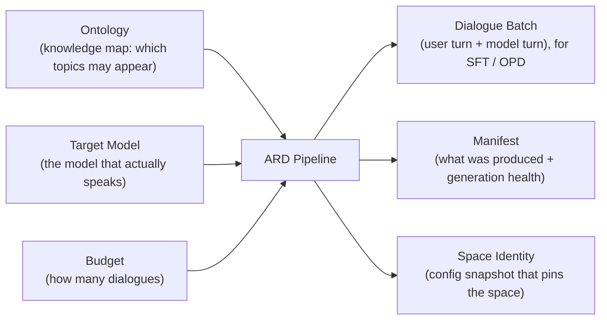
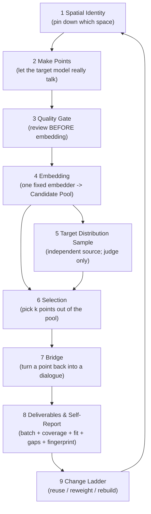
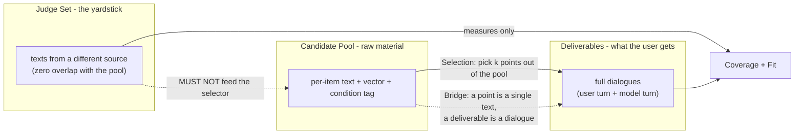

# ARD 算法原理

> **这份文档是什么**：ARD 的**宏观算法说明**——先一屏看懂"这个算法在做什么、输入输出是什么、经过哪九个环节"，
> 再逐步看**每一步到底做了哪些具体操作**（按顺序、能用大白话复述"先做什么、再做什么、产出什么"）。
> 文档里的每一条操作都能在 `src/ard/` 找到依据；每一步都标注了**今天到底有没有在跑**。
>
> **不在这份文档里的**：参数取值、配置写法、代码结构细节，以及**变量影响力测量的方法学**（口径之争、ICC、零分布、
> 置换检验……那一整套）。后者已整体移到 [`measurement-methods.md`](./measurement-methods.md)，本文只在 §4 留摘要与链接。
>
> **读法**：§1 一页纸全貌（含三张 Mermaid 图）→ §2 九步的具体操作（**本文主体**）→ §3 三条最容易做错的边界 →
> §4 与方法学文档的接口 → §5 术语表 → §6 仍未定的问题。
>
> **本文不用公式、不写参数取值。** 出现模块名/文件名的唯一场合是**标注实现状态**（§2.0 与每步的"实现状态"行），
> 那是为了让你能核对"这一步有没有真的在跑"，不是教你读代码。
>
> **定名以 [`architecture.md`](./architecture.md) §0.2 的定名表为准**：本文的**组合云**＝生产链路选点的对象；
> **候选池 / 文本池**＝通过复核的文本材料（池建流程与覆盖度评测）；**本文不出现"实验向量云"**（那是离线覆盖几何实验的集合）。

---

## 一、这个算法在做什么（一页纸；§1）

### 1.1 要解决的问题：为什么不能"把题出满"

我们要给模型造一批**训练对话**，希望这批对话在"模型能说出的通顺语言"里**铺得尽可能开**——不是每句话都长一个样。

**为什么不能"把题出满"**：题目方向由若干维度组合而成（哪门语言 × 哪个知识领域 × 哪类能力 × 什么对话形态 × 系统提示怎么给），
**组合数是乘积级增长的**，而每生成一条都要调一次模型。于是"每个条件至少一条"在数学上就不可达。

更根本的是：**模型能说出的通顺语言，严格大于"我们的条件能触达的范围"**——同一句话可以对应很多种条件组合，
而很多真实话语并不对应任何单一条件。

⇒ 所以这个算法**不追求"覆盖条件"**，它只追求两件事：

1. 在给定预算下，**让语言空间铺得尽可能开**；
2. **如实列出没铺到的地方**，绝不假装铺满了。

### 1.2 输入 → 输出：一张图看懂

| | 是什么 |
|---|---|
| **输入** | 一份知识地图（下文叫**本体**：可能出哪些方向的题）＋ 一个**目标模型**（真正把话说出来、也是下游要学的那个模型）＋ 一个生成预算 |
| **输出** | 一批**对话**（用户问 + 模型答），供监督微调（SFT）与在线策略蒸馏（OPD）使用；外加产物清单与空间身份 |
| **优化对象** | 这批对话在**目标模型能说出的全部通顺语言**里铺得有多开 |
| **不优化什么** | 条件本身的覆盖数量——条件只是"引子"，不是优化对象 |

> **动手之前先校验凭证**：目标模型与生成模型的**接口地址与模型名**是这条流水线唯一真正必需的外部输入。
> 它们缺失时，程序会**在创建任何输出目录之前**就停下，报一条**指明缺了哪个字段**的可读错误并非零退出——
> 也就是**什么都不会落盘**（不会留下半个空目录或一份空产物清单）。这条检查是**无条件**的，跟这次要不要真的生成无关。

### 1.3 九个环节的全景图

**一句话概括每个环节的职责**：

| # | 环节 | 一句话职责 |
|---|---|---|
| 1 | **空间身份** | 先钉死"我们在谈哪个空间"——模型、解码方式、提示族、本体、语言集合，任一项变了就是换了空间 |
| 2 | **造点** | 拿条件当引子，让目标模型**真的把话讲出来**；离散的"标签"到这里变成连续的"真话" |
| 3 | **质量门** | 复核要在**嵌入之前**做——没通过的文本不该占用后面任何一步 |
| 4 | **嵌入** | 用**同一个**嵌入器把文本变成向量，形成候选池；换嵌入器就是换空间 |
| 5 | **目标分布样本** | 准备"要被铺的那张网"——它与造池不同源，只拿来判分 |
| 6 | **选点** | 在池里挑出"最能代表整体"的一批点 |
| 7 | **桥** | 把"选中的点"变回**完整对话** |
| 8 | **交付与自证** | 交一批对话，同时报"铺得开"、"像不像模型自己说的话"、缺口清单与产物指纹 |
| 9 | **换配置判定** | 变更发生时，按"从便宜到贵"三级判断：复用池 → 重调权重 → 重建池 |

> **图是"设计链条"，不是"落地清单"**：上面九步是**算法设计**的完整链条；`src/ard/` 里今天真正在跑的是一条更短的生产管线
> （详见 §2.0 的状态表与 §2 每一步的"实现状态"行）。**看图不要当成"九步都在跑"。**

### 1.4 三个东西必须分清：候选池 / 交付物 / 判分集

算法链条上同时存在三样容易被混为一谈的东西。**它们的身份、用途、以及能不能反向影响选点，都不同**：

| | **候选池** | **交付物** | **判分集** |
|---|---|---|---|
| 是什么 | 通过复核的单条文本 + 向量 + 条件标签 | 完整对话（用户问 + 模型答） | 与造池不同源的文本 |
| 角色 | **材料**——越多越广越好 | **产物**——最终交给用户的东西 | **尺子**——只用来量 |
| 能不能进选点算法 | 它**就是**被选的对象 | 不参与选点 | **绝对不能**（否则判分被优化污染，见 §3.3） |
| 主要风险 | 被当成交付物直接发出去 | 只报覆盖率、不报贴合度 | 被认为"代表模型真正会说的话" |

---

## 二、算法每一步的具体操作（本文主体；§2）

> **本章写法**：每一步都写成一串**按顺序的操作**，让你能说出"这一步先做什么、再做什么、产出什么"。
> 每步末尾另有两行：**为什么必须这么做**、**做错会怎样**（各一句），以及**实现状态**。
> **今天还没实现**的步骤（第 3、5、7 步）写的是"**设计上这一步要做哪些操作** ＋ **今天实际没有这一步**"，绝不混写。

### 2.0 九步实现状态一览

**这张表是本章的诚实性要求——读者看完九步，能一眼分清"已实现"与"仅设计"。**
判据是：**该步骤能不能在 `src/ard/` 里找到承载它的模块或文件。**

| # | 步骤 | 实现状态 | 承载模块 / 未实现时的现状 |
|---|---|---|---|
| 1 | 空间身份 | ✅ **已实现** | `core/ontology.py`（本体加载）、`core/embeddings.py`（嵌入空间指纹＝嵌入器名:维度）、`core/cloud.py`（运行时空间/云身份校验）、`pipeline.py`（**动手前的凭证校验**、配置快照 `config.json`）、`config.py`（字段级错误 `ConfigError`）、`cli.py`（把错误打成一行可读信息并非零退出） |
| 2 | 造点 | ✅ **已实现** | `core/sampler.py`（抽样＋轮数分配）→ `domain/text_anchor.py`（并发逐条生成完整对话、失败即整条作废、背压冷却）→ `backends/api_client.py`（HTTP/SSE 流式/分层超时/重试） |
| 3 | 质量门（复核） | 🎨 **设计未实现** | **当前生产管线没有这一步**：生成即入库。`src/ard/` 里没有复核模型，也没有语言/格式/隐私/通顺的复核门。**只做了"消息形状"校验**（`domain/anchor_shape.py`：可选的单条 system 在首位、对话以 user 开头与结尾、角色严格交替）——那是**入库结构门**，不是质量复核 |
| 4 | 嵌入 | ⚠️ **部分实现** | 已实现的是**组合云**（首次出现处括注旧称"本体组合向量"；**定名以 `docs/architecture.md` §0.2 为准**）：由 `ontology/anchor_ontology_embeddings.json` 预生成（`scripts/generate_ontology_embeddings.py`），运行期由 `core/_fps.py` 校验并装载、`core/embeddings.py` 命名空间。**"把生成文本嵌入成候选池"这条链不在 `src/ard/`** |
| 5 | 目标分布样本（判分集） | 🎨 **设计未实现** | **当前生产管线没有判分集**：没有独立引出、没有零重叠校验、也没有贴合度度量 |
| 6 | 选点 | ⚠️ **已实现，但默认口径 ≠ 设计口径；设计口径在当前生产云上跑不通** | `core/cloud.py`（FPS：先把向量变成单位长度，再用余弦距离）＋ `core/_fps.py`（两层 FPS）＋ `core/sampler.py`。**接口里有两条规则**：默认仍是历史口径「挑最远的点」；「总空白」（求和口径）是可选参数、**未成为默认**，而且**当前生产云上"配得出、跑不通"**（余量填充那一步的云约 50,310 行 ⇒ 求和口径要一张约 18.9 GiB 的距离矩阵，超 1 GiB 预算被拒绝；见 §2.6） |
| 7 | 桥 | 🎨 **设计未实现** | **当前生产管线没有这一步**：文本是**直接按条件引子生成完整对话**（`domain/text_anchor.py`），不存在"先在池里选点、再把选中的点重新生成成对话"这条链 |
| 8 | 交付与自证 | ⚠️ **部分实现** | 交付：`domain/bank.py`（逐条增量写盘、三道出口门、断点续跑计数）＋ `pipeline.py`（`manifest.json`、脱敏 `config.json`）。**"覆盖半径 + 贴合度 + 缺口清单"没有接入生产**（`core/coverage.py` 存在且已测，但生产链零引用） |
| 9 | 换配置判定 | ⚠️ **部分实现** | 已有的是**可追溯与可续跑**：**动手前的凭证校验**、配置快照、产物清单、`generation.overwrite` 决定重建还是续跑、**嵌入空间/云身份在运行时强制"换空间即拒绝复用"**。**缺的是覆盖/贴合度判定**——没有它就无法回答阶梯里的"还适用吗"，所以今天实际只有"续跑 / 重建"两态 |

**一句话读法**：**已跑起来的是"造点 → 选点 → 落库"这条最短链路；而"前后两头"——前面的质量门与文本池、后面的判分集与自证——都还是设计。**
两个必须一起读的补充：① 这条最短链路的**"选点"选的是「组合云」**（本体组合向量的云），**不是**生成的文本（第 4、6 步的落点差异，见 §2.6）；
② 第 6 步虽然已实现，**默认仍在用被实测判为更差的那条规则**，"总空白"只是可选且在生产云上跑不通。

> **定名（一名一物，与 `docs/architecture.md` §0.2 对齐）**：本文第 4、6 步里**生产链路选点的那个对象**统一叫**组合云**；
> **候选池 / 文本池**专指"通过复核的文本 + 向量 + 条件标签"（池建流程与覆盖度评测，今天尚未接入生产）。
> **第三行「实验向量云」是离线覆盖几何实验里的集合**（属 `docs/architecture.md` 的读数语境），**本文不涉及**——本文只在定名说明里点到它，以免三个名字被混用。

> **结论句的复核**：本包逐文件核实后确认"**已跑起来的是『造点→选点→落库』这条最短链路**"**成立且需要加一句限定**——
> 三段都在跑，但它们不是一条连续的文本链：**造点**产出的是"完整对话"，**选点**选的是"**组合云**"里的组合，**落库**落的是前者；
> "选点"并不消费"造点"的产出。这不是结论被推翻，而是这条链路的真实接法。

### 2.1 第 1 步｜空间身份 —— 具体操作

**做什么**：先钉死一组**生成配置**——目标模型版本、解码参数（温度等）、系统提示族、本体、语言集合。这五样一起定义一个"通顺语言空间"。

**操作序列**：

1. **读配置**：CLI 要求显式给出配置文件路径；可选再叠加一份本地覆写配置，二者**深度合并**成唯一一份配置（字段校验在加载时完成，未知字段直接拒绝）。
2. **先校验凭证**（**在做任何事之前**）：检查生成模型与目标模型的**接口地址与模型名**是否都有值；缺了就**立刻停下**，报一条指明缺了哪个字段、该去哪张配置表里补的可读错误并非零退出。**这一步跑在创建输出目录之前**——配置不能用就什么也不落盘。另外，**"没有填密钥"是合法的**（很多本地服务不需要鉴权），空白的密钥会被归一成"未提供"，不会被当成一个空凭证发出去。
3. **把本体读进来**：按键值路径读 JSON 知识地图，得到语言、知识域、能力、对话形态、系统提示的取值清单（读不到文件就报错退出，不猜默认值）。
4. **确定目标模型与生成模型的身份**：两条 API 客户端的端点、模型名、解码参数分别来自配置留出的两个字段组（第 2 步已校验过的两个字段在这里被当成"一定存在"读走）；**生成模型那一侧的"思维模式"被代码钉死为关**（出题不需要思考，且思考会先吃掉输出预算）；**目标模型那一侧的思维模式由配置决定**。
5. **确定本次运行的随机种子**：配置里给了整数就用它，没给就**在配置加载时**从系统熵源抽一个（此后这一轮就固定用它）；**真正用到的那个种子会随配置快照落盘**，否则复现不了。
6. **把这个空间的指纹算出来**：从嵌入文件里读出**嵌入器名与向量维度**，拼成一个空间标识。任何距离计算之前，它先被算出来并携带在向量数据上。
7. **校验并装载嵌入**：对本体与嵌入文件做一套一致性校验（文件存在、JSON 合法、条目非空、维度统一、知识域两侧键完全一致、系统提示维度也有向量），任一项不过就报错。
8. **把空间指纹落盘**：把合并后的配置快照写进输出目录（**凭证字段先脱敏**），本次运行因此可以事后追溯"当时是在哪个空间里跑的"。
9. **运行时强制**：后续每一次向量运算都要求两侧空间标识一致；不一致就抛错，**不静默计算**。

**产出**：一份可追溯的配置快照 ＋ 一个贯穿全流程的空间标识。

**为什么必须这么做**：这五样里任何一样变了，空间就变了——之前建的池、选的点、测的覆盖都不能直接复用。不先声明空间，后面所有距离读数都无从解释。

**做错会怎样**：拿两个不同空间的向量一起算距离，读数看着正常、结论全错；或者用户改了模型却发现系统还在复用旧池，交付了一批"不是这个模型会说的话"。

**实现状态**：✅ 已实现。本体加载 `core/ontology.py`；**动手前的凭证校验与字段级错误** `config.py`、`pipeline.py`（在创建输出目录之前，`cli.py` 把它打成一行可读信息并非零退出）；空间指纹 `core/embeddings.py`；跨空间/跨云拒绝 `core/cloud.py`；配置快照与脱敏 `pipeline.py`。

### 2.2 第 2 步｜造点：给模型起头，让它真的把话讲出来 —— 具体操作

**做什么**：从本体条件里抽样，每个条件作为**引子**喂给目标模型，生成真实文本。今天它生成的不是"单条文本"，而是**完整对话**（用户轮 + 助手轮）。

**操作序列 A —— 先决定"生成哪些、以及每条生成多长"**：

1. **定抽样范围**：从本体取值清单里取本次允许的语言与能力集合（配置留空＝全用）；知识域、对话形态、系统提示取值来自本体本身。
2. **把全部条件组合枚举出来**：一个组合＝语言 × 知识域 × 能力 × 对话形态 × 系统提示（是否给、给什么风格）。数量是乘积级的。
3. **先给知识域排序**：对知识域的向量做一轮最远点采样，得到一个"多样性优先"的域顺序。
4. **把每个组合编码成一个向量**：六个槽位各取一个单位向量拼起来——域、能力、语言、对话形态、系统提示的"有无"、系统提示的"风格"；其中风格槽是**类别型**的（不同风格彼此正交），"无系统提示"被放在**远离所有风格**的方向上，这样"没有提示"与"有提示"才真的分得开。
5. **按域分配名额**：把目标条数尽量均分到排序后的域上，在**每个域自己的切片里**再跑一轮最远点采样，挑出该域的代表组合。
6. **补余量**：若均分后还差，就从**没被选中的剩余组合**里再做一轮全局最远点采样把差额补满；万一超了，随机裁掉多余条目。
7. **分配每条的对话轮数**：只在**奇数轮数**上分配（末轮必须是用户轮），把条数尽量均分到各档轮数，零头随机分给某几档。
8. **生成稳定锚点 ID**：把 5 个抽样维度按固定顺序拼串做哈希，得到锚点 ID。**同 ID 即同一条**——这是后面去重与续跑的依据。
9. **组出"生成规格"**：每条规格是一串交替的 user/assistant 轮次，末轮固定为 user，并带上它的条件元数据。
10. **（可选）挂图**：若本次给了图片目录，先扫描图片并抽样，再把图片按"单轮对话优先、每条最多挂若干轮"的规则塞进各条的**用户轮**，并给每条打上"有没有图、几张图"的标记。

**操作序列 B —— 再逐条真的生成（并发）**：

1. **开一个并发池**，把每条规格派给一个工作线程；同时起一个完成计数条。
2. **每条规格内部按轮次顺序生成**：
   - 若这条有条件要求系统提示，**先生成系统提示文本**（用生成模型，按该风格的要求并结合本条的领域与能力写），放在消息列表**最前面**；风格取值不在词表里就报错作废（那是抽样/本体的问题，不是模型的问题）。
   - **遇到用户轮**：把"到目前为止的对话历史"和本条条件拼成提示，让**生成模型**扮演提问方写出这条用户消息；有图就随这条消息一起带上。
   - **遇到助手轮**：把当前消息列表整体交给**目标模型**要一个助手回复，追加进历史。
   - 每一个模型调用都走同一套 HTTP 客户端：**SSE 流式读取**，连接、首字、字间三段超时分别计时；失败按配置重试（超时是否重试由开关决定，指数退避）；HTTP 层失败向上抛。
   - **每生成一轮，立刻核对"历史是不是正好前进了 1 条消息"**；不前进就说明有 bug，整条作废。
   - **任何一轮失败（超时、传输错误、空回复）都让整条锚点作废**——绝不允许"跳过这一轮"，因为跳过会留下两个连续同角色的消息。
3. **末轮（一定是用户轮）由目标模型回答**：先核对累积的角色序列与规格声明的一致，再请求；拿回**答案正文**与**思维链**两个独立字段（没思维链就是空值，不是空串），正文过短或过长都作废。
4. **每条成功后在消息列表上做两件收尾**：把内联的图片数据改写成**相对路径**形式（写盘用）；再从**实际存下来的消息**推导这条数据的路由标签（含图 ⇒ 多模态，否则 ⇒ 纯文本）——路由标签看记录本身，不看本次运行开了什么开关。
5. **落库**：把这条锚点转成一行 JSON 追加进锚点库，逐条刷盘。写入前过三道**出口门**：消息形状校验、路由标签词表校验、锚点 ID 唯一性校验；任一不过就**拒收并计数**，不写。
6. **收集端做背压**：连续出现"服务器不稳定"类失败（超时、传输错误）达到阈值就**暂停一段时间**让服务端排空队列，然后计数清零；"模型输出不可用"类失败只计数、**不暂停**（同样的提示重试还是一样失败，睡觉没用）。
7. **全程计数并公布**：请求数、成功数、按原因分类的作废数、写入数、各类拒收数、背压次数；目标模型的"思维占满预算导致答案为空"也单独计数。这些数字最后写进产物清单。
8. **收尾**：达到目标条数就停止提交剩余任务，关闭线程池，打印汇总。

**产出**：一批**完整对话**（逐条追加进锚点库），外加一份生成健康计数。

**为什么必须这么做**：这一步把**离散的"条件"映射到连续的"语言"**——从标签变成真话。也正因如此，**"点从哪里来"比"用哪个选点算法"重要得多**（已有实测：池的分布差异带来的覆盖差，远大于不同选点算法带来的差）；真实文本的内在维度也远高于条件编码空间，所以**这个空间才值得优化**。

**做错会怎样**：条件抽样偏了，池就偏了——后面再精巧的选点也只是在偏掉的池里挑，覆盖结论从根上不成立。

**实现状态**：✅ 已实现。抽样与轮数分配 `core/sampler.py`；逐条并发生成 `domain/text_anchor.py`；HTTP/流式/重试 `backends/api_client.py`；图片 `domain/image_store.py` ＋ `core/quota.py`。

### 2.3 第 3 步｜质量门（复核） —— 具体操作

**做什么**：生成的候选**不能直接进池**，必须先复核；**复核必须在嵌入之前做**。分工原则是——**能用确定性方法判的不要用大模型，只有真正需要判断力的才交给复核大模型**。

**设计上这一步要做哪些操作**（**今天尚未实现**）：

1. **确定性判据先跑**（便宜、可复现、有明确答案）：
   - 用语言识别确认"这条文本真的是它声称的那门语言"；
   - 用规则校验格式与结构是否合规；
   - 用规则扫描＋人工清单查隐私与敏感信息。
2. **判断性判据交给复核大模型**（只有这一类需要判断力）：通顺、有意义、有没有真的答上问题。
3. **只让通过全部判据的文本进入下一步**；未通过的在**嵌入之前**就被拦下。
4. **记录复核模型身份**，写进产物指纹：换复核模型 ⇒ 通过与否改变 ⇒ 池的构成改变。
5. **复核调用量与候选数同阶**，在成本估算里显式列出（这是生成之外的第二大成本项）。

**今天实际没有这一步**：当前生产管线**生成后直接落库**。代码里唯一相关的是 `domain/anchor_shape.py` 的**消息形状校验**（可选的单条 system 在首位、对话以 user 开头与结尾、角色严格交替）——那是**入库结构门**，任何一条复核判据（语言、格式、隐私、通顺）都还没实现，复核模型也没有。

**为什么必须这么做**：三类判据有明确的确定性答案，交给大模型只会**同时**推高成本、降低可复现性（模型判决有随机性），还引入不必要的依赖；而"通顺、有意义、真答上了"这类判断，正则表达式兜不住，只能由模型判。另外，复核模型**与出题答题的目标模型不是同一个**，它承担的是"判决"角色，建议用能力更强的模型。

**做错会怎样**：把该判的交给正则，脏数据进池，覆盖读数是给垃圾打的；把复核放在嵌入之后，没通过的文本已经占用了后续算力与指纹；**换了复核模型却不记身份**，池的构成会静默改变，两期数据被当成一期用。

**实现状态**：🎨 设计未实现（只有入库结构门 `domain/anchor_shape.py`）。

### 2.4 第 4 步｜把点放进同一个空间（嵌入） —— 具体操作

**做什么**：用一个**固定**的嵌入器，把所有通过复核的文本变成向量，形成**候选池**。

**设计上这一步要做哪些操作**：

1. **固定嵌入器**，并把它的身份（嵌入器名＋维度）记成空间指纹——换嵌入器即换空间。
2. **逐条把文本嵌入成向量**，向量与文本、条件标签一一对应，组成候选池。
3. **没有池就没有选点**：选点的输入是池，池越大越广越好。
4. **池里的条目是单条文本，不是对话**——它是材料，交付时还要经过"桥"（第 7 步）。

**今天实际跑的是另一件事**：`src/ard/` 里已实现的是**组合云**（旧称"本体组合向量"）——由离线脚本预生成、随本体一起发布的各维度向量（域、能力、语言、对话形态、系统提示）；运行期由 `core/_fps.py` 校验并装载，六个槽位拼成组合向量，供第 6 步的选点使用。**"把生成出来的文本嵌入成候选池"这条链不在 `src/ard/`**——所以今天**不存在文本候选池**，第 3、5、7 步也就无从执行。

**为什么必须这么做**：同一个空间里向量才能相减、才能谈距离。而且造池成本几乎全在第 2 步的生成上，嵌入是分钟级——**离线一次、可反复摊销**，所以"重建"省不掉"重新生成"。

**做错会怎样**：换嵌入器而不记录，等于悄悄换了坐标系，之前所有距离读数作废；把池当成最终交付物，就会交付一批"单条文本"而不是对话（见 §3.2）。

**实现状态**：⚠️ 部分实现（组合云已实现；生成文本的嵌入链未实现）。

### 2.5 第 5 步｜确定"要铺满的那张网"（目标分布样本） —— 具体操作

**做什么**：准备一批代表"模型自己会说什么"的文本，作为度量"铺得开"时的**被铺对象**。

**设计上这一步要做哪些操作**（**今天尚未实现**）：

1. **选一种"不与我们造池同源"的来源**：外部语料（本来就不是我们生成的文本）／零槽位中性引出（不带本体槽位的自由提问）／换措辞的消融引出。
2. **按该来源引出一批文本**，只用来判分，**绝不参与选点**。
3. **做零重叠校验**：判分集与候选池的文本不得重复。
4. **度量两个量**：覆盖半径（铺得开不开）与贴合度（像不像模型自己说的话）。
5. **把宣称范围写清**：它代表"**我们定义的那批话**"，**不代表"模型真正会说的话"**（见 §3.3）。

**今天实际没有这一步**：当前生产管线**没有判分集**——没有独立引出、没有零重叠校验、也没有贴合度度量。

**为什么必须这么做**：要度量覆盖，必须先有一个被覆盖的对象；而且它必须**独立于造池过程**（不同的引出方式、零文本重叠），否则我们只是在给自己出的题打分。

**做错会怎样**：判分样本与造池同源，覆盖率就会系统性乐观——"覆盖得好"可能只是"覆盖了我们自己造的东西"（见 §3.3）。另外它**只做判分，不参与选点**：一旦喂给选点算法，判分就被优化污染了。

**实现状态**：🎨 设计未实现。

### 2.6 第 6 步｜选点：总空白准则（逐点贪心） —— 具体操作

**做什么**：每一步，在候选池里挑**"加上它之后，全体目标点到最近锚点的距离总和降得最多"**的那一个点。

**操作序列**：

1. **准备一个向量云**：把待选的向量组织成"云"——它自带两个身份（**空间标识**：这批向量出自哪个嵌入空间；**云标识**：这批行是哪一批行）。行号只在它自己的云里有意义。
2. **选第一个点**：用固定种子的随机数从云里抽一行作为起点。
3. **把每行都变成单位长度**（余弦距离的前提；零向量有兜底），然后计算每一行到"已选集合"的**最近距离**。
4. **逐点贪心**，直到选够 k 个：
   - **默认规则「挑最远的点」**：在尚未选中的行里，取"到已选集合最近距离最大"的那一行。它只需要维护一列"最近距离"，不需要距离矩阵。
   - **可选规则「总空白」**：先物化整张两两距离矩阵，再为每一候选行算"**全体行到『已选集合 ∪ 这个候选』的最近距离之和**"，取**和最小**的那一行——也就是"剩下没铺到的地方最少"的那一行。为了避免再开一张大矩阵，求和是分块进行的，瞬时占用固定。
   - 两种规则都**在选完之后更新最近距离列**，进入下一轮。
5. **规模边界**：求和规则必须物化距离矩阵，所以有一个内存预算；**超过预算直接报错拒绝，绝不静默降级到另一条规则**（这个报错今天在生产云上真的会发生，见下）。
6. **返回带标签的选择**：返回的不是一串裸行号，而是"带云标识的选择"，**行号无法被误用到另一个云上**；把选择应用回原云时，若云/空间对不上就抛错。
7. **在生产管线里的实际调用顺序**：先对**知识域向量云**做一轮（把全部域排序）；再对**每个域的组合切片**做一轮（域内名额）；最后对**剩余组合**做一轮（补余量）。**第一轮（知识域排序）固定用默认规则**——它只是对全部域做重排，在这里换规则会同时移动两个变量；可选规则只作用于后两轮（域内与余量填充）。

**今天必须一起读的两条限制**：

- **默认口径 ≠ 本节口径**：接口里的默认仍是历史口径「挑最远的点」（它复现所有历史发布，逐字节一致）；**「总空白」只是可选参数，尚未成为默认**。
- **"总空白"今天在生产云上"配得出、跑不通"**：余量填充那一步的云约 50,310 行，求和口径需要一张约 18.9 GiB 的距离矩阵，**超过 1 GiB 预算 ⇒ 被 `ValueError` 拒绝**（报错正发生在余量填充处；域内选点已完成）。配置校验能过、域内选点也支持，但几乎所有规模都会在余量填充退出。**默认路径不受影响。**
  ⇒ **不得读成"把配置改成总空白就能拿到更好的覆盖"。** 公开表述以 `docs/architecture.md` §4.7 为准。

**产出**：被选中的组合（今天）／被选中的池条目（设计上）。

**为什么必须这么做**：**"挑最远的那一个点"实测输给同池随机**——它被单个孤立点支配；而"总空白"照顾整体分布：目标空间密度不均匀，它天然把力气花在稀疏区。它还有理论保证：该目标单调且次模，贪心可给出接近最优的保证，且"加点覆盖只可能变好"是结构性的，不依赖运气。
⚠️ **但这条优点目前只在"域内选点"与"小品云"上讲得通**——它不能被读成"今天改用总空白就能拿到更好的覆盖"。

**做错会怎样**：用"挑最远"的规则，选出来的点被一两个离群点牵着走，覆盖反而比随机更差——**而且这种差法不会报错，只会安静地给出更差的交付物**。

**实现状态**：⚠️ 已实现（默认口径 ≠ 设计口径；设计口径在生产云上被规模预算拒绝）。承载：`core/cloud.py`、`core/_fps.py`、`core/sampler.py`。

### 2.7 第 7 步｜把选出来的点变回对话（桥） —— 具体操作

**做什么**：以**被选中条目对应的条件**作引子骨架，以**该条目的正文**作**目标语义锚**（告诉生成器"要往这个意思上写"），重新生成**完整对话**（用户问 + 模型答，按需要的轮数）。

**设计上这一步要做哪些操作**（**今天尚未实现**）：

1. 取出被选中条目：它的条件 + 它的正文。
2. 用条件拼引子骨架，用正文作语义锚，写进给生成器的提示。
3. 按需要的轮数**重新生成完整对话**，末轮固定为用户轮。
4. **测量桥引入的语义漂移**并如实报告，否则覆盖报告会系统性乐观。

**今天实际没有这一步**：当前生产管线里，文本是**按条件引子直接生成完整对话**——用户轮由生成模型写、助手轮由目标模型写、末轮固定为用户轮；**不存在"先在池里选点、再把选中的点重新生成成对话"这条链**。因此本节警告的**桥漂移目前无从测量**。

**为什么必须这么做**：选点是在池上做的，而**交付物是对话**；池里的条目只是单条文本，不构成对话，不能直接当锚点交付。

**做错会怎样**：⚠️ **这是算法链条上最薄的一环**——池里的向量只保证"材料文本"在空间里的位置，**不保证重新生成的对话落回同一个位置**。这个漂移若不被测量并报告，覆盖报告会系统性乐观。

**实现状态**：🎨 设计未实现。

### 2.8 第 8 步｜交付与自证 —— 具体操作

**做什么**：交付**一批对话**，同时给出三样东西——**覆盖半径**（铺得开不开）与**与目标分布的贴合度**（像不像模型自己说的话）**两个量并报**；**缺口清单**（哪些取值/条件没被覆盖到、占比多少）；**产物指纹**（空间身份五项 + 复核模型身份 + 生成器身份 + 种子）。

**操作序列（今天真正在跑的交付部分）**：

1. **逐条写盘**：生成成功一条就追加一行 JSON，**写完立刻刷盘**——中断只丢正在写的那一条，已提交的可续跑。
2. **写盘前过三道出口门**（与第 2 步的操作 5 是同一处）：
   - **消息形状**：可选的单条 system 在首位，对话以 user 开头与结尾，角色严格交替；不合格拒收。
   - **路由标签词表**：记录的路由标签必须在允许集合内；不在就拒收（否则下游没有消费者会取到这条记录）。
   - **锚点 ID 唯一**：同一 ID 只写一次；重复的跳过并计数。
3. **每条记录带上可追溯字段**：锚点 ID、来源、路由标签、格式版本、消息列表、目标输出（**答案正文与思维链分开存**，没思维链写空值）、条件元数据、出题模型、目标模型。
4. **写完之后读回全库**，按维度清点：知识域、语言、能力、系统提示模式、路由标签各有多少条——这是"交了多少、覆盖了哪些取值"。
5. **写产物清单**：总条数、各维度清点、输出目录、脱敏后的配置快照，外加**本次运行的健康计数**（请求/成功/作废/拒收/背压/思维占预算）。**计数为零的条目会被丢掉**，所以健康的一轮不产生噪音，不健康的一轮也不会被误读成健康。
6. **把配置快照脱敏后一并落盘**（凭证字段替换成掩码并告警），让输出目录可以安全地被分享与打包。

**尚未接入生产的部分**：**"覆盖半径 + 贴合度 + 缺口清单"没有接入生产**。`core/coverage.py` 已存在（能算最大/平均/中位/九十分位/九十五分位半径，且强制空间一致），但**生产链对它零引用**，只有测试在用它。

**为什么必须这么做**：只报覆盖率是误导——铺得很开但不像模型会说的话，等于造了一批模型学不到的东西；缺口清单是把"没铺到"如实交账；指纹是让这批产物可追溯、可复现。

**做错会怎样**：读者以为已经"覆盖了模型真正会说的话"；或者两批数据被混算成一期；或者事后无法判断"这批结果对应哪次配置"。

**实现状态**：⚠️ 部分实现（交付与清单已实现；覆盖/贴合度/缺口清单未接入生产）。承载：`domain/bank.py`、`pipeline.py`。

### 2.9 第 9 步｜换配置时怎么判定（阶梯） —— 具体操作

**做什么**：变更发生时，按**从便宜到贵**三级判断——① **还适用吗？** 在既有池上重选点（零生成调用），看覆盖与贴合度是否仍达标；② **重调权重**：改变引子的抽样偏好，仍复用池；③ **重建池**：只有当上面两级都不够时，才重新花生成预算。

**操作序列（今天真正在跑的"可追溯 + 可续跑"部分）**：

1. **读配置**：先算出本次的配置（含输出目录）与随机种子。
2. **先校验凭证**（与第 1 步同一条纪律）：**在创建任何输出目录之前**检查端点与模型名是否齐备，缺了就直接非零退出。
   ⇒ **一个已知的、有意的行为**：即使锚点库已经装满、"这次什么都不用生成"，缺凭证也会被拒——它是"动手之前先校验"的代价，换来的是**任何失败都不留下半成品目录**。
3. **决定重建还是续跑**：若输出目录里已有锚点库，且配置选择了"覆盖"，就把旧库删掉，从零开始；否则**读回旧库，逐行解析计数**（解析不了的行跳过并告警，不计入条数）。
4. **算还差多少**：目标条数减去已有条数；若已经够了，就**只重建产物清单然后直接返回**——不生成、不调用模型（这是阶梯里最便宜的一级）。注意：这条路径**不会覆盖上一轮的运行计数**，避免"什么都没跑"被写成一个健康的样子。
5. **只生成差额**：把"还差多少"作为本次生成预算，其余配置照旧，进入第 2 步的生成流程。
6. **写入前的身份闸门**：向量云在运行时强制校验空间与云的身份（不同空间/不同云的行号不能互相套用）；空间指纹一变，旧池**不会被静默复用**，而是直接拒绝。
7. **落盘身份与清单**：写下配置快照与产物清单，让下一次运行能判断"上次是在哪个空间、用哪套配置跑的"。

**尚未实现的部分**：**缺的是覆盖与贴合度判定**——没有它就无法回答阶梯第一级"还适用吗"，所以今天实际只有"**续跑 / 重建**"两态，"重调权重"一级也没有落地入口。

**为什么必须这么做**：**成本几乎全在生成**——这个阶梯是成本控制的核心机制。

**做错会怎样**：一有改动就重建池，把最贵的一步当成默认动作；或者反过来，空间身份已经变了还在复用旧池，交付物与声称的空间对不上。

**实现状态**：⚠️ 部分实现（可追溯与可续跑已实现；覆盖/贴合度判定未实现）。承载：`pipeline.py`、`domain/bank.py`、`core/cloud.py`。

---

## 三、三条最容易做错的边界（§3）

### 3.1 边界一：哪些东西是"空间里的坐标"，哪些是"空间的定义"

本体里的取值分两类，**绝不能混入同一个组合**：

| 类别 | 例子 | 性质 | 进不进组合 |
|---|---|---|---|
| **空间内的坐标** | 语言、知识域、能力、对话形态、系统提示**模式** | 决定"在固定分布里落在哪" | ✅ 进 |
| **空间的定义** | 解码参数（温度等）、系统提示**族**、模型版本 | 决定"分布本身长什么样" | ❌ 不进，进**空间身份** |
| **对话轮数** | 轮数上限 | 决定"一条对话有多长"，是每条产物的属性 | ❌ 不进组合，按锚点分配 |

**为什么不能把温度这类东西放进组合**：

- 温度不提供"语义方向上的多样性"，它只是把同一分布**摊平或收尖**。把温度当组合维度，等于用"扰动强度"冒充"内容多样性"；
- 一旦温度是组合维度，同一个条件在不同温度下产出**不同分布**——那么"覆盖"到底是在覆盖哪个温度的分布？**覆盖的定义会崩**；
- 温度/系统提示族/模型版本一变，**整个空间就换了**（已经明写在空间身份里）。

### 3.2 边界二：池不是对话，选点与交付之间必须有桥

- 池里的条目是**单条文本**（只有助手侧内容），**不构成对话**；交付物要求是**对话**；
- 因此"选中池条目"不能直接交付，必须经第 7 步的桥**重新生成对话**；
- 桥引入的**语义漂移必须被测量**（第 7 步的警告）。

### 3.3 边界三：独立评估原理上做不成，只能宣称覆盖我们定义的那批话

**结论：目标总体（"目标模型能说出的全部通顺语言"）不可枚举、不可观测，因此"用独立样本自证覆盖了模型真正会说的话"原理上做不成。能做的是把宣称范围收缩到"我们定义的那批话"，并把可选替身的作用与局限如实标注。**

- **为什么做不成**：任何一批用于判分的文本，都必须由某一个**引出模板**产生；模板一旦由我们选定，样本就只代表"这个模板能引出的那批话"，而不是目标总体本身。换措辞、换抽样规则，读数就可能变——所以"独立"只能是**相对于造池过程**的不同源，不可能**相对于目标总体**独立。
- **收缩后的宣称**：不再宣称"覆盖了模型真正会说的话"，只宣称"**覆盖了我们定义的那批话**"，并把那个定义（引出模板及其哈希）当作被管理、被版本化的产物——改模板即换一期测量，两期不能混算。
- **可选的替身（按独立性从高到低，择一或并用，取舍显式交给用户）**：
  1. **外部语料**：本来就不是我们生成的文本（公开语料 / 真实用户输入）。独立性最高、最便宜，风险是与目标模型的实际输出分布有偏差——这个偏差本身可测。
  2. **零槽位引出**：用一套**不带本体槽位**的中性引出语，让目标模型自由说。它不受我们的条件污染，但引出语仍是我们的；必须版本化并留哈希。
  3. **措辞消融**：另造一条同样零槽位、但措辞不同的引出语。若两者给出的读数差异超过事先冻结的阈值，则宣布本次测量**对措辞敏感**：两个读数都报，且**不得据此驱动任何权重改动**。
- **明令**：**不得**用"在我们自己的设计下留出的那批文本"去证明"覆盖了模型真正会说的话"。这种同源留出只能测"采样器实现与设计意图的保真度"，测不了"设计意图是否等于目标总体"。
- **代价必须认账**：收缩宣称范围是**降级**，不是等价替换。替身只能把偏差显式暴露出来，不能把不可观测的总体变成可观测的。
- **两条配套决策（今天的取舍）**：判分集**只判分、不参与选点**；若某期跳过判分集，算法仍能跑，但只能宣称覆盖了我们的设计意图，**这个取舍应当显式交给用户**。

---

## 四、与测量方法学的接口（§4）

**变量影响力测量**（哪个变量真的在移动语言空间、下一份预算该花在哪）已整体移到独立文档，这里只留结论要点：

1. 在花大预算之前，先做一次小规模测量；**这次生成同时就是候选池材料**，不必单独造数据。
2. 正式口径是**未归一化（arithmetic）**，理由有三条实测：它对重复次数逐位不变、归一化随重复次数显著变化且不可外推、归一化会不成比例地放大弱效应从而扭曲变量排序。
3. **位移与散布必须并报**；在"每格样本量很大"的场景下这个比值会**退化成常数**，那时必须改用**方差分解的平方和占比**，并且**只能与各自的置换零分布比，不能与 0 比**。
4. **每格 3 次名义重复只值约 1.84 条独立观测**，所以主扫每格 1 次；要提精度靠"锚定格带"，不是靠加重复。
5. 可分辨性**必须相对"该装置各自的零分布"定义**，不存在单一灵敏度下限；未超零分布的轴只能报"在本设计检验力下不可分辨"。

⇒ 全部读数、口径、纪律、出处见 **[`measurement-methods.md`](./measurement-methods.md)**。

---

## 五、术语表（精简到读者真正会遇到的；§5）

| 术语 | 含义 |
|---|---|
| **本体 / 知识地图** | 定义"可能出哪些方向的题"的数据文件 |
| **条件 / 组合** | 本体若干取值的一个组合，充当生成引子 |
| **引子** | 喂给模型的、由条件构成的提问模板 |
| **文本点** | 模型按引子真的说出来的文本，可嵌入 |
| **候选池** | 通过复核的文本点集合（含文本 + 向量 + 条件标签）；它是**材料**，不是交付物。**今天尚未接入生产** |
| **目标分布样本 / 判分集** | 与造池不同源、用来判分的文本集合；**它代表"我们定义的那批话"，不代表"模型真正会说的话"**。**今天尚未接入生产** |
| **空间身份** | 定义一个语言空间的固定配置组合（模型版本 / 解码参数 / 系统提示族 / 本体 / 语言集合） |
| **空间指纹** | 嵌入器的名字与维度拼成的标识；两侧指纹不一致时禁止做距离计算 |
| **锚点 / 锚点 ID** | 被选中（或生成）的那一条；ID 由 5 个抽样维度哈希得到，是去重与续跑的依据 |
| **总空白准则** | 逐点贪心：每步选"能让全体目标点到最近锚点距离总和降最多"的点（也称求和口径）。**生产接口里是可选项、默认未启用；且当前生产云上"配得出、跑不通"**（余量填充云约 50,310 行，超距离矩阵预算被拒） |
| **覆盖半径** | 目标点到最近锚点的距离（越小越好）。**主指标用平均半径与 95 分位半径，禁用最大值半径**。**尚未接入生产交付** |
| **贴合度** | 交付集的分布与目标分布的接近程度。**尚未接入生产交付** |
| **桥** | 把"选中的池条目"变成"完整对话"的那一步。**仅设计，当前生产管线没有这一步** |
| **产物指纹** | 空间身份五项 + 复核模型身份 + 生成器身份 + 种子的集合，随产物一起冻结 |
| **复核大模型** | 承担判断性复核的模型，与出题答题的目标模型不是同一个。**今天尚未接入** |

---

## 六、仍未定的问题（精简；§6）

| # | 问题 | 状态 |
|---|---|---|
| Q1 | 空间定义项（模型版本、解码参数、系统提示族、语言集合）要不要"下沉"进本体统一管理？ | **待定**。可以"记在"本体里，不能"混进"组合里；真正省心的来源是把空间身份检查自动化，而不是把它混进组合 |
| Q2 | 复核的具体分工与预算：哪些判据只能交给复核大模型？复核强度（每条/抽样/只查可疑）怎么权衡？ | **待定** |
| Q3 | 判分集的来源：外部语料 / 零槽位引出 / 措辞消融，选哪一种、各花多少预算？ | **部分已定**：替身只能是"相对于造池不同源"；选哪种待定 |
| Q4 | 交付规模的判据："这一批对话够不够"该用什么判据？ | **待定**。项目已明确承认**覆盖几何改善 ≠ 训练效果改善** |
| Q5 | 桥的语义漂移在什么量级？漂移大时选点结果是否需要修正？ | **待定**（桥未实现，无从测量） |
| Q6 | 系统提示"模式"进组合、"族"进空间身份——这个切法是否合理？ | **待定**（目前按此切法实现） |
| Q7 | 中心定义与每格重复次数怎么定？ | ✅ **已定**（见 [`measurement-methods.md`](./measurement-methods.md) §5、§8）：未归一化为正式口径；主扫每格 1 次、精度靠锚定格带 |
