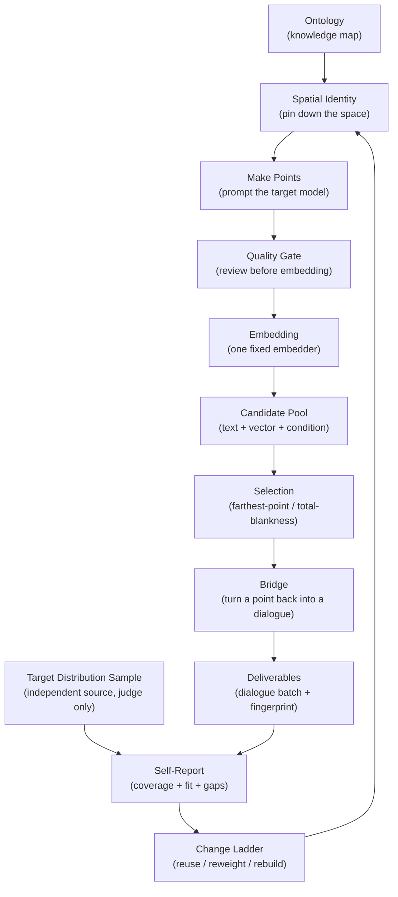
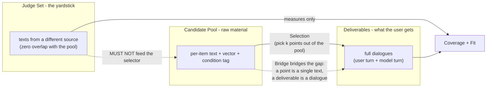

# ARD 算法原理

> **这份文档是什么**：ARD 的**算法级**说明——只讲"算法要做什么、为什么这么做、做错会怎样"，不涉及参数取值、配置写法与代码结构。
>
> **读法**：第一章"整体逻辑一页纸"一屏看懂全貌（含端到端流程图）；第二章讲"动手之前先测什么"；第三章是九个步骤，每步统一三句话；第四章是三条最容易做错的边界；第五章是问题的现状（哪些已由实测确认、哪些还没定）；第六章是几个已讨论问题的留档；第七章是术语约定。
>
> **本文不用公式、不写参数取值、不展开实现细节。** 只有在**标注实现状态**时才出现模块名/文件名（§3.0 与九步各自的"实现状态"行）——那是为了让你能核对"这一步有没有真的在跑"，不是教你读代码。所有"实测"都能在 `.local/hb-workspace/` 的工位证据里找到原始读数（见 §2.12）。

---

## 一、整体逻辑一页纸

### 1.1 这个算法要解决什么问题

我们要给模型造一批**训练对话**，希望这批对话在"模型能说出的通顺语言"里**铺得尽可能开**——不是每句话都长一个样。

**为什么不能"把题出满"**：题目方向由若干维度组合而成（哪门语言 × 哪个知识领域 × 哪类能力 × 什么对话形态 × 系统提示怎么给），**组合数是乘积级增长的**，而每生成一条都要调一次模型。于是"每个条件至少一条"在数学上就不可达。

更根本的是：**模型能说出的通顺语言，严格大于"我们的条件能触达的范围"**——同一句话可以对应很多种条件组合，而很多真实话语并不对应任何单一条件。

⇒ 所以这个算法**不追求"覆盖条件"**，它只追求两件事：

1. 在给定预算下，**让语言空间铺得尽可能开**；
2. **如实列出没铺到的地方**，绝不假装铺满了。

### 1.2 输入、输出、要优化的量

| | 是什么 |
|---|---|
| **输入** | 一份知识地图（下文叫**本体**：可能出哪些方向的题）＋ 一个**目标模型**（真正把话说出来、也是下游要学的那个模型） |
| **输出** | 一批**对话**（用户问 + 模型答），供监督微调（SFT）与在线策略蒸馏（OPD）使用 |
| **优化对象** | 这批对话在**目标模型能说出的全部通顺语言**里铺得有多开 |
| **不优化什么** | 条件本身的覆盖数量——条件只是"引子"，不是优化对象 |

### 1.3 从输入到输出的大环节（端到端）

**一句话概括每个大环节的职责**：

| 环节 | 一句话职责 |
|---|---|
| **空间身份** | 先钉死"我们在谈哪个空间"——模型、解码方式、提示族、本体、语言集合，任一项变了就是换了空间 |
| **造点** | 拿条件当引子，让目标模型**真的把话讲出来**；离散的"标签"到这里变成连续的"真话" |
| **质量门** | 复核要在**嵌入之前**做——没通过的文本不该占用后面任何一步 |
| **嵌入** | 用**同一个**嵌入器把文本变成向量；换嵌入器就是换空间 |
| **候选池** | 通过复核的文本集合，是**材料**，不是交付物（池里是单条文本，不构成对话） |
| **选点** | 在池里挑出"最能代表整体"的一批点——池越大越好，选点只是从材料里挑 |
| **桥** | 把"选中的点"变回**完整对话**——这是全链条最薄的一环（见 §3 第 7 步） |
| **交付与自证** | 交一批对话，同时报"铺得开"和"像不像模型自己说的话"，外加缺口清单与产物指纹 |
| **换配置判定** | 变更发生时，按"从便宜到贵"三级判断：复用池 → 重调权重 → 重建池 |

> **两条链的关系（重要，避免误读）**：上面的九步是**算法设计**的完整链条。当前 `src/ard/` 里落地的生产管线走的是另一个更短的口径——选点在**本体组合云**上做（两层最远点采样），文本是**直接生成完整对话**；**"质量门（复核）"与"桥"这两步都没有对应实现**，判分集与文本池也尚未接入（"候选池 / 判分集"这条链在架构上属于**池建流程**，见 `docs/architecture.md` §1.3 的两层结构）。**每一步的实现状态统一列在 §3.0 那张表里**，本章不再重复两份说法。

### 1.4 三个东西必须分清：候选池 / 交付物 / 判分集

算法链条上同时存在三样容易被混为一谈的东西。**它们的身份、用途、以及能不能反向影响选点，都不同**：

| | **候选池** | **交付物** | **判分集** |
|---|---|---|---|
| 是什么 | 通过复核的单条文本 + 向量 + 条件标签 | 完整对话（用户问 + 模型答） | 与造池不同源的文本 |
| 角色 | **材料**——越多越广越好 | **产物**——最终交给用户的东西 | **尺子**——只用来量 |
| 能不能进选点算法 | 它**就是**被选的对象 | 不参与选点 | **绝对不能**（否则判分被优化污染，见 §6.3） |
| 主要风险 | 被当成交付物直接发出去（见 §4.2） | 只报覆盖率、不报贴合度 | 被认为"代表模型真正会说的话"（见 §4.3） |

### 1.5 九步一览

**状态图例**：✅ 已实现 ｜ ⚠️ 部分实现 ｜ ❌ 尚未实现（判据与逐项依据统一见 **§3.0**）。

| # | 步骤 | 一句话 | 状态 |
|---|---|---|---|
| 1 | 空间身份 | 先声明"这是谁的空间"，并记进产物指纹 | ✅ |
| 2 | 造点 | 用条件当引子，让目标模型真的说话 | ✅ |
| 3 | 质量门 | 先复核再嵌入；能用确定性方法判的别用大模型 | ❌ |
| 4 | 嵌入 | 固定一个嵌入器，把通过的文本变成向量，形成候选池 | ⚠️ |
| 5 | 目标分布样本 | 准备"要被铺的那张网"——它与造池不同源，只拿来判分 | ❌ |
| 6 | 选点 | 逐点贪心：每步挑"能让全体目标点到最近锚点的距离总和降最多"的点 | ✅（默认口径不同） |
| 7 | 桥 | 把选中的点重新生成为完整对话 | ❌ |
| 8 | 交付与自证 | 交付对话 + 覆盖 + 贴合度 + 缺口清单 + 产物指纹 | ⚠️ |
| 9 | 换配置判定 | 复用池 → 重调权重 → 重建池，从便宜到贵 | ⚠️ |

> **看图须知**：本章两张流程图是**算法设计**的链条，**不代表每一步都已落地**——落地情况只看上表与 §3.0。图由 Mermaid 源码写成，结构经程序化校验（节点与箭头的括号、引号、端点配对），并**已用官方 `mermaid@12` 的 `parse()` 解析验证通过**（由本项目的复审与文档工作包**各自独立复跑**；本工位所在机器无网络、无本地渲染器，因此未由本工位自行渲染）。

---

## 二、变量与影响力测量（先测再采）

> **本章结论**：在花大预算生成之前，先用一次小规模测量回答"哪个变量真的在移动语言空间"。要点是：把定义争论换成可测量的问题；把"随机波动"与"多样性"分开量；用组间位移与组内散布的比值作无量纲的影响力；并用一条已知应当更分离的对照轴证明方法本身有效。
>
> **中心定义已裁定（用户裁决）**：正式口径是**未归一化（arithmetic）**。理由与实测见 §2.5。

### 2.1 为什么要"先测再采"

**结论：把"某个配置算不算空间的一部分"这个定义争论，换成一个可测量的问题——"改这个变量，在语言空间里跑多远"。**

- "温度算不算空间的一个维度""系统提示族算不算坐标"，这类问题在定义层面可以永远争下去，因为它取决于怎么措辞。
- 换一种问法就有答案：**固定住其他变量，只动这一个，看它把语言空间里的点移动了多远。** 移动得远 ⇒ 它是空间里的坐标；移动得与随机波动差不多 ⇒ 它只是扰动。这是实测能回答的，不是措辞能回答的。

### 2.2 变量分层：一张表管坐标与旋钮

**结论：内容坐标与全局旋钮都进同一张影响力表；池级元数据不进表，只记入产物指纹。**

| 层 | 例子 | 进不进影响力表 |
|---|---|---|
| **内容坐标** | 语言、知识域、能力、对话形态、系统提示模式 | ✅ 进 |
| **全局旋钮** | 温度、系统提示族 | ✅ 进（与坐标同一张表，可直接比大小） |
| **池级元数据** | 模型版本、嵌入器版本、复核模型身份 | ❌ 不进表，记入**产物指纹** |

- 之所以"都进同一张表"：只有放在同一个尺子上，才能回答"下一份预算该花在哪个变量上"。
- 之所以元数据不进表：它们一变更，**整个空间就换了**，不存在"在同一个空间里比较"的前提。它们进产物指纹（见 §3 第 1 步与第 8 步）。

### 2.3 核心区分：组内散布不是多样性

**结论：同一变量下的"组内散布"（随机波动）不是多样性。只量位移会低估随机性大的变量，只量散布会高估它——必须两者都量。**

实测（温度这一全局旋钮）：

| 读数 | 实测 |
|---|---|
| 组内散布随档位上升 | 从低档到高档增加 **0.236**，区间 **[0.137, 0.331]**（不含零） |
| 组内散布与档位的秩相关 | **0.77** |
| 同一条轴上的格中心位移，相对组内散布 | 只有 **0.74–1.11** 倍（见 §2.4） |

- 温度的组内散布**确实随档位上升**：高档位下同一格的重复彼此更散。若只看"格中心移了多远"，会把这部分真实存在的随机性差异漏掉。
- 反过来，若只看"组内散布有多大"，会把"高档位的重复之间更散"误读成"高档位内容更多样"——散布变大并不等于空间铺得更开。
- ⇒ **报告里必须位移与散布并报**，且两者用同一个尺度（同一嵌入器、同一距离口径）。

### 2.4 影响力指标：位移相对散布

**结论：影响力 = 组间位移 ÷ 组内散布。它是无量纲的比值，可跨变量比较；比值约为 1 意味着"换一档的效果与一次随机波动相当"。**

实测参照（同一批数据）：

| 轴 | 影响力（位移 ÷ 组内散布） |
|---|---|
| **温度（全局旋钮）** | **0.74–1.11**（两种中心定义并列，见 §2.5；正式口径给出 **1.11**） |
| **内容条件之间的位移**（绝对距离读数，不是比值） | **0.87–0.92** |
| 内容位移相对组内散布（补充读数） | **1.46–1.55** |

- **怎么读**：比值约为 1 ⇒ 这个变量的"换档效果"与同格一次随机波动同量级；明显大于 1 ⇒ 它在真正移动位置；明显小于 1 ⇒ 它更像扰动。
- **内容条件之间的位移（0.87–0.92）明显大于温度位移（见 §2.6）**，说明嵌入空间能分辨这两类轴——这正是方法有效性的来源。

### 2.5 中心定义：正式口径是"未归一化"，理由有三条实测

**结论（用户已裁决）：正式口径 = 未归一化（arithmetic，格中心 = 该格各次重复向量的平均，**不**把中心拉成单位长度）。归一化（unit，只保留方向）作为并列的敏感度口径保留，但不作为决策依据。**

三条实测理由（三条都在同一批数据、同一批格上测出）：

| # | 事实 | 实测读数 |
|---|---|---|
| **①** | **未归一化对"每格重复次数 k"逐位不变**——它不依赖你生成了几次 | k=1…13 全枚举，读数恒为 **0.7224**，极差 **3.3e-16 / 2.2e-16**（纯浮点尾差） |
| **②** | **归一化随 k 显著变化，且不可外推** | 同一格对：k=1 给 **0.7224**、k=3 给 **0.5144**、k=13 给 **0.3191**（单调下滑，到 k=13 仍以约 **−2.1%/步** 缓降）；留一检验失败（相对误差 14.8% / 43.9%），跨模型外推极差 **61.3%** ⇒ **外推不可信** |
| **③** | **归一化会不成比例地放大弱效应，从而扭曲"变量影响力排序"** | 两对格同时测：弱效应（温度对）在 k=3 处被抬高 **28.8%**，强效应（内容对）只被抬高 **4.4%**，相差 **6.5 倍**（若以各自的极限为分母则差距更大：61.2% vs 4.9%，差 12.6 倍） |

**两个口径的读数并列**（同一批数据：位移 0.660 / 0.438，组内散布同为 0.595；区间为 95%）：

| 格中心定义 | 影响力 | 置信区间 | 对 k | 是否可外推 |
|---|---|---|---|---|
| **未归一化（正式口径）** | **1.11** | **[1.041, 1.187]** | **逐位不变**（k=1…13 极差 3.3e-16） | **无需外推** |
| 归一化（并列敏感度口径） | 0.74 | [0.664, 0.814] | **依赖 k**（k=1→13 由 0.72 降到 0.32） | **不可外推**（留一失败、跨模型极差 61.3%） |

- **为什么这是选未归一化的主要理由**：`② + ③` 合起来意味着——用归一化口径，**同一份数据在不同 k 下会给出不同的影响力排序**，而且**弱效应被抬得比强效应多**。排序恰恰是这个测量最核心的产物（"下一份预算花在哪个变量上"），所以扭曲排序的口径不能用。
- **归一化口径仍有信息量**：它测的是"语义方向移动了多少"，与未归一化（方向 + 幅度一起测）回答的不是同一个问题。**两者必须在固定 k 下并列报出**，不得跨口径混算；判定一律以未归一化口径为准。
- **一个必须一起读的限定**：这两个口径的读数**只在固定 k 下可比**。任何跨口径比较、任何阈值判定，都必须先把 k 钉死（见 §2.7 与 §2.12）。

### 2.6 负对照：方法有效性的必需件

**结论：必须有一条"已知应当更分离"的对照轴。若对照不通过，则该次测量作废，不得解释。**

- 对照轴是**内容条件**（不同知识域 / 能力）：它在设计上本就应当比"同一个条件只换旋钮档位"更分离。
- 实测（两种中心定义并列）：

| 轴 | 位移（绝对距离读数） | 置信区间 |
|---|---|---|
| **内容条件之间** | **0.87 – 0.92** | [0.854, 0.889] / [0.915, 0.934] |
| **温度档位之间** | **0.44 – 0.66** | [0.397, 0.473] / [0.623, 0.689] |

- **内容位移明显大于温度位移，且两种口径下置信区间都不相交** ⇒ 嵌入空间确实能分辨这两个轴，方法本身有效，上述影响力读数才有解释基础。
- **如实标注的限制**：本批实测的"两轴分离倍数"为 **1.99 / 1.40**，两种口径都未达到事先冻结的要求（其中一种恰好卡在门槛之下），属**弱证据**。方向性结论稳健，但"可分离度"有限，影响力读数不宜与内容位移直接横向对比。
- **判定纪律**：若对照轴的位移不大于被测轴，或两者置信区间相交 ⇒ 该次测量**作废**，不得用其数字驱动任何后续决定。

### 2.7 🔴 度量本身的适用边界：位移/散布在"大格"时会退化

**结论：位移 ÷ 散布（下文简称 B/W）这个比值，在"每格样本量很大"时会**退化成常数 1**，与分组无关；那时**必须改用方差分解的平方和占比**。**

- **为什么退化**：格中心是"该格各次重复的平均"，每格样本量越大，中心向量的长度按约 1/√k 收缩。于是**任何两组格中心之间的位移都趋近于 1**——不管这两组分不分得开。比值随之趋近 1，**对分组不再敏感**。
- **实测证据**：同一批数据里，B/W 给出 知识域 0.297 / 能力 0.227 / 语言 0.156 / 温度 0.136 / 提示态 0.116 / 会话形态 **0.044**——会话形态（二值对比）的 B/W 只有知识域的 1/7，看似"最没影响力"。但方差分解给出：会话形态占比 0.468%，而它的**置换零分布基线本身只有约 3%**；知识域占比 18.0%，基线约 11.9%。**换成与各自基线比较，两者的可分辨性差异远没有 B/W 暗示的那么大。** 本会话已实测确认 B/W 在大格退化（层中心近正交 ⇒ 位移≈1，与分组无关），故**排名一律用平方和占比，不用 B/W**。
- **改用哪个度量**：**方差分解的平方和占比**——逐坐标求平方和、**不构造格中心**，因此不经过任何"中心归一化"，也不受上述退化影响。它还有一个额外好处：**与温度轴同口径可比**（温度轴占比是从同一套逐坐标平方和口径算出的）。
- **这个口径的配套纪律**（否则会误判）：
  - **占比不能与 0 比，只能与各自的置换零分布比**。零分布基线**按轴的档位多少而不同**：18 档（知识域）≈ **11.3%**、20 档（能力）≈ **11.4%**、4 档（语言）≈ **9.3%**、5 档（提示态/温度）≈ **9.3–9.8%**、**2 档（会话形态）≈ 3.1%**（其 97.5 分位 4.01% 恰是给它的通过线）。**档位越多，随机贴标签能解释的占比越大**（自由度效应）——所以二值轴的"3.1% 基线 vs 2.68% 观测"与长轴的"11% 基线 vs 18% 观测"**不是同一把尺子**。
  - **判定只看"置换零分布 97.5% 分位 / 置换 p"两列**；本设计里簇 bootstrap 区间不可用作判定（只有 9 个簇，该区间与留一簇 jackknife 相差约 5 倍，数值本身没被定好）。
  - **占比只在同一设计内部可比**（同一批背景、同一残差口径、同一置换零分布），不得跨设计直接比大小。
  - 裸符号 **B 是歧义的**：影响力分析的 B 指"格中心位移"，方差分解里的 `mean_cross_cell_distance` 是"不同格全部观测对的平均距离"（实测 0.8759），两者不是同一个量。**引用时必须带定义。**

### 2.8 重复的边际收益极低：每格 3 次只值约 1.84 条

**结论：每格 3 次名义重复只相当于约 1.84 条独立观测（主口径，已裁定）。要提精度就加"锚定格带"，不是加"每格重复"。**

**正式主口径 = 无投影 trace 口径**（逐坐标求平方和，**不构造格中心、不投影到任何方向**）：

| 读数 | 实测 |
|---|---|
| 格内相关（ICC，主口径） | **0.3167**（受控探针 n=149）/ **0.3161**（探针 n=150）/ **0.3158**（锚定格带） |
| 每格 3 次名义重复的**有效独立条数** | **1.83812 / 1.8366 / 1.83865** |
| 该数字的独立性 | **在两个彼此独立的实验里复现**（受控探针 ↔ 全变量筛的锚定格带），**最差相对差 0.03–0.07%** |
| 结论 | **主口径 `n_eff(3) ≈ 1.84`** |

**其余口径降为"口径敏感性"，并写清它们各自来自哪**：

| 口径 | 来自哪里 | ICC | `n_eff(3)` |
|---|---|---|
| **无投影 trace（正式主口径）** | 逐坐标平方和，不构造格中心、不投影 | **0.3167** | **1.84** |
| 格中心第一主方向投影 | 把格中心投影到**首主方向**再分解 | 0.7097 / 0.9041 | 1.16 / 1.07 |
| 事后选向投影 | 投影到**为最大化格间差异而事后选出**的方向 | 0.9428 | 1.04 |

- **为什么后两类只作敏感性、不作正式口径**：它们的分母用的是**格中心的首主方向投影**——那是**看着数据挑出来的方向**（事后选方向会**系统性抬高 ICC**，从而**压低** `n_eff`；本包最高值 0.94 正是这一类）。**我们在"中心定义"上已经因为同一个理由否决了事后选方向**（归一化口径依赖 k 且扭曲弱效应排序，见 §2.5）⇒ **这里必须保持同一把尺子**，否则文档自相矛盾：不能一边说"事后选方向的口径不可信"，一边用事后选方向的口径去报 `n_eff`。
- **稳健性说明（这条才是要读的）**：**全部口径都落在 1.04–1.84 之间，全部远小于 3** ⇒ **"每格重复 3 次买不到 3 条独立观测、重复的边际收益极低"这个结论不依赖口径选择。** 口径只改变"低到什么程度"，不改变"很低"这个方向。
- **怎么用这个数**：`n_eff(k) = k / (1 + (k−1)·ICC)`。每格 1 次买到 **1.0** 条独立观测，每格 3 次只买到 **0.613** 条/次生成（k=1 的信息效率是 k=3 的 **1.63 倍**）；继续加重复，边际效率单调下降。
- ⇒ **主扫每格 1 次**；预算优先花在"更多不同的格"上。
- ⇒ **要提精度不是加每格重复，而是加"锚定格带"**：在**少数格**上面多做重复，专门用来估噪声地板（格内自由度）——本包的锚定格带正是这样独立复核了受控探针的 ICC（0.3158 vs 0.3161，差 0.07%）。这两件事服从两条**不同的**算术，必须分开读：`n_eff` 说"重复不值钱"，格带说"要精度靠少数格加厚"。

### 2.9 阳性对照与"可分辨性"：必须相对各自的零分布

**结论：可分辨性必须相对"该装置各自的零分布"定义；实测各装置阈值落在 0.261–0.573，不存在单一灵敏度下限。**

- 四个对照装置各自的判据阈值（**该装置**零分布的 97.5 分位）实测：**合并均值口径 0.261–0.393**、**逐上下文口径 0.397–0.573**（审查者独立复算 0.384–0.580）。⇒ **不存在单一的位移灵敏度下限**。
- 最直接的证据：逐上下文位移 **0.5219 比 0.4559 更大，却没有通过**——因为它的装置阈值高达 **0.5725**；而 0.4559 通过，因为其阈值为 0.3971。**"位移多大才算数"是每个装置自己的事。**
- **曾被写入又已被证伪的表述（此处留存以免复述）**：曾写过"可分辨位移约 ≳0.45、≲0.38 在噪声带内"这样一个单一括号。**该表述已被数据证伪，不得再写。**
- **配套纪律**：因此，未超各自零分布的轴只能报"**在本设计检验力下不可分辨**"，**不得写成"无影响力"**。

### 2.10 实验即建池

**结论：测影响力用的那次生成，同时就是候选池材料——一次生成两个用途；因此第一批规模不需要很大。**

- 测量用的生成与建池用的生成在形态上是同一件事：都是按引子让目标模型真的把话讲出来；区别只在后面拿去算什么。
- 实测规模：一次 **160 条**的生成，失败 **0** 条，墙钟约 **159 秒**，吞吐约 **1 条/秒**。这个量级足以给出本章的全部结论。
- ⇒ **不要为"先测再采"单独再造一批数据**：把测量做在第一批生成上，测完的文本直接进池。

### 2.11 指标纪律与测量流程

**结论：主指标用平均半径与 95 分位半径；禁用最大值半径作判据。**

- 最大值半径由**单个最远点**决定，换一次抽样就可能翻盘；它的有效独立条数与 §2.8 里"每格重复"的处境同源——**一个点说话**。
- 平均半径照顾整体，95 分位半径照顾尾部；两者并报，即可覆盖"铺得开"与"最远处"两个关心点。
- 本批实测全程未使用最大值半径（已如实登记）。

**测量流程（七步可照做）**：布局 → 生成 → 复核 → 嵌入 → 统计 → 输出 → 转权重。

1. **布局**：分层因子（内容坐标，按取值分层）＋ 分数因子（全局旋钮，取多档）＋ **对照格**（内容轴，用于 §2.6 的负对照）＋ 噪声基线（同一格内的多次重复）＋ **锚定格带**（少数格加厚，用于 §2.8 的噪声地板）。
2. **生成**：把每个格作为引子喂给目标模型。必须**显式关闭思维模式**（生成端默认开启，不关会改变产出形态）、**增量落盘**（逐条写盘，避免中断全损）、**可续跑**（按用例标识跳过已完成）。
3. **复核**：先复核、再嵌入（与 §3 第 3 步同一道质量门）。没通过复核的文本不进入后续任何一步。
4. **嵌入**：固定同一个嵌入器，记录其身份（本批实测 4096 维、已归一化，且与既有池同空间）。
5. **统计**：按格算**组内散布**、按轴算**组间位移**（作为参考读数）；**排名与判定用方差分解的平方和占比**，并与各自的置换零分布比较（§2.7）。
6. **输出**：一张**影响力表**（每个变量一行：位移、散布、**占比**、各自的零分布与判定）＋ 各旋钮的**档位曲线**（逐档读数）。
7. **转权重**：把影响力表翻译成采样权重——影响力大的变量，其取值组合在引子抽样里应被更认真地铺开；这一步与"我们定义的那批话"的宣称范围一起交给用户确认（见 §4.3）。

### 2.12 必须留痕的三件事

**结论：三件身份必须与产物一起冻结；任一变更都会改变池的构成。**

1. **生成配置与模板哈希**：生成配置（含关思维模式这一项）与引子模板的哈希。本批实测：模板哈希在全部记录中逐条一致。
2. **复核模型身份**：复核模型与出题答题的目标模型不是同一个；换复核模型 ⇒ 通过与否改变 ⇒ 池的构成改变。
3. **嵌入器身份**：换嵌入器即换空间，之前的一切距离读数作废。

> 这三件事与 §3 第 1 步的"空间身份"、第 8 步的"产物指纹"是同一条纪律的三个落点：**能改变池构成的，都必须被记录并在运行时检查。**
>
> **本章实测结论的出处**（按结论分组，工位路径为 `.local/hb-workspace/20260919-0100-influence-exp/`）：
> 影响力与两种中心定义的基础读数 → `task-influence-analysis/report.md`；
> k 曲线（未归一化逐位不变 / 归一化随 k 下滑且不可外推 / 弱效应被不成比例放大）→ `task-k-curve/report.md`；
> 不可外推的留一检验与跨模型极差 → `task-k-bias-verification/report.md`；
> 有效独立条数与方差分解口径 → `task-variance-decomposition/report.md`、`task-screen-allocation/ALLOCATION.md`；
> 零分布基线与“无单一阈值”（含被撤回的单一括号）→ `task-screen-b/report.md`。

---

## 三、算法整体步骤

> **九步。** 第 1 步是前提声明，第 2–4 步造点，第 5 步准备判分的对象，第 6 步选点，第 7 步交付，第 8 步自证，第 9 步管后续变更。
>
> 每步统一三句话：**做什么 / 为什么必须这么做 / 做错会怎样**。每步另加一行**实现状态**（见下表）。

### 3.0 实现状态：哪些已经在跑、哪些还只是设计

**这张表是本章的诚实性要求——读者看完九步，能一眼分清"已实现"与"仅设计"。** 判据是：**该步骤能不能在 `src/ard/` 里找到承载它的模块或文件。**

| # | 步骤 | 实现状态 | 承载模块 / 未实现时的现状 |
|---|---|---|---|
| 1 | 空间身份 | ✅ **已实现** | `core/ontology.py`（本体加载）、`core/embeddings.py`（嵌入空间指纹＝嵌入器名:维度）、`core/cloud.py`（运行时空间校验）、`pipeline.py`（配置快照） |
| 2 | 造点 | ✅ **已实现** | `core/sampler.py`（抽样+轮数分配）→ `domain/text_anchor.py`（并发生成完整对话）→ `backends/api_client.py`（HTTP/重试/流式） |
| 3 | 质量门（复核） | ❌ **未实现** | **当前生产管线没有这一步**：生成即入库。`src/ard/` 里没有复核模型、没有语言/格式/隐私的复核门。**只做了"消息形状"校验**（`domain/anchor_shape.py`：以 user 开头、以 user 结尾、角色交替），那是**入库结构门**，不是质量复核 |
| 4 | 嵌入 | ⚠️ **部分实现** | 已实现的是 **本体组合向量**（`ontology/anchor_ontology_embeddings.json`，`scripts/generate_ontology_embeddings.py` 生成）；**"把生成文本嵌入成候选池"这条链不在 `src/`**（见 `docs/architecture.md` §1.3 两层结构） |
| 5 | 目标分布样本（判分集） | ❌ **未实现** | **当前生产管线没有判分集**。覆盖读数在覆盖度 v2 的离线设计里做（含独立留出集与零重叠校验），尚未接入生产 |
| 6 | 选点 | ✅ **已实现**（默认口径≠设计口径） | `core/cloud.py`（FPS：余弦距离 `1−点积`）+ `core/_fps.py`（两层 FPS）+ `core/sampler.py`。**接口里有两条规则**：默认仍是历史口径"挑最远的点"；"总空白"（求和口径）是可选参数、**未成为默认**，而且**当前生产云上"配得出、跑不通"**——余量填充云约 50,310 行 ⇒ 需 ≈18.9 GiB 距离矩阵、超 1 GiB 预算被 `ValueError` 拒绝（见本节第 6 步与 `docs/architecture.md` §4.7） |
| 7 | 桥 | ❌ **未实现** | **当前生产管线没有这一步**：文本是**直接按条件引子生成完整对话**（`domain/text_anchor.py`），不存在"先在池里选点、再把选中的点重新生成成对话"这条链 |
| 8 | 交付与自证 | ⚠️ **部分实现** | 交付：`domain/bank.py`（增量写盘 `append_anchor`、断点续跑计数）+ `pipeline.py`（`manifest.json`、脱敏 `config.json`）。**"覆盖 + 贴合度 + 缺口清单"没有实现**（那属于覆盖度 v2 的未落地设计） |
| 9 | 换配置判定 | ⚠️ **部分实现** | 已有的是**可追溯与可续跑**：配置快照 `config.json`、产物清单 `manifest.json`（含配置与生成健康计数）、`generation.overwrite` 控制重建还是续跑、**嵌入空间指纹强制"换空间即拒绝复用"**。**缺的是覆盖/贴合度判定**——没有它就无法回答阶梯里的"还适用吗" |

**一句话读法**：**已跑起来的是"造点 → 选点 → 落库"这条最短链路；而"前后两头"——前面的质量门与文本池、后面的判分集与自证——都还是设计。** 第 6 步的选点虽然已实现，但**默认仍在用被实测判为更差的那条规则**，"总空白"只是可选。

### 第 1 步｜定义"这是谁的空间"（空间身份）

- **实现状态**：✅ **已实现**。本体由 `core/ontology.py` 加载；空间指纹由 `core/embeddings.py` 生成（嵌入器名 + 维度）；跨空间比较由 `core/cloud.py` 在运行时强制拒绝；运行配置快照由 `pipeline.py` 写进输出目录。

- **做什么**：先钉死一组**生成配置**——目标模型版本、解码参数（温度等）、系统提示族、本体、语言集合。这五样一起定义一个"通顺语言空间"。
- **为什么必须这么做**：这五样里任何一样变了，空间就变了——之前建的池、选的点、测的覆盖都不能直接复用。不先声明空间，后面所有距离读数都无从解释。
- **做错会怎样**：拿两个不同空间的向量一起算距离，读数看着正常、结论全错；或者用户改了模型却发现系统还在复用旧池，交付了一批"不是这个模型会说的话"。

### 第 2 步｜造点：给模型起头，让它真的把话讲出来

- **实现状态**：✅ **已实现**。抽样与轮数分配在 `core/sampler.py`；并发逐条生成完整对话在 `domain/text_anchor.py`；HTTP、重试与流式读取在 `backends/api_client.py`；另有背压冷却（连续失败即暂停）与「失败即整条锚点作废」的策略。

- **做什么**：从本体条件里抽样，每个条件作为**引子**喂给目标模型，生成真实文本。
- **为什么必须这么做**：这一步把**离散的"条件"映射到连续的"语言"**——从标签变成真话。也正因如此，**"点从哪里来"比"用哪个选点算法"重要得多**（已有实测：池的分布差异带来的覆盖差，远大于不同选点算法带来的差）；真实文本的内在维度也远高于条件编码空间，所以**这个空间才值得优化**。
- **做错会怎样**：条件抽样偏了，池就偏了——后面再精巧的选点也只是在偏掉的池里挑，覆盖结论从根上不成立。

### 第 3 步｜质量门（复核）

- **实现状态**：❌ **未实现**。**当前生产管线没有这一步**：生成后直接落库。代码里唯一相关的是 `domain/anchor_shape.py` 的**消息形状校验**（以 user 开头、以 user 结尾、角色严格交替、可选单条 system 在首位）——那是**入库结构门**，任何一条复核判据（语言、格式、隐私、通顺）都还没实现。

- **做什么**：生成的候选**不能直接进池**，必须先复核；**复核必须在嵌入之前做**。分工原则是——**能用确定性方法判的不要用大模型，只有真正需要判断力的才交给复核大模型**。

| 复核内容 | 建议承担者 | 理由 |
|---|---|---|
| 语言是否真是该语言 | 语言识别（确定性） | 有明确答案，快且免费 |
| 格式/结构是否合规 | 规则校验（确定性） | 结构性判据，不需要判断力 |
| 隐私与敏感信息 | 规则扫描 + 人工清单 | 必须可复核、可追溯 |
| 通顺、有意义、有没有真的答上 | **复核大模型** | 只有这一类需要判断力 |

- **为什么必须这么做**：三类判据有明确的确定性答案，交给大模型只会**同时**推高成本、降低可复现性（模型判决有随机性），还引入不必要的依赖；而"通顺、有意义、真答上了"这类判断，正则表达式兜不住，只能由模型判。另外，复核模型**与出题答题的目标模型不是同一个**，它承担的是"判决"角色，建议用能力更强的模型。
- **做错会怎样**：把该判的交给正则，脏数据进池，覆盖读数是给垃圾打的；把复核放在嵌入之后，没通过的文本已经占用了后续算力与指纹；**换了复核模型却不记身份**，池的构成会静默改变，两期数据被当成一期用。

### 第 4 步｜把点放进同一个空间

- **实现状态**：⚠️ **部分实现**。已实现的是**本体组合向量**（`ontology/anchor_ontology_embeddings.json`，由 `scripts/generate_ontology_embeddings.py` 预生成，运行期由 `core/embeddings.py` 读取并命名空间）。**「把生成文本嵌入成候选池」这条链不在 `src/`**。

- **做什么**：用一个**固定**的嵌入器，把所有通过复核的文本变成向量，形成**候选池**。
- **为什么必须这么做**：同一个空间里向量才能相减、才能谈距离。而且造池成本几乎全在第 2 步的生成上，嵌入是分钟级——**离线一次、可反复摊销**，所以"重建"省不掉"重新生成"。
- **做错会怎样**：换嵌入器而不记录，等于悄悄换了坐标系，之前所有距离读数作废；把池当成最终交付物，就会交付一批"单条文本"而不是对话（见 §4.2）。

### 第 5 步｜确定"要铺满的那张网"（目标分布样本）

- **实现状态**：❌ **未实现**。**当前生产管线没有判分集**——没有独立引出、没有零重叠校验、也没有贴合度度量。覆盖读数目前只在覆盖度 v2 的**离线设计**里讨论（独立留出集 + 零重叠，尚未接入生产选点）。

- **做什么**：准备一批代表"模型自己会说什么"的文本，作为度量"铺得开"时的**被铺对象**。
- **为什么必须这么做**：要度量覆盖，必须先有一个被覆盖的对象；而且它必须**独立于造池过程**（不同的引出方式、零文本重叠），否则我们只是在给自己出的题打分。
- **做错会怎样**：判分样本与造池同源，覆盖率就会系统性乐观——"覆盖得好"可能只是"覆盖了我们自己造的东西"（见 §4.3）。另外它**只做判分，不参与选点**：一旦喂给选点算法，判分就被优化污染了（见 §6.3）。

### 第 6 步｜选点：总空白准则（逐点贪心）

- **实现状态**：✅ **已实现，但默认口径 ≠ 本节口径；且本节口径在当前生产云上"配得出、跑不通"**。选点实现在 `core/cloud.py`（余弦距离 = 1 − 点积）与 `core/_fps.py`（先选知识域、再在域内选组合的两层最远点采样），由 `core/sampler.py` 调用。**接口里有两条规则**：默认仍是历史口径「挑最远的点」（复现所有历史发布）；**本节讲的「总空白 / 求和口径」只是可选参数，尚未成为默认**。
- **🔴 同一处必须讲清的限制**：**不要以为"把配置改成总空白就能拿到更好的覆盖"**。当前生产路径上，**余量填充那一段的云约 50,310 行**，求和口径需要 `(50310×50310)` 距离矩阵 ≈ **18.9 GiB**，**超过 1 GiB 的矩阵预算 ⇒ 被 `ValueError` 拒绝**（报错正发生在那一步）。即 **`"sum"` 今天在本体生产云上"配得出、跑不通"**：配置校验能过、域内选点也支持，但几乎所有规模都会在余量填充处退出。**默认 `max` 路径不受影响**（与旧版本逐字节相同）。
- **公开表述的措辞以 `docs/architecture.md` §4.7 为准**：该节逐字给出报错原文与只读复现命令，并明令**只能写成"`sum` 是可选准则，但在当前本体组合云的生产路径上被规模预算拒绝"，不得写成"改成 `sum` 即可获得更优覆盖"**。

- **做什么**：每一步，在候选池里挑**"加上它之后，全体目标点到最近锚点的距离总和降得最多"**的那一个点。
- **为什么必须这么做**：**"挑最远的那一个点"实测输给同池随机**——它被单个孤立点支配；而"总空白"照顾整体分布：目标空间密度不均匀，它天然把力气花在稀疏区。它还有理论保证：该目标单调且次模，贪心可给出接近最优的保证，且"加点覆盖只可能变好"是结构性的，不依赖运气。
  ⚠️ **但这条优点目前只在"域内选点"与"小品云"上讲得通**——它**不能**被读成"今天改用总空白就能拿到更好的覆盖"（见上面那条限制：生产路径上它被规模预算拒绝）。
- **做错会怎样**：用"挑最远"的规则，选出来的点被一两个离群点牵着走，覆盖反而比随机更差——**而且这种差法不会报错，只会安静地给出更差的交付物**。

### 第 7 步｜把选出来的点变回对话（桥）

- **实现状态**：❌ **未实现**。**当前生产管线没有这一步**：文本是**按条件引子直接生成完整对话**（`domain/text_anchor.py`：用户轮由出题模型生成、助手轮由目标模型生成，末轮固定为用户轮），不存在「先选点、再把选中条目重新生成为对话」这条链。因此本节警告的**桥漂移目前无从测量**。

- **做什么**：以**被选中条目对应的条件**作引子骨架，以**该条目的正文**作**目标语义锚**（告诉生成器"要往这个意思上写"），重新生成**完整对话**（用户问 + 模型答，按需要的轮数）。
- **为什么必须这么做**：选点是在池上做的，而**交付物是对话**；池里的条目只是单条文本，不构成对话，不能直接当锚点交付。
- **做错会怎样**：⚠️ **这是算法链条上最薄的一环**——池里的向量只保证"材料文本"在空间里的位置，**不保证重新生成的对话落回同一个位置**。这个漂移若不被测量并报告，覆盖报告会系统性乐观。

### 第 8 步｜交付与自证

- **实现状态**：⚠️ **部分实现**。交付实现了：`domain/bank.py` 负责增量写盘（逐条 `append_anchor`，POSIX 追加原子性 + 三道出口门）与断点续跑计数；`pipeline.py` 写出 `manifest.json`（含配置与生成健康计数：失败数、背压次数、思考占预算的情况）和**脱敏后的** `config.json`。**「覆盖半径 + 贴合度 + 缺口清单」没有实现**——只报了「交了多少、覆盖了哪些取值」，没报「铺得开不开、像不像模型自己说的话」。

- **做什么**：交付**一批对话**，同时给出三样东西——**覆盖半径**（铺得开不开）与**与目标分布的贴合度**（像不像模型自己说的话）**两个量并报**；**缺口清单**（哪些取值/条件没被覆盖到、占比多少）；**产物指纹**（空间身份五项 + 复核模型身份 + 生成器身份 + 种子）。
- **为什么必须这么做**：只报覆盖率是误导——铺得很开但不像模型会说的话，等于造了一批模型学不到的东西；缺口清单是把"没铺到"如实交账；指纹是让这批产物可追溯、可复现。
- **做错会怎样**：读者以为已经"覆盖了模型真正会说的话"；或者两批数据被混算成一期；或者事后无法判断"这批结果对应哪次配置"。

### 第 9 步｜换配置时怎么判定（阶梯）

- **实现状态**：⚠️ **部分实现**（具备前提设施、缺判定依据）。已有的设施是：配置快照 `config.json`、产物清单 `manifest.json`、`generation.overwrite` 决定「重建还是续跑」、`count_existing_anchors` 决定「还差多少条」，以及**嵌入空间指纹在运行时强制「换了空间就拒绝复用」**（`core/cloud.py`）。**缺的是覆盖与贴合度判定**——没有它就无法回答阶梯第一级「还适用吗」，所以目前实际只有「续跑 / 重建」两态。

- **做什么**：变更发生时，按**从便宜到贵**三级判断——① **还适用吗？** 在既有池上重选点（零生成调用），看覆盖与贴合度是否仍达标；② **重调权重**：改变引子的抽样偏好，仍复用池；③ **重建池**：只有当上面两级都不够时，才重新花生成预算。
- **为什么必须这么做**：**成本几乎全在生成**——这个阶梯是成本控制的核心机制。
- **做错会怎样**：一有改动就重建池，把最贵的一步当成默认动作；或者反过来，空间身份已经变了还在复用旧池，交付物与声称的空间对不上。

---

## 四、三条最容易做错的边界

### 4.1 边界一：哪些东西是"空间里的坐标"，哪些是"空间的定义"

本体里的取值分两类，**绝不能混入同一个组合**：

| 类别 | 例子 | 性质 | 进不进组合 |
|---|---|---|---|
| **空间内的坐标** | 语言、知识域、能力、对话形态、系统提示**模式** | 决定"在固定分布里落在哪" | ✅ 进 |
| **空间的定义** | 解码参数（温度等）、系统提示**族**、模型版本 | 决定"分布本身长什么样" | ❌ 不进，进**空间身份** |
| **对话轮数** | 轮数上限 | 决定"一条对话有多长"，是每条产物的属性 | ❌ 不进组合，按锚点分配 |

**为什么不能把温度这类东西放进组合**：

- 温度不提供"语义方向上的多样性"，它只是把同一分布**摊平或收尖**。把温度当组合维度，等于用"扰动强度"冒充"内容多样性"；
- 一旦温度是组合维度，同一个条件在不同温度下产出**不同分布**——那么"覆盖"到底是在覆盖哪个温度的分布？**覆盖的定义会崩**；
- 温度/系统提示族/模型版本一变，**整个空间就换了**（已经明写在空间身份里）。

### 4.2 边界二：池不是对话，选点与交付之间必须有桥

- 池里的条目是**单条文本**（只有助手侧内容），**不构成对话**；交付物要求是**对话**；
- 因此"选中池条目"不能直接交付，必须经第 7 步的桥**重新生成对话**；
- 桥引入的**语义漂移必须被测量**（第 7 步的警告）。

### 4.3 边界三：独立评估原理上做不成，只能宣称覆盖我们定义的那批话

**结论：目标总体（"目标模型能说出的全部通顺语言"）不可枚举、不可观测，因此"用独立样本自证覆盖了模型真正会说的话"原理上做不成。能做的是把宣称范围收缩到"我们定义的那批话"，并把可选替身的作用与局限如实标注。**

- **为什么做不成**：任何一批用于判分的文本，都必须由某一个**引出模板**产生；模板一旦由我们选定，样本就只代表"这个模板能引出的那批话"，而不是目标总体本身。换措辞、换抽样规则，读数就可能变——所以"独立"只能是**相对于造池过程**的不同源，不可能**相对于目标总体**独立。
- **收缩后的宣称**：不再宣称"覆盖了模型真正会说的话"，只宣称"**覆盖了我们定义的那批话**"，并把那个定义（引出模板及其哈希）当作被管理、被版本化的产物——改模板即换一期测量，两期不能混算。
- **可选的替身（按独立性从高到低，择一或并用，取舍显式交给用户）**：
  1. **外部语料**：本来就不是我们生成的文本（公开语料 / 真实用户输入）。独立性最高、最便宜，风险是与目标模型的实际输出分布有偏差——这个偏差本身可测。
  2. **零槽位引出**：用一套**不带本体槽位**的中性引出语，让目标模型自由说。它不受我们的条件污染，但引出语仍是我们的；必须版本化并留哈希。
  3. **措辞消融**：另造一条同样零槽位、但措辞不同的引出语。若两者给出的读数差异超过事先冻结的阈值，则宣布本次测量**对措辞敏感**：两个读数都报，且**不得据此驱动任何权重改动**。
- **明令**：**不得**用"在我们自己的设计下留出的那批文本"去证明"覆盖了模型真正会说的话"。这种同源留出只能测"采样器实现与设计意图的保真度"，测不了"设计意图是否等于目标总体"。
- **代价必须认账**：收缩宣称范围是**降级**，不是等价替换。替身只能把偏差显式暴露出来，不能把不可观测的总体变成可观测的。
（相关讨论见 §6.3。）

---

## 五、问题的现状（哪些已定、哪些没定）

> 本章取代原来的"开放问题"章：标注"**已由实测确认**"的条目**已经有答案**（结论写在各条里，出处见 §2.12）；标注"**待定**"的才是真的还差一次决定。

### Q1｜空间定义项要不要"下沉"进本体 —— **待定**

把模型版本、解码参数、系统提示族、语言集合也当作本体里的项来管理，是否可行、是否更好？
（相关讨论见 §6.1。）

### Q2｜复核的具体分工与预算 —— **待定**

- 哪些判据真的只能交给复核大模型？
- 复核强度（每条都复核 / 抽样复核 / 只复核可疑）与成本如何权衡？
- 复核模型与被复核内容的语言覆盖是否匹配？

### Q3｜判分集的选择 —— **部分已由实测确认**

**已由实测确认**："独立评估"原理上做不成——目标总体不可观测，任何判分集都由我们选定的引出模板产生（见 §4.3）。因此问题不再是"独立样本从哪来"，而是"**替身选哪个**"。
**待定**：在外部语料 / 零槽位引出 / 措辞消融三种替身里选哪一种（或哪几种并用）、各自花多少预算、以及是否接受"只宣称覆盖我们定义的那批话"这一降级。
（相关讨论见 §6.3。）

### Q4｜交付规模的判据 —— **待定**

"这一批对话够不够"应该用什么判据？目前只有覆盖半径与贴合度，而项目已明确承认**覆盖几何改善 ≠ 训练效果改善**。

### Q5｜桥的漂移 —— **待定**

桥的语义漂移在什么量级上？如果漂移很大，第 6 步的选点结果是否需要被修正？

### Q6｜中心定义用哪种口径 —— ✅ **已由实测确认**

**已由实测确认（用户裁决）**：采用**未归一化（arithmetic）**为正式口径。三条依据：**① 它对每格重复次数 k 逐位不变**（k=1…13 极差 3.3e-16 / 2.2e-16）⇒ 读数不依赖"生成了几次"；**② 归一化（unit）随 k 显著变化且不可外推**（k=1→13 从 0.7224 降到 0.3191，到 k=13 仍以约 −2.1%/步 缓降；留一检验失败、跨模型极差 61.3%）；**③ 归一化会不成比例地放大弱效应**（弱效应被抬高约 29%、强效应仅约 4%）⇒ **它会扭曲"变量影响力排序"**，这是弃用它的**主要理由**。
**仍需遵守的配套纪律**：归一化口径作为**并列的敏感度口径**保留，但**必须在固定 k 下报出**（其读数依赖 k），且**不得**跨口径比较或据此做阈值判定。（详见 §2.5；出处见 §2.12。）

### Q7｜每格重复几次、预算怎么分 —— ✅ **已由实测确认**

**已由实测确认（口径已裁定）**：主口径 = **无投影 trace 口径**；每格 3 次名义重复只相当于约 **1.84 条独立观测**（ICC **0.3167 / 0.3161 / 0.3158**，`n_eff(3)` **1.83812 / 1.8366 / 1.83865**；该数字在**两个彼此独立的实验里复现，最差差 0.03–0.07%**）。每格 1 次买到 1.0 条独立观测，每格 3 次只买到 0.613 条/次生成 ⇒ **主扫每格 1 次**；预算优先花在"更多不同的格"上。
**已由实测确认**：**要提精度不是加"每格重复"，而是加"锚定格带"**——在少数格上多做重复，专门估噪声地板。这两条服从不同的算术，必须分开读。
**口径敏感性（降级保留，不作决策依据）**：格中心首主方向投影 / 事后选向投影给出 1.16 / 1.07 / 1.04——它们**事后选方向、系统性抬高 ICC**，与 §2.5 否决归一化口径的理由是**同一条**，故只作敏感性。
**稳健性**：**全部口径落在 1.04–1.84，均远小于 3** ⇒ "重复买不到独立观测、边际收益极低"**不依赖口径选择**。（详见 §2.8；出处见 §2.12。）

---

## 六、已讨论问题的记录

> 本章回答几个具体质疑，作为讨论记录保留；结论已反映到第三、四、五章。

### 6.1 关于"空间定义项要不要进本体"

**结论：可以"记在"本体里，不能"混进"组合里。**

把模型版本、解码参数、系统提示族、语言集合同样作为本体里的**可管理项**，好处是真实的：

- 它们一起定义空间身份，集中管理确实更清楚；
- 用户只改一处，系统能自动判断"这是换空间，不是换坐标"。

但**必须与"坐标类取值"在结构上分开**（例如分成两个段落），因为算法上它们的作用完全不同：

| | 坐标类（进组合） | 定义类（进空间身份） |
|---|---|---|
| 改变它意味着 | 在**同一个空间**里换个位置 | **换了一个空间** |
| 旧池是否可用 | 可用 | **不可用**，必须重建 |

**关于"用户更省心"**：省心的真正来源**不是**把它混进组合，而是**把空间身份检查自动化**——用户改了任何一项，系统就告诉他"这需要重建 / 这需要重选 / 这可以复用"。这件事**无论取值存在哪里都要做**。

**关于"覆盖范围更广"**：把温度之类并入组合**不会**让范围更广。判据很简单——**温度改变的是"怎么说"，不是"说什么"**：它不产生新的语义方向，只让同一分布的采样更散或更尖。要扩大覆盖，靠的是**引子在语义方向上的多样性**（条件抽样）与**生成量**，不是解码扰动。

**关于"对话轮数"**：轮数**已经**在算法里被处理了，只是位置不同——它是**每条产物的属性**，按锚点分配（而不是作为组合维度）。所以它确实重要，这一点你的直觉是对的。

**还剩一个真问题**（记入 Q1）：**系统提示"模式"与系统提示"族"现在被分在了两类**——模式进组合、族进空间身份。这个切法是否合理，值得单独讨论。

### 6.2 关于"质量门只能靠大模型复核"

**结论：同意"正则兜不住复杂判断"；但不同意"全部交给大模型"——应当按判据分工，且复核必须在嵌入之前。**

- **同意的部分**：通顺、有意义、有没有真的答上——这些**没有可靠的确定性判据**，必须由模型判。正则表达式在这类判断上确实兜不住。
- **需要分工的部分**：语言是否真是该语言、格式是否合规、有没有隐私信息，这三类**有明确的确定性判据**。把它们也交给大模型会**同时**推高成本、降低可复现性（模型判决有随机性），而且会引入不必要的依赖。
- **顺序**：**复核在生成之后、嵌入之前**——没通过复核的文本不该占用嵌入与后续任何一步。
- **依赖管理**：复核模型的**身份必须写进产物指纹**。否则"换了复核模型"会静默改变池的构成。
- **成本**：复核调用数与候选数同阶。这是第 2 步之外的第二大成本项，**在所有成本估算里都必须显式列出**。

### 6.3 关于"独立样本是不是循环了"

**结论：你的直觉是对的，而且比"循环"更强——按"独立样本"本义要求的那种独立评估，原理上做不成（目标总体不可观测）；能做的是把宣称范围收缩为"我们定义的那批话"，并用可选替身把偏差显式暴露出来。**

先分清**两个用途**，它们对"独立"的要求完全不同：

| 用途 | 独立性的要求 | 为什么 |
|---|---|---|
| **锚点（池）** | 不要求独立 | 它就是"原材料"，越多越广越好 |
| **判分样本** | **必须与造池不同源**（对目标总体的"独立"做不到，见 §4.3） | 否则"覆盖得好"只是"覆盖了我们自己造的东西" |

一个系统**不能只靠自己的产物自证**。这不是算法瑕疵，是度量学约束：**你拿什么尺子量，就等于在宣称那把尺子是对的。**

**循环在哪里，怎么断**：

1. **定义循环**：如果用"按目标分布抽样"来决定"往哪生成"，又用同一批样本来判分 ⇒ 判分被优化污染 ⇒ 循环。**打断方式**：**判分样本不参与选点**——它只做两件事：度量覆盖、度量贴合度。
2. **来源循环（真正难的那半）**：如果判分样本也是"我们的模板 + 我们的条件"生成的，那它只是"我们设计的镜像"，再独立也不代表"模型真正会说什么"。**打断方式**：判分样本必须在引出方式上与造池不同（不同的引出模板、不同的抽样分布），而不只是换随机种子；**并承认这仍然只是替身**——它切断的是"与我们自己的设计同源"，切断不了"与我们选定的引出模板同源"。

**三种可选的替身来源（按代价从低到高）**：

| 方式 | 做法 | 独立性强度 | 代价 |
|---|---|---|---|
| **A. 无槽位引出** | 用一套**不带本体槽位**的中性引出语，让目标模型自由说 | 中：模型是自由的，但引出语仍是我们的 | 中（一次生成） |
| **B. 外部语料** | 用**本来就不是我们生成的**文本（公开语料/真实用户输入） | 高：与我们的设计无关 | 低（不用生成） |
| **C. 自建独立来源** | 用与造池**不同的抽样规则**自由生成 | 中低：最容易被悄悄污染 | 中 |

**建议（待你定）**：**A 作为主**，**B 作为优先补充**——B 最便宜且独立性最高，唯一的风险是"与目标模型的实际输出分布有偏差"，而这个偏差本身也是可测的。

**为什么不能只做 C**：C 最省事，但它与造池共用同一套模板，**"不同源"只停留在随机种子层面**。已有实测警告：在同一模板下，所谓"空白"很可能只是"我们自己生成分布的空白"。

**关于"这又变成 ARD 要解决的问题"**：是的，**它确实要花一次生成**。但它与"把全部条件生成一遍"不是一回事——它只需要**足够量**，不需要**全覆盖**。而且这一步可以**先跳过**：跳过时算法仍能跑，只是**无法宣称覆盖了模型真正会说的话**，只能宣称覆盖了我们自己的设计意图。**这个取舍应当显式交给用户**。

### 6.4 与"用户省心"的关系

三条已讨论问题最终都指向同一件事：**让系统的默认行为是对用户友好的，同时把"事实上的依赖"显式暴露出来。**

- 空间定义项集中管理 + 自动判定"能否复用" ⇒ 省心；
- 复核分工 + 指纹记录 ⇒ 省心且可追溯；
- 判分样本来源可选替身 A/B/C ⇒ 用户按预算与严格度自选，但**必须知道自己选了什么、以及它换不来什么**（换不来"对目标总体的独立"，见 §4.3）。

---

## 七、术语约定

| 术语 | 含义 |
|---|---|
| **本体 / 知识地图** | 定义"可能出哪些方向的题"的数据文件 |
| **条件 / 组合** | 本体若干取值的一个组合，充当生成引子 |
| **引子** | 喂给模型的、由条件构成的提问模板 |
| **实现 / 文本点** | 模型按引子真的说出来的文本，可嵌入 |
| **候选池** | 通过复核的文本点集合（含文本 + 向量 + 条件标签）；它是**材料**，不是交付物 |
| **目标分布样本 / 判分集** | 与造池不同源、用来判分的文本集合；**它代表"我们定义的那批话"，不代表"模型真正会说的话"**（原理上不可独立，见 §4.3） |
| **影响力** | 组间位移 ÷ 组内散布，无量纲，可跨变量比较；约为 1 表示换档效果与一次随机波动相当。**大格场景下会退化成常数 1，届时改用平方和占比（见 §2.7）** |
| **组内散布** | 同一个格内部各次重复两两之间的距离，代表随机波动（不是多样性） |
| **组间位移** | 固定其他变量、只换某一变量的档位后，各格中心之间的距离 |
| **中心定义：未归一化（arithmetic）** | 格中心 = 该格各次重复向量的平均，不拉成单位长度。**正式口径**：对每格重复次数 k 逐位不变 |
| **中心定义：归一化（unit）** | 格中心拉成单位长度，只量方向。**并列的敏感度口径**：读数依赖 k，不可外推，不得跨 k 比较 |
| **平方和占比** | 方差分解口径下某个轴解释的平方和占总平方和的比例；逐坐标计算、不构造格中心。**排名与判定一律用它** |
| **置换零分布** | 随机重贴标签得到的同口径读数分布。占比**只能与各自的零分布比，不能与 0 比**；基线随档位数不同（2 档约 3%、18 档约 11%） |
| **可分辨性** | 某轴的读数超过**该装置自身**零分布的 97.5 分位。**不存在单一灵敏度阈值**（实测 0.261–0.573） |
| **池化散布** | 把若干格合并后算出的散布，用作后续测量的参照尺度 |
| **有效独立条数** | 同格 n 次名义重复折算成的独立观测数；实测每格 3 次只相当于约 1.84 条（主口径） |
| **锚定格带** | 在少数格上刻意加厚重复，用来估噪声地板；它与"主扫每格 1 次"是两条不同的预算 |
| **锚点** | 被选中的点；交付时经"桥"重新生成为完整对话 |
| **总空白准则** | 逐点贪心：每步选"能让全体目标点到最近锚点距离总和降最多"的点（也称求和口径）。**仅设计口径，生产接口里是可选项、默认未启用（见 §3.0 第 6 步）；且当前生产云上"配得出、跑不通"**——余量填充云约 50,310 行，需 (50310×50310) 距离矩阵 ≈ 18.9 GiB，**超 1 GiB 预算、被 `ValueError` 拒绝**（出处见 `docs/architecture.md` §4.7）。**不得读成"改成它即可获得更优覆盖"** |
| **覆盖半径** | 目标点到最近锚点的距离（越小越好）。**主指标用平均半径与 95 分位半径，禁用最大值半径**。**尚未接入生产交付**（见 §3.0 第 8 步） |
| **贴合度** | 交付集的分布与目标分布的接近程度。**尚未接入生产交付** |
| **桥** | 把"选中的池条目"变成"完整对话"的那一步。**仅设计，当前生产管线没有这一步**（见 §3.0 第 7 步） |
| **空间身份** | 定义一个语言空间的固定配置组合（模型版本 / 解码参数 / 系统提示族 / 本体 / 语言集合） |
| **复核大模型** | 承担判断性复核的模型，与出题答题的目标模型不是同一个 |
