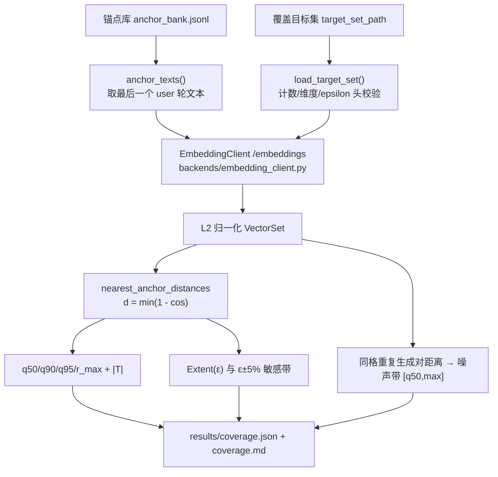

# ARD 验收尺子：口径与可分辨性边界

> 职责：定义 ARD 的验收尺子——距离、分位、覆盖读数、ε 敏感带、配对 bootstrap、噪声带、空间声明要求与退化行为，
> 并写明该尺子的**可分辨性边界**。纯计算实现见 `src/ard/core/coverage.py`；读数组装见 `src/ard/core/acceptance.py`
> 与 `src/ard/backends/coverage_wiring.py`；产物见 `results/coverage.json` / `coverage.md`。
> 基线：本页所有 `文件:行` 以提交 `a0f3221` 的树为准（并行开发期，代码行号可能随提交漂移；按符号名可定位）。

## 1. 距离与分位

- **距离**：`d(x) = min_{a ∈ A} (1 − cos(x, a))`，逐目标点取其到**最近锚点**的距离。两侧向量必须 **L2 归一化**，
  这样点积即余弦、`1 − dot` 即距离；结果夹到 `[0, 2]` 以免浮点噪声产生负距离。
  实现：`src/ard/core/coverage.py:338-377`（`nearest_anchor_distances`）；归一化门 `src/ard/core/coverage.py:292-324`（容差 `1e-6`，常量 `:43`）。
- **分位**：**Hyndman–Fan type-7**（`numpy.percentile(method="linear")`，`src/ard/core/coverage.py:33`），全项目统一口径。
- **主尺子 `q95`**：最近锚点距离的 **type-7 95 分位**（`src/ard/core/coverage.py:380-397`）。并报 `q50` / `q90` / `r_max`（最大距离），
  以及样本量 `|T|`（目标点个数）。
- `Extent(ε) = mean(d ≤ ε)`：落在半径 ε 内的目标点比例，**仅作参考**，从不作为判定尺子（`src/ard/core/coverage.py:399-412`）。

## 2. ε 敏感带

`Extent` 对 ε 的选择敏感，故并列三点（`src/ard/core/coverage.py:416-435`，乘子常量 `src/ard/core/coverage.py:37`）：

| 字段 | 含义 |
|---|---|
| `extent_at_095` | `Extent(0.95 × ε)` |
| `extent_at_100` | `Extent(1.00 × ε)` = 报告的主覆盖读数 |
| `extent_at_105` | `Extent(1.05 × ε)` |

ε 的来源被显式落在空间声明里（`src/ard/backends/coverage_wiring.py:179-190`）：

1. 目标集文件头部声明了 `epsilon` ⇒ 原样使用；
2. 未声明 ⇒ 用目标集**自身尺度**：目标点之间最近邻距离的 type-7 中位数（`src/ard/core/acceptance.py:400-422`，`intrinsic_epsilon`）；
   目标点少于 2 个时**报错**，不猜测。

## 3. 配对 bootstrap

用于比较两臂的 `q95` 差（`src/ard/core/coverage.py:471-548`）：

- **单位 = 目标点**：每次重采样抽的是目标点下标；
- **两臂共用同一次索引抽取**（同一 `positions` 同时索引两臂）——这是"配对"的定义，也是它与独立重采样的区别；
- **B = 2000**（`DEFAULT_BOOTSTRAP_RESAMPLES`，`:39`），置信水平 0.95（`:41`）；
- 点估计 = `q95(A) − q95(B)`（原始样本上的 type-7 分位差）；CI = bootstrap 差值的 type-7 2.5% / 97.5% 分位；
- 两臂长度不一致、或 `unit_id` 不同的目标集 ⇒ `PairingMismatchError`，不静默产出。

## 4. 噪声带

同格重复生成（**同一坐标**被生成多次）的距离分布，下沿 `q50`、上沿 `max`（`src/ard/core/coverage.py:578-595`）。
原料是同一格的**互异对**距离（`pairwise_distances`，`src/ard/core/coverage.py:549-576`）。判据 `within_noise_band(value, band)`
为闭区间判定：落在 `[q50, max]` 内 = 与重复生成噪声**不可分辨**（`src/ard/core/coverage.py:597-608`）。

组装：`src/ard/core/acceptance.py:424-464`（`noise_section`）从库记录中找同坐标分组（`repeat_groups`，`:378-399`），
无重复生成数据时按 `NOISE_UNAVAILABLE_REASON`（`src/ard/core/acceptance.py:48-51`）显式写 **`unavailable`**，绝不省略。

## 5. 空间声明要求

每次指标读数必须**声明它是在什么空间里测的**（`src/ard/core/acceptance.py:133-165`，`SpaceDeclaration`）：

| 字段 | 要求 | 值/来源 |
|---|---|---|
| `anchors_source` | 锚点向量来自哪个产物 | 锚点库路径（如 `outputs/<run>/anchor_bank.jsonl`） |
| `anchor_field` | 嵌入的是该产物的哪个字段 | `src/ard/core/acceptance.py:43`：`messages[last].content`（最后一个 user 轮） |
| `targets_source` | 目标集文件路径 | `coverage.target_set_path` |
| `target_field` | 嵌入目标条目的哪个字段 | `src/ard/core/acceptance.py:46`：`text` |
| `n_anchor` / `n_target` | `|A|` / `|T|` | 实测矩阵行数 |
| `embedder` | **嵌入器身份 = model + dimension + normalize** | `src/ard/core/acceptance.py:123-131`；由 `[coverage.embedding]` 解析 |
| `distance` / `quantile_method` | 距离与分位定义 | `"1 - cos"`、`"linear"`（type-7） |
| `epsilon` / `epsilon_source` | ε 及其来源 | 头部声明或目标集自身尺度 |

**不含密钥**：空间声明只写 model 与 dimension，不写 `api_base`、不写任何 key；输出目录里的配置快照另有脱敏
（`src/ard/pipeline.py:189`，`_redact_secrets`）。

## 6. 读数流水线与退化行为

退化行为（都**显式**、绝不静默，`src/ard/pipeline.py:470-600`）：

| 情形 | 行为 |
|---|---|
| `coverage.target_set_path` 未配置 | 只产出**结构读数**（计划计数 vs 构造规则，零模型调用），并写 WARNING：`metric readout not measured …`（`src/ard/pipeline.py:491-493`）；manifest 指针 `metric_readout: false`、`q95: null` |
| `[coverage.embedding]` 未配置 | 同上：没有可用嵌入器即不做指标读数，不猜 |
| 目标集缺失/不可解析/计数或维度与配置矛盾 | 在**创建输出目录之前**拒绝整个运行（`src/ard/pipeline.py:470-512`，`CoverageWiringError`），不产生半成品产物 |
| 嵌入调用失败 | 结构性读数**先已落盘**（`src/ard/pipeline.py:583-590`），失败照常抛出，但不会抹掉零成本的结构报告 |
| 无同格重复生成数据 | 噪声带写 `unavailable` 并附原因（`src/ard/core/acceptance.py:48-51`；`src/ard/pipeline.py:597-598` 把原因并入 warnings） |

## 7. 已知边界：指标层的分辨力上限

**这是本尺子的硬约束，读任何 `q95` 数字前必须先读它：**

- 噪声带的语义是"**同格重复生成**这条管道自身产生的距离散布"。当两臂的 `q95` 差值**小于**该噪声时，
  指标层**无法区分**这两臂——差异可能来自生成随机性，而非被测的设计因素。
- **实验结论（设计阶段的可分辨性实验）**：在"多臂（六臂）× 多尺子层（四层）"的格子中，
  **24/24 的 `q95` 都落在同格重复生成噪声带 `[q50, max]` 内**；配对 bootstrap 的臂间差 CI 大多含 0。
  ⇒ 尾部读数（`q95`、`r_max`）已被噪声主导，**指标层已到顶**。
  （出处：v4 设计阶段的本地实验记录，**未纳入版本控制**，此处只作方法论沿革；不引用任何部署/运行编号，
  也不构成对某个具体运行的断言。）
- **由此得出的口径**：在该分辨力上限内，**结构保证才是硬约束**——
  即"935/891 个合法受限块每块恰好 1 条、`knowledge_domain` 209 叶轮转、`visual_domain` 21 叶轮转、坐标 0 重复"
  这类可零成本复核的结构事实，比臂间 `q95` 排名更可靠。`q95` 用于**自证与回归**（同一构造的读数是否稳定），
  不用于主张细微的算法优劣。
- 报告的措辞要求：当读数落在噪声带内时，不得写"某臂更优/更差"，只能报
  **效应量 + CI 宽度 + 最小可辨差（≈ CI 半宽）**，并明确声明"不可分辨"。

## 8. 产物字段

- `results/coverage.json`：`AcceptanceReport` 的完整机器可读序列化（`report_schema = "ard-acceptance-1"`），
  含 `structure` / `metrics`（`space` / `quantiles` / `extent` / `epsilon_band` / `noise`）/ `warnings`。
- `results/coverage.md`：同一报告的人读版渲染（`src/ard/core/acceptance.py:510-600`），
  结构读数表、Conventions（`MULTI_TURN_DEFAULT` 与轮数映射）、空间声明、分位/覆盖读数、噪声带、warnings。
