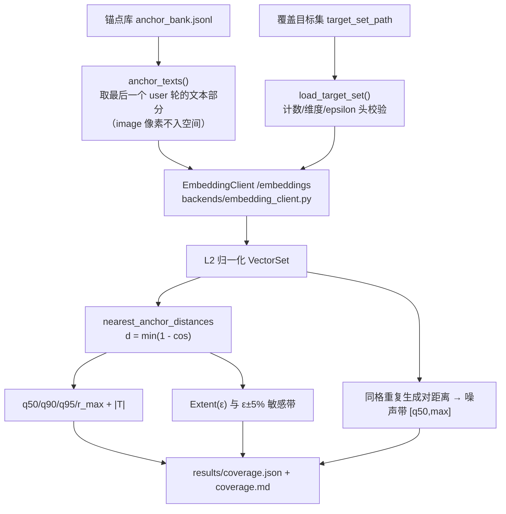

# ARD 验收尺子：口径与可分辨性边界

> 职责：定义 ARD 的验收尺子——距离、分位、覆盖读数、ε 敏感带、配对 bootstrap、噪声带、空间声明要求与退化行为，
> 并写明该尺子的**可分辨性边界**。纯计算实现见 `src/ard/core/coverage.py`；读数组装见 `src/ard/core/acceptance.py`
> 与 `src/ard/backends/coverage_wiring.py`；产物见 `results/coverage.json` / `coverage.md`。
> 基线：`src/ard/core/acceptance.py` 的行号已按提交 `16ee1fd` 的树重新逐条核对（该提交修正多模态锚点取文，
> 行号随之整体平移）；其余被引用的代码文件自 `a94e7b3` 以来未改动，沿用以该提交为准的核对结果，
> 其间核正了本页此前指向 `src/ard/pipeline.py` 的几处错行。

## 1. 距离与分位

- **距离**：`d(x) = min_{a ∈ A} (1 − cos(x, a))`，逐目标点取其到**最近锚点**的距离。两侧向量必须 **L2 归一化**，
  这样点积即余弦、`1 − dot` 即距离；结果夹到 `[0, 2]` 以免浮点噪声产生负距离。
  实现：`src/ard/core/coverage.py:338-377`（`nearest_anchor_distances`）；归一化门 `src/ard/core/coverage.py:292-324`（容差 `1e-6`，常量 `:43`）。
- **分位**：**Hyndman–Fan type-7**（`numpy.percentile(method="linear")`，`src/ard/core/coverage.py:33`），全项目统一口径。
- **主尺子 `q95`**：最近锚点距离的 **type-7 95 分位**（`src/ard/core/coverage.py:380-397`）。并报 `q50` / `q90` / `r_max`（最大距离），
  以及样本量 `|T|`（目标点个数）。
- `Extent(ε) = mean(d ≤ ε)`：落在半径 ε 内的目标点比例，**仅作参考**，从不作为判定尺子（`src/ard/core/coverage.py:399-412`）。

## 2. ε 敏感带

`Extent` 对 ε 的选择敏感，故并列三点（`src/ard/core/coverage.py:416-435`，乘子常量 `src/ard/core/coverage.py:37`）：

| 字段 | 含义 |
|---|---|
| `extent_at_095` | `Extent(0.95 × ε)` |
| `extent_at_100` | `Extent(1.00 × ε)` = 报告的主覆盖读数 |
| `extent_at_105` | `Extent(1.05 × ε)` |

ε 的来源被显式落在空间声明里（`src/ard/backends/coverage_wiring.py:180-191`）：

1. 目标集文件头部声明了 `epsilon` ⇒ 原样使用；
2. 未声明 ⇒ 用目标集**自身尺度**：目标点之间最近邻距离的 type-7 中位数（`src/ard/core/acceptance.py:492-514`，`intrinsic_epsilon`）；
   目标点少于 2 个时**报错**，不猜测。

## 3. 配对 bootstrap

用于比较两臂的 `q95` 差（`src/ard/core/coverage.py:471-548`）：

- **单位 = 目标点**：每次重采样抽的是目标点下标；
- **两臂共用同一次索引抽取**（同一 `positions` 同时索引两臂）——这是"配对"的定义，也是它与独立重采样的区别；
- **B = 2000**（`DEFAULT_BOOTSTRAP_RESAMPLES`，`:39`），置信水平 0.95（`:41`）；
- 点估计 = `q95(A) − q95(B)`（原始样本上的 type-7 分位差）；CI = bootstrap 差值的 type-7 2.5% / 97.5% 分位；
- 两臂长度不一致、或 `unit_id` 不同的目标集 ⇒ `PairingMismatchError`，不静默产出。

## 4. 噪声带

同格重复生成（**同一坐标**被生成多次）的距离分布，下沿 `q50`、上沿 `max`（`src/ard/core/coverage.py:578-595`）。
原料是同一格的**互异对**距离（`pairwise_distances`，`src/ard/core/coverage.py:549-576`）。判据 `within_noise_band(value, band)`
为闭区间判定：落在 `[q50, max]` 内 = 与重复生成噪声**不可分辨**（`src/ard/core/coverage.py:597-608`）。

组装：`src/ard/core/acceptance.py:516-557`（`noise_section`）从库记录中找同坐标分组（`repeat_groups`，`:470-490`），
无重复生成数据时按 `NOISE_UNAVAILABLE_REASON`（`src/ard/core/acceptance.py:68-70`）显式写 **`unavailable`**，绝不省略。

## 5. 空间声明要求

每次指标读数必须**声明它是在什么空间里测的**（`src/ard/core/acceptance.py:161-194`，`SpaceDeclaration`）：

| 字段 | 要求 | 值/来源 |
|---|---|---|
| `anchors_source` | 锚点向量来自哪个产物 | 锚点库路径（如 `outputs/<run>/anchor_bank.jsonl`） |
| `anchor_field` | 嵌入的是该产物的哪个字段 | `src/ard/core/acceptance.py:53`：`messages[last].content(text parts only)`（最后一个 user 轮的**文本部分**） |
| `targets_source` | 目标集文件路径 | `coverage.target_set_path` |
| `target_field` | 嵌入目标条目的哪个字段 | `src/ard/core/acceptance.py:65`：`text` |
| `n_anchor` / `n_target` | `|A|` / `|T|` | 实测矩阵行数 |
| `embedder` | **嵌入器身份 = model + dimension + normalize** | `src/ard/core/acceptance.py:151-158`；由 `[coverage.embedding]` 解析 |
| `distance` / `quantile_method` | 距离与分位定义 | `"1 - cos"`、`"linear"`（type-7） |
| `epsilon` / `epsilon_source` | ε 及其来源 | 头部声明或目标集自身尺度 |

**指标空间只含文本；图像模态以其文本部分参与，图像像素不进该空间。** 图像模态锚点的最终 user 轮
`content` 是多模态 part 列表（`{"type": "image", ...}` 与 `{"type": "text", "text": ...}` 并列），
取文只取其中 `type == "text"` 的 `text`，故 `anchor_field` 写作 `messages[last].content(text parts only)`，
而不是笼统的 `messages[last].content`——否则读数的空间声明会被误读成"图像也进了这个空间"。
多个文本部分按声明分隔符 `"\n"`（`src/ard/core/acceptance.py:62`）连接；非文本 part 一律忽略。

**没有任何文本部分 ⇒ 报错，不静默跳过、不用空串占位。** 某条锚点的最终 user 轮若一个可用文本部分都没有
（纯图像锚点、或文本部分全为空白），`user_turn_text`（`src/ard/core/acceptance.py:372-429`）与
`anchor_texts`（`:431-468`）以 `AcceptanceError` 终止，报文含**记录 id、part 数量与 part 类型**。
静默跳过会让 `q95` 落在一个比运行产物更小的锚点集上，空串占位则是在空间里伪造一个点——两者都是伪读数。

**不含密钥**：空间声明只写 model 与 dimension，不写 `api_base`、不写任何 key；输出目录里的配置快照另有脱敏
（`src/ard/pipeline.py:201`，`_redact_secrets`）。

## 6. 读数流水线与退化行为



**三种配置组合的契约**（`src/ard/config.py:352-404`，`resolved_embedding`；`src/ard/pipeline.py:542-584`，`_prepare_coverage`）。

| `coverage.target_set_path` | `[coverage.embedding]` | 行为 |
|---|---|---|
| **两者都未设** | 任意 | **结构读数 + 明确 WARNING**：`metric readout not measured …`（`src/ard/pipeline.py:561-567`）；报告 `metrics: null`、manifest `metric_readout: false` / `q95: null`。不静默、不崩溃 |
| **已设** | **缺** `api_base` / `model` / `dimension`（或全空） | **fail-fast 报错**（`ConfigError`），报文逐项列出缺失字段并要求"补齐或清空 `target_set_path`"；在 `load_config` 即触发（`src/ard/config.py:381-387`），**早于创建任何输出目录**。这是**刻意严格**的行为：目标集已声明要测指标，却没有可用嵌入器，属于配置错误而非可退化的缺省 |
| **已设** | 完备，`normalize = true` | 产出**指标读数**（`q95` / `Extent(ε)` / ε 带 / 噪声带）；`normalize = false` 同样 fail-fast（尺子要求 L2 归一化，`src/ard/config.py:389-393`） |

其余退化行为（都**显式**、绝不静默，`src/ard/pipeline.py:597-685`，`_run_acceptance`）：

| 情形 | 行为 |
|---|---|
| 目标集缺失/不可解析/计数或维度与配置矛盾 | 在**创建输出目录之前**拒绝整个运行（`src/ard/pipeline.py:542-584`，`CoverageWiringError`；`:779` 在输出目录存在之前调用），不产生半成品产物 |
| 嵌入调用失败 | 结构性读数**先已落盘**（`src/ard/pipeline.py:653-660`），失败照常抛出，但不会抹掉零成本的结构报告 |
| 无同格重复生成数据 | 噪声带写 `unavailable` 并附原因（`src/ard/core/acceptance.py:68-70`；`src/ard/pipeline.py:667-668` 把原因并入 warnings） |

## 7. 已知边界：指标层的分辨力上限

**这是本尺子的硬约束，读任何 `q95` 数字前必须先读它：**

- 噪声带的语义是"**同格重复生成**这条管道自身产生的距离散布"。当两臂的 `q95` 差值**小于**该噪声时，
  指标层**无法区分**这两臂——差异可能来自生成随机性，而非被测的设计因素。
- **实验结论（设计阶段的可分辨性实验）**：在"多臂（六臂）× 多尺子层（四层）"的格子中，
  **24/24 的 `q95` 都落在同格重复生成噪声带 `[q50, max]` 内**；配对 bootstrap 的臂间差 CI 大多含 0。
  ⇒ 尾部读数（`q95`、`r_max`）已被噪声主导，**指标层已到顶**。
  （出处：v4 设计阶段的本地实验记录，**未纳入版本控制**，此处只作方法论沿革；不引用任何部署/运行编号，
  也不构成对某个具体运行的断言。）
- **由此得出的口径**：在该分辨力上限内，**结构保证才是硬约束**——
  即"935/891 个合法受限块每块恰好 1 条、`knowledge_domain` 209 叶轮转、`visual_domain` 21 叶轮转、坐标 0 重复"
  这类可零成本复核的结构事实，比臂间 `q95` 排名更可靠。`q95` 用于**自证与回归**（同一构造的读数是否稳定），
  不用于主张细微的算法优劣。
- 报告的措辞要求：当读数落在噪声带内时，不得写"某臂更优/更差"，只能报
  **效应量 + CI 宽度 + 最小可辨差（≈ CI 半宽）**，并明确声明"不可分辨"。

## 8. 产物字段

- `results/coverage.json`：`AcceptanceReport` 的完整机器可读序列化（`report_schema = "ard-acceptance-1"`），
  含 `structure` / `metrics`（`space` / `quantiles` / `extent` / `epsilon_band` / `noise`）/ `warnings`。
- `results/coverage.md`：同一报告的人读版渲染（`src/ard/core/acceptance.py:602-692`），
  结构读数表、Conventions（`MULTI_TURN_DEFAULT` 与轮数映射）、空间声明、分位/覆盖读数、噪声带、warnings。

## 9. 复核指标路径：三步

指标读数**完全由配置驱动**（没有 CLI 开关，`src/ard/config.py:335-404`）。要让复核员能零成本复跑：

1. **配嵌入器**：在 `.local/config.override.toml`（被 gitignore 的本机覆写文件，**绝不入库**）里写
   `[coverage.embedding]`。下文只给**字段名与占位符**，不给真实端点/模型/密钥：

   ```toml
   [coverage.embedding]
   api_base = "<OpenAI 兼容的 /embeddings 基址，含 /v1>"
   model = "<嵌入模型名>"
   dimension = <该模型的向量维度>
   # api_key = "<服务端需要时填>"
   # batch_size = 32
   # normalize = true      # 必须为 true：尺子要求 L2 归一化行
   ```

2. **指向目标集**：设 `coverage.target_set_path`。仓库自带一个小而确定的样例
   （`examples/target_set.sample.jsonl`，32 条、约 4.5 KB，构造规则见其文件头与 §10），开箱可用：

   ```toml
   [coverage]
   target_set_path = "examples/target_set.sample.jsonl"
   ```

3. **跑一次**：`--smoke`（8 条锚点，几分钟）或完整运行。产物在 `<output_dir>/results/coverage.json`
   与 `coverage.md`：`metrics.space` 是空间声明，`metrics.quantiles.q95` 是主读数。

三种配置组合的行为见 §6 的契约表：都没设 ⇒ 结构读数 + WARNING；只设目标集不配嵌入器 ⇒ fail-fast 报错；
两者都设 ⇒ 指标读数。只想验证接线、不想调用生成端点时，可以对**已有的** `anchor_bank.jsonl` 直接调用
`pipeline._prepare_coverage` + `pipeline._run_acceptance`（`src/ard/pipeline.py:542-584` / `:597-685`）。

## 10. 目标集样例的构造规则

`examples/target_set.sample.jsonl` 是**接线样例（wiring sample），不是产品目标集**。它的构造规则写在文件头
（`axes` / `selection` / `template` 三个字段）里，机器可读、可复算：

- **用到的轴**：`knowledge_domain` 与 `language`（取自 `ontology/anchor_ontology.v4.json`）；
- **`knowledge_domain` 取法**：按 `knowledge_domain_tree` 的文档序展开成 **209 个叶值**，取下标
  `floor(k × (209 − 1) / 7)`，`k = 0..7` —— 等距 8 个，**含首尾**；
- **`language` 取法**：`axes.language.values` 的**全部 4 个值**，按本体序；
- **文本模板**（唯一一条，逐字）：
  `Explain {leaf} in depth: what it is, how it is studied, and why it matters. Answer in {language}.`
- **顺序与数量**：`knowledge_domain` 外层、`language` 内层，共 **8 × 4 = 32 条**；文件头声明
  `expected_count: 32`，条目数不符即被 `load_target_set` 拒绝。

该文件不含端点、密钥、模型名或个人信息。文件是**一行 JSON 文档**（外层是带 `targets` 数组的对象），
这同时满足 JSONL 的"一行一个 JSON 值"与 `load_target_set` 的"对象文档可带头部"两种读法——JSONL 逐行读取
时不支持头部，头部因此只能由对象文档承载。

**它不保证读出的数字有意义**：32 条同模板句子的自身尺度很小（本机离线 MiniLM 384-d 下 ε ≈ 0.021，
故 `Extent(ε)` 通常为 0）。样例只证明"目标集 → 嵌入 → 距离 → 读数"这条**接线**通，不构成任何覆盖结论；
产品级读数需要真正的目标集与真正的锚点库。
